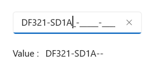

# Value mask formats in WinUI SfMaskedTextBox

`SfMaskedTextBox` allows you to format the characters in the `Value` property in a mask scenario (when the Mask property is set). By default, the `Value` property holds your input characters, prompt characters and the literals defined in the mask. You can modify this and allow the `Value` property to hold the characters without prompt and literals by setting the `ValueMaskFormat` property of the control. The `Value` in the `SfMaskedTextBox` is formatted by any one of the following formatting enum values:

1. ExcludePromptAndLiterals
2. IncludePrompt
3. IncludeLiterals
4. IncludePromptAndLiterals

## ExcludePromptAndLiterals

The `Value` property contains only the text entered by the user. It does not include prompt and literals characters in the `Value`.

### Example




<syncfusion:SfMaskedTextBox x:Name="sfMaskedTextBox"
                            Width="195"
                            MaskType="Simple"
                            Mask=">AAAAA-AAAAA-AAAAA-AAAAA"
                            Value="DF321SD1A"
                            ValueMaskFormat="ExcludePromptAndLiterals"/>




SfMaskedTextBox maskedTextBox = new SfMaskedTextBox();
maskedTextBox.Width = "195";
maskedTextBox.MaskType = MaskedTextBoxMaskType.Simple;
maskedTextBox.Mask = ">AAAAA-AAAAA-AAAAA-AAAAA";
maskedTextBox.Value = "DF321SD1A";
maskedTextBox.ValueMaskFormat = MaskedTextBoxMaskFormat.ExcludePromptAndLiterals;




## IncludePrompt

The `Value` property contains the text entered by the user as well as the prompt character.

### Example




<syncfusion:SfMaskedTextBox x:Name="sfMaskedTextBox"
                            Width="195"
                            MaskType="Simple"
                            Mask=">AAAAA-AAAAA-AAAAA-AAAAA"
                            Value="DF321SD1A"
                            ValueMaskFormat="IncludePrompt"/>




SfMaskedTextBox maskedTextBox = new SfMaskedTextBox();
maskedTextBox.Width = "195";
maskedTextBox.MaskType = MaskedTextBoxMaskType.Simple;
maskedTextBox.Mask = ">AAAAA-AAAAA-AAAAA-AAAAA";
maskedTextBox.Value = "DF321SD1A";
maskedTextBox.ValueMaskFormat = MaskedTextBoxMaskFormat.IncludePrompt;




## IncludeLiterals

The `Value` property contains the text entered by the user as well as any literal characters defined in the mask.

### Example




<syncfusion:SfMaskedTextBox x:Name="sfMaskedTextBox"
                            Width="195"
                            MaskType="Simple"
                            Mask=">AAAAA-AAAAA-AAAAA-AAAAA"
                            Value="DF321SD1A"
                            ValueMaskFormat="IncludeLiterals"/>




SfMaskedTextBox maskedTextBox = new SfMaskedTextBox();
maskedTextBox.Width = "195";
maskedTextBox.MaskType = MaskedTextBoxMaskType.Simple;
maskedTextBox.Mask = ">AAAAA-AAAAA-AAAAA-AAAAA";
maskedTextBox.Value = "DF321SD1A";
maskedTextBox.ValueMaskFormat = MaskedTextBoxMaskFormat.IncludeLiterals;




## IncludePromptAndLiterals

The `Value` property contains text entered by the user as well as any literal characters and the prompt character defined in the mask.

### Example




<syncfusion:SfMaskedTextBox x:Name="sfMaskedTextBox"
                            Width="195"
                            MaskType="Simple"
                            Mask=">AAAAA-AAAAA-AAAAA-AAAAA"
                            Value="DF321SD1A"
                            ValueMaskFormat="IncludePromptAndLiterals"/>




SfMaskedTextBox maskedTextBox = new SfMaskedTextBox();
maskedTextBox.Width = "195";
maskedTextBox.MaskType = MaskedTextBoxMaskType.Simple;
maskedTextBox.Mask = ">AAAAA-AAAAA-AAAAA-AAAAA";
maskedTextBox.Value = "DF321SD1A";
maskedTextBox.ValueMaskFormat = MaskedTextBoxMaskFormat.IncludePromptAndLiterals;




