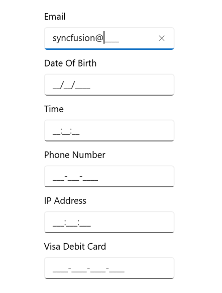

# WinUI MaskedTextBox Overview

The [WinUI MaskedTextBox](https://www.syncfusion.com/winui-controls/masked-textbox) is an advanced version of the input control that restricts input of certain characters, text, and numbers by using a mask pattern. This control is used to create a template for providing information such as telephone numbers, email IDs, IP addresses, product keys, and so on.

## Key features

* `MaskTypes`: The input can be masked with a fixed or variable length by setting the mask type to simple or regex, respectively.
* `PromptChar`: Customize the prompt characters used to set the default characters as input in the absence of input.
* `Value`: Enter values and clipboard operations in the control based on the ValueMaskFormat property.
* `ValueMaskFormat`: Setting formatted values in the control using mask format values such as prompt, literals, and both.
* `Customization`: Customize the UI of the masked text box.
* `Error Indication` : Effectively manage and convey errors by selecting from a range of error types like none, default, warning, information, critical, success or custom. Each type offers unique visual indicators, tailored to reflect the severity or nature of the error.