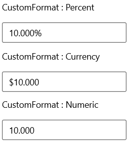

# Value formatting with WinUI NumberBox

This section explains how to change the value format of the `NumberBox` control using `NumberFormatter` and `CustomFormat` properties.

## Change the decimal value format

You can change the format of the value displayed in `NumberBox` control to decimal format by using the `NumberFormatter` and `CustomFormat` properties. By default, the value of `NumberFormatter` and `CustomFormat` properties value is **null**.

The following code shows how to change the display format of a value using the `DecimalFormatter` class. 




<editors:SfNumberBox x:Name="sfNumberBox" 
                     Height="30" Width="200" Value="10" />




CultureInfo ci = new CultureInfo("en-US");
sfNumberBox.NumberFormatter = new DecimalFormatter(new[] { ci.Name }, "ZZ")
{
    IntegerDigits = 2,
    FractionDigits = 4
}




The following code shows how to change the display format of a value using the `CustomFormat` class. 




<editors:SfNumberBox x:Name="sfNumberBox" CustomFormat="#0.000"
                     Height="30" Width="200" Value="10" />




SfNumberBox sfNumberBox = new SfNumberBox();
sfNumberBox.Height = 30;
sfNumberBox.Width = 200;
sfNumberBox.CustomFormat ="#0.0000";




## Change the currency value format

You can change the format of the value displayed in the `NumberBox` control by using the `NumberFormatter` and `CustomFormat` properties. By default, the value of `NumberFormatter` and `CustomFormat` properties value is **null**.

The following code shows how to change the display format of a value using the `CurrencyFormatter` class. 




<editors:SfNumberBox x:Name="sfNumberBox" 
                     Height="30" Width="200" Value="10" />




CultureInfo ci = new CultureInfo("en-US");
string currencyCode = new RegionInfo(ci.LCID).ISOCurrencySymbol;
sfNumberBox.NumberFormatter = new CurrencyFormatter(currencyCode, new string[] { ci.Name }, "ZZ")
{
    IntegerDigits = 1,
    FractionDigits = 4
};




The following code shows how to change the display format of a value using the `CustomFormat` class. 




<editors:SfNumberBox x:Name="sfNumberBox" CustomFormat="$0.0000"
                     Height="30" Width="200" Value="10" />




SfNumberBox sfNumberBox = new SfNumberBox();
sfNumberBox.Height = 30;
sfNumberBox.Width = 200;
sfNumberBox.CustomFormat ="$0.0000";




## Change the percent value format

You can change the format of the value displayed in the `NumberBox` control by using the `NumberFormatter` and `CustomFormat` properties. By default, the value of `NumberFormatter` and `CustomFormat` properties value is **null**.

The following code shows how to change the display format of a value using the `PercentFormatter` class. 




<editors:SfNumberBox x:Name="sfNumberBox" 
                     Height="30" Width="200" Value="0.05" />




CultureInfo ci = new CultureInfo("en-US");
string currencyCode = new RegionInfo(ci.LCID).ISOCurrencySymbol;
sfNumberBox.NumberFormatter = new CurrencyFormatter(currencyCode, new string[] { ci.Name }, "ZZ")
{
    IntegerDigits = 1,
    FractionDigits = 4
};




The following code shows how to change the display format of a value using the `CustomFormat` class. 




<editors:SfNumberBox x:Name="sfNumberBox" CustomFormat="0.0000%"
                     Height="30" Width="200" Value="0.05" />




SfNumberBox sfNumberBox = new SfNumberBox();
sfNumberBox.Height = 30;
sfNumberBox.Width = 200;
sfNumberBox.CustomFormat ="0.0000%";




## Apply custom value format

Using the `CustomFormat` property, you can apply custom formats to the value of `NumberBox` control. The value of the `CustomFormat` property is **null** by default. Using **N**, **C**, and **P** format values, we can apply numeric, currency, and percent custom formats for value in the `NumberBox` control. You can specify the fractional digits of the value by appending an integer suffix to these format values. 




<editors:SfNumberBox x:Name="sfNumberBox" CustomFormat="P3"
                     Height="30" Width="200" Value="0.10" />




SfNumberBox sfNumberBox = new SfNumberBox();
sfNumberBox.Height = 30;
sfNumberBox.Width = 200;
sfNumberBox.Value = 0.10;
sfNumberBox.CustomFormat ="P3";




You can apply various custom formats available in [this page](https://docs.microsoft.com/en-us/dotnet/standard/base-types/standard-numeric-format-strings) which are supported for `double` type.




<editors:SfNumberBox x:Name="sfNumberBox" CustomFormat="E3"
                     Height="30" Width="200" Value="10.5" />




SfNumberBox sfNumberBox = new SfNumberBox();
sfNumberBox.Height = 30;
sfNumberBox.Width = 200;
sfNumberBox.Value = 10.5;
sfNumberBox.CustomFormat ="E3";




## Change culture

You can apply custom format for value in the `NumberBox` control based on the `CultureInfo` class. By default, the culture value is **en-US**. Hence the custom currency format is applied for value with dollar (**$**) sign. You can customize the format to use the currency of `fr-FR` culture as shown below.




<editors:SfNumberBox x:Name="sfNumberBox" Height="30" Width="200" Value="10" />




CultureInfo ci = new CultureInfo("fr-FR");
string currencyFormat = ci.NumberFormat.CurrencySymbol;
string customFormat = string.Format("{0}{1}{2}", currencyFormat," ", "#00.00");
sfNumberBox.CustomFormat = customFormat;




You can also apply currency format for value in the `NumberBox` control using `NumberFormatter` property based on the `CultureInfo` class.




<editors:SfNumberBox x:Name="sfNumberBox" Height="30" Width="200" Value="10" />




CultureInfo ci = new CultureInfo("fr-FR");
string currencyCode = new RegionInfo(ci.LCID).ISOCurrencySymbol;
sfNumberBox.NumberFormatter = new CurrencyFormatter(currencyCode, new string[] { ci.Name }, "ZZ")
{
    IntegerDigits = 1,
    FractionDigits = 3,
    Mode = CurrencyFormatterMode.UseCurrencyCode
};




