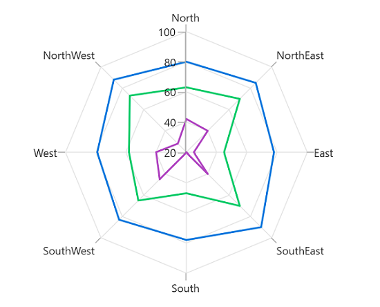
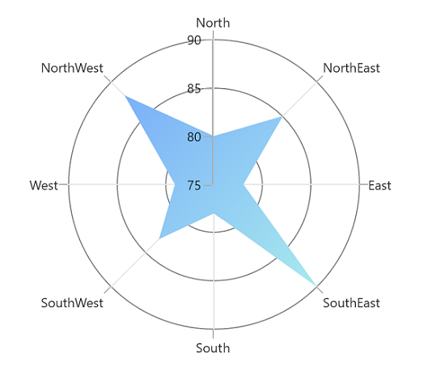

# Appearance in WinUI Chart (SfPolarChart)

The appearance of [SfPolarChart](https://help.syncfusion.com/cr/winui/Syncfusion.UI.Xaml.Charts.SfPolarChart.html) can be customized by using the predefined palettes, custom palettes and gradient, which allows to enrich the application.

## Default PaletteBrushes

Currently, [SfPolarChart](https://help.syncfusion.com/cr/winui/Syncfusion.UI.Xaml.Charts.SfPolarChart.html) supports only one predefined [PaletteBrushes]() and it is the default palette for SfPolarChart. The following screenshot shows the default appearance of multiple series.





<chart:SfPolarChart x:Name="chart"
                    GridLineType="Polygon">
        ...
        <chart:SfPolarChart.Series>
            <chart:PolarLineSeries ItemsSource="{Binding PlantDetails}" 
                        XBindingPath="Direction"
                        YBindingPath="Tree" Label="Tree">
            </chart:PolarLineSeries>

            <chart:PolarLineSeries ItemsSource="{Binding PlantDetails}" 
                        XBindingPath="Direction"
                        YBindingPath="Weed" Label="Weed">
            </chart:PolarLineSeries>

            <chart:PolarLineSeries ItemsSource="{Binding PlantDetails}" 
                        XBindingPath="Direction"
                        YBindingPath="Flower" Label="Flower">
            </chart:PolarLineSeries>
        </chart:SfPolarChart.Series>
        ...
</chart:SfPolarChart>





SfPolarChart chart = new SfPolarChart();
chart.GridLineType = PolarChartGridLineType.Polygon;
...
PolarLineSeries series1 = new PolarLineSeries();
series1.XBindingPath = "Direction";
series1.YBindingPath = "Tree";
series1.ItemsSource = viewModel.PlantDetails;

PolarLineSeries series2 = new PolarLineSeries();
series2.XBindingPath = "Direction";
series2.YBindingPath = "Weed";
series2.ItemsSource = viewModel.PlantDetails;

PolarLineSeries series3 = new PolarLineSeries();
series3.XBindingPath = "Direction";
series3.YBindingPath = "Flower";
series3.ItemsSource = viewModel.PlantDetails;
...
this.Content = chart;





## Custom PaletteBrushes

[SfPolarChart](https://help.syncfusion.com/cr/winui/Syncfusion.UI.Xaml.Charts.SfPolarChart.html) provides support to define own brushes for chart with preferred order by using the [PaletteBrushes]() property, as shown in the following code example.





<Grid>
    <Grid.Resources>
        <BrushCollection x:Key="customBrushes">
                <SolidColorBrush Color="#4dd0e1"/>
                <SolidColorBrush Color="#26c6da"/>
                <SolidColorBrush Color="#00bcd4"/>
                <SolidColorBrush Color="#00acc1"/>
                <SolidColorBrush Color="#0097a7"/>
                <SolidColorBrush Color="#00838f"/>
        </BrushCollection>
    </Grid.Resources>
    <chart:SfPolarChart x:Name="chart"
                        PaletteBrushes="{StaticResource customBrushes}" >
. . .
</chart:SfPolarChart>
</Grid>





SfPolarChart chart = new SfPolarChart();
...
List<Brush> customBrushes = new List<Brush>();
customBrushes.Add(new SolidColorBrush(Color.FromArgb(255, 77, 208, 225)));
customBrushes.Add(new SolidColorBrush(Color.FromArgb(255, 38, 198, 218)));
customBrushes.Add(new SolidColorBrush(Color.FromArgb(255, 0, 188, 212)));
customBrushes.Add(new SolidColorBrush(Color.FromArgb(255, 0, 172, 193)));
customBrushes.Add(new SolidColorBrush(Color.FromArgb(255, 0, 151, 167)));
customBrushes.Add(new SolidColorBrush(Color.FromArgb(255, 0, 131, 143)));

chart.PaletteBrushes = customBrushes;
. . .            
this.Content = chart;





## Applying Gradient

Gradient for the polar chart can be set by using the [PaletteBrushes]() property of the funnel chart with the help of `LinearGradientBrush` or `RadialGradientBrush`.





<Grid>
    <Grid.Resources>
        <BrushCollection x:Key="customBrushes">
                <LinearGradientBrush>
                    <GradientStop Offset="1" Color="#FFE7C7" />
                    <GradientStop Offset="0" Color="#FCB69F" />
                </LinearGradientBrush>
                <LinearGradientBrush>
                    <GradientStop Offset="1" Color="#fadd7d" />
                    <GradientStop Offset="0" Color="#fccc2d" />
                </LinearGradientBrush>
                <LinearGradientBrush>
                    <GradientStop Offset="1" Color="#DCFA97" />
                    <GradientStop Offset="0" Color="#96E6A1" />
                </LinearGradientBrush>
        </BrushCollection>
    </Grid.Resources>
    <chart:SfPolarChart x:Name="chart" 
                        PaletteBrushes="{StaticResource customBrushes}">
. . .
</chart:SfPolarChart>
</Grid>





SfPolarChart chart = new SfPolarChart();
...
List<Brush> customBrushes = new List<Brush>();
LinearGradientBrush gradientColor1 = new LinearGradientBrush();
GradientStop stop1 = new GradientStop() { Offset = 1, Color = Color.FromArgb(255, 255, 231, 199) };
GradientStop stop2 = new GradientStop() { Offset = 0, Color = Color.FromArgb(255, 252, 182, 159) };
gradientColor1.GradientStops.Add(stop1);
gradientColor1.GradientStops.Add(stop2);
LinearGradientBrush gradientColor2 = new LinearGradientBrush();
stop1 = new GradientStop() { Offset = 1, Color = Color.FromArgb(255, 250, 221, 125) };
stop2 = new GradientStop() { Offset = 0, Color = Color.FromArgb(255, 252, 204, 45) };

gradientColor2.GradientStops.Add(stop1);
gradientColor2.GradientStops.Add(stop2);

customBrushes.Add(gradientColor1);
customBrushes.Add(gradientColor2);

chart.PaletteBrushes = customBrushes;
. . .





Gradient color using the [Fill]( ) property of series with `LinearGradientBrush`.





<chart:SfPolarChart>
    ...
    <chart:PolarAreaSeries  ItemsSource="{Binding PlantDetails}" 
                            XBindingPath="Direction" 
                            YBindingPath="Tree" Label="Tree">

        <chart:PolarAreaSeries.Fill>
            <LinearGradientBrush>
                <GradientStop Offset="1" Color="#A8EAEE" />
                <GradientStop Offset="0" Color="#7BB0F9" />
            </LinearGradientBrush>
        </chart:PolarAreaSeries.Fill>
                   
    </chart:PolarAreaSeries>
...
</chart:SfPolarChart>





SfPolarChart chart = new SfPolarChart();
. . .
LinearGradientBrush gradientColor = new LinearGradientBrush();
GradientStop stop1 = new GradientStop() { Offset = 1, Color = Color.FromArgb(255, 168, 234, 238) };
GradientStop stop2 = new GradientStop() { Offset = 0, Color = Color.FromArgb(255, 123, 176, 249) };
gradientColor.GradientStops.Add(stop1);
gradientColor.GradientStops.Add(stop2);

PolarAreaSeries series = new PolarAreaSeries();
series.Fill = gradientColor;
...





