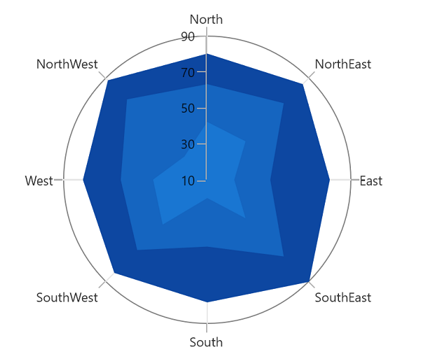
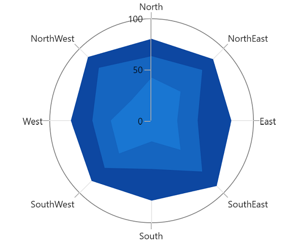

## NumericalAxis in WinUI Polar Chart (SfPolarChart) 

[`NumericalAxis`]() is used to plot numerical values to the chart. [`NumericalAxis`]() can be defined for both [`PrimaryAxis`]() and [`SecondaryAxis`](). The following code snippet shows how to define the [`NumericalAxis`]().





<chart:SfPolarChart >

    <syncfusion:SfPolarChart.PrimaryAxis>
        <syncfusion:NumericalAxis/>
    </syncfusion:SfPolarChart.PrimaryAxis>
    <syncfusion:SfPolarChart.SecondaryAxis>
        <syncfusion:NumericalAxis/>
    </syncfusion:SfPolarChart.SecondaryAxis>
    ...
</chart:SfPolarChart>





SfPolarChart chart = new SfPolarChart();
...
chart.PrimaryAxis = new NumericalAxis();
chart.SecondaryAxis = new NumericalAxis();
...





**Customizing** **the** **NumericalAxis** **Range**

[`Maximum`]() property used for setting the maximum value for the axis range and [`Minimum`]() property is used for setting the minimum value for the axis range.





<syncfusion:SfPolarChart.SecondaryAxis>
    <syncfusion:NumericalAxis Minimum="10" Maximum="90" Interval="20">
    </syncfusion:NumericalAxis>
</syncfusion:SfPolarChart.SecondaryAxis>





SfPolarChart chart = new SfPolarChart();
...
chart.SecondaryAxis = new NumericalAxis()
{
    Maximum = 90,
    Minimum = 10,
    Interval = 20,
};





N> If  minimum or maximum value is set, the other value is calculated by default internally.

**StartRangeFromZero**

[`NumericalAxis`]() will calculate the range based on the data points binded to the axis. To start the range from zero have to define the [`StartRangeFromZero`]() property to `True`. The following code example demonstrates the NumericalAxis range starting from zero.





<syncfusion:SfPolarChart.SecondaryAxis>
    <syncfusion:NumericalAxis StartRangeFromZero="True">
    </syncfusion:NumericalAxis>
</syncfusion:SfPolarChart.SecondaryAxis>
...





...
chart.SecondaryAxis = new NumericalAxis()
{
   StartRangeFromZero = true
};
...





N> By default, Range is calculated between the minimum and maximum value of the data points.