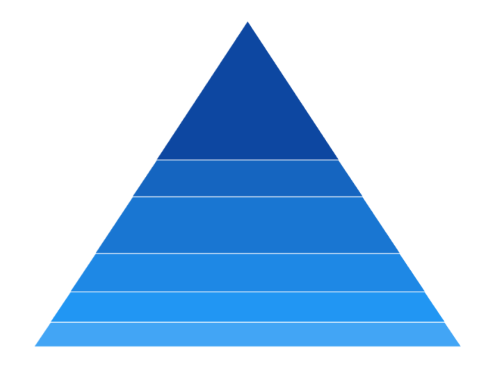
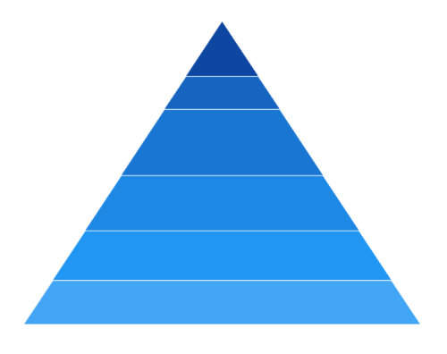

# Rendering Mode in WinUI Chart (SfPyramidChart)

The [Mode](https://help.syncfusion.com/cr/winui/Syncfusion.UI.Xaml.Charts.SfPyramidChart.html#Syncfusion_UI_Xaml_Charts_SfPyramidChart_Mode) property is used to define the rendering mode of pyramid chart such as [Surface](https://help.syncfusion.com/cr/winui/Syncfusion.UI.Xaml.Charts.ChartPyramidMode.html#Syncfusion_UI_Xaml_Charts_ChartPyramidMode_Surface) or [Linear](https://help.syncfusion.com/cr/winui/Syncfusion.UI.Xaml.Charts.ChartPyramidMode.html#Syncfusion_UI_Xaml_Charts_ChartPyramidMode_Linear). The default value of [Mode](https://help.syncfusion.com/cr/winui/Syncfusion.UI.Xaml.Charts.SfPyramidChart.html#Syncfusion_UI_Xaml_Charts_SfPyramidChart_Mode) property is `Linear`.

## Surface Mode

The [Surface](https://help.syncfusion.com/cr/winui/Syncfusion.UI.Xaml.Charts.ChartPyramidMode.html#Syncfusion_UI_Xaml_Charts_ChartPyramidMode_Surface) mode is used to rendering the area of pyramid chart segments based on data point values.

 



<chart:SfPyramidChart x:Name="chart"
                ItemsSource="{Binding Data}" 
                XBindingPath="Category" 
                YBindingPath="Value" 
                Mode="Surface">
</chart:SfPyramidChart>
 




SfPyramidChart chart = new SfPyramidChart();
chart.SetBinding(SfPyramidChart.ItemsSourceProperty, new Binding() { Path = new PropertyPath("Data") });
chart.XBindingPath = "Category";
chart.YBindingPath = "Value";
chart.Mode = ChartPyramidMode.Surface;
. . . 
this.Content = chart;





## Linear Mode

The [Linear](https://help.syncfusion.com/cr/winui/Syncfusion.UI.Xaml.Charts.ChartPyramidMode.html#Syncfusion_UI_Xaml_Charts_ChartPyramidMode_Linear) mode is used to rendering the height of pyramid chart segments based on data point values.

 



<chart:SfPyramidChart x:Name="chart"
                ItemsSource="{Binding Data}" 
                XBindingPath="Category" 
                YBindingPath="Value" 
                Mode="Linear">
</chart:SfPyramidChart>
 




SfPyramidChart chart = new SfPyramidChart();
chart.SetBinding(SfPyramidChart.ItemsSourceProperty, new Binding() { Path = new PropertyPath("Data") });
chart.XBindingPath = "Category";
chart.YBindingPath = "Value";
chart.Mode = ChartPyramidMode.Linear;
. . . 
this.Content = chart;





