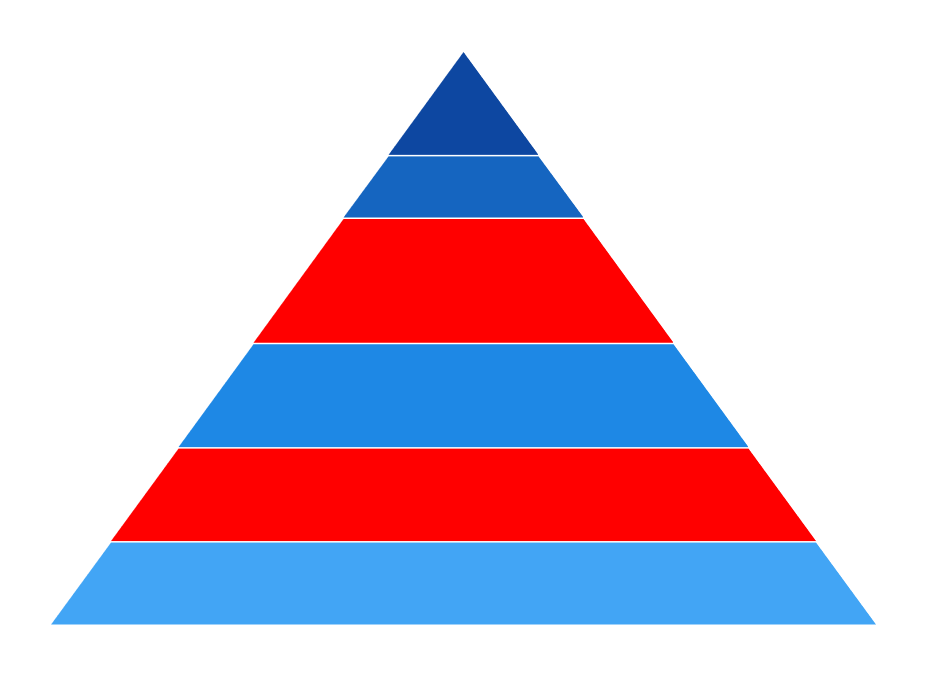
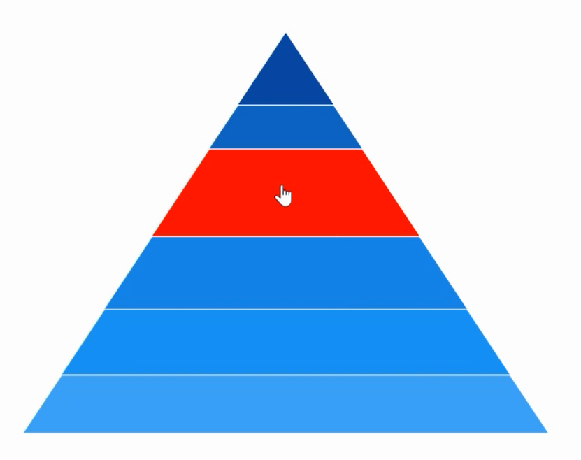

# Selection in WinUI Pyramid Chart (SfPyramidChart)

Pyramid Chart supports selection that allows you to select a segment in a chart by using [ChartSelectionBehavior](). 

## Define selection behavior

YCreate an instance [ChartSelectionBehavior]() and add it to the Behaviors collection of pyramid chart. And Need to set the [SelectionBrush]() property in pyramid chart.





<chart:SfPyramidChart x:Name="chart" 
                    SelectionBrush="Red"
                    Height="388" Width="500"
                    Palette="BlueChrome"
                    ItemsSource="{Binding Data}" 
                    XBindingPath="Category"
                    YBindingPath="Value">

    <chart:SfPyramidChart.Behaviors>
        <chart:ChartSelectionBehavior />
    </chart:SfPyramidChart.Behaviors>

</chart:SfPyramidChart>





SfPyramidChart chart = new SfPyramidChart();
chart.SetBinding(SfPyramidChart.ItemsSourceProperty, new Binding() { Path = new PropertyPath("Data") });
chart.XBindingPath = "Category";
chart.YBindingPath = "Value";
chart.SelectionBrush = new SolidColorBrush(Colors.Red);
ChartSelectionBehavior selection = new ChartSelectionBehavior();
chart.Behaviors.Add(selection);
. . .
this.Content = chart;





## Multi selection

Pyramid chart allows you to select multiple segment using [Type]() property set as `MultiPoint` of [ChartSelectionBehavior](). 

The following code snippet demonstrates multiple segment selection.





<chart:SfPyramidChart x:Name="chart"  
                    SelectionBrush="Red"
                    Palette="BlueChrome" 
                    ItemsSource="{Binding Data}" 
                    XBindingPath="Category"
                    YBindingPath="Value">

    <chart:SfPyramidChart.Behaviors>
        <chart:ChartSelectionBehavior Type="MultiPoint"/>
    </chart:SfPyramidChart.Behaviors>
. . .
</chart:SfPyramidChart>





SfPyramidChart chart = new SfPyramidChart();
chart.SetBinding(SfPyramidChart.ItemsSourceProperty, new Binding() { Path = new PropertyPath("Data") });
chart.XBindingPath = "Category";
chart.YBindingPath = "Value";
chart.SelectionBrush = new SolidColorBrush(Colors.Red);
ChartSelectionBehavior selection = new ChartSelectionBehavior();
selection.Type = SelectionType.MultiPoint;
chart.Behaviors.Add(selection);
. . .
this.Content = chart;





N>By default the [Type]() is `Point`. `Series` and `MultiSeries` is not support for pyramid chart behavior.

## Changing Cursor while Selection

[Cursor]() property allows you to define the cursor when mouse is hovered over the segment with segment selection enabled.

The following code snippet demonstrates hand cursor in segment selection.





<<chart:SfPyramidChart x:Name="chart"  
                    SelectionBrush="Red"
                    Palette="BlueChrome"  
                    ItemsSource="{Binding Data}" 
                    XBindingPath="Category"
                    YBindingPath="Value">

        <chart:SfPyramidChart.Behaviors>
            <chart:ChartSelectionBehavior Cursor="Hand" />
        </chart:SfPyramidChart.Behaviors>

</chart:SfPyramidChart>





SfPyramidChart chart = new SfPyramidChart();
chart.SetBinding(SfPyramidChart.ItemsSourceProperty, new Binding() { Path = new PropertyPath("Data") });
chart.XBindingPath = "Category";
chart.YBindingPath = "Value";
chart.SelectionBrush = new SolidColorBrush(Colors.Red);
ChartSelectionBehavior selection = new ChartSelectionBehavior();
selection.Cursor = Windows.UI.Core.CoreCursorType.Hand;
chart.Behaviors.Add(selection);
. . .
this.Content = chart;





## Events

The following events are available in SfPyramidChart for pyramid chart.

### SelectionChanging

The [SelectionChanging]() event occurs before the data point is being selected. This is a cancelable event. This argument contains the following information.

* [SelectedSegment]() - Gets the segment of the selected data point.
* [SelectedIndex]() - Gets the selected data point index.
* [PreviousSelectedIndex]() - Gets the previous selected data point index.
* [IsSelected]() - Gets a value that indicates whether the segment or series is selected.
* [IsDataPointSelection]() - Gets a value that indicates whether the selection is segment selection or series selection.
* [Cancel]() - Gets or Sets a value that indicates whether the selection should be canceled.

### SelectionChanged

The [SelectionChanged]() event occurs after a data point has been selected. This argument contains the following information.

* [SelectedSegment]() - Gets the segment of the selected data point.
* [SelectedIndex]() - Gets the selected data point index.
* [PreviousSelectedSegment]() - Gets the segment of previous selected data point.
* [PreviousSelectedIndex]() - Gets the previous selected data point index.
* [OldPointInfo]() - Gets the previous selected segment item value.
* [NewPointInfo]() - Gets the selected segment item value.
* [IsSelected]() - Gets a value that indicates whether the segment or series is being selected.
* [IsDataPointSelection]() - Gets a value that indicates whether the selection is segment selection or series selection.

