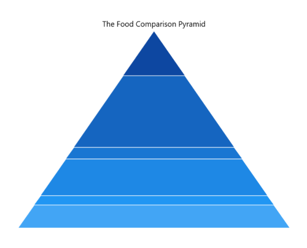
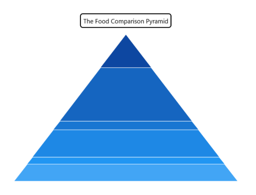
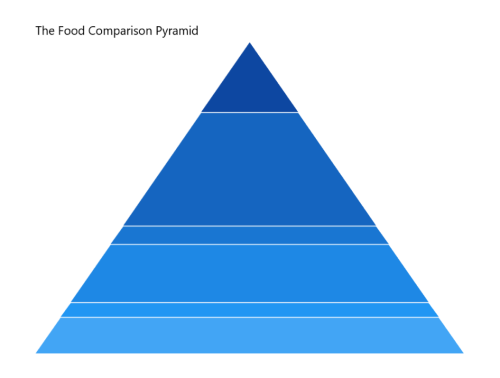

# Chart Title in WinUI Chart (SfPyramidChart)

[Header](https://help.syncfusion.com/cr/winui/Syncfusion.UI.Xaml.Charts.ChartBase.html#Syncfusion_UI_Xaml_Charts_ChartBase_Header) property is used to define the title for the chart.

   



    <chart:SfPyramidChart x:Name="chart" Header="The Food Comparison Pyramid">
    . . .           
    </chart:SfPyramidChart>





    SfPyramidChart chart = new SfPyramidChart();
    chart.Header = "The Food Comparison Pyramid";
    . . . 
    this.Content = chart;



 

## Customization

The pyramid chart provides support to add any `UIElement` as a title. The following code example defines `TextBlock` as chart header.

   



    <chart:SfPyramidChart>

        <chart:SfPyramidChart.Header>
            <Border BorderThickness="2"
                    BorderBrush="Black"
                    Margin="10"
                    CornerRadius="5">
                <TextBlock FontSize="14"
                        Text="The Food Comparison Pyramid"
                        Margin="5"/>
            </Border>
        </chart:SfPyramidChart.Header>
                
    </chart:SfPyramidChart>





        SfPyramidChart chart = new SfPyramidChart();
        . . .
        Border border = new Border()
        {
            BorderThickness = new Thickness(2),
            BorderBrush = new SolidColorBrush(Colors.Black),
            Margin = new Thickness(10),
            CornerRadius = new CornerRadius(5)
        };

        TextBlock textBlock = new TextBlock()
        {
            Text = "The Food Comparison Pyramid",
            Margin = new Thickness(5),
            FontSize = 14
        };

        border.Child = textBlock;
        chart.Header = border;
        . . . 
        this.Content = chart;



 

## Alignment

The title text content can be aligned horizontally to the left, center or right of the chart using the [HorizontalHeaderAlignment](https://help.syncfusion.com/cr/winui/Syncfusion.UI.Xaml.Charts.ChartBase.html#Syncfusion_UI_Xaml_Charts_ChartBase_HorizontalHeaderAlignment) property of the [SfPyramidChart](https://help.syncfusion.com/cr/winui/Syncfusion.UI.Xaml.Charts.SfPyramidChart.html).

   



    <chart:SfPyramidChart x:Name="chart" 
                        Header="The Food Comparison Pyramid"
                        HorizontalHeaderAlignment="Left"
                        ItemsSource="{Binding Data}" 
                        XBindingPath="FoodName"
                        YBindingPath="Calories">
                
    </chart:SfPyramidChart>





    public sealed partial class MainPage : Page
    {
        public MainPage()
        {
            this.InitializeComponent();
            SfPyramidChart chart = new SfPyramidChart();
            chart.Header = "The Food Comparison Pyramid";
            chart.HorizontalHeaderAlignment = HorizontalAlignment.Left;
            chart.SetBinding(SfPyramidChart.ItemsSourceProperty, new Binding() { Path = new PropertyPath("Data") });
            chart.XBindingPath = "FoodName";
            chart.YBindingPath = "Calories";
            . . . 
            this.Content = chart;
        }
    }



 

