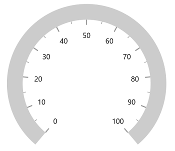
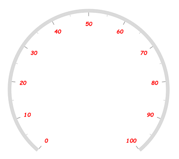
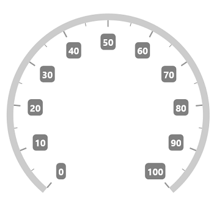
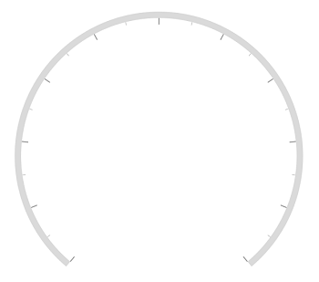
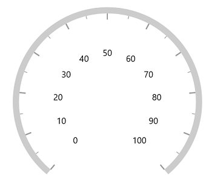
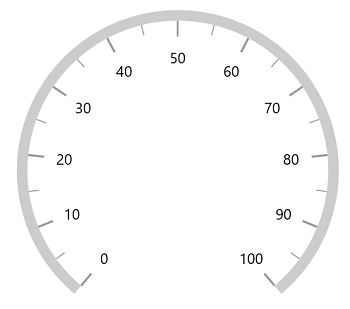
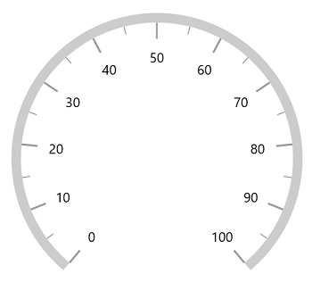
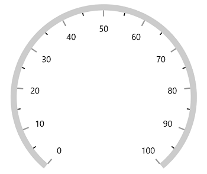
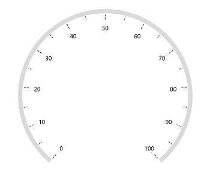
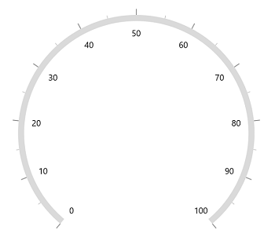

# Radial axis Feature in WinUI Radial Gauge (SfRadialGauge)

The [`Radial axis`](https://help.syncfusion.com/cr/winui/Syncfusion.UI.Xaml.Gauges.RadialAxis.html) is a circular arc in which a set of values are displayed along a linear or custom scale based on the design requirements. Axis elements such as  labels, ticks and axis line can be easily customized with built-in properties.

## Axis customization

**Setting axis minimum and maximum value** 

The [`Minimum`](https://help.syncfusion.com/cr/winui/Syncfusion.UI.Xaml.Gauges.GaugeAxis.html#Syncfusion_UI_Xaml_Gauges_GaugeAxis_Minimum) and [`Maximum`](https://help.syncfusion.com/cr/winui/Syncfusion.UI.Xaml.Gauges.GaugeAxis.html#Syncfusion_UI_Xaml_Gauges_GaugeAxis_Maximum) properties of an axis can be used to customize the axis value range.The default value of [`Minimum`](https://help.syncfusion.com/cr/winui/Syncfusion.UI.Xaml.Gauges.GaugeAxis.html#Syncfusion_UI_Xaml_Gauges_GaugeAxis_Minimum) is 0 and the default value of [`Maximum`](https://help.syncfusion.com/cr/winui/Syncfusion.UI.Xaml.Gauges.GaugeAxis.html#Syncfusion_UI_Xaml_Gauges_GaugeAxis_Maximum) is 100.





<gauge:SfRadialGauge>
    <gauge:SfRadialGauge.Axes>
        <gauge:RadialAxis Minimum="-60"
                          Maximum="60" />
    </gauge:SfRadialGauge.Axes>
</gauge:SfRadialGauge>





SfRadialGauge sfRadialGauge = new SfRadialGauge();

RadialAxis radialAxis = new RadialAxis();
radialAxis.Minimum = -60;
radialAxis.Maximum = 60;
sfRadialGauge.Axes.Add(radialAxis);

this.Content = sfRadialGauge;





**Interval**

The interval between labels can be customized using the [`Interval`](https://help.syncfusion.com/cr/winui/Syncfusion.UI.Xaml.Gauges.GaugeAxis.html#Syncfusion_UI_Xaml_Gauges_GaugeAxis_Interval) property of axis.





<gauge:SfRadialGauge>
    <gauge:SfRadialGauge.Axes>
        <gauge:RadialAxis Interval="20" />
    </gauge:SfRadialGauge.Axes>
</gauge:SfRadialGauge>





SfRadialGauge sfRadialGauge = new SfRadialGauge();

RadialAxis radialAxis = new RadialAxis();
radialAxis.Interval = 20;
sfRadialGauge.Axes.Add(radialAxis);

this.Content = sfRadialGauge;





**Angle customization**

The start and end angles of radial axis can be customized using the [`StartAngle`](https://help.syncfusion.com/cr/winui/Syncfusion.UI.Xaml.Gauges.RadialAxis.html#Syncfusion_UI_Xaml_Gauges_RadialAxis_StartAngle) and [`EndAngle`](https://help.syncfusion.com/cr/winui/Syncfusion.UI.Xaml.Gauges.RadialAxis.html#Syncfusion_UI_Xaml_Gauges_RadialAxis_EndAngle) properties.





<gauge:SfRadialGauge>
    <gauge:SfRadialGauge.Axes>
        <gauge:RadialAxis StartAngle="180"
                          EndAngle="90" />
    </gauge:SfRadialGauge.Axes>
</gauge:SfRadialGauge>





SfRadialGauge sfRadialGauge = new SfRadialGauge();

RadialAxis radialAxis = new RadialAxis();
radialAxis.StartAngle = 180;
radialAxis.EndAngle = 90;
sfRadialGauge.Axes.Add(radialAxis);

this.Content = sfRadialGauge;





**Radius customization**

The radius of the radial axis can be customized using the [`RadiusFactor`](https://help.syncfusion.com/cr/winui/Syncfusion.UI.Xaml.Gauges.RadialAxis.html#Syncfusion_UI_Xaml_Gauges_RadialAxis_RadiusFactor) property. The default value of the [`RadiusFactor`](https://help.syncfusion.com/cr/winui/Syncfusion.UI.Xaml.Gauges.RadialAxis.html#Syncfusion_UI_Xaml_Gauges_RadialAxis_RadiusFactor) is 0.9. The value of [`RadiusFactor`](https://help.syncfusion.com/cr/winui/Syncfusion.UI.Xaml.Gauges.RadialAxis.html#Syncfusion_UI_Xaml_Gauges_RadialAxis_RadiusFactor) ranges from 0 to 1. For example, When the [`RadiusFactor`](https://help.syncfusion.com/cr/winui/Syncfusion.UI.Xaml.Gauges.RadialAxis.html#Syncfusion_UI_Xaml_Gauges_RadialAxis_RadiusFactor) value is 1, the full radius will be considered for rendering the axis and when the [`RadiusFactor`](https://help.syncfusion.com/cr/winui/Syncfusion.UI.Xaml.Gauges.RadialAxis.html#Syncfusion_UI_Xaml_Gauges_RadialAxis_RadiusFactor) value is 0.5, then half of the radius value will be considered for rendering the circle.





<gauge:SfRadialGauge>
    <gauge:SfRadialGauge.Axes>
        <gauge:RadialAxis />
        <gauge:RadialAxis RadiusFactor="0.5" />
    </gauge:SfRadialGauge.Axes>
</gauge:SfRadialGauge>





SfRadialGauge sfRadialGauge = new SfRadialGauge();

RadialAxis radialAxis1 = new RadialAxis();
sfRadialGauge.Axes.Add(radialAxis1);

RadialAxis radialAxis2 = new RadialAxis();
radialAxis2.RadiusFactor = 0.5;
sfRadialGauge.Axes.Add(radialAxis2);

this.Content = sfRadialGauge;





**Positioning axis based on its angle**

The [`CanScaleToFit`](https://help.syncfusion.com/cr/winui/Syncfusion.UI.Xaml.Gauges.SfRadialGauge.html#Syncfusion_UI_Xaml_Gauges_SfRadialGauge_CanScaleToFit) property of [`radial gauge`](https://help.syncfusion.com/cr/winui/Syncfusion.UI.Xaml.Gauges.SfRadialGauge.html) allows to position the axis and its features based on the provided [`StartAngle`](https://help.syncfusion.com/cr/winui/Syncfusion.UI.Xaml.Gauges.RadialAxis.html#Syncfusion_UI_Xaml_Gauges_RadialAxis_StartAngle) and [`EndAngle`](https://help.syncfusion.com/cr/winui/Syncfusion.UI.Xaml.Gauges.RadialAxis.html#Syncfusion_UI_Xaml_Gauges_RadialAxis_EndAngle). By default, the [`CanScaleToFit`](https://help.syncfusion.com/cr/winui/Syncfusion.UI.Xaml.Gauges.SfRadialGauge.html#Syncfusion_UI_Xaml_Gauges_SfRadialGauge_CanScaleToFit) is true.





<gauge:SfRadialGauge CanScaleToFit="True">
    <gauge:SfRadialGauge.Axes>
        <gauge:RadialAxis StartAngle="180"
                          EndAngle="0"
                          Interval="10" />
    </gauge:SfRadialGauge.Axes>
</gauge:SfRadialGauge>





SfRadialGauge sfRadialGauge = new SfRadialGauge();
sfRadialGauge.CanScaleToFit = true;

RadialAxis radialAxis = new RadialAxis();
radialAxis.StartAngle = 180;
radialAxis.EndAngle = 0;
radialAxis.Interval = 10;
sfRadialGauge.Axes.Add(radialAxis);

this.Content = sfRadialGauge;





**Axis label rotation**

The axis label can be rotated based on its current angle using the [`CanRotateLabels`](https://help.syncfusion.com/cr/winui/Syncfusion.UI.Xaml.Gauges.RadialAxis.html?tabs=tabid-1#Syncfusion_UI_Xaml_Gauges_RadialAxis_CanRotateLabels) property of axis. The default value of [`CanRotateLabels`](https://help.syncfusion.com/cr/winui/Syncfusion.UI.Xaml.Gauges.RadialAxis.html?tabs=tabid-1#Syncfusion_UI_Xaml_Gauges_RadialAxis_CanRotateLabels) is false.





<gauge:SfRadialGauge>
    <gauge:SfRadialGauge.Axes>
        <gauge:RadialAxis CanRotateLabels="True" />
    </gauge:SfRadialGauge.Axes>
</gauge:SfRadialGauge>





SfRadialGauge sfRadialGauge = new SfRadialGauge();

RadialAxis radialAxis = new RadialAxis();
radialAxis.CanRotateLabels = true;
sfRadialGauge.Axes.Add(radialAxis);

this.Content = sfRadialGauge;





**Edge label customization**

The visibility of the first and last labels of an axis can be customized using the [`ShowFirstLabel`](https://help.syncfusion.com/cr/winui/Syncfusion.UI.Xaml.Gauges.RadialAxis.html?tabs=tabid-1#Syncfusion_UI_Xaml_Gauges_RadialAxis_ShowFirstLabel) and [`ShowLastLabel`](https://help.syncfusion.com/cr/winui/Syncfusion.UI.Xaml.Gauges.RadialAxis.html?tabs=tabid-1#Syncfusion_UI_Xaml_Gauges_RadialAxis_ShowLastLabel) properties. 

* [`ShowFirstLabel`](https://help.syncfusion.com/cr/winui/Syncfusion.UI.Xaml.Gauges.RadialAxis.html?tabs=tabid-1#Syncfusion_UI_Xaml_Gauges_RadialAxis_ShowFirstLabel) – Enables or disables the first label of the axis.
* [`ShowLastLabel`](https://help.syncfusion.com/cr/winui/Syncfusion.UI.Xaml.Gauges.RadialAxis.html?tabs=tabid-1#Syncfusion_UI_Xaml_Gauges_RadialAxis_ShowLastLabel) – Enables or disables the last label of the axis.

The default value of both the [`ShowFirstLabel`](https://help.syncfusion.com/cr/winui/Syncfusion.UI.Xaml.Gauges.RadialAxis.html?tabs=tabid-1#Syncfusion_UI_Xaml_Gauges_RadialAxis_ShowFirstLabel) and the [`ShowLastLabel`](https://help.syncfusion.com/cr/winui/Syncfusion.UI.Xaml.Gauges.RadialAxis.html?tabs=tabid-1#Syncfusion_UI_Xaml_Gauges_RadialAxis_ShowLastLabel) properties is true.





<gauge:SfRadialGauge>
    <gauge:SfRadialGauge.Axes>
        <gauge:RadialAxis Minimum="0"
                          Maximum="12"
                          Interval="1"
                          StartAngle="270"
                          EndAngle="270"
                          ShowFirstLabel="False" />
    </gauge:SfRadialGauge.Axes>
</gauge:SfRadialGauge>





SfRadialGauge sfRadialGauge = new SfRadialGauge();

RadialAxis radialAxis = new RadialAxis();
radialAxis.Minimum = 0;
radialAxis.Maximum = 12;
radialAxis.Interval = 1;
radialAxis.StartAngle = 270;
radialAxis.EndAngle = 270;
radialAxis.ShowFirstLabel = false;
sfRadialGauge.Axes.Add(radialAxis);

this.Content = sfRadialGauge;





**Axis direction customization**

The direction of [`Radial axis`](https://help.syncfusion.com/cr/winui/Syncfusion.UI.Xaml.Gauges.RadialAxis.html) can be customized by its [`IsInversed`](https://help.syncfusion.com/cr/winui/Syncfusion.UI.Xaml.Gauges.GaugeAxis.html#Syncfusion_UI_Xaml_Gauges_GaugeAxis_IsInversed) property. 

When the [`IsInversed`](https://help.syncfusion.com/cr/winui/Syncfusion.UI.Xaml.Gauges.GaugeAxis.html#Syncfusion_UI_Xaml_Gauges_GaugeAxis_IsInversed) property is true, the axis can be placed in counter-clockwise direction. When the  [`IsInversed`](https://help.syncfusion.com/cr/winui/Syncfusion.UI.Xaml.Gauges.GaugeAxis.html#Syncfusion_UI_Xaml_Gauges_GaugeAxis_IsInversed) property is set to false, the axis will be positioned in clockwise direction.





<gauge:SfRadialGauge>
    <gauge:SfRadialGauge.Axes>
        <gauge:RadialAxis IsInversed="True" />
    </gauge:SfRadialGauge.Axes>
</gauge:SfRadialGauge>





SfRadialGauge sfRadialGauge = new SfRadialGauge();

RadialAxis radialAxis = new RadialAxis();
radialAxis.IsInversed = true;
sfRadialGauge.Axes.Add(radialAxis);

this.Content = sfRadialGauge;





**Maximum number of labels per 100 logical pixels**

By default, a maximum of three labels are displayed for each 100 logical pixels in an axis. The maximum number of labels that should present within 100 logical pixels length can be customized using the [`MaximumLabelsCount`](https://help.syncfusion.com/cr/winui/Syncfusion.UI.Xaml.Gauges.GaugeAxis.html#Syncfusion_UI_Xaml_Gauges_GaugeAxis_MaximumLabelsCount) property of the axis. This property is applicable only for automatic range calculation and will not work if you set value for interval property of an axis.





<gauge:SfRadialGauge>
    <gauge:SfRadialGauge.Axes>
        <gauge:RadialAxis MaximumLabelsCount="5" />
    </gauge:SfRadialGauge.Axes>
</gauge:SfRadialGauge>





SfRadialGauge sfRadialGauge = new SfRadialGauge();

RadialAxis radialAxis = new RadialAxis();
radialAxis.MaximumLabelsCount = 5;
sfRadialGauge.Axes.Add(radialAxis);

this.Content = sfRadialGauge;





## Axis line customization

The radial axis line can be customized using the following properties.

* [`AxisLineWidth`](https://help.syncfusion.com/cr/winui/Syncfusion.UI.Xaml.Gauges.GaugeAxis.html#Syncfusion_UI_Xaml_Gauges_GaugeAxis_AxisLineWidth) – Customizes the thickness of axis line.
* [`AxisLineWidthUnit`](https://help.syncfusion.com/cr/winui/Syncfusion.UI.Xaml.Gauges.GaugeAxis.html#Syncfusion_UI_Xaml_Gauges_GaugeAxis_AxisLineWidthUnit) – Allows to specify the thickness of the axis line either in pixel or factor. Its default value is [`Pixel`](https://help.syncfusion.com/cr/winui/Syncfusion.UI.Xaml.Gauges.SizeUnit.html#Syncfusion_UI_Xaml_Gauges_SizeUnit_Pixel).
* [`AxisLineFill`](https://help.syncfusion.com/cr/winui/Syncfusion.UI.Xaml.Gauges.GaugeAxis.html#Syncfusion_UI_Xaml_Gauges_GaugeAxis_AxisLineFill) – Customizes the color of the axis line.
* [`GradientStops`](https://help.syncfusion.com/cr/winui/Syncfusion.UI.Xaml.Gauges.GaugeAxis.html#Syncfusion_UI_Xaml_Gauges_GaugeAxis_GradientStops) - Allows to apply the gradient brush for axis line.

**Axis line width in pixel**

If the [`AxisLineWidthUnit`](https://help.syncfusion.com/cr/winui/Syncfusion.UI.Xaml.Gauges.GaugeAxis.html#Syncfusion_UI_Xaml_Gauges_GaugeAxis_AxisLineWidthUnit) is set as a pixel, the axis line will be rendered based on the pixel values given in [`AxisLineWidth`](https://help.syncfusion.com/cr/winui/Syncfusion.UI.Xaml.Gauges.GaugeAxis.html#Syncfusion_UI_Xaml_Gauges_GaugeAxis_AxisLineWidth).





<gauge:SfRadialGauge>
    <gauge:SfRadialGauge.Axes>
        <gauge:RadialAxis AxisLineWidth="30"
                          AxisLineWidthUnit="Pixel" />
    </gauge:SfRadialGauge.Axes>
</gauge:SfRadialGauge>





SfRadialGauge sfRadialGauge = new SfRadialGauge();

RadialAxis radialAxis = new RadialAxis();
radialAxis.AxisLineWidth = 30;
radialAxis.AxisLineWidthUnit = SizeUnit.Pixel;
sfRadialGauge.Axes.Add(radialAxis);

this.Content = sfRadialGauge;





**Axis line width in factor**

If the [`AxisLineWidthUnit`](https://help.syncfusion.com/cr/winui/Syncfusion.UI.Xaml.Gauges.GaugeAxis.html#Syncfusion_UI_Xaml_Gauges_GaugeAxis_AxisLineWidthUnit) is set as a factor, the given factor value in the [`AxisLineWidth`](https://help.syncfusion.com/cr/winui/Syncfusion.UI.Xaml.Gauges.GaugeAxis.html#Syncfusion_UI_Xaml_Gauges_GaugeAxis_AxisLineWidth) is multiplied by the axis radius. The value of the factor ranges from 0 to 1.





<gauge:SfRadialGauge>
    <gauge:SfRadialGauge.Axes>
        <gauge:RadialAxis AxisLineWidth="0.1"
                          AxisLineWidthUnit="Factor" />
    </gauge:SfRadialGauge.Axes>
</gauge:SfRadialGauge>





SfRadialGauge sfRadialGauge = new SfRadialGauge();

RadialAxis radialAxis = new RadialAxis();
radialAxis.AxisLineWidth = 0.1;
radialAxis.AxisLineWidthUnit = SizeUnit.Factor;
sfRadialGauge.Axes.Add(radialAxis);

this.Content = sfRadialGauge;





**Setting axis line fill brush**

To fill the brush to axis line using the [`AxisLineFill`](https://help.syncfusion.com/cr/winui/Syncfusion.UI.Xaml.Gauges.GaugeAxis.html#Syncfusion_UI_Xaml_Gauges_GaugeAxis_AxisLineFill) property of radial axis. 





<gauge:SfRadialGauge>
    <gauge:SfRadialGauge.Axes>
        <gauge:RadialAxis AxisLineWidth="0.1"
                          AxisLineWidthUnit="Factor"
                          AxisLineFill="BlueViolet" />
    </gauge:SfRadialGauge.Axes>
</gauge:SfRadialGauge>





SfRadialGauge sfRadialGauge = new SfRadialGauge();

RadialAxis radialAxis = new RadialAxis();
radialAxis.AxisLineWidth = 0.1;
radialAxis.AxisLineWidthUnit = SizeUnit.Factor;
radialAxis.AxisLineFill = new SolidColorBrush(Colors.BlueViolet);
sfRadialGauge.Axes.Add(radialAxis);

this.Content = sfRadialGauge;





**Setting gradient brush to axis line**

The [`GradientStops`](https://help.syncfusion.com/cr/winui/Syncfusion.UI.Xaml.Gauges.GaugeAxis.html#Syncfusion_UI_Xaml_Gauges_GaugeAxis_GradientStops) property of radial axis allows to specify the gradient brush to the axis line by specifying the different colors based on provided axis value.





<gauge:SfRadialGauge>
    <gauge:SfRadialGauge.Axes>
        <gauge:RadialAxis AxisLineWidth="0.1"
                          AxisLineWidthUnit="Factor">
            <gauge:RadialAxis.GradientStops>
                <gauge:GaugeGradientStop Value="25"
                                         Color="#FFFF7676" />
                <gauge:GaugeGradientStop Value="75"
                                         Color="#FFF54EA2" />
            </gauge:RadialAxis.GradientStops>
        </gauge:RadialAxis>
    </gauge:SfRadialGauge.Axes>
</gauge:SfRadialGauge>





SfRadialGauge sfRadialGauge = new SfRadialGauge();

RadialAxis radialAxis = new RadialAxis();
radialAxis.AxisLineWidth = 0.1;
radialAxis.AxisLineWidthUnit = SizeUnit.Factor;

GaugeGradientStop gaugeGradientStop1 = new GaugeGradientStop();
gaugeGradientStop1.Value = 25;
gaugeGradientStop1.Color = Color.FromArgb(255, 255, 118, 118);
radialAxis.GradientStops.Add(gaugeGradientStop1);

GaugeGradientStop gaugeGradientStop2 = new GaugeGradientStop();
gaugeGradientStop2.Value = 75;
gaugeGradientStop2.Color = Color.FromArgb(255, 245, 78, 162);
radialAxis.GradientStops.Add(gaugeGradientStop2);

sfRadialGauge.Axes.Add(radialAxis);
this.Content = sfRadialGauge;





**Axis line visibility**

The visibility of the axis line can be customized using the [`ShowAxisLine`](https://help.syncfusion.com/cr/winui/Syncfusion.UI.Xaml.Gauges.GaugeAxis.html#Syncfusion_UI_Xaml_Gauges_GaugeAxis_ShowAxisLine) property of axis. By default, this property is set to true.





<gauge:SfRadialGauge>
    <gauge:SfRadialGauge.Axes>
        <gauge:RadialAxis ShowAxisLine="False" />
    </gauge:SfRadialGauge.Axes>
</gauge:SfRadialGauge>





SfRadialGauge sfRadialGauge = new SfRadialGauge();

RadialAxis radialAxis = new RadialAxis();
radialAxis.ShowAxisLine = false;
sfRadialGauge.Axes.Add(radialAxis);

this.Content = sfRadialGauge;





## Axis label customization

The axis labels can be customized using the following properties

* `Foreground` – Allows to customize the color of the labels.
* `FontFamily` – Allows to specify the font family for labels.
* `FontStyle` – Allows to specify the font style for labels.
* `FontWeight` – Allows to specify the font weight for labels.
* `FontSize` – Allows to specify the font size for labels.





<gauge:SfRadialGauge>
    <gauge:SfRadialGauge.Axes>
        <gauge:RadialAxis FontSize="15"
                          Foreground="Red"
                          FontFamily="Comic Sans MS"
                          FontWeight="Bold"
                          FontStyle="Italic" />
    </gauge:SfRadialGauge.Axes>
</gauge:SfRadialGauge>





SfRadialGauge sfRadialGauge = new SfRadialGauge();

RadialAxis radialAxis = new RadialAxis();
radialAxis.FontSize = 15;
radialAxis.Foreground = new SolidColorBrush(Colors.Red);
radialAxis.FontFamily = new FontFamily("Comic Sans MS");
radialAxis.FontWeight = FontWeights.SemiBold;
radialAxis.FontStyle = Windows.UI.Text.FontStyle.Italic;
sfRadialGauge.Axes.Add(radialAxis);

this.Content = sfRadialGauge;





**Formatting axis label**

The following property of the axis allows to customize the axis label text.

* [`LabelFormat`](https://help.syncfusion.com/cr/winui/Syncfusion.UI.Xaml.Gauges.GaugeAxis.html#Syncfusion_UI_Xaml_Gauges_GaugeAxis_LabelFormat) - Allows to customize the axis label with the globalized label format.





<gauge:SfRadialGauge>
    <gauge:SfRadialGauge.Axes>
        <gauge:RadialAxis LabelFormat="c" />
    </gauge:SfRadialGauge.Axes>
</gauge:SfRadialGauge>





SfRadialGauge sfRadialGauge = new SfRadialGauge();

RadialAxis radialAxis = new RadialAxis();
radialAxis.LabelFormat = "c";
sfRadialGauge.Axes.Add(radialAxis);

this.Content = sfRadialGauge;





**Template support for axis label**

The [`LabelTemplate`](https://help.syncfusion.com/cr/winui/Syncfusion.UI.Xaml.Gauges.GaugeAxis.html#Syncfusion_UI_Xaml_Gauges_GaugeAxis_LabelTemplate) property allows you to define the data template for the axis label's like the following code example.





<Page.Resources>
    <DataTemplate x:Key="labelTemplate">
        <Border Background="Gray"
                CornerRadius="5">
            <TextBlock Text="{Binding Text}"
                       Foreground="White"
                       FontStyle="Normal"
                       FontWeight="Bold"
                       Margin="3" />
        </Border>
    </DataTemplate>
</Page.Resources>

<gauge:SfRadialGauge>
    <gauge:SfRadialGauge.Axes>
        <gauge:RadialAxis LabelTemplate="{StaticResource labelTemplate}" />
    </gauge:SfRadialGauge.Axes>
</gauge:SfRadialGauge>





SfRadialGauge sfRadialGauge = new SfRadialGauge();

RadialAxis radialAxis = new RadialAxis();
radialAxis.LabelTemplate = this.Resources["labelTemplate"] as DataTemplate;
sfRadialGauge.Axes.Add(radialAxis);

this.Content = sfRadialGauge;





**Label visibility**

The [`ShowLabels`](https://help.syncfusion.com/cr/winui/Syncfusion.UI.Xaml.Gauges.GaugeAxis.html#Syncfusion_UI_Xaml_Gauges_GaugeAxis_ShowLabels) property of axis allows to enable or disable the visibility of labels. The default value of the property is true.





<gauge:SfRadialGauge>
    <gauge:SfRadialGauge.Axes>
        <gauge:RadialAxis ShowLabels="False" />
    </gauge:SfRadialGauge.Axes>
</gauge:SfRadialGauge>





SfRadialGauge sfRadialGauge = new SfRadialGauge();

RadialAxis radialAxis = new RadialAxis();
radialAxis.ShowLabels = false;
sfRadialGauge.Axes.Add(radialAxis);

this.Content = sfRadialGauge;





**Label placement**

The radial axis allows to position the labels either inside or outside of the axis line using the [`LabelPosition`](https://help.syncfusion.com/cr/winui/Syncfusion.UI.Xaml.Gauges.GaugeAxis.html#Syncfusion_UI_Xaml_Gauges_GaugeAxis_LabelPosition) property. By default, labels are positioned inside the axis line.





<gauge:SfRadialGauge>
    <gauge:SfRadialGauge.Axes>
        <gauge:RadialAxis LabelPosition="Outside" />
    </gauge:SfRadialGauge.Axes>
</gauge:SfRadialGauge>





SfRadialGauge sfRadialGauge = new SfRadialGauge();

RadialAxis radialAxis = new RadialAxis();
radialAxis.LabelPosition = LabelsPosition.Outside;
sfRadialGauge.Axes.Add(radialAxis);

this.Content = sfRadialGauge;





**Label position customization**

The [`LabelOffset`](https://help.syncfusion.com/cr/winui/Syncfusion.UI.Xaml.Gauges.RadialAxis.html?tabs=tabid-1#Syncfusion_UI_Xaml_Gauges_RadialAxis_LabelOffset) property allows to adjust the distance between the axis line and the labels. The [`OffsetUnit`](https://help.syncfusion.com/cr/winui/Syncfusion.UI.Xaml.Gauges.RadialAxis.html?tabs=tabid-1#Syncfusion_UI_Xaml_Gauges_RadialAxis_OffsetUnit) property of axis allows to specify the label offset either in factor or pixels. By default, the value of the label offset is double.NaN.

**Label offset in pixel**

If the [`OffsetUnit`](https://help.syncfusion.com/cr/winui/Syncfusion.UI.Xaml.Gauges.RadialAxis.html?tabs=tabid-1#Syncfusion_UI_Xaml_Gauges_RadialAxis_OffsetUnit) is set as a pixel, the axis labels will be moved based on the pixel values given in [`LableOffset`](https://help.syncfusion.com/cr/winui/Syncfusion.UI.Xaml.Gauges.RadialAxis.html?tabs=tabid-1#Syncfusion_UI_Xaml_Gauges_RadialAxis_LabelOffset).





<gauge:SfRadialGauge>
    <gauge:SfRadialGauge.Axes>
        <gauge:RadialAxis LabelOffset="70"
                          OffsetUnit="Pixel" />
    </gauge:SfRadialGauge.Axes>
</gauge:SfRadialGauge>





SfRadialGauge sfRadialGauge = new SfRadialGauge();

RadialAxis radialAxis = new RadialAxis();
radialAxis.OffsetUnit = SizeUnit.Pixel;
radialAxis.LabelOffset = 70;
sfRadialGauge.Axes.Add(radialAxis);

this.Content = sfRadialGauge;





**Label offset in factor**

If the [`OffsetUnit`](https://help.syncfusion.com/cr/winui/Syncfusion.UI.Xaml.Gauges.RadialAxis.html?tabs=tabid-1#Syncfusion_UI_Xaml_Gauges_RadialAxis_OffsetUnit) is set as a factor, then the provided factor value in the [`LabelOffset`](https://help.syncfusion.com/cr/winui/Syncfusion.UI.Xaml.Gauges.RadialAxis.html?tabs=tabid-1#Syncfusion_UI_Xaml_Gauges_RadialAxis_LabelOffset) is multiplied by the axis radius. The factor value ranges from 0 to 1.





<gauge:SfRadialGauge>
    <gauge:SfRadialGauge.Axes>
        <gauge:RadialAxis LabelOffset="0.3"
                          OffsetUnit="Factor" />
    </gauge:SfRadialGauge.Axes>
</gauge:SfRadialGauge>





SfRadialGauge sfRadialGauge = new SfRadialGauge();

RadialAxis radialAxis = new RadialAxis();
radialAxis.OffsetUnit = SizeUnit.Factor;
radialAxis.LabelOffset = 0.3;
sfRadialGauge.Axes.Add(radialAxis);

this.Content = sfRadialGauge;





N> The [`OffsetUnit`](https://help.syncfusion.com/cr/winui/Syncfusion.UI.Xaml.Gauges.RadialAxis.html?tabs=tabid-1#Syncfusion_UI_Xaml_Gauges_RadialAxis_OffsetUnit) property of axis is common for both the [`TickOffset`](https://help.syncfusion.com/cr/winui/Syncfusion.UI.Xaml.Gauges.RadialAxis.html?tabs=tabid-1#Syncfusion_UI_Xaml_Gauges_RadialAxis_TickOffset) and [`LabelOffset`](https://help.syncfusion.com/cr/winui/Syncfusion.UI.Xaml.Gauges.RadialAxis.html?tabs=tabid-1#Syncfusion_UI_Xaml_Gauges_RadialAxis_LabelOffset).

## Tick customization

The major and minor tick lines of an axis can be customized using the below properties.

* [`MajorTickLength`](https://help.syncfusion.com/cr/winui/Syncfusion.UI.Xaml.Gauges.GaugeAxis.html#Syncfusion_UI_Xaml_Gauges_GaugeAxis_MajorTickLength) – Specifics the major length of ticks.

* [`MinorTickLength`](https://help.syncfusion.com/cr/winui/Syncfusion.UI.Xaml.Gauges.GaugeAxis.html#Syncfusion_UI_Xaml_Gauges_GaugeAxis_MinorTickLength) – Specifics the minor length of ticks.

* [`TickLengthUnit`](https://help.syncfusion.com/cr/winui/Syncfusion.UI.Xaml.Gauges.GaugeAxis.html#Syncfusion_UI_Xaml_Gauges_GaugeAxis_TickLengthUnit) – Allows to specify the tick length either in pixels or factor. This property is common for both major and minor ticks.

* [`MajorTickStyle`](https://help.syncfusion.com/cr/winui/Syncfusion.UI.Xaml.Gauges.GaugeAxis.html#Syncfusion_UI_Xaml_Gauges_GaugeAxis_MajorTickStyle) – Allows to specify the style for major tick line.

* [`MinorTickStyle`](https://help.syncfusion.com/cr/winui/Syncfusion.UI.Xaml.Gauges.GaugeAxis.html#Syncfusion_UI_Xaml_Gauges_GaugeAxis_MinorTickStyle) – Allows to specify the style for minor tick line.

**Tick length in pixel**

If the [`TickLengthUnit`](https://help.syncfusion.com/cr/winui/Syncfusion.UI.Xaml.Gauges.GaugeAxis.html#Syncfusion_UI_Xaml_Gauges_GaugeAxis_TickLengthUnit) is set as a pixel,  the major and minor tick lines will be rendered based on the pixel values given in [`MajorTickLength`](https://help.syncfusion.com/cr/winui/Syncfusion.UI.Xaml.Gauges.GaugeAxis.html#Syncfusion_UI_Xaml_Gauges_GaugeAxis_MajorTickLength) and [`MinorTickLength`](https://help.syncfusion.com/cr/winui/Syncfusion.UI.Xaml.Gauges.GaugeAxis.html#Syncfusion_UI_Xaml_Gauges_GaugeAxis_MinorTickLength).





<gauge:SfRadialGauge>
    <gauge:SfRadialGauge.Axes>
        <gauge:RadialAxis MajorTickLength="15"
                          MinorTickLength="10"
                          TickLengthUnit="Pixel" />
    </gauge:SfRadialGauge.Axes>
</gauge:SfRadialGauge>





SfRadialGauge sfRadialGauge = new SfRadialGauge();

RadialAxis radialAxis = new RadialAxis();
radialAxis.MajorTickLength = 15;
radialAxis.MinorTickLength = 10;
radialAxis.TickLengthUnit = SizeUnit.Pixel;
sfRadialGauge.Axes.Add(radialAxis);

this.Content = sfRadialGauge;





**Tick length in factor**

If the [`TickLengthUnit`](https://help.syncfusion.com/cr/winui/Syncfusion.UI.Xaml.Gauges.GaugeAxis.html#Syncfusion_UI_Xaml_Gauges_GaugeAxis_TickLengthUnit) is set as a factor, the provided factor value in the [`MajorTickLength`](https://help.syncfusion.com/cr/winui/Syncfusion.UI.Xaml.Gauges.GaugeAxis.html#Syncfusion_UI_Xaml_Gauges_GaugeAxis_MajorTickLength) and [`MinorTickLength`](https://help.syncfusion.com/cr/winui/Syncfusion.UI.Xaml.Gauges.GaugeAxis.html#Syncfusion_UI_Xaml_Gauges_GaugeAxis_MinorTickLength) is multiplied by the axis radius, respectively. The factor value ranges from 0 to 1.





<gauge:SfRadialGauge>
    <gauge:SfRadialGauge.Axes>
        <gauge:RadialAxis MajorTickLength="0.1"
                          MinorTickLength="0.05"
                          TickLengthUnit="Factor" />
    </gauge:SfRadialGauge.Axes>
</gauge:SfRadialGauge>





SfRadialGauge sfRadialGauge = new SfRadialGauge();

RadialAxis radialAxis = new RadialAxis();
radialAxis.MajorTickLength = 0.1;
radialAxis.MinorTickLength = 0.05;
radialAxis.TickLengthUnit = SizeUnit.Factor;
sfRadialGauge.Axes.Add(radialAxis);

this.Content = sfRadialGauge;





**Setting style for major ticks**

The [`MajorTickStyle`](https://help.syncfusion.com/cr/winui/Syncfusion.UI.Xaml.Gauges.GaugeAxis.html#Syncfusion_UI_Xaml_Gauges_GaugeAxis_MajorTickStyle) property allows you to define the style for the major tick's as shown in the following code example.





<Page.Resources>
    
</Page.Resources>

<gauge:SfRadialGauge>
    <gauge:SfRadialGauge.Axes>
        <gauge:RadialAxis MajorTickStyle="{StaticResource MajorTickLineStyle}" />
    </gauge:SfRadialGauge.Axes>
</gauge:SfRadialGauge>





SfRadialGauge sfRadialGauge = new SfRadialGauge();

RadialAxis radialAxis = new RadialAxis();
radialAxis.MajorTickStyle = this.Resources["MajorTickLineStyle"] as Style;
sfRadialGauge.Axes.Add(radialAxis);

this.Content = sfRadialGauge;





**Setting style for minor ticks**

The [`MinorTickStyle`](https://help.syncfusion.com/cr/winui/Syncfusion.UI.Xaml.Gauges.GaugeAxis.html#Syncfusion_UI_Xaml_Gauges_GaugeAxis_MinorTickStyle) property allows you to define the style for the minor tick's as shown in the following code example.





<Page.Resources>
    
</Page.Resources>

<gauge:SfRadialGauge>
    <gauge:SfRadialGauge.Axes>
        <gauge:RadialAxis MinorTickStyle="{StaticResource MinorTickLineStyle}" />
    </gauge:SfRadialGauge.Axes>
</gauge:SfRadialGauge>





SfRadialGauge sfRadialGauge = new SfRadialGauge();

RadialAxis radialAxis = new RadialAxis();
radialAxis.MinorTickStyle = this.Resources["MinorTickLineStyle"] as Style;
sfRadialGauge.Axes.Add(radialAxis);

this.Content = sfRadialGauge;





**Setting dashed tick lines**

By defining `StrokDashArray` property in both [`MajorTickStyle`](https://help.syncfusion.com/cr/winui/Syncfusion.UI.Xaml.Gauges.GaugeAxis.html#Syncfusion_UI_Xaml_Gauges_GaugeAxis_MajorTickStyle) and [`MinorTickStyle`](https://help.syncfusion.com/cr/winui/Syncfusion.UI.Xaml.Gauges.GaugeAxis.html#Syncfusion_UI_Xaml_Gauges_GaugeAxis_MinorTickStyle) to draw the dashed tick line.





<Page.Resources>
    

    
</Page.Resources>

<gauge:SfRadialGauge>
    <gauge:SfRadialGauge.Axes>
        <gauge:RadialAxis MajorTickLength="15"
                          MinorTickLength="10"
                          MajorTickStyle="{StaticResource MajorTickLineStyle}"
                          MinorTickStyle="{StaticResource MinorTickLineStyle}" />
    </gauge:SfRadialGauge.Axes>
</gauge:SfRadialGauge>





SfRadialGauge sfRadialGauge = new SfRadialGauge();

RadialAxis radialAxis = new RadialAxis();
radialAxis.MajorTickLength = 15;
radialAxis.MinorTickLength = 10;
radialAxis.MajorTickStyle = this.Resources["MajorTickLineStyle"] as Style;
radialAxis.MinorTickStyle = this.Resources["MinorTickLineStyle"] as Style;
sfRadialGauge.Axes.Add(radialAxis);

this.Content = sfRadialGauge;





**Setting minor ticks count**

The major ticks are generated based on the [`Interval`](https://help.syncfusion.com/cr/winui/Syncfusion.UI.Xaml.Gauges.GaugeAxis.html#Syncfusion_UI_Xaml_Gauges_GaugeAxis_Interval) property. Like major ticks, the minor ticks are generated using the [`MinorTicksPerInterval`](https://help.syncfusion.com/cr/winui/Syncfusion.UI.Xaml.Gauges.GaugeAxis.html#Syncfusion_UI_Xaml_Gauges_GaugeAxis_MinorTicksPerInterval) property of axis.  By default, the count value of this property is 1.





<gauge:SfRadialGauge>
    <gauge:SfRadialGauge.Axes>
        <gauge:RadialAxis MinorTicksPerInterval="4" />
    </gauge:SfRadialGauge.Axes>
</gauge:SfRadialGauge>





SfRadialGauge sfRadialGauge = new SfRadialGauge();

RadialAxis radialAxis = new RadialAxis();
radialAxis.MinorTicksPerInterval = 4;
sfRadialGauge.Axes.Add(radialAxis);

this.Content = sfRadialGauge;





**Tick line visibility**

The [`ShowTicks`](https://help.syncfusion.com/cr/winui/Syncfusion.UI.Xaml.Gauges.GaugeAxis.html#Syncfusion_UI_Xaml_Gauges_GaugeAxis_ShowTicks) property of the axis is used to enable or disable the visibility of both the major and the minor ticks of axis. The default value of this property is true.





<gauge:SfRadialGauge>
    <gauge:SfRadialGauge.Axes>
        <gauge:RadialAxis ShowTicks="False" />
    </gauge:SfRadialGauge.Axes>
</gauge:SfRadialGauge>





SfRadialGauge sfRadialGauge = new SfRadialGauge();

RadialAxis radialAxis = new RadialAxis();
radialAxis.ShowTicks = false;
sfRadialGauge.Axes.Add(radialAxis);

this.Content = sfRadialGauge;





**Tick placement**

The [`Radial axis`](https://help.syncfusion.com/cr/winui/Syncfusion.UI.Xaml.Gauges.RadialAxis.html) allows to position the ticks either inside or outside or center of the axis line using the [`TickPosition`](https://help.syncfusion.com/cr/winui/Syncfusion.UI.Xaml.Gauges.GaugeAxis.html#Syncfusion_UI_Xaml_Gauges_GaugeAxis_TickPosition) property. By default, ticks are positioned inside the axis line.





<gauge:SfRadialGauge>
    <gauge:SfRadialGauge.Axes>
        <gauge:RadialAxis TickPosition="Outside" />
    </gauge:SfRadialGauge.Axes>
</gauge:SfRadialGauge>





SfRadialGauge sfRadialGauge = new SfRadialGauge();

RadialAxis radialAxis = new RadialAxis();
radialAxis.TickPosition = TickElementsPosition.Outside;
sfRadialGauge.Axes.Add(radialAxis);

this.Content = sfRadialGauge;





**Tick position customization**

The ticks can be moved near or far to the axis line using the [`TickOffset`](https://help.syncfusion.com/cr/winui/Syncfusion.UI.Xaml.Gauges.RadialAxis.html?tabs=tabid-1#Syncfusion_UI_Xaml_Gauges_RadialAxis_TickOffset) property. The [`OffsetUnit`](https://help.syncfusion.com/cr/winui/Syncfusion.UI.Xaml.Gauges.RadialAxis.html?tabs=tabid-1#Syncfusion_UI_Xaml_Gauges_RadialAxis_OffsetUnit) property of axis allows to specify the [`TickOffset`](https://help.syncfusion.com/cr/winui/Syncfusion.UI.Xaml.Gauges.RadialAxis.html?tabs=tabid-1#Syncfusion_UI_Xaml_Gauges_RadialAxis_TickOffset) either in factor or pixels and the default value of [`OffsetUnit`](https://help.syncfusion.com/cr/winui/Syncfusion.UI.Xaml.Gauges.RadialAxis.html?tabs=tabid-1#Syncfusion_UI_Xaml_Gauges_RadialAxis_OffsetUnit) is Pixel and the default value of [`TickOffset`](https://help.syncfusion.com/cr/winui/Syncfusion.UI.Xaml.Gauges.RadialAxis.html?tabs=tabid-1#Syncfusion_UI_Xaml_Gauges_RadialAxis_TickOffset) is double.NaN.

**Tick offset in pixel**

If the [`OffsetUnit`](https://help.syncfusion.com/cr/winui/Syncfusion.UI.Xaml.Gauges.RadialAxis.html?tabs=tabid-1#Syncfusion_UI_Xaml_Gauges_RadialAxis_OffsetUnit) is set as a pixel, the axis ticks will be moved based on the pixel values given in [`TickOffset`](https://help.syncfusion.com/cr/winui/Syncfusion.UI.Xaml.Gauges.RadialAxis.html?tabs=tabid-1#Syncfusion_UI_Xaml_Gauges_RadialAxis_TickOffset).





<gauge:SfRadialGauge>
    <gauge:SfRadialGauge.Axes>
        <gauge:RadialAxis TickOffset="50" />
    </gauge:SfRadialGauge.Axes>
</gauge:SfRadialGauge>





SfRadialGauge sfRadialGauge = new SfRadialGauge();

RadialAxis radialAxis = new RadialAxis();
radialAxis.TickOffset = 50;
sfRadialGauge.Axes.Add(radialAxis);

this.Content = sfRadialGauge;





**Tick offset in factor**

If the [`OffsetUnit`](https://help.syncfusion.com/cr/winui/Syncfusion.UI.Xaml.Gauges.RadialAxis.html?tabs=tabid-1#Syncfusion_UI_Xaml_Gauges_RadialAxis_OffsetUnit) is set as a factor, the provided factor value in the [`TickOffset`](https://help.syncfusion.com/cr/winui/Syncfusion.UI.Xaml.Gauges.RadialAxis.html?tabs=tabid-1#Syncfusion_UI_Xaml_Gauges_RadialAxis_TickOffset) is multiplied by the axis radius. The factor value ranges from 0 to 1.





<gauge:SfRadialGauge>
    <gauge:SfRadialGauge.Axes>
        <gauge:RadialAxis TickOffset="0.5"
                          OffsetUnit="Factor" />
    </gauge:SfRadialGauge.Axes>
</gauge:SfRadialGauge>





SfRadialGauge sfRadialGauge = new SfRadialGauge();

RadialAxis radialAxis = new RadialAxis();
radialAxis.TickOffset = 0.5;
radialAxis.OffsetUnit = SizeUnit.Factor;
sfRadialGauge.Axes.Add(radialAxis);

this.Content = sfRadialGauge;





N> The [`OffsetUnit`](https://help.syncfusion.com/cr/winui/Syncfusion.UI.Xaml.Gauges.RadialAxis.html?tabs=tabid-1#Syncfusion_UI_Xaml_Gauges_RadialAxis_OffsetUnit) property of axis is common for both the [`TickOffset`](https://help.syncfusion.com/cr/winui/Syncfusion.UI.Xaml.Gauges.RadialAxis.html?tabs=tabid-1#Syncfusion_UI_Xaml_Gauges_RadialAxis_TickOffset) and [`LabelOffset`](https://help.syncfusion.com/cr/winui/Syncfusion.UI.Xaml.Gauges.RadialAxis.html?tabs=tabid-1#Syncfusion_UI_Xaml_Gauges_RadialAxis_LabelOffset).

## Multiple axis

The [`radial gauge`](https://help.syncfusion.com/cr/winui/Syncfusion.UI.Xaml.Gauges.SfRadialGauge.html) allows you to add n number of radial axis in its axes collection. You can also customize individual axis added in the [`Axes`](https://help.syncfusion.com/cr/winui/Syncfusion.UI.Xaml.Gauges.SfRadialGauge.html#Syncfusion_UI_Xaml_Gauges_SfRadialGauge_Axes) collection.





<Page.Resources>
    

    

    

    
</Page.Resources>

<gauge:SfRadialGauge>
    <gauge:SfRadialGauge.Axes>
        <gauge:RadialAxis Maximum="60"
                            Interval="10"
                            MinorTicksPerInterval="5"
                            RadiusFactor="0.63"
                            TickLengthUnit="Factor"
                            MinorTickLength="0.05"
                            MajorTickLength="0.10"
                            AxisLineWidth="3"
                            AxisLineFill="Black"
                            Foreground="Black"
                            MinorTickStyle="{StaticResource InnerAxisMinorTickStyle}"
                            MajorTickStyle="{StaticResource InnerAxisMajorTickStyle}">
        </gauge:RadialAxis>

        <gauge:RadialAxis LabelPosition="Outside"
                            TickPosition="Outside"
                            Minimum="0"
                            Maximum="100"
                            Interval="10"
                            MinorTicksPerInterval="5"
                            RadiusFactor="0.95"
                            TickLengthUnit="Factor"
                            MinorTickLength="0.07"
                            MajorTickLength="0.15"
                            AxisLineWidth="3"
                            AxisLineFill="#8f1502"
                            Foreground="#8f1502"
                            MinorTickStyle="{StaticResource OuterAxisMinorTickStyle}"
                            MajorTickStyle="{StaticResource OuterAxisMajorTickStyle}">

        </gauge:RadialAxis>
    </gauge:SfRadialGauge.Axes>
</gauge:SfRadialGauge>





SfRadialGauge sfRadialGauge = new SfRadialGauge();

RadialAxis innerRadialAxis = new RadialAxis();
innerRadialAxis.Maximum = 60;
innerRadialAxis.Interval = 10;
innerRadialAxis.MinorTicksPerInterval = 5;
innerRadialAxis.RadiusFactor = 0.63;
innerRadialAxis.TickLengthUnit = SizeUnit.Factor;
innerRadialAxis.MinorTickLength = 0.05;
innerRadialAxis.MajorTickLength = 0.10;
innerRadialAxis.AxisLineWidth = 3;
innerRadialAxis.AxisLineFill = new SolidColorBrush(Colors.Black);
innerRadialAxis.Foreground = new SolidColorBrush(Colors.Black);
innerRadialAxis.MinorTickStyle = this.Resources["InnerAxisMinorTickStyle"] as Style;
innerRadialAxis.MajorTickStyle = this.Resources["InnerAxisMajorTickStyle"] as Style;
sfRadialGauge.Axes.Add(innerRadialAxis);

RadialAxis outerRadialAxis = new RadialAxis();
outerRadialAxis.LabelPosition = LabelsPosition.Outside;
outerRadialAxis.TickPosition = TickElementsPosition.Outside;
outerRadialAxis.Minimum = 0;
outerRadialAxis.Maximum = 100;
outerRadialAxis.Interval = 10;
outerRadialAxis.MinorTicksPerInterval = 5;
outerRadialAxis.RadiusFactor = 0.95;
outerRadialAxis.TickLengthUnit = SizeUnit.Factor;
outerRadialAxis.MinorTickLength = 0.07;
outerRadialAxis.MajorTickLength = 0.15;
outerRadialAxis.AxisLineWidth = 3;
outerRadialAxis.AxisLineFill = new SolidColorBrush(Color.FromArgb(255, 143, 21, 2));
outerRadialAxis.Foreground = new SolidColorBrush(Color.FromArgb(255, 143, 21, 2));
outerRadialAxis.MinorTickStyle = this.Resources["OuterAxisMinorTickStyle"] as Style;
outerRadialAxis.MajorTickStyle = this.Resources["OuterAxisMajorTickStyle"] as Style;
sfRadialGauge.Axes.Add(outerRadialAxis);

this.Content = sfRadialGauge;





## Custom scale range

[`radial gauge`](https://help.syncfusion.com/cr/winui/Syncfusion.UI.Xaml.Gauges.SfRadialGauge.html) allows you to define a custom scale range by extending the axis based on your business logic.





<gauge:SfRadialGauge>
    <gauge:SfRadialGauge.Axes>
        <local:RadialAxisExt Maximum="150" />
    </gauge:SfRadialGauge.Axes>
</gauge:SfRadialGauge>





public class RadialAxisExt : RadialAxis
{
    public override List<AxisLabelData> GenerateVisibleLabels()
    {
        List<AxisLabelData> customLabels = new List<AxisLabelData>();

        for (int i = 0; i < 9; i++)
        {
            double value = CalculateLabelValue(i);
            AxisLabelData label = new AxisLabelData
            {
                Value = value,
                Text = value.ToString()
            };
            customLabels.Add(label);
        }

        return customLabels;
    }

    public override double ValueToCoefficient(double value)
    {
        if (value >= 0 && value <= 2)
        {
            return (value * 0.125) / 2;
        }
        else if (value > 2 && value <= 5)
        {
            return (((value - 2) * 0.125) / (5 - 2)) + (1 * 0.125);
        }
        else if (value > 5 && value <= 10)
        {
            return (((value - 5) * 0.125) / (10 - 5)) + (2 * 0.125);
        }
        else if (value > 10 && value <= 20)
        {
            return (((value - 10) * 0.125) / (20 - 10)) + (3 * 0.125);
        }
        else if (value > 20 && value <= 30)
        {
            return (((value - 20) * 0.125) / (30 - 20)) + (4 * 0.125);
        }
        else if (value > 30 && value <= 50)
        {
            return (((value - 30) * 0.125) / (50 - 30)) + (5 * 0.125);
        }
        else if (value > 50 && value <= 100)
        {
            return (((value - 50) * 0.125) / (100 - 50)) + (6 * 0.125);
        }
        else if (value > 100 && value <= 150)
        {
            return (((value - 100) * 0.125) / (150 - 100)) + (7 * 0.125);
        }
        else
        {
            return 1;
        }
    }

    double CalculateLabelValue(double value)
    {
        if (value == 0)
        {
            return 0;
        }
        else if (value == 1)
        {
            return 2;
        }
        else if (value == 2)
        {
            return 5;
        }
        else if (value == 3)
        {
            return 10;
        }
        else if (value == 4)
        {
            return 20;
        }
        else if (value == 5)
        {
            return 30;
        }
        else if (value == 6)
        {
            return 50;
        }
        else if (value == 7)
        {
            return 100;
        }
        else
        {
            return 150;
        }
    }
}





## Events

**LabelPrepared**

The [`LabelPrepared`](https://help.syncfusion.com/cr/winui/Syncfusion.UI.Xaml.Gauges.GaugeAxis.html?tabs=tabid-1#Syncfusion_UI_Xaml_Gauges_GaugeAxis_LabelPrepared) event occurs each time a label is prepared for use. The following properties can be customized for each label in this event args:

* [`LabelText`](https://help.syncfusion.com/cr/winui/Syncfusion.UI.Xaml.Gauges.LabelPreparedEventArgs.html#Syncfusion_UI_Xaml_Gauges_LabelPreparedEventArgs_LabelText) – Allows to customize the text property of label.





<gauge:SfRadialGauge>
    <gauge:SfRadialGauge.Axes>
        <gauge:RadialAxis LabelPrepared="RadialAxis_LabelPrepared" />
    </gauge:SfRadialGauge.Axes>
</gauge:SfRadialGauge>





private void RadialAxis_LabelPrepared(object sender, LabelPreparedEventArgs e)
{
    e.LabelText += " %";
}





