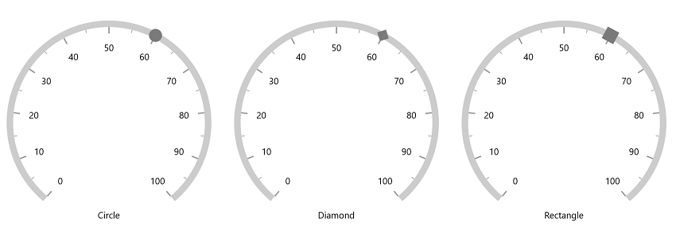
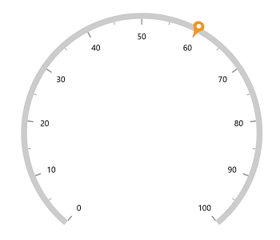
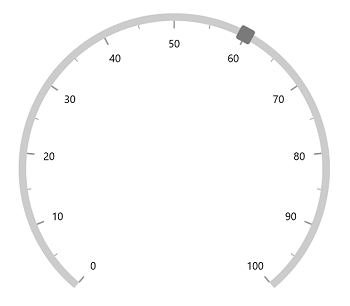
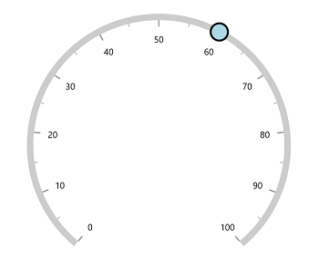

# Marker Pointer in WinUI Radial Gauge (SfRadialGauge)

Indicate current values by using different types of marker pointers. You can change the marker type using the [`MarkerType`](https://help.syncfusion.com/cr/winui/Syncfusion.UI.Xaml.Gauges.MarkerPointer.html#Syncfusion_UI_Xaml_Gauges_MarkerPointer_MarkerType) property.





<gauge:SfRadialGauge>
    <gauge:SfRadialGauge.Axes>
        <gauge:RadialAxis>
            <gauge:RadialAxis.Pointers>
                <gauge:MarkerPointer Value="60" />
            </gauge:RadialAxis.Pointers>
        </gauge:RadialAxis>
    </gauge:SfRadialGauge.Axes>
</gauge:SfRadialGauge>





SfRadialGauge sfRadialGauge = new SfRadialGauge();

RadialAxis radialAxis = new RadialAxis();
sfRadialGauge.Axes.Add(radialAxis);

MarkerPointer markerPointer = new MarkerPointer();
markerPointer.Value = 60;
radialAxis.Pointers.Add(markerPointer);

this.Content = sfRadialGauge;





Gauge supports the following types of marker:

* Circle
* Diamond
* Image
* Inverted triangle
* Rectangle
* Text
* Triangle
* Custom

## Image pointer

Image is used to denote the current pointer values instead of shape. It can be achieved by specifying the [`MarkerType`](https://help.syncfusion.com/cr/winui/Syncfusion.UI.Xaml.Gauges.MarkerPointer.html#Syncfusion_UI_Xaml_Gauges_MarkerPointer_MarkerType) as image and specifying the [`ImageSource`](https://help.syncfusion.com/cr/winui/Syncfusion.UI.Xaml.Gauges.MarkerPointer.html#Syncfusion_UI_Xaml_Gauges_MarkerPointer_ImageSource) property of marker pointer.



<gauge:SfRadialGauge>
    <gauge:SfRadialGauge.Axes>
        <gauge:RadialAxis>
            <gauge:RadialAxis.Pointers>
                <gauge:MarkerPointer Value="60"
                                     MarkerHeight="30"
                                     MarkerWidth="30"
                                     MarkerType="Image"
                                     ImageSource="pin.png"/>
            </gauge:RadialAxis.Pointers>
        </gauge:RadialAxis>
    </gauge:SfRadialGauge.Axes>
</gauge:SfRadialGauge>



## Text pointer

Text is used to denote the current pointer value instead of any marker shape. It can be achieved by setting the [`MarkerType`](https://help.syncfusion.com/cr/winui/Syncfusion.UI.Xaml.Gauges.MarkerPointer.html#Syncfusion_UI_Xaml_Gauges_MarkerPointer_MarkerType) as text and provide requrired text in [`Text`](https://help.syncfusion.com/cr/winui/Syncfusion.UI.Xaml.Gauges.MarkerPointer.html#Syncfusion_UI_Xaml_Gauges_MarkerPointer_Text) property. The provided text can be customized using the `Foreground` `FontSize` `FontWeight` `FontFamily` properties of marker pointer.





<gauge:SfRadialGauge>
    <gauge:SfRadialGauge.Axes>
        <gauge:RadialAxis>
            <gauge:RadialAxis.Pointers>
                <gauge:MarkerPointer Value="50"
                                     MarkerHeight="30"
                                     MarkerWidth="30"
                                     MarkerType="Text"
                                     Text="Average"
                                     FontSize="15"
                                     FontWeight="SemiBold"
                                     FontStyle="Italic" />
            </gauge:RadialAxis.Pointers>
        </gauge:RadialAxis>
    </gauge:SfRadialGauge.Axes>
</gauge:SfRadialGauge>





SfRadialGauge sfRadialGauge = new SfRadialGauge();

RadialAxis radialAxis = new RadialAxis();
sfRadialGauge.Axes.Add(radialAxis);

MarkerPointer markerPointer = new MarkerPointer();
markerPointer.Value = 50;
markerPointer.MarkerHeight = 30;
markerPointer.MarkerWidth = 30;
markerPointer.MarkerType = Syncfusion.UI.Xaml.Gauges.MarkerType.Text;
markerPointer.Text = "Average";
markerPointer.FontSize = 15;
markerPointer.FontWeight = FontWeights.SemiBold;
markerPointer.FontStyle = FontStyle.Italic;
radialAxis.Pointers.Add(markerPointer);

this.Content = sfRadialGauge;





## Add customized pointer

You can add customized symbols to denote the current pointer value instead of in-built marker shape. It can be achieved by setting the [`MarkerType`](https://help.syncfusion.com/cr/winui/Syncfusion.UI.Xaml.Gauges.MarkerPointer.html#Syncfusion_UI_Xaml_Gauges_MarkerPointer_MarkerType) as [`Custom`](https://help.syncfusion.com/cr/winui/Syncfusion.UI.Xaml.Gauges.MarkerType.html#Syncfusion_UI_Xaml_Gauges_MarkerType_Custom) and provide requrired shape in [`MarkerTemplate`](https://help.syncfusion.com/cr/winui/Syncfusion.UI.Xaml.Gauges.MarkerPointer.html#Syncfusion_UI_Xaml_Gauges_MarkerPointer_MarkerTemplate) property.





<Page.Resources>
    <DataTemplate x:Key="CustomMarkerPointer">
        <Grid>
            <Rectangle Fill="{Binding Background}"
                       Stroke="{Binding BorderBrush}"
                       StrokeThickness="{Binding BorderWidth}"
                       Width="{Binding MarkerWidth}"
                       Height="{Binding MarkerHeight}"
                       RadiusX="3"
                       RadiusY="3" />
        </Grid>
    </DataTemplate>
</Page.Resources>

<gauge:SfRadialGauge>
    <gauge:SfRadialGauge.Axes>
        <gauge:RadialAxis>
            <gauge:RadialAxis.Pointers>
                <gauge:MarkerPointer Value="60"
                                     MarkerType="Custom"
                                     MarkerTemplate="{StaticResource CustomMarkerPointer}"/>
            </gauge:RadialAxis.Pointers>
        </gauge:RadialAxis>
    </gauge:SfRadialGauge.Axes>
</gauge:SfRadialGauge>





SfRadialGauge sfRadialGauge = new SfRadialGauge();

RadialAxis radialAxis = new RadialAxis();
sfRadialGauge.Axes.Add(radialAxis);

MarkerPointer markerPointer = new MarkerPointer();
markerPointer.Value = 60;
markerPointer.MarkerType = Syncfusion.UI.Xaml.Gauges.MarkerType.Custom;
markerPointer.MarkerTemplate = this.Resources["CustomMarkerPointer"] as DataTemplate;
radialAxis.Pointers.Add(markerPointer);

this.Content = sfRadialGauge;





## Marker customization

The marker pointer can be customized using the following properties:

* `Background` – Allows to customize the marker color.
* [`MarkerHeight`](https://help.syncfusion.com/cr/winui/Syncfusion.UI.Xaml.Gauges.MarkerPointer.html#Syncfusion_UI_Xaml_Gauges_MarkerPointer_MarkerHeight) – Allows to specify the marker height.
* [`MarkerWidth`](https://help.syncfusion.com/cr/winui/Syncfusion.UI.Xaml.Gauges.MarkerPointer.html#Syncfusion_UI_Xaml_Gauges_MarkerPointer_MarkerWidth) – Allows to specify the marker width.
* `BorderBrush` – Allows to specify the border color for the marker.
* [`BorderWidth`](https://help.syncfusion.com/cr/winui/Syncfusion.UI.Xaml.Gauges.MarkerPointer.html#Syncfusion_UI_Xaml_Gauges_MarkerPointer_BorderWidth) –  Allows to specify the border width of the marker.





<gauge:SfRadialGauge>
    <gauge:SfRadialGauge.Axes>
        <gauge:RadialAxis>
            <gauge:RadialAxis.Pointers>
                <gauge:MarkerPointer Value="60"
                                     MarkerHeight="30"
                                     MarkerWidth="30"
                                     BorderBrush="Black"
                                     BorderWidth="3"
                                     MarkerType="Circle"
                                     Background="LightBlue"/>
            </gauge:RadialAxis.Pointers>
        </gauge:RadialAxis>
    </gauge:SfRadialGauge.Axes>
</gauge:SfRadialGauge>





SfRadialGauge sfRadialGauge = new SfRadialGauge();

RadialAxis radialAxis = new RadialAxis();
sfRadialGauge.Axes.Add(radialAxis);

MarkerPointer markerPointer = new MarkerPointer();
markerPointer.Value = 60;
markerPointer.MarkerHeight = 30;
markerPointer.MarkerWidth = 30;
markerPointer.BorderBrush = new SolidColorBrush(Colors.Black);
markerPointer.BorderWidth = 3;
markerPointer.MarkerType = Syncfusion.UI.Xaml.Gauges.MarkerType.Circle;
markerPointer.Background = new SolidColorBrush(Colors.LightBlue);
radialAxis.Pointers.Add(markerPointer);

this.Content = sfRadialGauge;





## Marker position customization

The marker pointer can be moved near or far from its actual position using the [`MarkerOffset`](https://help.syncfusion.com/cr/winui/Syncfusion.UI.Xaml.Gauges.MarkerPointer.html#Syncfusion_UI_Xaml_Gauges_MarkerPointer_MarkerOffset) and [`OffsetUnit`](https://help.syncfusion.com/cr/winui/Syncfusion.UI.Xaml.Gauges.MarkerPointer.html#Syncfusion_UI_Xaml_Gauges_MarkerPointer_OffsetUnit) properties. 

When you set [`OffsetUnit`](https://help.syncfusion.com/cr/winui/Syncfusion.UI.Xaml.Gauges.MarkerPointer.html#Syncfusion_UI_Xaml_Gauges_MarkerPointer_OffsetUnit) to pixel, the marker pointer will be moved based on the pixel value. If you set [`OffsetUnit`](https://help.syncfusion.com/cr/winui/Syncfusion.UI.Xaml.Gauges.MarkerPointer.html#Syncfusion_UI_Xaml_Gauges_MarkerPointer_OffsetUnit) to factor, then provided factor will be multiplied with the axis radius value, and then the pointer will be moved to corresponding value. The default value of [`OffsetUnit`](https://help.syncfusion.com/cr/winui/Syncfusion.UI.Xaml.Gauges.MarkerPointer.html#Syncfusion_UI_Xaml_Gauges_MarkerPointer_OffsetUnit) is [`SizeUnit.Pixel`](https://help.syncfusion.com/cr/winui/Syncfusion.UI.Xaml.Gauges.SizeUnit.html#Syncfusion_UI_Xaml_Gauges_SizeUnit_Pixel).





<gauge:SfRadialGauge>
    <gauge:SfRadialGauge.Axes>
        <gauge:RadialAxis>
            <gauge:RadialAxis.Pointers>
                <gauge:MarkerPointer Value="60"
                                     MarkerOffset="-18"/>
            </gauge:RadialAxis.Pointers>
        </gauge:RadialAxis>
    </gauge:SfRadialGauge.Axes>
</gauge:SfRadialGauge>





SfRadialGauge sfRadialGauge = new SfRadialGauge();

RadialAxis radialAxis = new RadialAxis();
sfRadialGauge.Axes.Add(radialAxis);

MarkerPointer markerPointer = new MarkerPointer();
markerPointer.Value = 60;
markerPointer.MarkerOffset = -18;
radialAxis.Pointers.Add(markerPointer);

this.Content = sfRadialGauge;





