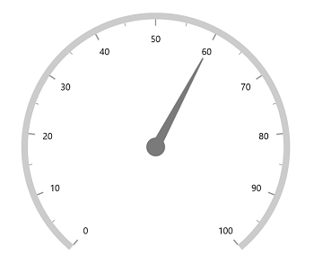
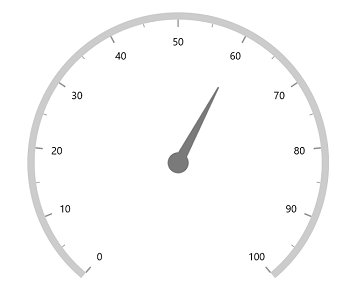
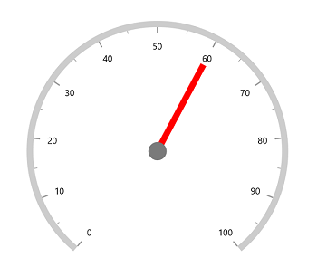
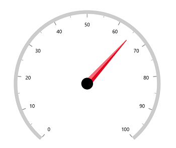
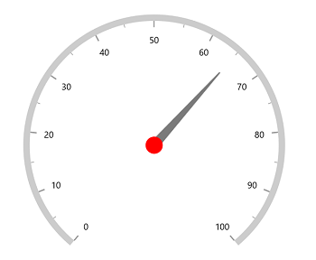
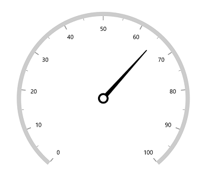

# Needle Pointer in WinUI Radial Gauge

[`Needle Pointer`](https://help.syncfusion.com/cr/winui/Syncfusion.UI.Xaml.Gauges.NeedlePointer.html) contains three parts, namely needle, knob, and tail and that can be placed on a gauge to mark the values.





<gauge:SfRadialGauge>
    <gauge:SfRadialGauge.Axes>
        <gauge:RadialAxis>
            <gauge:RadialAxis.Pointers>
                <gauge:NeedlePointer Value="60" />
            </gauge:RadialAxis.Pointers>
        </gauge:RadialAxis>
    </gauge:SfRadialGauge.Axes>
</gauge:SfRadialGauge>





SfRadialGauge sfRadialGauge = new SfRadialGauge();

RadialAxis radialAxis = new RadialAxis();
sfRadialGauge.Axes.Add(radialAxis);

NeedlePointer needlePointer = new NeedlePointer();
needlePointer.Value = 60;
radialAxis.Pointers.Add(needlePointer);

this.Content = sfRadialGauge;





## Needle customization

The needle can be customized using the following properties:

* [`NeedleLength`](https://help.syncfusion.com/cr/winui/Syncfusion.UI.Xaml.Gauges.NeedlePointer.html#Syncfusion_UI_Xaml_Gauges_NeedlePointer_NeedleLength) – Customizes the length of the needle. The length of the pointer can be set either in pixel or factor.

* [`NeedleLengthUnit`](https://help.syncfusion.com/cr/winui/Syncfusion.UI.Xaml.Gauges.NeedlePointer.html#Syncfusion_UI_Xaml_Gauges_NeedlePointer_NeedleLengthUnit) – Specifies whether to set the length in pixel or factor. 

* [`NeedleStartWidth`](https://help.syncfusion.com/cr/winui/Syncfusion.UI.Xaml.Gauges.NeedlePointer.html#Syncfusion_UI_Xaml_Gauges_NeedlePointer_NeedleStartWidth) – Specifies the start width of the needle.

* [`NeedleEndWidth`](https://help.syncfusion.com/cr/winui/Syncfusion.UI.Xaml.Gauges.NeedlePointer.html#Syncfusion_UI_Xaml_Gauges_NeedlePointer_NeedleEndWidth) – Specifies the end width of the needle.

* [`NeedleFill`](https://help.syncfusion.com/cr/winui/Syncfusion.UI.Xaml.Gauges.NeedlePointer.html#Syncfusion_UI_Xaml_Gauges_NeedlePointer_NeedleFill) – Specifies the needle color.

**Needle length customization**

The needle length can be controlled using the [`NeedleLength`](https://help.syncfusion.com/cr/winui/Syncfusion.UI.Xaml.Gauges.NeedlePointer.html#Syncfusion_UI_Xaml_Gauges_NeedlePointer_NeedleLength) and [`NeedleLengthUnit`](https://help.syncfusion.com/cr/winui/Syncfusion.UI.Xaml.Gauges.NeedlePointer.html#Syncfusion_UI_Xaml_Gauges_NeedlePointer_NeedleLengthUnit) properties. The length can be set either in pixels or factor using [`NeedleLengthUnit`](https://help.syncfusion.com/cr/winui/Syncfusion.UI.Xaml.Gauges.NeedlePointer.html#Syncfusion_UI_Xaml_Gauges_NeedlePointer_NeedleLengthUnit).

If the [`NeedleLengthUnit`](https://help.syncfusion.com/cr/winui/Syncfusion.UI.Xaml.Gauges.NeedlePointer.html#Syncfusion_UI_Xaml_Gauges_NeedlePointer_NeedleLengthUnit) is set to pixel, the pixel value will be set to the [`NeedleLength`](https://help.syncfusion.com/cr/winui/Syncfusion.UI.Xaml.Gauges.NeedlePointer.html#Syncfusion_UI_Xaml_Gauges_NeedlePointer_NeedleLength) to calculate the needle length. 
If the [`NeedleLengthUnit`](https://help.syncfusion.com/cr/winui/Syncfusion.UI.Xaml.Gauges.NeedlePointer.html#Syncfusion_UI_Xaml_Gauges_NeedlePointer_NeedleLengthUnit) is set to factor, then the factor value will be set to the [`NeedleLength`](https://help.syncfusion.com/cr/winui/Syncfusion.UI.Xaml.Gauges.NeedlePointer.html#Syncfusion_UI_Xaml_Gauges_NeedlePointer_NeedleLength). The factor value ranges from 0 to 1. For example, if the needle length is set to 0.5, the half of the radius value is set to the needle length. The default value of  [`NeedleLengthUnit`](https://help.syncfusion.com/cr/winui/Syncfusion.UI.Xaml.Gauges.NeedlePointer.html#Syncfusion_UI_Xaml_Gauges_NeedlePointer_NeedleLengthUnit) is factor.





<gauge:SfRadialGauge>
    <gauge:SfRadialGauge.Axes>
        <gauge:RadialAxis>
            <gauge:RadialAxis.Pointers>
                <gauge:NeedlePointer Value="60"
                                     NeedleLengthUnit="Pixel"
                                     NeedleLength="130" />
            </gauge:RadialAxis.Pointers>
        </gauge:RadialAxis>
    </gauge:SfRadialGauge.Axes>
</gauge:SfRadialGauge>





SfRadialGauge sfRadialGauge = new SfRadialGauge();

RadialAxis radialAxis = new RadialAxis();
sfRadialGauge.Axes.Add(radialAxis);

NeedlePointer needlePointer = new NeedlePointer();
needlePointer.Value = 60;
needlePointer.NeedleLengthUnit = SizeUnit.Pixel;
needlePointer.NeedleLength = 130;
radialAxis.Pointers.Add(needlePointer);

this.Content = sfRadialGauge;





**Needle width customization**

The width of the needle pointer can be customized using the [`NeedleStartWidth`](https://help.syncfusion.com/cr/winui/Syncfusion.UI.Xaml.Gauges.NeedlePointer.html#Syncfusion_UI_Xaml_Gauges_NeedlePointer_NeedleStartWidth) and [`NeedleEndWidth`](https://help.syncfusion.com/cr/winui/Syncfusion.UI.Xaml.Gauges.NeedlePointer.html#Syncfusion_UI_Xaml_Gauges_NeedlePointer_NeedleEndWidth) properties.





<gauge:SfRadialGauge>
    <gauge:SfRadialGauge.Axes>
        <gauge:RadialAxis>
            <gauge:RadialAxis.Pointers>
                <gauge:NeedlePointer Value="60"
                                     NeedleLengthUnit="Factor"
                                     NeedleLength="0.75"
                                     NeedleStartWidth="10"
                                     NeedleEndWidth="10"
                                     NeedleFill="Red"/>
            </gauge:RadialAxis.Pointers>
        </gauge:RadialAxis>
    </gauge:SfRadialGauge.Axes>
</gauge:SfRadialGauge>





SfRadialGauge sfRadialGauge = new SfRadialGauge();

RadialAxis radialAxis = new RadialAxis();
sfRadialGauge.Axes.Add(radialAxis);

NeedlePointer needlePointer = new NeedlePointer();
needlePointer.Value = 60;
needlePointer.NeedleLengthUnit = SizeUnit.Factor;
needlePointer.NeedleLength = 0.75;
needlePointer.NeedleFill = new SolidColorBrush(Colors.Red);
needlePointer.NeedleStartWidth = 10;
needlePointer.NeedleEndWidth = 10;
radialAxis.Pointers.Add(needlePointer);

this.Content = sfRadialGauge;





**Setting gradient brush to the needle**

 The [`NeedleFill`](https://help.syncfusion.com/cr/winui/Syncfusion.UI.Xaml.Gauges.NeedlePointer.html#Syncfusion_UI_Xaml_Gauges_NeedlePointer_NeedleFill) property of [`Needle Pointer`](https://help.syncfusion.com/cr/winui/Syncfusion.UI.Xaml.Gauges.NeedlePointer.html) is Brush type. So, it accepts gradient brushes by default as shown in below code





<gauge:SfRadialGauge>
    <gauge:SfRadialGauge.Axes>
        <gauge:RadialAxis>
            <gauge:RadialAxis.Pointers>
                <gauge:NeedlePointer Value="65"
                                     NeedleLengthUnit="Factor"
                                     NeedleLength="0.8"
                                     NeedleEndWidth="20"
                                     KnobRadius="0.08"
                                     KnobFill="Black">
                    <gauge:NeedlePointer.NeedleFill>
                        <LinearGradientBrush StartPoint="0,0.5"
                                             EndPoint="1,0.5">
                            <GradientStop Color="#FFFF6B78"
                                          Offset="0" />
                            <GradientStop Color="#FFFF6B78"
                                          Offset="0.5" />
                            <GradientStop Color="#FFE20A22"
                                          Offset="0.5" />
                            <GradientStop Color="#FFE20A22"
                                          Offset="1" />
                        </LinearGradientBrush>
                    </gauge:NeedlePointer.NeedleFill>
                </gauge:NeedlePointer>
            </gauge:RadialAxis.Pointers>
        </gauge:RadialAxis>
    </gauge:SfRadialGauge.Axes>
</gauge:SfRadialGauge>





SfRadialGauge sfRadialGauge = new SfRadialGauge();

RadialAxis radialAxis = new RadialAxis();
sfRadialGauge.Axes.Add(radialAxis);

NeedlePointer needlePointer = new NeedlePointer();
needlePointer.Value = 65;
needlePointer.NeedleLengthUnit = SizeUnit.Factor;
needlePointer.NeedleLength = 0.8;
needlePointer.NeedleEndWidth = 20;
needlePointer.KnobRadius = 0.08;
needlePointer.KnobFill = new SolidColorBrush(Microsoft.UI.Colors.Black);

LinearGradientBrush linearGradientBrush = new LinearGradientBrush();
linearGradientBrush.StartPoint = new Point(0, 0.5);
linearGradientBrush.EndPoint = new Point(1, 0.5);
linearGradientBrush.GradientStops.Add(new GradientStop { Offset = 0,  Color = Color.FromArgb(255, 255, 107, 120) });
linearGradientBrush.GradientStops.Add(new GradientStop { Offset = 0.5, Color = Color.FromArgb(255, 255, 107, 120) });
linearGradientBrush.GradientStops.Add(new GradientStop { Offset = 0.5, Color = Color.FromArgb(255, 226, 10, 34) });
linearGradientBrush.GradientStops.Add(new GradientStop { Offset = 1, Color = Color.FromArgb(255, 226, 10, 34) });
needlePointer.NeedleFill = linearGradientBrush;

radialAxis.Pointers.Add(needlePointer);

this.Content = sfRadialGauge;





## Knob customization

The knob can be customized using the following properties:

* [`knobRadius`](https://help.syncfusion.com/cr/winui/Syncfusion.UI.Xaml.Gauges.NeedlePointer.html#Syncfusion_UI_Xaml_Gauges_NeedlePointer_KnobRadius) – Specifies the knob radius either in pixels or factor.

* [`KnobFill`](https://help.syncfusion.com/cr/winui/Syncfusion.UI.Xaml.Gauges.NeedlePointer.html#Syncfusion_UI_Xaml_Gauges_NeedlePointer_KnobFill) – Specifies the knob color.

* [`KnobStrokeThickness`](https://help.syncfusion.com/cr/winui/Syncfusion.UI.Xaml.Gauges.NeedlePointer.html#Syncfusion_UI_Xaml_Gauges_NeedlePointer_KnobStrokeThickness) – Specifies the width of the knob stroke outline of knob either in pixels or factor.

* [`KnobStroke`](https://help.syncfusion.com/cr/winui/Syncfusion.UI.Xaml.Gauges.NeedlePointer.html#Syncfusion_UI_Xaml_Gauges_NeedlePointer_KnobStroke) – Specifies the knob border color.

* [`KnobSizeUnit`](https://help.syncfusion.com/cr/winui/Syncfusion.UI.Xaml.Gauges.NeedlePointer.html#Syncfusion_UI_Xaml_Gauges_NeedlePointer_KnobSizeUnit) – Allows to specify whether the value of knob radius and border width is in pixels or in factor.

**Knob radius customization**

The radius of the knob can be customized using the [`knobRadius`](https://help.syncfusion.com/cr/winui/Syncfusion.UI.Xaml.Gauges.NeedlePointer.html#Syncfusion_UI_Xaml_Gauges_NeedlePointer_KnobRadius) and [`KnobSizeUnit`](https://help.syncfusion.com/cr/winui/Syncfusion.UI.Xaml.Gauges.NeedlePointer.html#Syncfusion_UI_Xaml_Gauges_NeedlePointer_KnobSizeUnit).  If [`KnobSizeUnit`](https://help.syncfusion.com/cr/winui/Syncfusion.UI.Xaml.Gauges.NeedlePointer.html#Syncfusion_UI_Xaml_Gauges_NeedlePointer_KnobSizeUnit) is pixel, the pixel value can be set to the [`knobRadius`](https://help.syncfusion.com/cr/winui/Syncfusion.UI.Xaml.Gauges.NeedlePointer.html#Syncfusion_UI_Xaml_Gauges_NeedlePointer_KnobRadius).





<gauge:SfRadialGauge>
    <gauge:SfRadialGauge.Axes>
        <gauge:RadialAxis>
            <gauge:RadialAxis.Pointers>
                <gauge:NeedlePointer Value="65"
                                     KnobSizeUnit="Pixel"
                                     KnobRadius="15"
                                     KnobFill="Red" />
            </gauge:RadialAxis.Pointers>
        </gauge:RadialAxis>
    </gauge:SfRadialGauge.Axes>
</gauge:SfRadialGauge>





SfRadialGauge sfRadialGauge = new SfRadialGauge();

RadialAxis radialAxis = new RadialAxis();
sfRadialGauge.Axes.Add(radialAxis);

NeedlePointer needlePointer = new NeedlePointer();
needlePointer.Value = 65;
needlePointer.KnobRadius = 15;
needlePointer.KnobSizeUnit = SizeUnit.Pixel;
needlePointer.KnobFill = new SolidColorBrush(Colors.Red);
radialAxis.Pointers.Add(needlePointer);

this.Content = sfRadialGauge;





If the [`KnobSizeUnit`](https://help.syncfusion.com/cr/winui/Syncfusion.UI.Xaml.Gauges.NeedlePointer.html#Syncfusion_UI_Xaml_Gauges_NeedlePointer_KnobSizeUnit) is set to factor, the factor value will be set to knob radius. The factor value ranges from 0 to 1. For example, if the needle length is set to 0.1, 10% of the radius value of axis will be set to knob radius. By default, the value of [`KnobSizeUnit`](https://help.syncfusion.com/cr/winui/Syncfusion.UI.Xaml.Gauges.NeedlePointer.html#Syncfusion_UI_Xaml_Gauges_NeedlePointer_KnobSizeUnit) is factor

**Knob stroke customization**

Like knob radius, the [`KnobStrokeThickness`](https://help.syncfusion.com/cr/winui/Syncfusion.UI.Xaml.Gauges.NeedlePointer.html#Syncfusion_UI_Xaml_Gauges_NeedlePointer_KnobStrokeThickness) can be specified either in pixel or factor. The [`KnobSizeUnit`](https://help.syncfusion.com/cr/winui/Syncfusion.UI.Xaml.Gauges.NeedlePointer.html#Syncfusion_UI_Xaml_Gauges_NeedlePointer_KnobSizeUnit) property is common for both [`knobRadius`](https://help.syncfusion.com/cr/winui/Syncfusion.UI.Xaml.Gauges.NeedlePointer.html#Syncfusion_UI_Xaml_Gauges_NeedlePointer_KnobRadius) and [`KnobStrokeThickness`](https://help.syncfusion.com/cr/winui/Syncfusion.UI.Xaml.Gauges.NeedlePointer.html#Syncfusion_UI_Xaml_Gauges_NeedlePointer_KnobStrokeThickness) properties.





<gauge:SfRadialGauge>
    <gauge:SfRadialGauge.Axes>
        <gauge:RadialAxis>
            <gauge:RadialAxis.Pointers>
                <gauge:NeedlePointer Value="65"
                                     NeedleEndWidth="10"
                                     NeedleFill="Black"
                                     KnobRadius="0.05"
                                     KnobStrokeThickness="0.02"
                                     KnobStroke="Black"
                                     KnobFill="White" />
            </gauge:RadialAxis.Pointers>
        </gauge:RadialAxis>
    </gauge:SfRadialGauge.Axes>
</gauge:SfRadialGauge>





SfRadialGauge sfRadialGauge = new SfRadialGauge();

RadialAxis radialAxis = new RadialAxis();
sfRadialGauge.Axes.Add(radialAxis);

NeedlePointer needlePointer = new NeedlePointer();
needlePointer.Value = 65;
needlePointer.NeedleEndWidth = 10;
needlePointer.NeedleFill = new SolidColorBrush(Colors.Black);
needlePointer.KnobRadius = 0.05;
needlePointer.KnobStrokeThickness = 0.02;
needlePointer.KnobFill = new SolidColorBrush(Colors.White);
needlePointer.KnobStroke = new SolidColorBrush(Colors.Black);
radialAxis.Pointers.Add(needlePointer);

this.Content = sfRadialGauge;





## Tail customization

The tail of the needle can be customized using the following properties,

* [`TailLength`](https://help.syncfusion.com/cr/winui/Syncfusion.UI.Xaml.Gauges.NeedlePointer.html#Syncfusion_UI_Xaml_Gauges_NeedlePointer_TailLength) – Specifies the length of tail either in pixels or factor.

* [`TailLengthUnit`](https://help.syncfusion.com/cr/winui/Syncfusion.UI.Xaml.Gauges.NeedlePointer.html#Syncfusion_UI_Xaml_Gauges_NeedlePointer_TailLengthUnit) – Specifies whether the tail length value is defined in pixels or factor.

* [`TailWidth`](https://help.syncfusion.com/cr/winui/Syncfusion.UI.Xaml.Gauges.NeedlePointer.html#Syncfusion_UI_Xaml_Gauges_NeedlePointer_TailWidth) – Specifies the width for the tail.

* [`TailFill`](https://help.syncfusion.com/cr/winui/Syncfusion.UI.Xaml.Gauges.NeedlePointer.html#Syncfusion_UI_Xaml_Gauges_NeedlePointer_TailFill) -  Specifies the tail color.

**Tail length customization**

The tail length can be controlled using the [`TailLength`](https://help.syncfusion.com/cr/winui/Syncfusion.UI.Xaml.Gauges.NeedlePointer.html#Syncfusion_UI_Xaml_Gauges_NeedlePointer_TailLength) and [`TailLengthUnit`](https://help.syncfusion.com/cr/winui/Syncfusion.UI.Xaml.Gauges.NeedlePointer.html#Syncfusion_UI_Xaml_Gauges_NeedlePointer_TailLengthUnit) properties. The length can be set either in pixels or factor using [`TailLengthUnit`](https://help.syncfusion.com/cr/winui/Syncfusion.UI.Xaml.Gauges.NeedlePointer.html#Syncfusion_UI_Xaml_Gauges_NeedlePointer_TailLengthUnit). The default value of [`TailLengthUnit`](https://help.syncfusion.com/cr/winui/Syncfusion.UI.Xaml.Gauges.NeedlePointer.html#Syncfusion_UI_Xaml_Gauges_NeedlePointer_TailLengthUnit) is factor.

**Tail length in pixel**

If the [`TailLengthUnit`](https://help.syncfusion.com/cr/winui/Syncfusion.UI.Xaml.Gauges.NeedlePointer.html#Syncfusion_UI_Xaml_Gauges_NeedlePointer_TailLengthUnit) is set as a pixel, the tail will be rendered based on the pixel value given in [`TailLength`](https://help.syncfusion.com/cr/winui/Syncfusion.UI.Xaml.Gauges.NeedlePointer.html#Syncfusion_UI_Xaml_Gauges_NeedlePointer_TailLength).





<gauge:SfRadialGauge>
    <gauge:SfRadialGauge.Axes>
        <gauge:RadialAxis>
            <gauge:RadialAxis.Pointers>
                <gauge:NeedlePointer Value="60"
                                     TailLengthUnit="Pixel"
                                     TailLength="40" />
            </gauge:RadialAxis.Pointers>
        </gauge:RadialAxis>
    </gauge:SfRadialGauge.Axes>
</gauge:SfRadialGauge>





SfRadialGauge sfRadialGauge = new SfRadialGauge();

RadialAxis radialAxis = new RadialAxis();
sfRadialGauge.Axes.Add(radialAxis);

NeedlePointer needlePointer = new NeedlePointer();
needlePointer.Value = 60;
needlePointer.TailLengthUnit = SizeUnit.Pixel;
needlePointer.TailLength = 40;
radialAxis.Pointers.Add(needlePointer);

this.Content = sfRadialGauge;





**Tail length in factor**

If the [`TailLengthUnit`](https://help.syncfusion.com/cr/winui/Syncfusion.UI.Xaml.Gauges.NeedlePointer.html#Syncfusion_UI_Xaml_Gauges_NeedlePointer_TailLengthUnit) is set as a factor, the provided factor value in the tail length will be multiplied by the axis radius. The factor value ranges from 0 to 1. For example, if the tail length is set to 0.5, the half of the radius value of axis to tail length. 





<gauge:SfRadialGauge>
    <gauge:SfRadialGauge.Axes>
        <gauge:RadialAxis>
            <gauge:RadialAxis.Pointers>
                <gauge:NeedlePointer Value="60"
                                     TailLengthUnit="Factor"
                                     TailLength="0.2" />
            </gauge:RadialAxis.Pointers>
        </gauge:RadialAxis>
    </gauge:SfRadialGauge.Axes>
</gauge:SfRadialGauge>





SfRadialGauge sfRadialGauge = new SfRadialGauge();

RadialAxis radialAxis = new RadialAxis();
sfRadialGauge.Axes.Add(radialAxis);

NeedlePointer needlePointer = new NeedlePointer();
needlePointer.Value = 60;
needlePointer.TailLengthUnit = SizeUnit.Factor;
needlePointer.TailLength = 0.2;
radialAxis.Pointers.Add(needlePointer);

this.Content = sfRadialGauge;





**Tail width customization**

The width of the tail can be customized using the [`TailWidth`](https://help.syncfusion.com/cr/winui/Syncfusion.UI.Xaml.Gauges.NeedlePointer.html#Syncfusion_UI_Xaml_Gauges_NeedlePointer_TailWidth) property of needle pointer.





<gauge:SfRadialGauge>
    <gauge:SfRadialGauge.Axes>
        <gauge:RadialAxis>
            <gauge:RadialAxis.Pointers>
                <gauge:NeedlePointer Value="60"
                                     TailLength="0.15"
                                     TailWidth="15" />
            </gauge:RadialAxis.Pointers>
        </gauge:RadialAxis>
    </gauge:SfRadialGauge.Axes>
</gauge:SfRadialGauge>





SfRadialGauge sfRadialGauge = new SfRadialGauge();

RadialAxis radialAxis = new RadialAxis();
sfRadialGauge.Axes.Add(radialAxis);

NeedlePointer needlePointer = new NeedlePointer();
needlePointer.Value = 60;
needlePointer.TailLength = 0.15;
needlePointer.TailWidth = 15;
radialAxis.Pointers.Add(needlePointer);

this.Content = sfRadialGauge;





**Setting gradient brush to the tail**

The following code shows how to apply the gradient for the tail.





<gauge:SfRadialGauge>
    <gauge:SfRadialGauge.Resources>
        <LinearGradientBrush StartPoint="0,0.5"
                             EndPoint="1,0.5" 
                             x:Key="GradientBrush">
            <GradientStop Color="#FFFF6B78"
                          Offset="0" />
            <GradientStop Color="#FFFF6B78"
                          Offset="0.5" />
            <GradientStop Color="#FFE20A22"
                          Offset="0.5" />
            <GradientStop Color="#FFE20A22"
                          Offset="1" />
        </LinearGradientBrush>
    </gauge:SfRadialGauge.Resources>
    <gauge:SfRadialGauge.Axes>
        <gauge:RadialAxis>
            <gauge:RadialAxis.Pointers>
                <gauge:NeedlePointer Value="60"
                                     TailLength="0.15"
                                     TailWidth="15"
                                     NeedleFill="{StaticResource GradientBrush}"
                                     TailFill="{StaticResource GradientBrush}">
                </gauge:NeedlePointer>
            </gauge:RadialAxis.Pointers>
        </gauge:RadialAxis>
    </gauge:SfRadialGauge.Axes>
</gauge:SfRadialGauge>





SfRadialGauge sfRadialGauge = new SfRadialGauge();

RadialAxis radialAxis = new RadialAxis();
sfRadialGauge.Axes.Add(radialAxis);

NeedlePointer needlePointer = new NeedlePointer();
needlePointer.Value = 60;
needlePointer.TailLength = 0.15;
needlePointer.TailWidth = 15;
LinearGradientBrush linearGradientBrush = new LinearGradientBrush();
linearGradientBrush.StartPoint = new Point(0, 0.5);
linearGradientBrush.EndPoint = new Point(1, 0.5);
linearGradientBrush.GradientStops.Add(new GradientStop { Offset = 0, Color = Color.FromArgb(255, 255, 107, 120) });
linearGradientBrush.GradientStops.Add(new GradientStop { Offset = 0.5, Color = Color.FromArgb(255, 255, 107, 120) });
linearGradientBrush.GradientStops.Add(new GradientStop { Offset = 0.5, Color = Color.FromArgb(255, 226, 10, 34) });
linearGradientBrush.GradientStops.Add(new GradientStop { Offset = 1, Color = Color.FromArgb(255, 226, 10, 34) });
needlePointer.NeedleFill = linearGradientBrush;
needlePointer.TailFill = linearGradientBrush;
radialAxis.Pointers.Add(needlePointer);

this.Content = sfRadialGauge;





