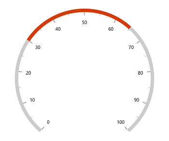
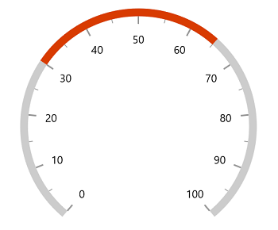
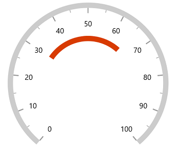
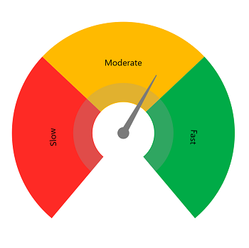

# Range Feature in WinUI Radial Gauge (SfRadialGauge)

Gauge range is a visual element that helps to quickly visualize where a value falls on the axis.

**Setting start and end value**

The start and end values of ranges are set using the [`StartValue`](https://help.syncfusion.com/cr/winui/Syncfusion.UI.Xaml.Gauges.GaugeRange.html#Syncfusion_UI_Xaml_Gauges_GaugeRange_StartValue) and [`EndValue`](https://help.syncfusion.com/cr/winui/Syncfusion.UI.Xaml.Gauges.GaugeRange.html#Syncfusion_UI_Xaml_Gauges_GaugeRange_EndValue) properties.





<gauge:SfRadialGauge>
    <gauge:SfRadialGauge.Axes>
        <gauge:RadialAxis>
            <gauge:RadialAxis.Ranges>
                <gauge:GaugeRange StartValue="30"
                                  EndValue="65" />
            </gauge:RadialAxis.Ranges>
        </gauge:RadialAxis>
    </gauge:SfRadialGauge.Axes>
</gauge:SfRadialGauge>





SfRadialGauge sfRadialGauge = new SfRadialGauge();

RadialAxis radialAxis = new RadialAxis();
sfRadialGauge.Axes.Add(radialAxis);

GaugeRange gaugeRange = new GaugeRange();
gaugeRange.StartValue = 30;
gaugeRange.EndValue = 65;
radialAxis.Ranges.Add(gaugeRange);

this.Content = sfRadialGauge;





## Range customization

The following properties are used for the range customization:

* `Background` – Specifies the color for the range.

* [`StartWidth`](https://help.syncfusion.com/cr/winui/Syncfusion.UI.Xaml.Gauges.GaugeRange.html#Syncfusion_UI_Xaml_Gauges_GaugeRange_StartWidth) – Specifies the start width of the range either in pixels or factor.

* [`EndWidth`](https://help.syncfusion.com/cr/winui/Syncfusion.UI.Xaml.Gauges.GaugeRange.html#Syncfusion_UI_Xaml_Gauges_GaugeRange_EndWidth) – Specifies the end width of the range either in pixels or factor.

* [`WidthUnit`](https://help.syncfusion.com/cr/winui/Syncfusion.UI.Xaml.Gauges.GaugeRange.html#Syncfusion_UI_Xaml_Gauges_GaugeRange_WidthUnit) – Specifies whether the start width and end width of the range are set in pixels or factor.

* [`GradientStops`](https://help.syncfusion.com/cr/winui/Syncfusion.UI.Xaml.Gauges.GaugeRange.html#Syncfusion_UI_Xaml_Gauges_GaugeRange_GradientStops) - Specifies the gradient for the range.

**Equal range width**

Range width can be controlled by [`StartWidth`](https://help.syncfusion.com/cr/winui/Syncfusion.UI.Xaml.Gauges.GaugeRange.html#Syncfusion_UI_Xaml_Gauges_GaugeRange_StartWidth) and [`EndWidth`](https://help.syncfusion.com/cr/winui/Syncfusion.UI.Xaml.Gauges.GaugeRange.html#Syncfusion_UI_Xaml_Gauges_GaugeRange_EndWidth) properties of range.





<gauge:SfRadialGauge>
    <gauge:SfRadialGauge.Axes>
        <gauge:RadialAxis>
            <gauge:RadialAxis.Ranges>
                <gauge:GaugeRange StartValue="30"
                                  EndValue="65"
                                  StartWidth="10"
                                  EndWidth="10" />
            </gauge:RadialAxis.Ranges>
        </gauge:RadialAxis>
    </gauge:SfRadialGauge.Axes>
</gauge:SfRadialGauge>





SfRadialGauge sfRadialGauge = new SfRadialGauge();

RadialAxis radialAxis = new RadialAxis();
sfRadialGauge.Axes.Add(radialAxis);

GaugeRange gaugeRange = new GaugeRange();
gaugeRange.StartValue = 30;
gaugeRange.EndValue = 65;
gaugeRange.StartWidth = 10;
gaugeRange.EndWidth = 10;
radialAxis.Ranges.Add(gaugeRange);

this.Content = sfRadialGauge;





**Different range width**

By setting different values to [`StartWidth`](https://help.syncfusion.com/cr/winui/Syncfusion.UI.Xaml.Gauges.GaugeRange.html#Syncfusion_UI_Xaml_Gauges_GaugeRange_StartWidth) and [`EndWidth`](https://help.syncfusion.com/cr/winui/Syncfusion.UI.Xaml.Gauges.GaugeRange.html#Syncfusion_UI_Xaml_Gauges_GaugeRange_EndWidth) property can create different width ranges. 





<gauge:SfRadialGauge>
    <gauge:SfRadialGauge.Axes>
        <gauge:RadialAxis>
            <gauge:RadialAxis.Ranges>
                <gauge:GaugeRange StartValue="30"
                                  EndValue="65"
                                  StartWidth="5"
                                  EndWidth="20" />
            </gauge:RadialAxis.Ranges>
        </gauge:RadialAxis>
    </gauge:SfRadialGauge.Axes>
</gauge:SfRadialGauge>





SfRadialGauge sfRadialGauge = new SfRadialGauge();

RadialAxis radialAxis = new RadialAxis();
sfRadialGauge.Axes.Add(radialAxis);

GaugeRange gaugeRange = new GaugeRange();
gaugeRange.StartValue = 30;
gaugeRange.EndValue = 65;
gaugeRange.StartWidth = 5;
gaugeRange.EndWidth = 20;
radialAxis.Ranges.Add(gaugeRange);

this.Content = sfRadialGauge;





When the [`WidthUnit`](https://help.syncfusion.com/cr/winui/Syncfusion.UI.Xaml.Gauges.GaugeRange.html#Syncfusion_UI_Xaml_Gauges_GaugeRange_WidthUnit) is set as pixels, the range will be rendered based on the provided pixel values in [`StartWidth`](https://help.syncfusion.com/cr/winui/Syncfusion.UI.Xaml.Gauges.GaugeRange.html#Syncfusion_UI_Xaml_Gauges_GaugeRange_StartWidth) and [`EndWidth`](https://help.syncfusion.com/cr/winui/Syncfusion.UI.Xaml.Gauges.GaugeRange.html#Syncfusion_UI_Xaml_Gauges_GaugeRange_EndWidth)

If the [`WidthUnit`](https://help.syncfusion.com/cr/winui/Syncfusion.UI.Xaml.Gauges.GaugeRange.html#Syncfusion_UI_Xaml_Gauges_GaugeRange_WidthUnit) is set as factor, the provided factor value in the start width and end width will be multiplied with the axis radius, respectively. The factor value ranges from 0 to 1.

**Setting gradient brush to the range**

 The [`GradientStops`](https://help.syncfusion.com/cr/winui/Syncfusion.UI.Xaml.Gauges.GaugeRange.html#Syncfusion_UI_Xaml_Gauges_GaugeRange_GradientStops) property of [`range`](https://help.syncfusion.com/cr/winui/Syncfusion.UI.Xaml.Gauges.GaugeRange.html) allows to specify the smooth color transition to pointer by specifying the different colors based on provided axis value.





<gauge:SfRadialGauge>
    <gauge:SfRadialGauge.Axes>
        <gauge:RadialAxis>
            <gauge:RadialAxis.Ranges>
                <gauge:GaugeRange StartValue="30"
                                  EndValue="65"
                                  StartWidth="5"
                                  EndWidth="20">
                    <gauge:GaugeRange.GradientStops>
                        <gauge:GaugeGradientStop Value="39"
                                                 Color="#FFBC4E9C" />
                        <gauge:GaugeGradientStop Value="56"
                                                 Color="#FFF80759" />
                    </gauge:GaugeRange.GradientStops>
                </gauge:GaugeRange>
            </gauge:RadialAxis.Ranges>
        </gauge:RadialAxis>
    </gauge:SfRadialGauge.Axes>
</gauge:SfRadialGauge>





SfRadialGauge sfRadialGauge = new SfRadialGauge();

RadialAxis radialAxis = new RadialAxis();
sfRadialGauge.Axes.Add(radialAxis);

GaugeRange gaugeRange = new GaugeRange();
gaugeRange.StartValue = 30;
gaugeRange.EndValue = 65;
gaugeRange.StartWidth = 5;
gaugeRange.EndWidth = 20;

GaugeGradientStop gaugeGradientStop1 = new GaugeGradientStop();
gaugeGradientStop1.Value = 39;
gaugeGradientStop1.Color = Color.FromArgb(255, 188, 78, 156);
gaugeRange.GradientStops.Add(gaugeGradientStop1);

GaugeGradientStop gaugeGradientStop2 = new GaugeGradientStop();
gaugeGradientStop2.Value = 56;
gaugeGradientStop2.Color = Color.FromArgb(255, 248, 7, 89);
gaugeRange.GradientStops.Add(gaugeGradientStop2);

radialAxis.Ranges.Add(gaugeRange);

this.Content = sfRadialGauge;





**Position customization**

 The range can be moved far or near to the axis line with using the [`RangeOffset`](https://help.syncfusion.com/cr/winui/Syncfusion.UI.Xaml.Gauges.GaugeRange.html#Syncfusion_UI_Xaml_Gauges_GaugeRange_RangeOffset) property. The [`OffsetUnit`](https://help.syncfusion.com/cr/winui/Syncfusion.UI.Xaml.Gauges.GaugeRange.html#Syncfusion_UI_Xaml_Gauges_GaugeRange_OffsetUnit) property of range allows to specify the [`RangeOffset`](https://help.syncfusion.com/cr/winui/Syncfusion.UI.Xaml.Gauges.GaugeRange.html#Syncfusion_UI_Xaml_Gauges_GaugeRange_RangeOffset) either in factor or pixels, and the default value of [`OffsetUnit`](https://help.syncfusion.com/cr/winui/Syncfusion.UI.Xaml.Gauges.GaugeRange.html#Syncfusion_UI_Xaml_Gauges_GaugeRange_OffsetUnit) is Pixel.

**Range offset in pixel**

If the [`OffsetUnit`](https://help.syncfusion.com/cr/winui/Syncfusion.UI.Xaml.Gauges.GaugeRange.html#Syncfusion_UI_Xaml_Gauges_GaugeRange_OffsetUnit) is set as a pixels, the range will be moved based on the provided pixel value.





<gauge:SfRadialGauge>
    <gauge:SfRadialGauge.Axes>
        <gauge:RadialAxis>
            <gauge:RadialAxis.Ranges>
                <gauge:GaugeRange StartValue="30"
                                  EndValue="65"
                                  RangeOffset="70" />
            </gauge:RadialAxis.Ranges>
        </gauge:RadialAxis>
    </gauge:SfRadialGauge.Axes>
</gauge:SfRadialGauge>





SfRadialGauge sfRadialGauge = new SfRadialGauge();

RadialAxis radialAxis = new RadialAxis();
sfRadialGauge.Axes.Add(radialAxis);

GaugeRange gaugeRange = new GaugeRange();
gaugeRange.StartValue = 30;
gaugeRange.EndValue = 65;
gaugeRange.RangeOffset = 70;
radialAxis.Ranges.Add(gaugeRange);

this.Content = sfRadialGauge;





**Range offset in factor**

If the [`OffsetUnit`](https://help.syncfusion.com/cr/winui/Syncfusion.UI.Xaml.Gauges.GaugeRange.html#Syncfusion_UI_Xaml_Gauges_GaugeRange_OffsetUnit) is set as a factor, the provided factor value in the [`RangeOffset`](https://help.syncfusion.com/cr/winui/Syncfusion.UI.Xaml.Gauges.GaugeRange.html#Syncfusion_UI_Xaml_Gauges_GaugeRange_RangeOffset) will be multiplied by the axis radius and the range will be moved to the corresponding value. The default value of [`OffsetUnit`](https://help.syncfusion.com/cr/winui/Syncfusion.UI.Xaml.Gauges.GaugeRange.html#Syncfusion_UI_Xaml_Gauges_GaugeRange_OffsetUnit) is Pixel.





<gauge:SfRadialGauge>
    <gauge:SfRadialGauge.Axes>
        <gauge:RadialAxis>
            <gauge:RadialAxis.Ranges>
                <gauge:GaugeRange StartValue="30"
                                  EndValue="65"
                                  RangeOffset="0.4"
                                  OffsetUnit="Factor"/>
            </gauge:RadialAxis.Ranges>
        </gauge:RadialAxis>
    </gauge:SfRadialGauge.Axes>
</gauge:SfRadialGauge>





SfRadialGauge sfRadialGauge = new SfRadialGauge();

RadialAxis radialAxis = new RadialAxis();
sfRadialGauge.Axes.Add(radialAxis);

GaugeRange gaugeRange = new GaugeRange();
gaugeRange.StartValue = 30;
gaugeRange.EndValue = 65;
gaugeRange.RangeOffset = 0.4;
gaugeRange.OffsetUnit = SizeUnit.Factor;
radialAxis.Ranges.Add(gaugeRange);

this.Content = sfRadialGauge;





## Setting range color to axis elements

You can set range color to axis labels and ticks using the [`UseRangeColorForAxis`](https://help.syncfusion.com/cr/winui/Syncfusion.UI.Xaml.Gauges.GaugeAxis.html#Syncfusion_UI_Xaml_Gauges_GaugeAxis_UseRangeColorForAxisProperty) property of axis,





<Page.Resources>
    

    
</Page.Resources>

<gauge:SfRadialGauge>
    <gauge:SfRadialGauge.Axes>
        <gauge:RadialAxis ShowAxisLine="False"
                          TickPosition="Outside"
                          LabelPosition="Outside"
                          StartAngle="270"
                          EndAngle="270"
                          UseRangeColorForAxis="True"
                          RadiusFactor="0.95"
                          Interval="10"
                          ShowFirstLabel="False"
                          IsInversed="True"
                          TickLengthUnit="Factor"
                          MajorTickLength="0.15"
                          MinorTickLength="0.04"
                          MinorTicksPerInterval="4"
                          MajorTickStyle="{StaticResource AxisMajorTickStyle
                          MinorTickStyle="{StaticResource AxisMinorTickStyle
            <gauge:RadialAxis.Ranges>
                <gauge:GaugeRange WidthUnit="Factor"
                                  OffsetUnit="Factor"
                                  RangeOffset="0.36"
                                  StartWidth="0.05"
                                  EndWidth="0.25"
                                  StartValue="0"
                                  EndValue="35"
                                  Background="#FFF8B195">
                </gauge:GaugeRange>
                <gauge:GaugeRange WidthUnit="Factor"
                                  OffsetUnit="Factor"
                                  RangeOffset="0.36"
                                  StartWidth="0.05"
                                  EndWidth="0.25"
                                  StartValue="35"
                                  EndValue="70"
                                  Background="#FFC06C84">
                </gauge:GaugeRange>
                <gauge:GaugeRange WidthUnit="Factor"
                                  OffsetUnit="Factor"
                                  RangeOffset="0.36"
                                  StartWidth="0.05"
                                  EndWidth="0.25"
                                  StartValue="70"
                                  EndValue="100"
                                  Background="#FF355C7D">
                </gauge:GaugeRange>
            </gauge:RadialAxis.Ranges>
        </gauge:RadialAxis>
    </gauge:SfRadialGauge.Axes>
</gauge:SfRadialGauge>





SfRadialGauge sfRadialGauge = new SfRadialGauge();

RadialAxis radialAxis = new RadialAxis();
radialAxis.ShowAxisLine = false;
radialAxis.TickPosition = TickElementsPosition.Outside;
radialAxis.LabelPosition = LabelsPosition.Outside;
radialAxis.StartAngle = 270;
radialAxis.EndAngle = 270;
radialAxis.UseRangeColorForAxis = true;
radialAxis.RadiusFactor = 0.95;
radialAxis.Interval = 10;
radialAxis.ShowFirstLabel = false;
radialAxis.IsInversed = true;
radialAxis.TickLengthUnit = SizeUnit.Factor;
radialAxis.MajorTickLength = 0.15;
radialAxis.MinorTickLength = 0.04;
radialAxis.MinorTicksPerInterval = 4;
radialAxis.MajorTickStyle = this.Resources["AxisMajorTickStyle"] as Style;
radialAxis.MinorTickStyle = this.Resources["AxisMinorTickStyle"] as Style;
sfRadialGauge.Axes.Add(radialAxis);

GaugeRange gaugeRange1 = new GaugeRange();
gaugeRange1.WidthUnit = SizeUnit.Factor;
gaugeRange1.OffsetUnit = SizeUnit.Factor;
gaugeRange1.RangeOffset = 0.36;
gaugeRange1.StartWidth = 0.05;
gaugeRange1.EndWidth = 0.25;
gaugeRange1.StartValue = 0;
gaugeRange1.EndValue = 35;
gaugeRange1.Background = new SolidColorBrush(Color.FromArgb(255, 248, 177, 149));
radialAxis.Ranges.Add(gaugeRange1);

GaugeRange gaugeRange2 = new GaugeRange();
gaugeRange2.WidthUnit = SizeUnit.Factor;
gaugeRange2.OffsetUnit = SizeUnit.Factor;
gaugeRange2.RangeOffset = 0.36;
gaugeRange2.StartWidth = 0.05;
gaugeRange2.EndWidth = 0.25;
gaugeRange2.StartValue = 35;
gaugeRange2.EndValue = 70;
gaugeRange2.Background = new SolidColorBrush(Color.FromArgb(255, 192, 108, 132));
radialAxis.Ranges.Add(gaugeRange2);

GaugeRange gaugeRange3 = new GaugeRange();
gaugeRange3.WidthUnit = SizeUnit.Factor;
gaugeRange3.OffsetUnit = SizeUnit.Factor;
gaugeRange3.RangeOffset = 0.36;
gaugeRange3.StartWidth = 0.05;
gaugeRange3.EndWidth = 0.25;
gaugeRange3.StartValue = 70;
gaugeRange3.EndValue = 100;
gaugeRange3.Background = new SolidColorBrush(Color.FromArgb(255, 53, 92, 125));
radialAxis.Ranges.Add(gaugeRange3);

this.Content = sfRadialGauge;





## Range label

A text can be displayed on range using the `Label` property. The provided text can be customized using the `Foreground`, `FontSize`, `FontWeight`, `FontFamily` and `FontStyle` properties of [`range`](https://help.syncfusion.com/cr/winui/Syncfusion.UI.Xaml.Gauges.GaugeRange.html).





<gauge:SfRadialGauge>
    <gauge:SfRadialGauge.Axes>
        <gauge:RadialAxis ShowLabels="False"
                          ShowAxisLine="False"
                          ShowTicks="False"
                          Minimum="0"
                          Maximum="99">

            <gauge:RadialAxis.Ranges>
                <gauge:GaugeRange StartValue="0"
                                  EndValue="33"
                                  Label="Slow"
                                  WidthUnit="Factor"
                                  StartWidth="0.65"
                                  EndWidth="0.65"
                                  FontSize="20"
                                  Background="#FFFE2A25" />
                <gauge:GaugeRange StartValue="33"
                                  EndValue="66"
                                  Label="Moderate"
                                  WidthUnit="Factor"
                                  StartWidth="0.65"
                                  EndWidth="0.65"
                                  FontSize="20"
                                  Background="#FFFFBA00" />
                <gauge:GaugeRange StartValue="66"
                                  EndValue="99"
                                  Label="Fast"
                                  WidthUnit="Factor"
                                  StartWidth="0.65"
                                  EndWidth="0.65"
                                  FontSize="20"
                                  Background="#FF00AB47" />
                <gauge:GaugeRange StartValue="0"
                                  EndValue="99"
                                  WidthUnit="Factor"
                                  StartWidth="0.15"
                                  EndWidth="0.15"
                                  OffsetUnit="Factor"
                                  RangeOffset="0.55"
                                  Background="#4D9b9b9b" />
            </gauge:RadialAxis.Ranges>

            <gauge:RadialAxis.Pointers>
                <gauge:NeedlePointer Value="60"
                                     NeedleLength="0.6"
                                     NeedleStartWidth="2"
                                     NeedleEndWidth="15"
                                     KnobRadius="15"
                                     KnobSizeUnit="Pixel" />
            </gauge:RadialAxis.Pointers>
        </gauge:RadialAxis>
    </gauge:SfRadialGauge.Axes>
</gauge:SfRadialGauge>





SfRadialGauge sfRadialGauge = new SfRadialGauge();

RadialAxis radialAxis = new RadialAxis();
radialAxis.ShowLabels = false;
radialAxis.ShowAxisLine = false;
radialAxis.ShowTicks = false;
radialAxis.Minimum = 0;
radialAxis.Maximum = 99;
sfRadialGauge.Axes.Add(radialAxis);

GaugeRange gaugeRange1 = new GaugeRange();
gaugeRange1.StartValue = 0;
gaugeRange1.EndValue = 33;
gaugeRange1.Label = "Slow";
gaugeRange1.WidthUnit = SizeUnit.Factor;
gaugeRange1.StartWidth = 0.65;
gaugeRange1.EndWidth = 0.65;
gaugeRange1.FontSize = 20;
gaugeRange1.Background = new SolidColorBrush(Color.FromArgb(255, 254, 42, 37));
radialAxis.Ranges.Add(gaugeRange1);

GaugeRange gaugeRange2 = new GaugeRange();
gaugeRange2.StartValue = 33;
gaugeRange2.EndValue = 66;
gaugeRange2.Label = "Moderate";
gaugeRange2.WidthUnit = SizeUnit.Factor;
gaugeRange2.StartWidth = 0.65;
gaugeRange2.EndWidth = 0.65;
gaugeRange2.FontSize = 20;
gaugeRange2.Background = new SolidColorBrush(Color.FromArgb(255, 255, 186, 0));
radialAxis.Ranges.Add(gaugeRange2);

GaugeRange gaugeRange3 = new GaugeRange();
gaugeRange3.StartValue = 66;
gaugeRange3.EndValue = 99;
gaugeRange3.Label = "Fast";
gaugeRange3.WidthUnit = SizeUnit.Factor;
gaugeRange3.StartWidth = 0.65;
gaugeRange3.EndWidth = 0.65;
gaugeRange3.FontSize = 20;
gaugeRange3.Background = new SolidColorBrush(Color.FromArgb(255, 0, 171, 71));
radialAxis.Ranges.Add(gaugeRange3);

GaugeRange gaugeRange4 = new GaugeRange();
gaugeRange4.StartValue = 0;
gaugeRange4.EndValue = 99;
gaugeRange4.WidthUnit = SizeUnit.Factor;
gaugeRange4.StartWidth = 0.15;
gaugeRange4.EndWidth = 0.15;
gaugeRange4.OffsetUnit = SizeUnit.Factor;
gaugeRange4.RangeOffset = 0.55;
gaugeRange4.Background = new SolidColorBrush(Color.FromArgb(77, 155, 155, 155));
radialAxis.Ranges.Add(gaugeRange4);

NeedlePointer needlePointer = new NeedlePointer();
needlePointer.Value = 60;
needlePointer.NeedleLength = 0.6;
needlePointer.NeedleStartWidth = 2;
needlePointer.NeedleEndWidth = 15;
needlePointer.KnobRadius = 15;
needlePointer.KnobSizeUnit = SizeUnit.Pixel;
radialAxis.Pointers.Add(needlePointer);

this.Content = sfRadialGauge;





**Template support for range label**

The `LabelTemplate` property allows you to define the data template for the range label's like the following code example.





<Page.Resources>
    <DataTemplate x:Key="RangeLabelTemplate">
        <Border Background="Gray"
                CornerRadius="5">
            <TextBlock Text="{Binding Label}"
                       Margin="5"
                       Foreground="White"
                       FontSize="{Binding FontSize}" />
        </Border>
    </DataTemplate>
</Page.Resources>

<gauge:SfRadialGauge>
    <gauge:SfRadialGauge.Axes>
        <gauge:RadialAxis ShowLabels="False"
                          ShowAxisLine="False"
                          ShowTicks="False"
                          Minimum="0"
                          Maximum="99">

            <gauge:RadialAxis.Ranges>
                <gauge:GaugeRange StartValue="0"
                                  EndValue="33"
                                  Label="Slow"
                                  WidthUnit="Factor"
                                  StartWidth="0.65"
                                  EndWidth="0.65"
                                  FontSize="20"
                                  Background="#FFFE2A25"
                                  LabelTemplate="{StaticResource RangeLabelTemplate}" />
                <gauge:GaugeRange StartValue="33"
                                  EndValue="66"
                                  Label="Moderate"
                                  WidthUnit="Factor"
                                  StartWidth="0.65"
                                  EndWidth="0.65"
                                  FontSize="20"
                                  Background="#FFFFBA00"
                                  LabelTemplate="{StaticResource RangeLabelTemplate}" />
                <gauge:GaugeRange StartValue="66"
                                  EndValue="99"
                                  Label="Fast"
                                  WidthUnit="Factor"
                                  StartWidth="0.65"
                                  EndWidth="0.65"
                                  FontSize="20"
                                  Background="#FF00AB47"
                                  LabelTemplate="{StaticResource RangeLabelTemplate}" />
                <gauge:GaugeRange StartValue="0"
                                  EndValue="99"
                                  WidthUnit="Factor"
                                  StartWidth="0.15"
                                  EndWidth="0.15"
                                  OffsetUnit="Factor"
                                  RangeOffset="0.55"
                                  Background="#4D9b9b9b" />
            </gauge:RadialAxis.Ranges>

            <gauge:RadialAxis.Pointers>
                <gauge:NeedlePointer Value="60"
                                     NeedleLength="0.6"
                                     NeedleStartWidth="2"
                                     NeedleEndWidth="15"
                                     KnobRadius="15"
                                     KnobSizeUnit="Pixel" />
            </gauge:RadialAxis.Pointers>
        </gauge:RadialAxis>
    </gauge:SfRadialGauge.Axes>
</gauge:SfRadialGauge>





SfRadialGauge sfRadialGauge = new SfRadialGauge();

RadialAxis radialAxis = new RadialAxis();
radialAxis.ShowLabels = false;
radialAxis.ShowAxisLine = false;
radialAxis.ShowTicks = false;
radialAxis.Minimum = 0;
radialAxis.Maximum = 99;
sfRadialGauge.Axes.Add(radialAxis);

GaugeRange gaugeRange1 = new GaugeRange();
gaugeRange1.StartValue = 0;
gaugeRange1.EndValue = 33;
gaugeRange1.Label = "Slow";
gaugeRange1.LabelTemplate = this.Resources["RangeLabelTemplate"] as DataTemplate;
gaugeRange1.WidthUnit = SizeUnit.Factor;
gaugeRange1.StartWidth = 0.65;
gaugeRange1.EndWidth = 0.65;
gaugeRange1.FontSize = 20;
gaugeRange1.Background = new SolidColorBrush(Color.FromArgb(255, 254, 42, 37));
radialAxis.Ranges.Add(gaugeRange1);

GaugeRange gaugeRange2 = new GaugeRange();
gaugeRange2.StartValue = 33;
gaugeRange2.EndValue = 66;
gaugeRange2.Label = "Moderate";
gaugeRange2.LabelTemplate = this.Resources["RangeLabelTemplate"] as DataTemplate;
gaugeRange2.WidthUnit = SizeUnit.Factor;
gaugeRange2.StartWidth = 0.65;
gaugeRange2.EndWidth = 0.65;
gaugeRange2.FontSize = 20;
gaugeRange2.Background = new SolidColorBrush(Color.FromArgb(255, 255, 186, 0));
radialAxis.Ranges.Add(gaugeRange2);

GaugeRange gaugeRange3 = new GaugeRange();
gaugeRange3.StartValue = 66;
gaugeRange3.EndValue = 99;
gaugeRange3.Label = "Fast";
gaugeRange3.LabelTemplate = this.Resources["RangeLabelTemplate"] as DataTemplate;
gaugeRange3.WidthUnit = SizeUnit.Factor;
gaugeRange3.StartWidth = 0.65;
gaugeRange3.EndWidth = 0.65;
gaugeRange3.FontSize = 20;
gaugeRange3.Background = new SolidColorBrush(Color.FromArgb(255, 0, 171, 71));
radialAxis.Ranges.Add(gaugeRange3);

GaugeRange gaugeRange4 = new GaugeRange();
gaugeRange4.StartValue = 0;
gaugeRange4.EndValue = 99;
gaugeRange4.WidthUnit = SizeUnit.Factor;
gaugeRange4.StartWidth = 0.15;
gaugeRange4.EndWidth = 0.15;
gaugeRange4.OffsetUnit = SizeUnit.Factor;
gaugeRange4.RangeOffset = 0.55;
gaugeRange4.Background = new SolidColorBrush(Color.FromArgb(77, 155, 155, 155));
radialAxis.Ranges.Add(gaugeRange4);

NeedlePointer needlePointer = new NeedlePointer();
needlePointer.Value = 60;
needlePointer.NeedleLength = 0.6;
needlePointer.NeedleStartWidth = 2;
needlePointer.NeedleEndWidth = 15;
needlePointer.KnobRadius = 15;
needlePointer.KnobSizeUnit = SizeUnit.Pixel;
radialAxis.Pointers.Add(needlePointer);

this.Content = sfRadialGauge;





