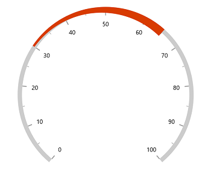
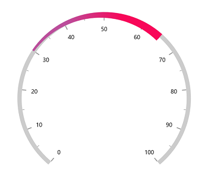
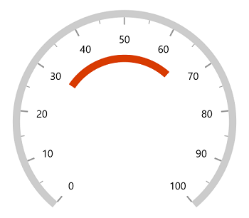

# Range Feature in WinUI Radial Gauge (SfRadialGauge)

Gauge range is a visual element that helps to quickly visualize where a value falls on the axis.

**Setting start and end value**

The start and end values of ranges are set using the `StartValue` and `EndValue` properties.





<gauge:SfRadialGauge>
    <gauge:SfRadialGauge.Axes>
        <gauge:RadialAxis>
            <gauge:RadialAxis.Ranges>
                <gauge:GaugeRange StartValue="30"
                                  EndValue="65" />
            </gauge:RadialAxis.Ranges>
        </gauge:RadialAxis>
    </gauge:SfRadialGauge.Axes>
</gauge:SfRadialGauge>





SfRadialGauge sfRadialGauge = new SfRadialGauge();

RadialAxis radialAxis = new RadialAxis();
sfRadialGauge.Axes.Add(radialAxis);

GaugeRange gaugeRange = new GaugeRange();
gaugeRange.StartValue = 30;
gaugeRange.EndValue = 65;
radialAxis.Ranges.Add(gaugeRange);

this.Content = sfRadialGauge;





## Range customization

The following properties are used for the range customization:

* `Background` – Specifies the color for the range.

* `StartWidth` – Specifies the start width of the range either in logical pixels or factor.

* `EndWidth` – Specifies the end width of the range either in logical pixels or factor.

* `WidthUnit` – Specifies whether the start width and end width of the range are set in logical pixels or factor.

* `GradientStops` - Specifies the gradient for the range.

**Equal range width**





<gauge:SfRadialGauge>
    <gauge:SfRadialGauge.Axes>
        <gauge:RadialAxis>
            <gauge:RadialAxis.Ranges>
                <gauge:GaugeRange StartValue="30"
                                  EndValue="65"
                                  StartWidth="10"
                                  EndWidth="10" />
            </gauge:RadialAxis.Ranges>
        </gauge:RadialAxis>
    </gauge:SfRadialGauge.Axes>
</gauge:SfRadialGauge>





SfRadialGauge sfRadialGauge = new SfRadialGauge();

RadialAxis radialAxis = new RadialAxis();
sfRadialGauge.Axes.Add(radialAxis);

GaugeRange gaugeRange = new GaugeRange();
gaugeRange.StartValue = 30;
gaugeRange.EndValue = 65;
gaugeRange.StartWidth = 10;
gaugeRange.EndWidth = 10;
radialAxis.Ranges.Add(gaugeRange);

this.Content = sfRadialGauge;





**Different range width**

By setting different values to `StartWidth` and `EndWidth` property can create diffent width ranges. 





<gauge:SfRadialGauge>
    <gauge:SfRadialGauge.Axes>
        <gauge:RadialAxis>
            <gauge:RadialAxis.Ranges>
                <gauge:GaugeRange StartValue="30"
                                  EndValue="65"
                                  StartWidth="5"
                                  EndWidth="20" />
            </gauge:RadialAxis.Ranges>
        </gauge:RadialAxis>
    </gauge:SfRadialGauge.Axes>
</gauge:SfRadialGauge>





SfRadialGauge sfRadialGauge = new SfRadialGauge();

RadialAxis radialAxis = new RadialAxis();
sfRadialGauge.Axes.Add(radialAxis);

GaugeRange gaugeRange = new GaugeRange();
gaugeRange.StartValue = 30;
gaugeRange.EndValue = 65;
gaugeRange.StartWidth = 5;
gaugeRange.EndWidth = 20;
radialAxis.Ranges.Add(gaugeRange);

this.Content = sfRadialGauge;





When the `WidthUnit` is set as logical pixels, the range will be rendered based on the provided logical pixel values in `StartWidth` and `EndWidth`

If the `WidthUnit` is set as factor, the provided factor value in the start width and end width will be multiplied with the axis radius, respectively. The factor value ranges from 0 to 1.

**Setting gradient brush to the range**

 The `gradient` property of `range` allows to specify the smooth color transition to pointer by specifying the different colors based on provided factor value.





<gauge:SfRadialGauge>
    <gauge:SfRadialGauge.Axes>
        <gauge:RadialAxis>
            <gauge:RadialAxis.Ranges>
                <gauge:GaugeRange StartValue="30"
                                  EndValue="65"
                                  StartWidth="5"
                                  EndWidth="20">
                    <gauge:GaugeRange.GradientStops>
                        <gauge:GaugeGradientStop Value="39"
                                                 Color="#FFBC4E9C" />
                        <gauge:GaugeGradientStop Value="56"
                                                 Color="#FFF80759" />
                    </gauge:GaugeRange.GradientStops>
                </gauge:GaugeRange>
            </gauge:RadialAxis.Ranges>
        </gauge:RadialAxis>
    </gauge:SfRadialGauge.Axes>
</gauge:SfRadialGauge>





SfRadialGauge sfRadialGauge = new SfRadialGauge();

RadialAxis radialAxis = new RadialAxis();
sfRadialGauge.Axes.Add(radialAxis);

GaugeRange gaugeRange = new GaugeRange();
gaugeRange.StartValue = 30;
gaugeRange.EndValue = 65;
gaugeRange.StartWidth = 5;
gaugeRange.EndWidth = 20;

GaugeGradientStop gaugeGradientStop1 = new GaugeGradientStop();
gaugeGradientStop1.Value = 39;
gaugeGradientStop1.Color = Color.FromArgb(255, 188, 78, 156);
gaugeRange.GradientStops.Add(gaugeGradientStop1);

GaugeGradientStop gaugeGradientStop2 = new GaugeGradientStop();
gaugeGradientStop2.Value = 56;
gaugeGradientStop2.Color = Color.FromArgb(255, 248, 7, 89);
gaugeRange.GradientStops.Add(gaugeGradientStop2);

radialAxis.Ranges.Add(gaugeRange);

this.Content = sfRadialGauge;





**Position customization**

 The range can be moved far or near to the axis line with using the `RangeOffset` property. The `OffsetUnit` property of range allows to specify the `RangeOffset` either in factor or logical pixels, and the default value of `OffsetUnit` is logicalPixel.

**Range offset in pixel**

If the `OffsetUnit` is set as a pixels, the range will be moved based on the provided logical pixel value.





<gauge:SfRadialGauge>
    <gauge:SfRadialGauge.Axes>
        <gauge:RadialAxis>
            <gauge:RadialAxis.Ranges>
                <gauge:GaugeRange StartValue="30"
                                  EndValue="65"
                                  RangeOffset="70" />
            </gauge:RadialAxis.Ranges>
        </gauge:RadialAxis>
    </gauge:SfRadialGauge.Axes>
</gauge:SfRadialGauge>





SfRadialGauge sfRadialGauge = new SfRadialGauge();

RadialAxis radialAxis = new RadialAxis();
sfRadialGauge.Axes.Add(radialAxis);

GaugeRange gaugeRange = new GaugeRange();
gaugeRange.StartValue = 30;
gaugeRange.EndValue = 65;
gaugeRange.RangeOffset = 70;
radialAxis.Ranges.Add(gaugeRange);

this.Content = sfRadialGauge;





**Range offset in factor**

If the `OffsetUnit` is set as a factor, the provided factor value in the `RangeOffset` will be multiplied by the axis radius and the range will be moved to the corresponding value. The default value of `OffsetUnit` is logicalPixel.





<gauge:SfRadialGauge>
    <gauge:SfRadialGauge.Axes>
        <gauge:RadialAxis>
            <gauge:RadialAxis.Ranges>
                <gauge:GaugeRange StartValue="30"
                                  EndValue="65"
                                  RangeOffset="0.4"
                                  OffsetUnit="Factor"/>
            </gauge:RadialAxis.Ranges>
        </gauge:RadialAxis>
    </gauge:SfRadialGauge.Axes>
</gauge:SfRadialGauge>





SfRadialGauge sfRadialGauge = new SfRadialGauge();

RadialAxis radialAxis = new RadialAxis();
sfRadialGauge.Axes.Add(radialAxis);

GaugeRange gaugeRange = new GaugeRange();
gaugeRange.StartValue = 30;
gaugeRange.EndValue = 65;
gaugeRange.RangeOffset = 0.4;
gaugeRange.OffsetUnit = SizeUnit.Factor;
radialAxis.Ranges.Add(gaugeRange);

this.Content = sfRadialGauge;





## Setting range color to axis elements

You can set range color to axis labels and ticks using the `UseRangeColorForAxis` property of axis,





<Page.Resources>
    

    
</Page.Resources>

<gauge:SfRadialGauge>
    <gauge:SfRadialGauge.Axes>
        <gauge:RadialAxis ShowAxisLine="False"
                          TickPosition="Outside"
                          LabelPosition="Outside"
                          StartAngle="270"
                          EndAngle="270"
                          UseRangeColorForAxis="True"
                          RadiusFactor="0.95"
                          Interval="10"
                          ShowFirstLabel="False"
                          IsInversed="True"
                          TickLengthUnit="Factor"
                          MajorTickLength="0.15"
                          MinorTickLength="0.04"
                          MinorTicksPerInterval="4"
                          MajorTickStyle="{StaticResource AxisMajorTickStyle
                          MinorTickStyle="{StaticResource AxisMinorTickStyle
            <gauge:RadialAxis.Ranges>
                <gauge:GaugeRange WidthUnit="Factor"
                                  OffsetUnit="Factor"
                                  RangeOffset="0.36"
                                  StartWidth="0.05"
                                  EndWidth="0.25"
                                  StartValue="0"
                                  EndValue="35"
                                  Background="#FFF8B195">
                </gauge:GaugeRange>
                <gauge:GaugeRange WidthUnit="Factor"
                                  OffsetUnit="Factor"
                                  RangeOffset="0.36"
                                  StartWidth="0.05"
                                  EndWidth="0.25"
                                  StartValue="35"
                                  EndValue="70"
                                  Background="#FFC06C84">
                </gauge:GaugeRange>
                <gauge:GaugeRange WidthUnit="Factor"
                                  OffsetUnit="Factor"
                                  RangeOffset="0.36"
                                  StartWidth="0.05"
                                  EndWidth="0.25"
                                  StartValue="70"
                                  EndValue="100"
                                  Background="#FF355C7D">
                </gauge:GaugeRange>
            </gauge:RadialAxis.Ranges>
        </gauge:RadialAxis>
    </gauge:SfRadialGauge.Axes>
</gauge:SfRadialGauge>





SfRadialGauge sfRadialGauge = new SfRadialGauge();

RadialAxis radialAxis = new RadialAxis();
radialAxis.ShowAxisLine = false;
radialAxis.TickPosition = TickElementsPosition.Outside;
radialAxis.LabelPosition = LabelsPosition.Outside;
radialAxis.StartAngle = 270;
radialAxis.EndAngle = 270;
radialAxis.UseRangeColorForAxis = true;
radialAxis.RadiusFactor = 0.95;
radialAxis.Interval = 10;
radialAxis.ShowFirstLabel = false;
radialAxis.IsInversed = true;
radialAxis.TickLengthUnit = SizeUnit.Factor;
radialAxis.MajorTickLength = 0.15;
radialAxis.MinorTickLength = 0.04;
radialAxis.MinorTicksPerInterval = 4;
radialAxis.MajorTickStyle = this.Resources["AxisMajorTickStyle"] as Style;
radialAxis.MinorTickStyle = this.Resources["AxisMinorTickStyle"] as Style;
sfRadialGauge.Axes.Add(radialAxis);

GaugeRange gaugeRange1 = new GaugeRange();
gaugeRange1.WidthUnit = SizeUnit.Factor;
gaugeRange1.OffsetUnit = SizeUnit.Factor;
gaugeRange1.RangeOffset = 0.36;
gaugeRange1.StartWidth = 0.05;
gaugeRange1.EndWidth = 0.25;
gaugeRange1.StartValue = 0;
gaugeRange1.EndValue = 35;
gaugeRange1.Background = new SolidColorBrush(Color.FromArgb(255, 248, 177, 149));
radialAxis.Ranges.Add(gaugeRange1);

GaugeRange gaugeRange2 = new GaugeRange();
gaugeRange2.WidthUnit = SizeUnit.Factor;
gaugeRange2.OffsetUnit = SizeUnit.Factor;
gaugeRange2.RangeOffset = 0.36;
gaugeRange2.StartWidth = 0.05;
gaugeRange2.EndWidth = 0.25;
gaugeRange2.StartValue = 35;
gaugeRange2.EndValue = 70;
gaugeRange2.Background = new SolidColorBrush(Color.FromArgb(255, 192, 108, 132));
radialAxis.Ranges.Add(gaugeRange2);

GaugeRange gaugeRange3 = new GaugeRange();
gaugeRange3.WidthUnit = SizeUnit.Factor;
gaugeRange3.OffsetUnit = SizeUnit.Factor;
gaugeRange3.RangeOffset = 0.36;
gaugeRange3.StartWidth = 0.05;
gaugeRange3.EndWidth = 0.25;
gaugeRange3.StartValue = 70;
gaugeRange3.EndValue = 100;
gaugeRange3.Background = new SolidColorBrush(Color.FromArgb(255, 53, 92, 125));
radialAxis.Ranges.Add(gaugeRange3);

this.Content = sfRadialGauge;





