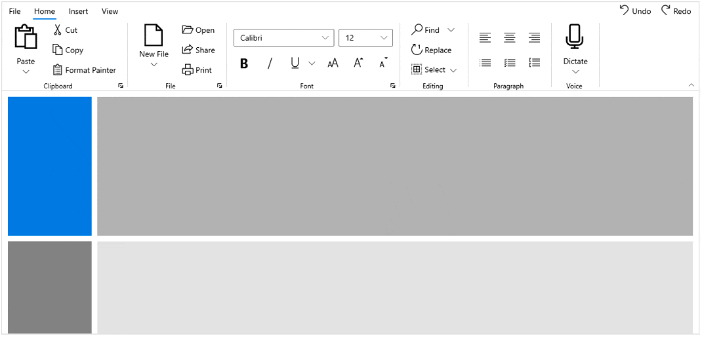
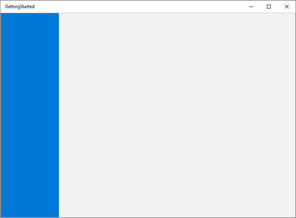
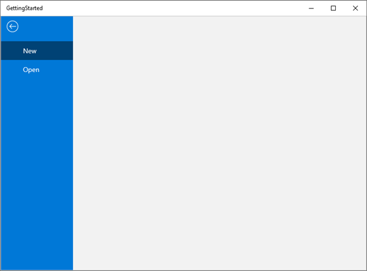
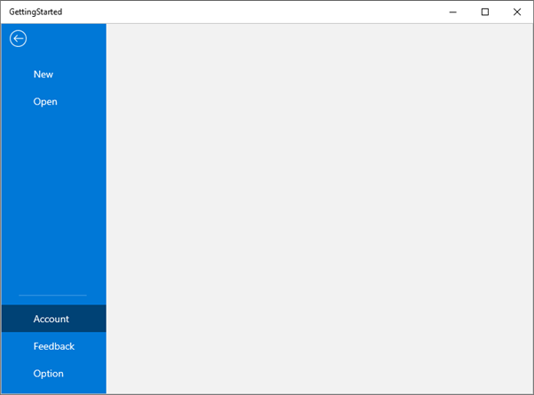
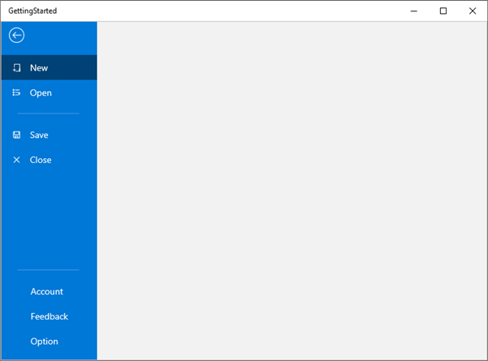

# Backstage with WinUI Ribbon (SfRibbon)

The [RibbonBackstage](https://help.syncfusion.com/cr/winui/Syncfusion.UI.Xaml.Ribbon.RibbonBackstage.html) allows to host any controls to create a custom view, based on the requirements of the application and it can be added by using the `Backstage` property. 
Backstage appears as the first tab in the top left corner named File and opens a backstage view while clicking the `File` menu button. 



<ribbon:SfRibbon x:Name="ribbon" BackstageMenuButtonContent="File">
    <ribbon:SfRibbon.Tabs>
        // Add ribbon tabs here...
    </ribbon:SfRibbon.Tabs>
    <ribbon:SfRibbon.Backstage>
        <ribbon:RibbonBackstage Target="{Binding ElementName=rootGrid}">
            <Grid>
                <Grid.RowDefinitions>
                    <RowDefinition Height="*" />
                    <RowDefinition Height="Auto" />
                </Grid.RowDefinitions>
                <Grid
                    Grid.Row="0"
                    Padding="0,0,0,1"
                    VerticalAlignment="Top"
                    BorderBrush="LightGray"
                    BorderThickness="0,0,0,1">
                    <Grid.RowDefinitions>
                        <RowDefinition Height="Auto" />
                        <RowDefinition Height="481" />
                    </Grid.RowDefinitions>
                    <Grid.ColumnDefinitions>
                        <ColumnDefinition />
                        <ColumnDefinition />
                    </Grid.ColumnDefinitions>
                    <TextBlock
                        Grid.Row="0"
                        Padding="15"
                        FontSize="24"
                        FontWeight="SemiBold"
                        Text="Settings" />
                    <StackPanel
                        Grid.Row="1"
                        Margin="15,15,15,0"
                        BorderBrush="LightGray"
                        BorderThickness="0,0,0,0">
                        <TextBlock
                            Padding="0,0,0,5"
                            FontSize="16"
                            Text="User Information" />
                        <TextBlock
                            Padding="0,5,0,5"
                            FontSize="14"
                            Text="Name : John" />
                        <HyperlinkButton Content="Change photo" />
                        <HyperlinkButton Content="Sign Out" />
                        <HyperlinkButton Content="Switch Account" />
                        <TextBlock Padding="0,5,0,5" Text="Theme Mode" />
                        <RadioButton Content="Light" />
                        <RadioButton Content="Dark" />
                        <RadioButton Content="Use system setting" />
                    </StackPanel>
                    <StackPanel
                        Grid.Row="1"
                        Grid.Column="1"
                        Padding="15,15,15,0"
                        BorderBrush="LightGray"
                        BorderThickness="1,0,0,0">
                        <TextBlock
                            Padding="0,0,0,5"
                            FontSize="16"
                            Text="Product Information" />
                        <HyperlinkButton Content="About product" />
                        <HyperlinkButton Content="Help" />
                        <HyperlinkButton Content="Updates" />
                    </StackPanel>
                </Grid>
                <StackPanel
                    Grid.Row="1"
                    Grid.ColumnSpan="2"
                    Padding="120,0,5,5"
                    HorizontalAlignment="Right"
                    BorderBrush="LightGray"
                    BorderThickness="0,0,0,0"
                    Orientation="Horizontal">
                    <Button
                        Margin="5"
                        Content="Options"
                        CornerRadius="0" />
                    <Button
                        Margin="5"
                        Content="Exit Backstage"
                        Click="Button_Click"
                        CornerRadius="0" />
                </StackPanel>
            </Grid>                           
        </ribbon:RibbonBackstage>
    </ribbon:SfRibbon.Backstage>                    
</ribbon:SfRibbon>


private void Button_Click(object sender, RoutedEventArgs e)
{
    this.ribbon.IsBackstageOpen = false;
}
 


## File menu (backstage button) visibility

Ribbon allows to show or hide a Backstage menu button using the [ShowBackstageMenuButton](https://help.syncfusion.com/cr/winui/Syncfusion.UI.Xaml.Ribbon.SfRibbon.html#Syncfusion_UI_Xaml_Ribbon_SfRibbon_ShowBackstageMenuButton) property.



<ribbon:SfRibbon ShowBackstageMenuButton="False">
    <ribbon:SfRibbon.Tabs>
        <ribbon:RibbonTab Header="Home" />
        <ribbon:RibbonTab Header="Insert" />
        <ribbon:RibbonTab Header="View" />
    </ribbon:SfRibbon.Tabs>
    <ribbon:SfRibbon.Backstage>
        <ribbon:RibbonBackstage>
            <ribbon:BackstageView />
        </ribbon:RibbonBackstage>
    </ribbon:SfRibbon.Backstage>
</ribbon:SfRibbon> 
 


## File menu (Backstage button) text

The [BackstageMenuButtonContent](https://help.syncfusion.com/cr/winui/Syncfusion.UI.Xaml.Ribbon.SfRibbon.html#Syncfusion_UI_Xaml_Ribbon_SfRibbon_BackstageMenuButtonContent) property allows to set a content of the Backstage menu button in the [Ribbon](https://help.syncfusion.com/cr/winui/Syncfusion.UI.Xaml.Ribbon.SfRibbon.html). The content of the property is specified as `File` by default.

## Backstage view

 Ribbon provides the [BackstageView](https://help.syncfusion.com/cr/winui/Syncfusion.UI.Xaml.Ribbon.BackstageView.html) as separate view like in MS Outlook and MS Word applications, that can be hosted inside the Ribbon backstage.The backstage view contains tabs and buttons. 
 Separators are placed between backstage view items to create groups and it can be added using `Items` property. The view can be placed at the top or bottom of the application.



<ribbon:SfRibbon>
    <ribbon:SfRibbon.Tabs>
        <ribbon:RibbonTab Header="Home" />
        <ribbon:RibbonTab Header="Insert" />
        <ribbon:RibbonTab Header="View" />
        <ribbon:RibbonTab Header="Layout" />
    </ribbon:SfRibbon.Tabs>
    <ribbon:SfRibbon.Backstage>
        <ribbon:RibbonBackstage>
            <ribbon:BackstageView>
                <ribbon:BackstageView.Items>
                    <ribbon:BackstageViewTabItem Header="New" />
                    <ribbon:BackstageViewTabItem Header="Open" />
                    <ribbon:BackstageViewItemSeparator />
                    <ribbon:BackstageViewTabItem Header="Info" />
                    <ribbon:BackstageViewButtonItem Header="Save" />
                    <ribbon:BackstageViewButtonItem Header="Close" />
                </ribbon:BackstageView.Items>
            </ribbon:BackstageView>
        </ribbon:RibbonBackstage>
    </ribbon:SfRibbon.Backstage>
</ribbon:SfRibbon>
 


## Backstage view visibility

The Ribbon allows to show or hide a backstage view visibility using the `IsBackstageOpen` property. 

* Through property

 The visibility of the backstage view can be directly enabled or disabled by setting value to the `IsBackstageOpen` property of Ribbon.



<ribbon:SfRibbon x:Name="ribbon"
                 IsBackstageOpen="True">
    <ribbon:SfRibbon.Backstage>
        <ribbon:RibbonBackstage>
            </ribbon:BackstageView/>
        </ribbon:RibbonBackstage>
    </ribbon:SfRibbon.Backstage>
</ribbon:SfRibbon>



* Through back button click event

 The backstage view can be opened or closed dynamically using `BackButtonClick` event.



<ribbon:SfRibbon x:Name="ribbon">
    <ribbon:SfRibbon.Backstage>
        <ribbon:RibbonBackstage>
            <ribbon:BackstageView x:Name="backstageview"
                                  BackButtonClick="BackstageView_BackButtonClick">
            </ribbon:BackstageView>
        </ribbon:RibbonBackstage>
    </ribbon:SfRibbon.Backstage>
</ribbon:SfRibbon>
 

private void BackstageView_BackButtonClick(BackstageView sender, object args)
{
    this.ribbon.IsBackstageOpen = false;
}
 


* Through Back button command

The backstage view can be opened or closed dynamically using `BackButtonCommand` property.



<ribbon:SfRibbon x:Name="ribbon">
    <ribbon:SfRibbon.Backstage>
        <ribbon:RibbonBackstage>
            <ribbon:BackstageView x:Name="backstageview"
                                  BackButtonCommand="{x:Bind ButtonCommand}"
                                  BackButtonCommandParameter="false" />
        </ribbon:RibbonBackstage>
    </ribbon:SfRibbon.Backstage>
</ribbon:SfRibbon>
 

public ICommand ButtonCommand { get; set; }
this.ButtonCommand = new DelegateCommand(ExecuteButtonCommand, CanExecuteCommand);

private bool CanExecuteCommand(object obj)
{
    return true;
}

private void ExecuteButtonCommand(object obj)
{
    this.ribbon.IsBackstageOpen = bool.Parse(obj.ToString());
}
 


## Back button visibility

The [BackstageView](https://help.syncfusion.com/cr/winui/Syncfusion.UI.Xaml.Ribbon.BackstageView.html) allows to show or hide the back button using `ShowBackButton` property. 



<ribbon:SfRibbon x:Name="ribbon">
    <ribbon:SfRibbon.Backstage>
        <ribbon:RibbonBackstage>
            <ribbon:BackstageView ShowBackButton="False" />
        </ribbon:RibbonBackstage>
    </ribbon:SfRibbon.Backstage>
</ribbon:SfRibbon>
 


## Backstage items

The backstage items such as [BackstageViewTabItem](https://help.syncfusion.com/cr/winui/Syncfusion.UI.Xaml.Ribbon.BackstageViewTabItem.html), [BackstageViewButtonItem](https://help.syncfusion.com/cr/winui/Syncfusion.UI.Xaml.Ribbon.BackstageViewButtonItem.html) and  [BackstageViewItemSeparator](https://help.syncfusion.com/cr/winui/Syncfusion.UI.Xaml.Ribbon.BackstageViewItemSeparator.html) can be added to the top of the backstage view using the [Items](https://help.syncfusion.com/cr/winui/Syncfusion.UI.Xaml.Ribbon.BackstageView.html#Syncfusion_UI_Xaml_Ribbon_BackstageView_Items) property.

## Backstage tab item

The [BackstageViewTabItem](https://help.syncfusion.com/cr/winui/Syncfusion.UI.Xaml.Ribbon.BackstageViewTabItem.html) can be added to the backstage view and provides a separate view of the backstage while clicking the tab item. Use the Header property to provide a name to the tab.



<ribbon:SfRibbon>
    <ribbon:SfRibbon.Backstage>
        <ribbon:RibbonBackstage>
            <ribbon:BackstageView>
                <ribbon:BackstageView.Items>
                    <ribbon:BackstageViewTabItem Header="New" />                  
                    <ribbon:BackstageViewTabItem Header="Open" />                
                </ribbon:BackstageView.Items>
            </ribbon:BackstageView>
        </ribbon:RibbonBackstage>
    </ribbon:SfRibbon.Backstage>
</ribbon:SfRibbon>
 


## Backstage button item

The [BackstageViewButtonItem](https://help.syncfusion.com/cr/winui/Syncfusion.UI.Xaml.Ribbon.BackstageViewButtonItem.html) can be added to the backstage view that performs the actions of the `Click` event. The Command can be used instead of Click Event, and the buttons with the name Save and Close are added using the `Content` property.



<ribbon:SfRibbon x:Name="ribbon">
    <ribbon:SfRibbon.Backstage>
        <ribbon:RibbonBackstage>
            <ribbon:BackstageView>
                <ribbon:BackstageView.Items>
                    <ribbon:BackstageViewButtonItem Header="Save" />
                    <ribbon:BackstageViewButtonItem Header="Close"
                                                    Click="BackstageViewButtonItem_Click" />
                </ribbon:BackstageView.Items>
            </ribbon:BackstageView>
        </ribbon:RibbonBackstage>
    </ribbon:SfRibbon.Backstage>
</ribbon:SfRibbon>
 

 private void BackstageViewButtonItem_Click(object sender, RoutedEventArgs e)
        {
            this.ribbon.IsBackstageOpen = false;
            ContentDialog contentDialog1 = new ContentDialog();
            contentDialog1.Title = "Backstage closed";
            contentDialog1.PrimaryButtonText = "Close";
            await contentDialog1.ShowAsync();
        }
 


## Backstage separator item

The [BackstageViewItemSeparator](https://help.syncfusion.com/cr/winui/Syncfusion.UI.Xaml.Ribbon.BackstageViewItemSeparator.html) displays a line used to separate the backstage view items such as tabs and buttons. The separator can be added to the backstage view by the following code snippet.



<ribbon:SfRibbon x:Name="ribbon">
    <ribbon:SfRibbon.Backstage>
        <ribbon:RibbonBackstage>
            <ribbon:BackstageView>
                <ribbon:BackstageView.Items>
                    <ribbon:BackstageViewTabItem Header="New" />
                    <ribbon:BackstageViewTabItem Header="Open" />
                    <ribbon:BackstageViewItemSeparator />
                    <ribbon:BackstageViewTabItem Header="Info" />
                    <ribbon:BackstageViewButtonItem Header="Save" />
                    <ribbon:BackstageViewButtonItem Header="Close" />
                </ribbon:BackstageView.Items>
            </ribbon:BackstageView>
        </ribbon:RibbonBackstage>
    </ribbon:SfRibbon.Backstage>
</ribbon:SfRibbon>
 


## Footer items in backstage view

The [BackstageView](https://help.syncfusion.com/cr/winui/Syncfusion.UI.Xaml.Ribbon.BackstageView.html) allows to add footer items using `FooterItems` property and the backstage items can be added to the footer of backstage view by the following code snippet.



<ribbon:SfRibbon x:Name="ribbon">
    <ribbon:SfRibbon.Backstage>
        <ribbon:RibbonBackstage>
            <ribbon:BackstageView>
                <ribbon:BackstageView.Items>
                    <ribbon:BackstageViewTabItem Header="New" />
                    <ribbon:BackstageViewTabItem Header="Open" />
                </ribbon:BackstageView.Items>
                <ribbon:BackstageView.FooterItems>
                    <ribbon:BackstageViewItemSeparator />
                    <ribbon:BackstageViewTabItem Header="Account" />
                    <ribbon:BackstageViewTabItem Header="Feedback" />
                    <ribbon:BackstageViewButtonItem  Header="Option" />
                </ribbon:BackstageView.FooterItems>
            </ribbon:BackstageView>
        </ribbon:RibbonBackstage>
    </ribbon:SfRibbon.Backstage>
</ribbon:SfRibbon>
 


## Icons for backstage view items

BackstageView items such as [BackstageViewTabItem](https://help.syncfusion.com/cr/winui/Syncfusion.UI.Xaml.Ribbon.BackstageViewTabItem.html) , [BackstageViewButtonItem](https://help.syncfusion.com/cr/winui/Syncfusion.UI.Xaml.Ribbon.BackstageViewButtonItem.html) and the tabs can display an icon as graphical content using the `Icon` property



<ribbon:SfRibbon x:Name="ribbon">
    <ribbon:SfRibbon.Backstage>
        <ribbon:RibbonBackstage>
            <ribbon:BackstageView>
                <ribbon:BackstageView.Items>
                    <ribbon:BackstageViewTabItem Header="New"
                                                 Icon="NewFolder" />
                    <ribbon:BackstageViewTabItem Header="Open"
                                                 Icon="OpenWith" />
                    <ribbon:BackstageViewItemSeparator />
                    <ribbon:BackstageViewButtonItem Header="Save"
                                                    Icon="Save" />
                    <ribbon:BackstageViewButtonItem Header="Close"
                                                    Icon="Cancel" />
                </ribbon:BackstageView.Items>
                <ribbon:BackstageView.FooterItems>
                    <ribbon:BackstageViewItemSeparator />
                    <ribbon:BackstageViewTabItem Header="Account" />
                    <ribbon:BackstageViewTabItem Header="Feedback" />
                    <ribbon:BackstageViewButtonItem  Header="Option" />
                </ribbon:BackstageView.FooterItems>
            </ribbon:BackstageView>
        </ribbon:RibbonBackstage>
    </ribbon:SfRibbon.Backstage>
</ribbon:SfRibbon>
 


N> The other icon types can also be used such as   [BitmapIcon](https://docs.microsoft.com/en-us/windows/winui/api/microsoft.ui.xaml.controls.bitmapicon?view=winui-3.0-preview), [FontIcon](https://docs.microsoft.com/en-us/windows/winui/api/microsoft.ui.xaml.controls.fonticon?view=winui-3.0-preview), [PathIcon](https://docs.microsoft.com/en-us/windows/winui/api/microsoft.ui.xaml.controls.pathicon?view=winui-3.0-preview) and [SymbolIcon](https://docs.microsoft.com/en-us/windows/winui/api/microsoft.ui.xaml.controls.symbolicon?view=winui-3.0-preview) to the backstage view items.
