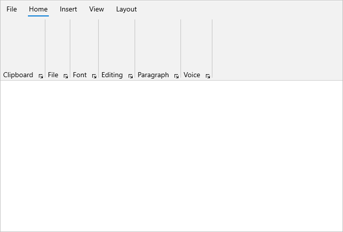
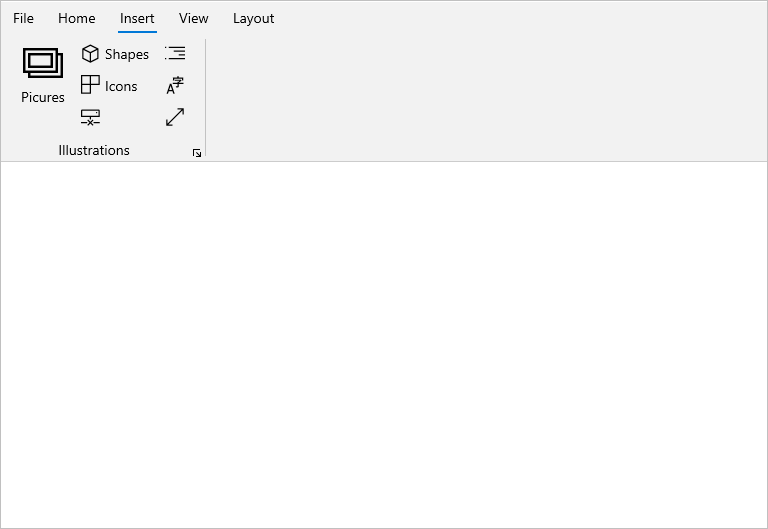
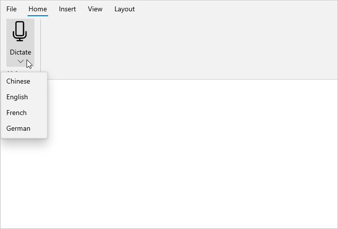
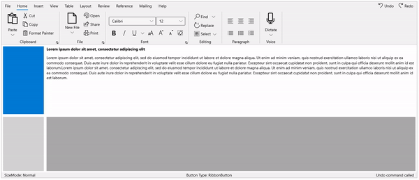

# Getting Started with WinUI Ribbon

This section explains the steps required to add the Ribbon control and its elements such as ribbon tabs, ribbon groups, built in ribbon items, custom ribbon items, right pane, backstage and its items. This section also covers the basic features needed to get started with Syncfusion ribbon control.

## Creating an application with WinUI Ribbon

1. Create a [WinUI 3 desktop app for C# and .NET 5](https://docs.microsoft.com/en-us/windows/apps/winui/winui3/get-started-winui3-for-desktop).

2.	Add reference to [Syncfusion.Ribbon.WinUI](https://www.nuget.org/packages/Syncfusion.Ribbon.WinUI) NuGet.

3.	Import the control namespace `Syncfusion.UI.Xaml.Ribbon` in XAML or C# code.

4.	Initialize the [SfRibbon](https://help.syncfusion.com/cr/winui/Syncfusion.UI.Xaml.Ribbon.SfRibbon.html) control. 




<Page
    x:Class="GettingStarted.MainPage"
    xmlns="http://schemas.microsoft.com/winfx/2006/xaml/presentation"
    xmlns:x="http://schemas.microsoft.com/winfx/2006/xaml"
    xmlns:local="using:GettingStarted"
    xmlns:d="http://schemas.microsoft.com/expression/blend/2008"
    xmlns:mc="http://schemas.openxmlformats.org/markup-compatibility/2006"
    xmlns:ribbon="using:Syncfusion.UI.Xaml.Ribbon"
    mc:Ignorable="d"
    Background="{ThemeResource ApplicationPageBackgroundThemeBrush}">
     
    <Grid x:Name="rootGrid">
        <ribbon:SfRibbon x:Name=”sfRibbon”/>
    </Grid>

</Page>



using Syncfusion.UI.Xaml.Ribbon;
namespace GettingStarted
{
    public sealed partial class MainPage : Page
    {
        public MainPage()
        {
            this.InitializeComponent();
            SfRibbon sfRibbon = new SfRibbon();
            rootGrid.Children.Add(sfRibbon);
        }
    }
}



## Add ribbon tab

Categorize the command using the [RibbonTab](https://help.syncfusion.com/cr/winui/Syncfusion.UI.Xaml.Ribbon.RibbonTab.html). Any number of tab elements can be added to the ribbon using the [Tabs](https://help.syncfusion.com/cr/winui/Syncfusion.UI.Xaml.Ribbon.SfRibbon.html#Syncfusion_UI_Xaml_Ribbon_SfRibbon_Tabs) property and the `Header` property can be used to name the tab.




<Grid x:Name="rootGrid">
    <ribbon:SfRibbon x:Name="sfRibbon">
        <ribbon:SfRibbon.Tabs>
            <ribbon:RibbonTab Header="Home" />
            <ribbon:RibbonTab Header="Insert" />
            <ribbon:RibbonTab Header="View" />
            <ribbon:RibbonTab Header="Layout" />
        </ribbon:SfRibbon.Tabs>
    </ribbon:SfRibbon>
</Grid>



SfRibbon sfRibbon = new SfRibbon();
RibbonTab homeTab = new RibbonTab() { Header = "Home" };
RibbonTab insertTab = new RibbonTab() { Header = "Insert" };
RibbonTab viewTab = new RibbonTab() { Header = "View" };
RibbonTab layoutTab = new RibbonTab() { Header = "Layout" };
sfRibbon.Tabs.Add(homeTab);
sfRibbon.Tabs.Add(insertTab);
sfRibbon.Tabs.Add(viewTab);
sfRibbon.Tabs.Add(layoutTab);
this.rootGrid.Children.Add(sfRibbon);



## Add ribbon group

The commands in the ribbon tab can be grouped using a [RibbonGroup](https://help.syncfusion.com/cr/winui/Syncfusion.UI.Xaml.Ribbon.RibbonGroup.html). It allows to add built-in ribbon items such as [RibbonButton](https://help.syncfusion.com/cr/winui/Syncfusion.UI.Xaml.Ribbon.RibbonButton.html), [RibbonDropDownButton](https://help.syncfusion.com/cr/winui/Syncfusion.UI.Xaml.Ribbon.RibbonDropDownButton.html) and [RibbonSplitButton](https://help.syncfusion.com/cr/winui/Syncfusion.UI.Xaml.Ribbon.RibbonSplitButton.html). Other controls such as checkbox, combobox and radio button etc. can also be added.




<Grid x:Name="rootGrid">
    <ribbon:SfRibbon x:Name="sfRibbon">
        <ribbon:SfRibbon.Tabs>
            <ribbon:RibbonTab Header="Home">
                <ribbon:RibbonGroup Header="Clipboard" />
                <ribbon:RibbonGroup Header="File" />
                <ribbon:RibbonGroup Header="Font" />
                <ribbon:RibbonGroup Header="Editing" />
                <ribbon:RibbonGroup Header="Paragraph" />
                <ribbon:RibbonGroup Header="Voice" />
            </ribbon:RibbonTab>
            <ribbon:RibbonTab Header="Insert" />
            <ribbon:RibbonTab Header="View" />
            <ribbon:RibbonTab Header="Layout" />
        </ribbon:SfRibbon.Tabs>
    </ribbon:SfRibbon>
</Grid>



SfRibbon sfRibbon = new SfRibbon();
RibbonTab homeTab = new RibbonTab() { Header = "Home" };
RibbonTab insertTab = new RibbonTab() { Header = "Insert" };
RibbonTab viewTab = new RibbonTab() { Header = "View" };
RibbonTab layoutTab = new RibbonTab() { Header = "Layout" };

RibbonGroup clipboardGroup = new RibbonGroup() { Header = "Clipboard" };
RibbonGroup fileGroup = new RibbonGroup() { Header = "File" };
RibbonGroup fontGroup = new RibbonGroup() { Header = "Font" };
RibbonGroup editingGroup = new RibbonGroup() { Header = "Editing" };
RibbonGroup paragraphGroup = new RibbonGroup() { Header = "Paragraph" };
RibbonGroup voiceGroup = new RibbonGroup() { Header = "Voice" };

homeTab.Items.Add(clipboardGroup);
homeTab.Items.Add(fileGroup);
homeTab.Items.Add(fontGroup);
homeTab.Items.Add(editingGroup);
homeTab.Items.Add(paragraphGroup);
homeTab.Items.Add(voiceGroup);

sfRibbon.Tabs.Add(homeTab);
sfRibbon.Tabs.Add(insertTab);
sfRibbon.Tabs.Add(viewTab);
sfRibbon.Tabs.Add(layoutTab);
this.rootGrid.Children.Add(sfRibbon);



## Add ribbon button

The [RibbonButton](https://help.syncfusion.com/cr/winui/Syncfusion.UI.Xaml.Ribbon.RibbonButton.html) represents a normal button and can be added to a ribbon group with different sizes using the `AllowedSizeModes` property. Use the `Content` and `Icon` properties to set the label and icon to the button.



<ribbon:SfRibbon x:Name="sfRibbon"
                 SelectedIndex="1">
    <ribbon:SfRibbon.Tabs>
        <ribbon:RibbonTab Header="Home" />
        <ribbon:RibbonTab Header="Insert">
            <ribbon:RibbonGroup Header="Illustrations">
                <ribbon:RibbonButton Content="Pictures"
                                     AllowedSizeModes="Large">
                    <ribbon:RibbonButton.Icon>
                        <SymbolIcon Symbol="Pictures" />
                    </ribbon:RibbonButton.Icon>
                </ribbon:RibbonButton>
                <ribbon:RibbonButton Content="Shapes"
                                     AllowedSizeModes="Normal">
                    <ribbon:RibbonButton.Icon>
                        <FontIcon Glyph="&#xF158;" />
                    </ribbon:RibbonButton.Icon>
                </ribbon:RibbonButton>
                <ribbon:RibbonButton Content="Icons"
                                     AllowedSizeModes="Normal">
                    <ribbon:RibbonButton.Icon>
                        <FontIcon Glyph="&#xECAA;" />
                    </ribbon:RibbonButton.Icon>
                </ribbon:RibbonButton>
                <ribbon:RibbonButton Icon="DisconnectDrive"
                                     Content="3D Models"
                                     AllowedSizeModes="Normal" />
                <ribbon:RibbonButton AllowedSizeModes="Small">
                    <ribbon:RibbonButton.Icon>
                        <BitmapIcon UriSource="ms-appx:///Assets/Bookmarks.png" />
                    </ribbon:RibbonButton.Icon>
                </ribbon:RibbonButton>
                <ribbon:RibbonButton Icon="Character"
                                     AllowedSizeModes="Small" />
                <ribbon:RibbonButton Icon="FullScreen"
                                     AllowedSizeModes="Small" />
            </ribbon:RibbonGroup>
        </ribbon:RibbonTab> 
        <ribbon:RibbonTab Header="View" />
        <ribbon:RibbonTab Header="Layout" />
    </ribbon:SfRibbon.Tabs>
</ribbon:SfRibbon>



SfRibbon sfRibbon = new SfRibbon();
sfRibbon.SelectedIndex = 1;

RibbonTab homeTab = new RibbonTab() { Header = "Home" };
RibbonTab insertTab = new RibbonTab() { Header = "Insert" };
RibbonTab viewTab = new RibbonTab() { Header = "View" };
RibbonTab layoutTab = new RibbonTab() { Header = "Layout" };

RibbonGroup illustrationsGroup = new RibbonGroup() { Header = "Illustrations" };

RibbonButton pictureButton = new RibbonButton() { Content = "Picures" , AllowedSizeModes= AllowedSizeModes.Large, Icon = new SymbolIcon(Symbol.Pictures)};

RibbonButton shapesButton = new RibbonButton() { Content = "Shapes" , AllowedSizeModes= AllowedSizeModes.Normal, Icon = new FontIcon() { Glyph= "\xF158" } };
RibbonButton iconsButton = new RibbonButton() { Content = "Icons" , AllowedSizeModes= AllowedSizeModes.Normal, Icon = new FontIcon() { Glyph= "\xECAA" } };            
RibbonButton disconnectDriveButton = new RibbonButton() { Content = "3D Models" , AllowedSizeModes= AllowedSizeModes.Small, Icon = new SymbolIcon(Symbol.DisconnectDrive)  };

RibbonButton bookmarksButton = new RibbonButton() { AllowedSizeModes = AllowedSizeModes.Small, Icon = new BitmapIcon() { UriSource = new Uri("msappx:///Assets/Bookmarks.png") } };
RibbonButton characterButton = new RibbonButton() {   AllowedSizeModes= AllowedSizeModes.Small, Icon = new SymbolIcon(Symbol.Character) };
RibbonButton fullScreenButton = new RibbonButton() { AllowedSizeModes = AllowedSizeModes.Small, Icon = new SymbolIcon(Symbol.FullScreen) };

illustrationsGroup.Items.Add(pictureButton);
illustrationsGroup.Items.Add(shapesButton);
illustrationsGroup.Items.Add(iconsButton);
illustrationsGroup.Items.Add(disconnectDriveButton);
illustrationsGroup.Items.Add(bookmarksButton);
illustrationsGroup.Items.Add(characterButton);
illustrationsGroup.Items.Add(fullScreenButton);

insertTab.Items.Add(illustrationsGroup);

sfRibbon.Tabs.Add(homeTab);
sfRibbon.Tabs.Add(insertTab);
sfRibbon.Tabs.Add(viewTab);
sfRibbon.Tabs.Add(layoutTab);

this.rootGrid.Children.Add(sfRibbon);



## Add ribbon drop down button

The [RibbonDropDownButton](https://help.syncfusion.com/cr/winui/Syncfusion.UI.Xaml.Ribbon.RibbonDropDownButton.html) represents a dropdown button that displays the drop-down menu items when clicked. It allows to arrange a button with different sizes within a ribbon group using the `AllowedSizeModes` property. Use the `Content` and `Icon` properties to set the label and icon to the button, and populate the drop-down menu items using the `Flyout` control in the button.



<Grid x:Name="rootGrid">
    <ribbon:SfRibbon x:Name="sfRibbon">
        <ribbon:SfRibbon.Tabs>
            <ribbon:RibbonTab Header="Home">
                <ribbon:RibbonGroup Header="File">
                    <ribbon:RibbonDropDownButton Content="New File"
                                                     AllowedSizeModes="Large">
                        <ribbon:RibbonDropDownButton.Icon>
                                <FontIcon FontFamily="Segoe MDL2 Assets" Glyph="&#xE7C3;" />
                        </ribbon:RibbonDropDownButton.Icon>
                        <ribbon:RibbonDropDownButton.Flyout>
                            <MenuFlyout>
                                    <MenuFlyoutItem Text="Empty File" />
                                    <MenuFlyoutItem Text="Template File" />
                            </MenuFlyout>
                        </ribbon:RibbonDropDownButton.Flyout>
                    </ribbon:RibbonDropDownButton>
                </ribbon:RibbonGroup>    
            </ribbon:RibbonTab>
            <ribbon:RibbonTab Header="Insert" />
            <ribbon:RibbonTab Header="View" />
            <ribbon:RibbonTab Header="Layout" /> 
        </ribbon:SfRibbon.Tabs>
    </ribbon:SfRibbon>
</Grid>
   

SfRibbon sfRibbon = new SfRibbon();

RibbonTab homeTab = new RibbonTab() { Header = "Home" };
RibbonTab insertTab = new RibbonTab() { Header = "Insert" };
RibbonTab viewTab = new RibbonTab() { Header = "View" };
RibbonTab layoutTab = new RibbonTab() { Header = "Layout" };

RibbonGroup fileGroup = new RibbonGroup() { Header = "File" };

RibbonDropDownButton newFileButton = new RibbonDropDownButton() { Content = "New File", AllowedSizeModes = AllowedSizeModes.Large, Icon = new FontIcon() { Glyph = "\xE7C3", FontFamily = new FontFamily("Segoe MDL2 Assets") } };

MenuFlyout flyout = new MenuFlyout();
MenuFlyoutItem emptyFileMenuFlyoutItem = new MenuFlyoutItem() { Text = "Empty File" };
MenuFlyoutItem templateFileMenuFlyoutItem = new MenuFlyoutItem() { Text = "Template File" };
flyout.Items.Add(emptyFileMenuFlyoutItem);
flyout.Items.Add(templateFileMenuFlyoutItem);

newFileButton.Flyout = flyout;
fileGroup.Items.Add(newFileButton);
homeTab.Items.Add(fileGroup);

sfRibbon.Tabs.Add(homeTab);
sfRibbon.Tabs.Add(insertTab);
sfRibbon.Tabs.Add(viewTab);
sfRibbon.Tabs.Add(layoutTab);

this.rootGrid.Children.Add(sfRibbon);



## Add ribbon split button

The [RibbonSplitButton](https://help.syncfusion.com/cr/winui/Syncfusion.UI.Xaml.Ribbon.RibbonSplitButton.html) represents a combined control that has a primary button which responds to a `Click` event and a secondary button acts like a drop-down menu with a list of values. It allows  to arrange a button with different sizes within a ribbon group using the `AllowedSizeModes` property. Use the `Content` and `Icon` properties to set the label and icon to the button, and populate the drop-down menu items using the `Flyout` control in the button.



<Grid x:Name="rootGrid">
    <ribbon:SfRibbon x:Name="sfRibbon">
        <ribbon:SfRibbon.Tabs>
            <ribbon:RibbonTab Header="Home">
                <ribbon:RibbonGroup Header="Voice">
                    <ribbon:RibbonSplitButton Icon="Microphone"
                                        Content="Dictate"
                                        AllowedSizeModes="Large">
                        <ribbon:RibbonSplitButton.Flyout>
                            <MenuFlyout>
                                <MenuFlyoutItem Text="Chinese" />
                                <MenuFlyoutItem Text="English" />
                                <MenuFlyoutItem Text="French" />
                                <MenuFlyoutItem Text="German" />
                            </MenuFlyout>
                        </ribbon:RibbonSplitButton.Flyout>
                    </ribbon:RibbonSplitButton>
                </ribbon:RibbonGroup>
            </ribbon:RibbonTab>
            <ribbon:RibbonTab Header="Insert" />
            <ribbon:RibbonTab Header="View" />
            <ribbon:RibbonTab Header="Layout" /> 
        </ribbon:SfRibbon.Tabs>
    </ribbon:SfRibbon>
</Grid>
   

SfRibbon sfRibbon = new SfRibbon();
RibbonTab homeTab = new RibbonTab() { Header = "Home" };
RibbonTab insertTab = new RibbonTab() { Header = "Insert" };
RibbonTab viewTab = new RibbonTab() { Header = "View" };
RibbonTab layoutTab = new RibbonTab() { Header = "Layout" };

RibbonGroup voiceGroup = new RibbonGroup() { Header = "Voice" };

RibbonSplitButton splitButton = new RibbonSplitButton() { Content = "Dictate", AllowedSizeModes = AllowedSizeModes.Large, Icon = new SymbolIcon(Symbol.Microphone) };

MenuFlyout flyout = new MenuFlyout();
MenuFlyoutItem chineseMenuFlyoutItem = new MenuFlyoutItem() { Text = "Chinese" };
MenuFlyoutItem englishMenuFlyoutItem = new MenuFlyoutItem() { Text = "English" };
MenuFlyoutItem frenchMenuFlyoutItem = new MenuFlyoutItem() { Text = "French" };
MenuFlyoutItem germanMenuFlyoutItem = new MenuFlyoutItem() { Text = "German" };

flyout.Items.Add(chineseMenuFlyoutItem);
flyout.Items.Add(englishMenuFlyoutItem);
flyout.Items.Add(frenchMenuFlyoutItem);
flyout.Items.Add(germanMenuFlyoutItem);

splitButton.Flyout = flyout;
voiceGroup.Items.Add(splitButton);

homeTab.Items.Add(voiceGroup);

sfRibbon.Tabs.Add(homeTab);
sfRibbon.Tabs.Add(insertTab);
sfRibbon.Tabs.Add(viewTab);
sfRibbon.Tabs.Add(layoutTab);
this.rootGrid.Children.Add(sfRibbon);




N> The other icon types such as   [BitmapIcon](https://docs.microsoft.com/en-us/windows/windows-app-sdk/api/winrt/microsoft.ui.xaml.controls.bitmapicon?view=windows-app-sdk-1.0), [FontIcon](https://docs.microsoft.com/en-us/windows/windows-app-sdk/api/winrt/microsoft.ui.xaml.controls.fonticon?view=windows-app-sdk-1.0), [PathIcon](https://docs.microsoft.com/en-us/windows/windows-app-sdk/api/winrt/microsoft.ui.xaml.controls.pathicon?view=windows-app-sdk-1.0) and [SymbolIcon](https://docs.microsoft.com/en-us/windows/windows-app-sdk/api/winrt/microsoft.ui.xaml.controls.symbolicon?view=windows-app-sdk-1.0) can be used for the Ribbon items such as RibbonButton, RibbonDropDownButton, RibbonSplitButton and Ribbon Item host controls.

## Add ribbon gallery

The example below shows how to include the [RibbonGallery](https://help.syncfusion.com/cr/winui/Syncfusion.UI.Xaml.Ribbon.RibbonGallery.html) control within a RibbonGroup.



<Grid x:Name="rootGalleryGrid">
    <ribbon:SfRibbon>
        <ribbon:SfRibbon.Tabs>
            <ribbon:RibbonTab Header="Home">
                <ribbon:RibbonGroup Header="Styles">
                    <ribbon:RibbonGallery />
                </ribbon:RibbonGroup>
            </ribbon:RibbonTab>
            <ribbon:RibbonTab Header="Insert" />
        </ribbon:SfRibbon.Tabs>
    </ribbon:SfRibbon>
</Grid>


SfRibbon sfRibbon = new SfRibbon();
RibbonTab homeTab = new RibbonTab() { Header = "Home" };
RibbonGroup stylesGroup = new RibbonGroup() { Header = "Styles" };
RibbonGallery ribbonGallery = new RibbonGallery();
stylesGroup.Items.Add(ribbonGallery);
homeTab.Items.Add(stylesGroup);
sfRibbon.Tabs.Add(homeTab);
rootGalleryGrid.Children.Add(sfRibbon);



## Host a custom control

Ribbon allows to host other controls such as checkbox, radio button and combobox etc., in a ribbon group using the `ItemTemplate` property of [RibbonItemHost](https://help.syncfusion.com/cr/winui/Syncfusion.UI.Xaml.Ribbon.RibbonItemHost.html).



<ribbon:SfRibbon x:Name="sfRibbon">
    <ribbon:SfRibbon.Tabs>
        <ribbon:RibbonTab Header="Home">
            <ribbon:RibbonGroup Header="Font">
                <ribbon:RibbonItemHost Margin="0,12,0,0">
                    <ribbon:RibbonItemHost.ItemTemplate>
                        <StackPanel Orientation="Horizontal">
                            <ComboBox x:Name="FontComboBox"
                                      Width="120"
                                      PlaceholderText="Select Font"
                                      PlaceholderForeground="#A2A2A2">
                                <ComboBoxItem Content="Calibri"
                                              IsSelected="True" />
                                <ComboBoxItem Content="Arial" />
                                <ComboBoxItem Content="Segoe UI" />
                            </ComboBox>
                            <ComboBox Margin="3,0"
                                      x:Name="FontSizeComboBox"
                                      PlaceholderText="Select Font Size"
                                      PlaceholderForeground="#A2A2A2">
                                <ComboBoxItem Content="11"
                                              IsSelected="True" />
                                <ComboBoxItem Content="12" />
                            </ComboBox>
                        </StackPanel>
                    </ribbon:RibbonItemHost.ItemTemplate>
                </ribbon:RibbonItemHost>
                <ribbon:RibbonItemHost Margin="0,12,0,0">
                    <ribbon:RibbonItemHost.ItemTemplate>
                        <StackPanel Orientation="Horizontal">
                            <ToggleButton x:Name="Bold"
                                          Background="{ThemeResource SystemChromeLowColor}">
                                <ToggleButton.Content>
                                    <SymbolIcon Symbol="Bold" />
                                </ToggleButton.Content>
                            </ToggleButton>
                            <ToggleButton x:Name="Italic"
                                          Background="{ThemeResource SystemChromeLowColor}">
                                <ToggleButton.Content>
                                    <SymbolIcon Symbol="Italic" />
                                </ToggleButton.Content>
                            </ToggleButton>
                            <ribbon:RibbonSplitButton x:Name="underlineButton"
                                                      AllowedSizeModes="Small"
                                                      Icon="Underline"
                                                      Content="Underline">
                                <ribbon:RibbonSplitButton.Flyout>
                                    <MenuFlyout>
                                        <MenuFlyoutItem Text="Underline" />
                                        <MenuFlyoutItem Text="Double underline" />
                                        <MenuFlyoutItem Text="Thick underline" />
                                        <MenuFlyoutItem Text="Dotted underline" />
                                    </MenuFlyout>
                                </ribbon:RibbonSplitButton.Flyout>
                            </ribbon:RibbonSplitButton>
                            <ribbon:RibbonButton x:Name="fontSizeButton"
                                                 Icon="FontSize"
                                                 AllowedSizeModes="Small"
                                                 Content="FontSize" />
                        </StackPanel>
                    </ribbon:RibbonItemHost.ItemTemplate>
                </ribbon:RibbonItemHost>
            </ribbon:RibbonGroup>
        </ribbon:RibbonTab>
    </ribbon:SfRibbon.Tabs>
</ribbon:SfRibbon>




## Add ribbon backstage

The [RibbonBackstage](https://help.syncfusion.com/cr/winui/Syncfusion.UI.Xaml.Ribbon.RibbonBackstage.html) provides a separate view to the ribbon and can be added by using the `Backstage` property of ribbon control. View the ribbon backstage by clicking the backstage menu button named as `File` by default, which is placed before the ribbon tabs.



<ribbon:SfRibbon x:Name="sfRibbon">
    <ribbon:SfRibbon.Backstage>
        <ribbon:RibbonBackstage>
            <Grid>
                <Grid.RowDefinitions>
                    <RowDefinition Height="*" />
                    <RowDefinition Height="Auto" />
                </Grid.RowDefinitions>
                <Grid Grid.Row="0"
                      Padding="0,0,0,1"
                      VerticalAlignment="Top"
                      BorderBrush="LightGray"
                      BorderThickness="0,0,0,1">
                    <Grid.RowDefinitions>
                        <RowDefinition Height="Auto" />
                        <RowDefinition Height="481" />
                    </Grid.RowDefinitions>
                    <Grid.ColumnDefinitions>
                        <ColumnDefinition />
                        <ColumnDefinition />
                    </Grid.ColumnDefinitions>
                    <TextBlock Grid.Row="0"
                               Padding="15"
                               FontSize="24"
                               FontWeight="SemiBold"
                               Text="Settings" />
                    <StackPanel Grid.Row="1"
                                Margin="15,15,15,0"
                                BorderBrush="LightGray"
                                BorderThickness="0,0,0,0">
                        <TextBlock Padding="0,0,0,5"
                                   FontSize="16"
                                   Text="User Information" />
                        <TextBlock Padding="0,5,0,5"
                                   FontSize="14"
                                   Text="Name : John" />
                        <HyperlinkButton Content="Change photo" />
                        <HyperlinkButton Content="Sign Out" />
                        <HyperlinkButton Content="Switch Account" />
                        <TextBlock Padding="0,5,0,5"
                                   Text="Theme Mode" />
                        <RadioButton Content="Light" />
                        <RadioButton Content="Dark" />
                        <RadioButton Content="Use system setting" />
                    </StackPanel>
                    <StackPanel Grid.Row="1"
                                Grid.Column="1"
                                Padding="15,15,15,0"
                                BorderBrush="LightGray"
                                BorderThickness="1,0,0,0">
                        <TextBlock Padding="0,0,0,5"
                                   FontSize="16"
                                   Text="Product Information" />
                        <HyperlinkButton Content="About product" />
                        <HyperlinkButton Content="Help" />
                        <HyperlinkButton Content="Updates" />
                    </StackPanel>
                </Grid>
                <StackPanel Grid.Row="1"
                            Grid.ColumnSpan="2"
                            Padding="120,0,5,5"
                            HorizontalAlignment="Right"
                            BorderBrush="LightGray"
                            BorderThickness="0,0,0,0"
                            Orientation="Horizontal">
                    <Button Margin="5"
                            Content="Options"
                            CornerRadius="0" />
                    <Button Margin="5"
                            Content="Exit Backstage"
                            CornerRadius="0" />
                </StackPanel>
            </Grid>
        </ribbon:RibbonBackstage>
    </ribbon:SfRibbon.Backstage>
</ribbon:SfRibbon>



### Backstage view 

Host [BackstageView](https://help.syncfusion.com/cr/winui/Syncfusion.UI.Xaml.Ribbon.BackstageView.html) inside the ribbon backstage and use it to manage the settings and options for the application in a separate backstage view.



<Grid x:Name="rootGrid">
    <ribbon:SfRibbon x:Name="sfRibbon">
        <ribbon:SfRibbon.Backstage>
            <ribbon:RibbonBackstage>
                 <ribbon:BackstageView/>
            </ribbon:RibbonBackstage>
        </ribbon:SfRibbon.Backstage>
    </ribbon:SfRibbon>
</Grid>
 

SfRibbon sfRibbon = new SfRibbon();
RibbonBackstage ribbonBackstage = new RibbonBackstage();
BackstageView backstageView = new BackstageView();
ribbonBackstage.Content = backstageView;
sfRibbon.Backstage = ribbonBackstage;
this.rootGrid.Children.Add(sfRibbon);
 


## Add right pane

The Right pane is located at the right side of the ribbon tab. Any controls can be placed inside the pane. The contents in the right pane are shown irrespective of the currently selected tab.

For example, below a stack panel is added with two ribbon buttons inside the right pane.



<Grid x:Name="rootGrid">
    <ribbon:SfRibbon x:Name="sfRibbon">       
        <ribbon:SfRibbon.RightPane>
            <StackPanel Orientation="Horizontal">
                <ribbon:RibbonButton Icon="Undo" Content="Undo" />
                <ribbon:RibbonButton Icon="Redo" Content="Redo" />
            </StackPanel>
        </ribbon:SfRibbon.RightPane>
    </ribbon:SfRibbon>
</Grid>
   

SfRibbon sfRibbon = new SfRibbon();

StackPanel customPanel = new StackPanel() { Orientation = Orientation.Horizontal };
RibbonButton undoButton = new RibbonButton() { Content = "Undo", Icon = new SymbolIcon(Symbol.Undo) };
RibbonButton redoButton = new RibbonButton() { Content = "Redo", Icon = new SymbolIcon(Symbol.Redo) };

customPanel.Children.Add(undoButton);
customPanel.Children.Add(redoButton);

sfRibbon.RightPane = customPanel;
this.rootGrid.Children.Add(sfRibbon);



