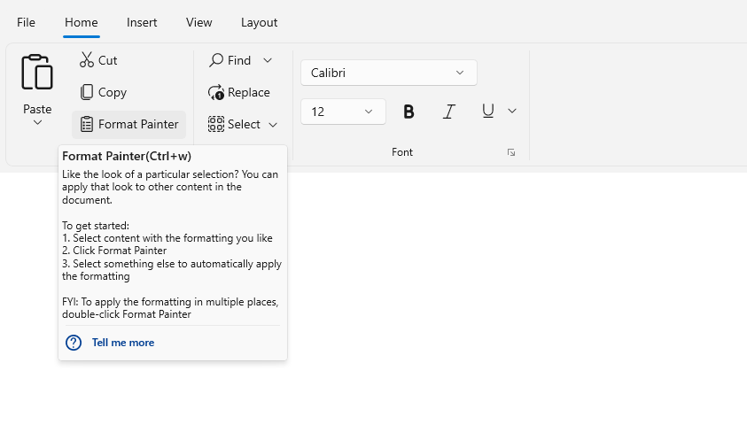

# ScreenTip in WinUI Ribbon Control

`ScreenTip` is an enhanced ToolTip and it is used to show a popup window when the pointer hovers over a ribbon item. The pop-up provides helpful details about the function of the ribbon item.

The ScreenTip consist of two parts 
    
* **Title:** A property of a type object that specifes the title of the ScreenTip.
* **Content:** A property of a type object that specifes the content of the ScreenTip.

## Adding ScreenTip for ribbon items

ScreenTip can be set to each Ribbon item by using its `ScreenTip` property. The below code shows how to define the ScreenTip for ribbon items in Ribbon control.




<ribbon:SfRibbon>
    <ribbon:SfRibbon.Tabs>
        <ribbon:RibbonTab Header="Home">
            <ribbon:RibbonGroup Header="Clipboard">
                <ribbon:RibbonSplitButton Content="Paste"
                                Command="{Binding ButtonCommand}" 
                                CommandParameter="Paste"
                                Icon="Paste"
                                AllowedSizeModes="Large">
                            <ribbon:RibbonSplitButton.Flyout>
                                <MenuFlyout>
                                    <MenuFlyoutItem Command="{Binding ButtonCommand}"
                                                    CommandParameter="Paste -&gt;Paste command"
                                                    Text="Paste" />
                                    <MenuFlyoutItem Command="{Binding ButtonCommand}"
                                                    CommandParameter="Paste -&gt;Paste Special"
                                                    Text="Paste Special" />
                                    <MenuFlyoutItem Command="{Binding ButtonCommand}"
                                                    CommandParameter="Paste -&gt; Set Default Paste"
                                                    Text="Set Default Paste" />
                                </MenuFlyout>
                            </ribbon:RibbonSplitButton.Flyout>
                            <ribbon:RibbonSplitButton.ScreenTip>
                            <ribbon:ScreenTip Title="Paste" Content="Add content on the clipboard to your document." />
                            </ribbon:RibbonSplitButton.ScreenTip>
                </ribbon:RibbonSplitButton>
                <ribbon:RibbonButton Content="Cut"
                                    Icon="Cut" 
                                    Command="{Binding ButtonCommand}" 
                                    CommandParameter="Cut"
                                    AllowedSizeModes="Normal, Small" >
                <ribbon:RibbonButton.ScreenTip>
                        <ribbon:ScreenTip Title="Cut" Content="Cut the selection and put it on the clipboard." />
                </ribbon:RibbonButton.ScreenTip>
                </ribbon:RibbonButton>
                // Add more elements here...
            </ribbon:RibbonGroup>
            // Add more groups here...
        </ribbon:RibbonTab>
        // Add more Tabs here...
    </ribbon:SfRibbon.Tabs>
</ribbon:SfRibbon>




### Customize the ScreenTip Title and Content

The appearance of the title and content can be customized by using the `TitleTemplate` and `ContentTemplate` property of the ScreenTip class. The following code example explains how to add a customizable title and content.




<ribbon:SfRibbon>
    <ribbon:SfRibbon.Tabs>
        <ribbon:RibbonTab Header="Home">
            <ribbon:RibbonGroup Header="Clipboard">
                    <ribbon:RibbonSplitButton Content="Paste"
                                    Command="{Binding ButtonCommand}" 
                                    CommandParameter="Paste"
                            Icon="Paste"
                            AllowedSizeModes="Large">
                    <ribbon:RibbonSplitButton.Flyout>
                        <MenuFlyout>
                                    <MenuFlyoutItem Command="{Binding ButtonCommand}"
                                                    CommandParameter="Paste -&gt;Paste command"
                                                    Text="Paste" />
                                    <MenuFlyoutItem Command="{Binding ButtonCommand}"
                                                    CommandParameter="Paste -&gt;Paste Special"
                                                    Text="Paste Special" />
                                    <MenuFlyoutItem Command="{Binding ButtonCommand}"
                                                    CommandParameter="Paste -&gt; Set Default Paste"
                                                    Text="Set Default Paste" />
                                </MenuFlyout>
                    </ribbon:RibbonSplitButton.Flyout>
                    <ribbon:RibbonSplitButton.ScreenTip>
                        <ribbon:ScreenTip Title="Paste" >
                            <ribbon:ScreenTip.ContentTemplate>
                                <DataTemplate>
                                        <StackPanel>
                                        <TextBlock Text="Add content on the clipboard to your document." 
                                                Width="180"
                                                TextWrapping="Wrap"/>
                                        </StackPanel>
                                </DataTemplate>
                            </ribbon:ScreenTip.ContentTemplate>
                        </ribbon:ScreenTip>
                    </ribbon:RibbonSplitButton.ScreenTip>
                </ribbon:RibbonSplitButton>
                <ribbon:RibbonButton Content="Cut"
                                    Icon="Cut" 
                                    Command="{Binding ButtonCommand}" 
                                    CommandParameter="Cut"
                                    AllowedSizeModes="Normal, Small" >
                    <ribbon:RibbonButton.ScreenTip>
                        <ribbon:ScreenTip Title="Cut" >
                            <ribbon:ScreenTip.ContentTemplate>
                                <DataTemplate>
                                    <StackPanel >
                                        <TextBlock Text="Remove the selection and put it on the clipboard so you can paste it somewhere else." 
                                                Width="170"
                                                TextWrapping="Wrap"/>
                                    </StackPanel>
                                </DataTemplate>
                            </ribbon:ScreenTip.ContentTemplate>
                        </ribbon:ScreenTip>
                    </ribbon:RibbonButton.ScreenTip>
                </ribbon:RibbonButton>
                <ribbon:RibbonButton Content="Copy"
                                    DisplayOptions="Normal,Overflow"
                                    Icon="Copy"
                                    AllowedSizeModes="Normal, Small"
                                    Command="{Binding ButtonCommand}" 
                                    CommandParameter="Copy">
                    <ribbon:RibbonButton.ScreenTip>
                        <ribbon:ScreenTip Title="Copy" >
                            <ribbon:ScreenTip.ContentTemplate>
                                <DataTemplate>
                                    <StackPanel Margin="2">
                                        <TextBlock Text="Put a copy of the selection on the clipboard so you can paste it somewhere else." 
                                                Width="170"
                                                TextWrapping="Wrap"/>
                                    </StackPanel>
                                </DataTemplate>
                            </ribbon:ScreenTip.ContentTemplate>
                        </ribbon:ScreenTip>
                    </ribbon:RibbonButton.ScreenTip>
                </ribbon:RibbonButton>
                <ribbon:RibbonButton Content="Format Painter"
                            DisplayOptions="Normal,Simplified"
                            AllowedSizeModes="Normal, Small" 
                            Command="{Binding ButtonCommand}" 
                            CommandParameter="Format Painter">
                    <ribbon:RibbonButton.Icon>
                        <FontIcon Glyph="&#xF0E3;" />
                    </ribbon:RibbonButton.Icon>
                    <ribbon:RibbonButton Content="Format Painter"
                            DisplayOptions="Normal,Simplified"
                            AllowedSizeModes="Normal, Small" 
                            Command="{Binding ButtonCommand}" 
                            CommandParameter="Format Painter">
                    <ribbon:RibbonButton.Icon>
                        <FontIcon Glyph="&#xF0E3;" />
                    </ribbon:RibbonButton.Icon>
                    <ribbon:RibbonButton.ScreenTip>
                        <ribbon:ScreenTip>
                            <ribbon:ScreenTip.ContentTemplate>
                                <DataTemplate>
                                    <Grid>
                                        <Grid.RowDefinitions>
                                            <RowDefinition Height="Auto"/>
                                            <RowDefinition/>
                                            <RowDefinition Height="Auto"/>
                                        </Grid.RowDefinitions>
                                        <StackPanel>
                                            <TextBlock Text="Like the look of a particular selection? You can apply that look to other content in the document." Width="250" TextWrapping="WrapWholeWords"/>
                                            <AppBarSeparator/>
                                            <TextBlock Text="To get started:" TextWrapping="Wrap" Width="250"/>
                                            <TextBlock Text="1. Select content with the formatting you like" TextWrapping="Wrap" Width="250"/>
                                            <TextBlock Text="2. Click Format Painter" TextWrapping="Wrap" Width="250"/>
                                            <TextBlock Text="3. Select something else to automatically apply the formatting" TextWrapping="Wrap" Width="250"/>
                                            <AppBarSeparator/>
                                            <TextBlock Text="FYI: To apply the formatting in multiple places, double-click Format Painter" TextWrapping="WrapWholeWords" Width="250"/>
                                        </StackPanel>
                                        <Border Name="PART_Seperator" Margin="4"  BorderBrush="{StaticResource ControlStrokeColorDefault}" BorderThickness="0,0,0,1"  Grid.Row="1"  />
                                        <Grid Grid.Row="2">
                                            <Grid.ColumnDefinitions>
                                                <ColumnDefinition Width="20"/>
                                                <ColumnDefinition  />
                                            </Grid.ColumnDefinitions>
                                            <Border  HorizontalAlignment="Left"   Grid.Column="0" Margin="4,4,0,4" x:Name="HelpImage">
                                                <SymbolIcon Height="16" x:Name="helpImage" Width="16" Symbol="Help" Foreground="{StaticResource SystemAccentColor}"/>
                                            </Border>
                                            <HyperlinkButton Content="Tell me more" FontWeight="Bold" Foreground="{StaticResource SystemAccentColor}" Grid.Column="1" />
                                        </Grid>
                                    </Grid>
                                </DataTemplate>
                            </ribbon:ScreenTip.ContentTemplate>
                            <ribbon:ScreenTip.TitleTemplate>
                                <DataTemplate>
                                    <Grid>
                                        <Grid.ColumnDefinitions>
                                            <ColumnDefinition Width="Auto"/>
                                            <ColumnDefinition Width="Auto"/>
                                        </Grid.ColumnDefinitions>
                                        <TextBlock Text="Format Painter" Grid.Column="0"/>
                                        <TextBlock Text="(Ctrl+w)" Grid.Column="1" />
                                    </Grid>
                                </DataTemplate>
                            </ribbon:ScreenTip.TitleTemplate>
                        </ribbon:ScreenTip>
                    </ribbon:RibbonButton.ScreenTip>
                </ribbon:RibbonButton> 
                // Add more elements here...
            </ribbon:RibbonGroup>
            // Add more groups here...
        </ribbon:RibbonTab>
        // Add more Tabs here...
    </ribbon:SfRibbon.Tabs>
</ribbon:SfRibbon>




