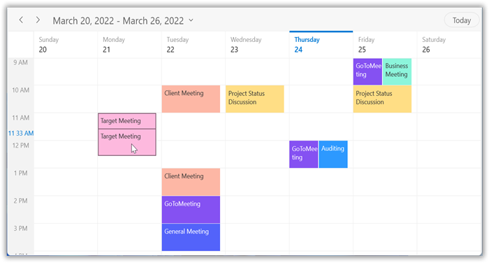

# Appointment Drag and Drop in WinUI Scheduler (SfScheduler)

The Scheduler supports to reschedule the appointment by performing the drag and drop operation.

## Disable drag and drop

The Scheduler supports disabling the appointment drag and drop by setting the [AppointmentEditFlag](https://help.syncfusion.com/cr/winui/Syncfusion.UI.Xaml.Scheduler.AppointmentEditFlag.html) property except [DragDrop](https://help.syncfusion.com/cr/winui/Syncfusion.UI.Xaml.Scheduler.AppointmentEditFlag.html#Syncfusion_UI_Xaml_Scheduler_AppointmentEditFlag_DragDrop). In this case, appointment drag and drop cannot be performed.



<scheduler:SfScheduler x:Name="Schedule" 
                       AppointmentEditFlag="Add,Edit,Resize">
</scheduler:SfScheduler>


this.Schedule.AppointmentEditFlag = AppointmentEditFlag.Add | AppointmentEditFlag.Edit | AppointmentEditFlag.Resize;



## Show/Hide the time indicator on appointment dragging

Show or hide the time indicator at a specific time to drag the appointment, by using the [ShowTimeIndicator](https://help.syncfusion.com/cr/winui/Syncfusion.UI.Xaml.Scheduler.DragDropSettings.html#Syncfusion_UI_Xaml_Scheduler_DragDropSettings_ShowTimeIndicator) property of [DragDropSettings](https://help.syncfusion.com/cr/winui/Syncfusion.UI.Xaml.Scheduler.DragDropSettings.html) by setting it to true. 



this.Schedule.ViewType = SchedulerViewType.Week;
this.Schedule.DragDropSettings.ShowTimeIndicator = true;



N>
* Not applicable for the `Month` and `Timeline Month` views. 
* If the [TimeRulerSize](https://help.syncfusion.com/winui/scheduler/day-week-views#change-time-ruler-size) property value is zero to collapse the time ruler labels, then drag the time indicator will not be shown.

## Appointment dragging time indicator text formatting

Customize the format for the appointment dragging time indicator format by setting the [TimeIndicatorFormat](https://help.syncfusion.com/cr/winui/Syncfusion.UI.Xaml.Scheduler.DragDropSettings.html#Syncfusion_UI_Xaml_Scheduler_DragDropSettings_TimeIndicatorFormat) property of [DragDropSettings](https://help.syncfusion.com/cr/winui/Syncfusion.UI.Xaml.Scheduler.DragDropSettings.html) in Scheduler.



this.Schedule.ViewType = SchedulerViewType.Week;
this.Schedule.DragDropSettings.TimeIndicatorFormat = "HH mm tt";



## AppointmentDragOver event

The Scheduler notifies by [AppointmentDragOver](https://help.syncfusion.com/cr/winui/Syncfusion.UI.Xaml.Scheduler.SfScheduler.html#Syncfusion_UI_Xaml_Scheduler_SfScheduler_AppointmentDragOver) when dragging the appointment. The [AppointmentDragOverEventArgs](https://help.syncfusion.com/cr/winui/Syncfusion.UI.Xaml.Scheduler.AppointmentDragOverEventArgs.html) has following members which provides the information for the [AppointmentDragOver](https://help.syncfusion.com/cr/winui/Syncfusion.UI.Xaml.Scheduler.SfScheduler.html#Syncfusion_UI_Xaml_Scheduler_SfScheduler_AppointmentDragOver) event.

[Appointment](https://help.syncfusion.com/cr/winui/Syncfusion.UI.Xaml.Scheduler.AppointmentDragOverEventArgs.html#Syncfusion_UI_Xaml_Scheduler_AppointmentDragOverEventArgs_Appointment): Gets the Appointment that is dragging.

[DraggingPoint](https://help.syncfusion.com/cr/winui/Syncfusion.UI.Xaml.Scheduler.AppointmentDragOverEventArgs.html#Syncfusion_UI_Xaml_Scheduler_AppointmentDragOverEventArgs_DraggingPoint): Gets the dragging point of the schedule appointment UI.

[DraggingTime](https://help.syncfusion.com/cr/winui/Syncfusion.UI.Xaml.Scheduler.AppointmentDragOverEventArgs.html#Syncfusion_UI_Xaml_Scheduler_AppointmentDragOverEventArgs_DraggingTime): Gets the dragging time of the dragging appointment object.

[SourceResource](https://help.syncfusion.com/cr/winui/Syncfusion.UI.Xaml.Scheduler.AppointmentDragOverEventArgs.html#Syncfusion_UI_Xaml_Scheduler_AppointmentDragOverEventArgs_SourceResource): Gets the SchedulerResource where the appointment was located before starting the dragging.

[TargetResource](https://help.syncfusion.com/cr/winui/Syncfusion.UI.Xaml.Scheduler.AppointmentDragOverEventArgs.html#Syncfusion_UI_Xaml_Scheduler_AppointmentDragOverEventArgs_TargetResource): Gets the SchedulerResource where the appointment is currently being dragged over.



this.Schedule.AppointmentDragOver += Schedule_AppointmentDragOver;

private void Schedule_AppointmentDragOver(object sender, AppointmentDragOverEventArgs e)
{
    //To notify when dragging the appointment.
}



## AppointmentDragStarting event

The Scheduler is notified by the [AppointmentDragStarting](https://help.syncfusion.com/cr/winui/Syncfusion.UI.Xaml.Scheduler.SfScheduler.html#Syncfusion_UI_Xaml_Scheduler_SfScheduler_AppointmentDragStarting) when starting to drag the appointment. The [AppointmentDragStartingEventArgs](https://help.syncfusion.com/cr/winui/Syncfusion.UI.Xaml.Scheduler.AppointmentDragStartingEventArgs.html) has the following members who provide the information for the [AppointmentDragStarting](https://help.syncfusion.com/cr/winui/Syncfusion.UI.Xaml.Scheduler.SfScheduler.html#Syncfusion_UI_Xaml_Scheduler_SfScheduler_AppointmentDragStarting) event.

[Appointment](https://help.syncfusion.com/cr/winui/Syncfusion.UI.Xaml.Scheduler.AppointmentDragStartingEventArgs.html#Syncfusion_UI_Xaml_Scheduler_AppointmentDragStartingEventArgs_Appointment): Get the selected appointment.

`Cancel`: To avoid appointment dragging by enabling this property.

[Resource](https://help.syncfusion.com/cr/winui/Syncfusion.UI.Xaml.Scheduler.AppointmentDragStartingEventArgs.html#Syncfusion_UI_Xaml_Scheduler_AppointmentDragStartingEventArgs_Resource): Gets the resource of an appointment under which the appointment is located.



this.Schedule.AppointmentDragStarting += Schedule_AppointmentDragStarting;

private void Schedule_AppointmentDragStarting(object sender, AppointmentDragStartingEventArgs e)
{
    //To notify when start to drag the appointment.
}



## AppointmentDropping event

The Scheduler is notified by `AppointmentDropping` when the appointment is dropped. The [AppointmentDroppingEventArgs](https://help.syncfusion.com/cr/winui/Syncfusion.UI.Xaml.Scheduler.AppointmentDroppingEventArgs.html) has the following members who provide information for the [AppointmentDropping](https://help.syncfusion.com/cr/winui/Syncfusion.UI.Xaml.Scheduler.SfScheduler.html#Syncfusion_UI_Xaml_Scheduler_SfScheduler_AppointmentDropping) event.

[Appointment](https://help.syncfusion.com/cr/winui/Syncfusion.UI.Xaml.Scheduler.AppointmentDroppingEventArgs.html#Syncfusion_UI_Xaml_Scheduler_AppointmentDroppingEventArgs_Appointment): Gets the selected appointment that is dragged and dropped.

`Cancel`: To avoid the appointment dropping by enabling this property.

[DropTime](https://help.syncfusion.com/cr/winui/Syncfusion.UI.Xaml.Scheduler.AppointmentDroppingEventArgs.html#Syncfusion_UI_Xaml_Scheduler_AppointmentDroppingEventArgs_DropTime): Gets the dropped time of the dragged appointment.

[SourceResource](https://help.syncfusion.com/cr/winui/Syncfusion.UI.Xaml.Scheduler.AppointmentDroppingEventArgs.html#Syncfusion_UI_Xaml_Scheduler_AppointmentDroppingEventArgs_SourceResource): Gets the SchedulerResource where the appointment was located before starting the dragging.

[TargetResource](https://help.syncfusion.com/cr/winui/Syncfusion.UI.Xaml.Scheduler.AppointmentDroppingEventArgs.html#Syncfusion_UI_Xaml_Scheduler_AppointmentDroppingEventArgs_TargetResource): Gets the SchedulerResource where the appointment is currently being dragged over.



this.Schedule.AppointmentDropping += Schedule_AppointmentDropping;

private void Schedule_AppointmentDropping(object sender, AppointmentDroppingEventArgs e)
{
    //To notify when the appointment is dropping.
}

