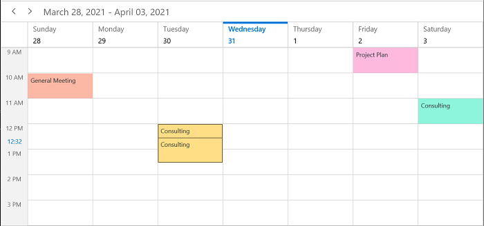
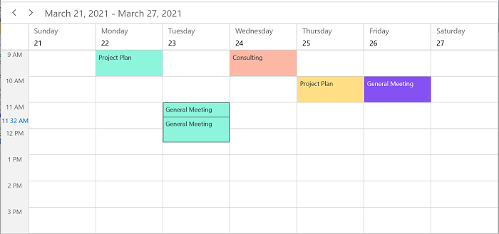

# Appointment drag and drop in WPF Scheduler (SfScheduler)

The Scheduler supports to reschedule the appointment by performing the drag and drop operation.

## Disable drag and drop

The Scheduler supports to disable the appointment drag and drop by setting `AppointmentEditFlag` property except `DragDrop.` In this case,you will not be able to perform appointment drag & drop.



<scheduler:SfScheduler x:Name="Schedule" 
                       AppointmentEditFlag="Add,Edit,Resize">
</scheduler:SfScheduler>


this.Schedule.AppointmentEditFlag = AppointmentEditFlag.Add | AppointmentEditFlag.Edit | AppointmentEditFlag.Resize;



## Show/Hide the time indicator on appointment dragging

You can show or hide the time indicator at a specific time when do drag the appointment by using the `ShowTimeIndicator` property of `DragDropSettings` is set to true. 



this.Schedule.ViewType = SchedulerViewType.Week;
this.Schedule.DragDropSettings.ShowTimeIndicator = true;



N>
* Not applicable for Month and Timeline Month views. 
* If the TimeRulerSize property value is zero to collapse the time ruler labels, then drag time indicator will not be shown.

## Appointment dragging time indicator text formatting

You can customize the format for the appointment dragging time indicator format by setting the `TimeIndicatorFormat` property of `DragDropSettings` in Scheduler.



this.Schedule.ViewType = SchedulerViewType.Week;
this.Schedule.DragDropSettings.TimeIndicatorFormat = "HH mm tt";



## AppointmentDragOver event

The Scheduler notifies by `AppointmentDragOver` when drag the appointment. The `AppointmentDragOverEventArgs` has following members which provides information for `AppointmentDragOver` event.

`Appointment` - Gets the Appointment that is dragging.

`DraggingPoint` - Gets the dragging point of schedule appointment UI.

`DraggingTime` - Gets the dragging time of the dragging appointment object.

`SourceResource` - Gets the SchedulerResource where the appointment was located before starting the dragging.

`TargetResource` - Gets the SchedulerResource where the appointment is currently being dragged over.



this.Schedule.AppointmentDragOver += Schedule_AppointmentDragOver;

private void Schedule_AppointmentDragOver(object sender, AppointmentDragOverEventArgs e)
{
    //To notify when dragging the appointment.
}



## AppointmentDragStarting event

The Scheduler notifies by `AppointmentDragStarting` when start to drag the appointment. The `AppointmentDragStartingEventArgs` has following members which provides information for `AppointmentDragStarting` event.

`Appointment` - Get the selected appointment.

`Cancel` - To avoid appointment dragging by enabling this property.

`Resource` - gets the resource of an appointment under which the appointment is located.



this.Schedule.AppointmentDragStarting += Schedule_AppointmentDragStarting;

private void Schedule_AppointmentDragStarting(object sender, AppointmentDragStartingEventArgs e)
{
    //To notify when start to drag the appointment.
}



## AppointmentDropping event

The Scheduler notifies by `AppointmentDropping` when you drop the appointment. The `AppointmentDroppingEventArgs` has following members which provides information for `AppointmentDropping` event.

`Appointment` - Gets the selected appointment that is dragged and dropped.

`Cancel` - To avoid appointment dropping by enabling this property.

`DropTime` - Gets the dropped time of the dragged appointment.

`SourceResource` - Gets the SchedulerResource where the appointment was located before starting the dragging.

`TargetResource` - Gets the SchedulerResource where the appointment is currently being dragged over.



this.Schedule.AppointmentDropping += Schedule_AppointmentDropping;

private void Schedule_AppointmentDropping(object sender, AppointmentDroppingEventArgs e)
{
    //To notify when the appointment is dropping.
}

