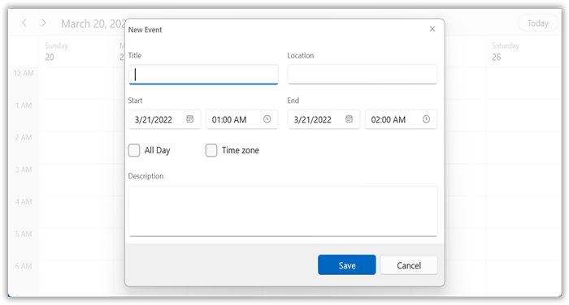
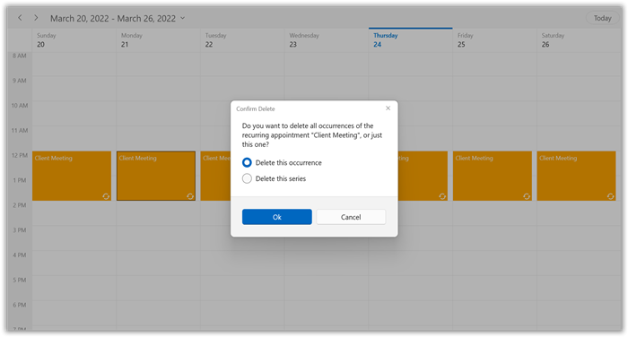

# Appointment Editing in WinUI Scheduler (SfScheduler)

This section explains how to handle appointment editing in WinUI scheduler and also explains about the appointment resizing.

## Creating appointments

The Scheduler supports adding new appointment by using [Appointment Editor](https://help.syncfusion.com/cr/winui/Syncfusion.UI.Xaml.Scheduler.SchedulerAppointmentEditorView.html) UI dialog. Open this editor dialog by double-clicking on a time cell or month cell or view header.

N>
* If `AllowViewNavigation` is true, the current view should be navigated to the respective day or timeline day views by single-clicking on the date in view header. Other than date by double-clicking on view header cell, the appointment editor window will be opened and by default the `AllDay` checkbox will be checked in the appointment editor window.
* All day appointment can be created by double-clicking on view header and not applicable for month view header.

## Editing appointment

The Scheduler supports editing the existing appointments by using the [Appointment Editor](https://help.syncfusion.com/cr/winui/Syncfusion.UI.Xaml.Scheduler.SchedulerAppointmentEditorView.html) UI dialog. Open this dialog by double-clicking on the appointment.

The appointments in the appointment editor dialog can be edited. These changes will be saved back in the appointment and mapped data object when using data binding.

### Edit recurring appointment

The Scheduler supports editing the recurrence appointment. The following editor dialog will appear while editing the recurrence appointment to select whether to edit only the particular occurrence or recurrence series.

The opening of recurrence popup editor dialog can be handled using [RecurringAppointmentEditMode](https://help.syncfusion.com/cr/winui/Syncfusion.UI.Xaml.Scheduler.RecurringAppointmentEditMode.html) property in [AppointmentEditorOpeningEventArgs](https://help.syncfusion.com/cr/winui/Syncfusion.UI.Xaml.Scheduler.AppointmentEditorOpeningEventArgs.html) by handling [AppointmentEditorOpening](https://help.syncfusion.com/cr/winui/Syncfusion.UI.Xaml.Scheduler.SfScheduler.html#Syncfusion_UI_Xaml_Scheduler_SfScheduler_AppointmentEditorOpening) event.

### AppointmentEditorOpening event

While opening the appointment editor UI dialog to add or update appointment, the Scheduler notifies the [AppointmentEditorOpening](https://help.syncfusion.com/cr/winui/Syncfusion.UI.Xaml.Scheduler.SfScheduler.html#Syncfusion_UI_Xaml_Scheduler_SfScheduler_AppointmentEditorOpening) event.

The [AppointmentEditorOpeningEventArgs](https://help.syncfusion.com/cr/winui/Syncfusion.UI.Xaml.Scheduler.AppointmentEditorOpeningEventArgs.html) has following members which provides the information for the [AppointmentEditorOpening](https://help.syncfusion.com/cr/winui/Syncfusion.UI.Xaml.Scheduler.SfScheduler.html#Syncfusion_UI_Xaml_Scheduler_SfScheduler_AppointmentEditorOpening) event.

[Appointment](https://help.syncfusion.com/cr/winui/Syncfusion.UI.Xaml.Scheduler.AppointmentEditorOpeningEventArgs.html#Syncfusion_UI_Xaml_Scheduler_AppointmentEditorOpeningEventArgs_Appointment): Gets the selected appointment details which are being updated. It will be null when adding a new appointment using the appointment editor.

[DateTime](https://help.syncfusion.com/cr/winui/Syncfusion.UI.Xaml.Scheduler.AppointmentEditorOpeningEventArgs.html#Syncfusion_UI_Xaml_Scheduler_AppointmentEditorOpeningEventArgs_DateTime): Get the DateTime of time slot or month cell where the user double clicked.

[AppointmentEditorOptions](https://help.syncfusion.com/cr/winui/Syncfusion.UI.Xaml.Scheduler.AppointmentEditorOptions.html): Specifies to show the editors for the `ScheduleAppointment` details in `SchedulerAppointmentEditorView` while double clicking the scheduler.

`Cancel`: To avoid the default appointment editor showing, by enabling this property.

[RecurrenceEditMode](https://help.syncfusion.com/cr/winui/Syncfusion.UI.Xaml.Scheduler.AppointmentEditorOpeningEventArgs.html#Syncfusion_UI_Xaml_Scheduler_AppointmentEditorOpeningEventArgs_RecurrenceEditMode): Get or Sets the edit mode to perform the edit option to edit the occurrence or series for recurrence appointment. The default value of `RecurrenceEditMode` is `User.`

* User: The default editor content dialog will appear when editing a recurrence appointment to select the edit option from the end-user itself.
* Occurrence: Edit the particular occurrence alone in a recurrence appointment. The default editor content dialog will not appear.
* Series: Edit the entire series in a recurrence appointment. The default editor content dialog will not appear.

For example, to use a custom appointment editor dialog instead of a default appointment editor content dialog, you can handle the `AppointmentEditorOpening` event.



this.Schedule.AppointmentEditorOpening += Schedule_AppointmentEditorOpening;

private void Schedule_AppointmentEditorOpening(object sender, AppointmentEditorOpeningEventArgs e)
{
    //To handle the default appointment editor content dialog by setting the e.Cancel value to true.
    e.Cancel = true;

    if (e.Appointment != null)
    {
        //Display the custom appointment editor content dialog to edit the appointment.
    }
    else
    {
        //Display the custom appointment editor content dialog to add new appointment.
    }
}



* [Resource](https://help.syncfusion.com/cr/winui/Syncfusion.UI.Xaml.Scheduler.AppointmentEditorOpeningEventArgs.html#Syncfusion_UI_Xaml_Scheduler_AppointmentEditorOpeningEventArgs_Resource): Gets the resource of an appointment under which the appointment is located.

## Visible/Collapse the built-in editors in appointment editor dialog

Programmatically visible or collapse the editors by setting the [AppointmentEditorOptions](https://help.syncfusion.com/cr/winui/Syncfusion.UI.Xaml.Scheduler.AppointmentEditorOptions.html) property in `SchedulerAppointmentEditorView.` By default, the value of `AppointmentEditorOptions` is set to [AppointmentEditorOptions.All](https://help.syncfusion.com/cr/winui/Syncfusion.UI.Xaml.Scheduler.AppointmentEditorOptions.html#Syncfusion_UI_Xaml_Scheduler_AppointmentEditorOptions_All) in the `SchedulerAppointmentEditorView` that displays all the appointment editors. The following code shows how to collapse the [Recurrence](https://help.syncfusion.com/cr/winui/Syncfusion.UI.Xaml.Scheduler.AppointmentEditorOptions.html#Syncfusion_UI_Xaml_Scheduler_AppointmentEditorOptions_Recurrence) editor by handling the [AppointmentEditorOptions](https://help.syncfusion.com/cr/winui/Syncfusion.UI.Xaml.Scheduler.AppointmentEditorOptions.html) event.



this.Schedule.AppointmentEditorOpening += Schedule_AppointmentEditorOpening;

private void Schedule_AppointmentEditorOpening(object sender, AppointmentEditorOpeningEventArgs e)
{
    e.AppointmentEditorOptions = AppointmentEditorOptions.All | (~AppointmentEditorOptions.Background & ~AppointmentEditorOptions.Foreground & ~AppointmentEditorOptions.Reminder & ~AppointmentEditorOptions.Resource);
}



N>
* The basic editors such as `Subject`, `Location`, `Start`, and `End` of the scheduler appointment editor cannot be collapsed.

### AppointmentEditorClosing event

While closing the appointment editor content dialog after adding or editing the schedule appointment, the Scheduler notifies the [AppointmentEditorClosing](https://help.syncfusion.com/cr/winui/Syncfusion.UI.Xaml.Scheduler.SfScheduler.html#Syncfusion_UI_Xaml_Scheduler_SfScheduler_AppointmentEditorClosing) event.

The [AppointmentEditorClosingEventArgs](https://help.syncfusion.com/cr/winui/Syncfusion.UI.Xaml.Scheduler.AppointmentEditorClosingEventArgs.html) has the following members who provides the information for the [AppointmentEditorClosing](https://help.syncfusion.com/cr/winui/Syncfusion.UI.Xaml.Scheduler.SfScheduler.html#Syncfusion_UI_Xaml_Scheduler_SfScheduler_AppointmentEditorClosing) event.

[Handled](https://help.syncfusion.com/cr/winui/Syncfusion.UI.Xaml.Scheduler.AppointmentEditorClosingEventArgs.html#Syncfusion_UI_Xaml_Scheduler_AppointmentEditorClosingEventArgs_Handled): Gets or sets a value that indicates whether the scheduler can update the underlying appointments collection or appointment based on the action performed in the appointment editor. If the value is true, the scheduler does not perform the action and we have to write the code in the handler and perform the action. The default value of Handled is `false.`

[Appointment](https://help.syncfusion.com/cr/winui/Syncfusion.UI.Xaml.Scheduler.AppointmentEditorClosingEventArgs.html#Syncfusion_UI_Xaml_Scheduler_AppointmentEditorClosingEventArgs_Appointment): Gets the details of updated or newly added appointment.

`Cancel`: To avoid the default appointment editor closing by enabling this property.

[Action](https://help.syncfusion.com/cr/winui/Syncfusion.UI.Xaml.Scheduler.AppointmentEditorClosingEventArgs.html#Syncfusion_UI_Xaml_Scheduler_AppointmentEditorClosingEventArgs_Action): Gets the action of appointment which is Add, Edit, Delete or Cancel.

* Add: Specifies that appointment is newly added using the appointment editor.
* Edit: Specifies that appointment is edited using the appointment editor.
* Delete: Specifies that appointment is deleted using the appointment editor.
* Cancel: Specifies that appointment editing is canceled using the appointment editor.

For example, to handle the appointment adding for today’s date, the user can handle the `AppointmentEditorClosing` event.



this.Schedule.AppointmentEditorClosing += Schedule_AppointmentEditorClosing;

private void Schedule_AppointmentEditorClosing(object sender, AppointmentEditorClosingEventArgs e)
{
    var appointment = e.Appointment as ScheduleAppointment;
    if (appointment != null)
    {
        if (appointment.StartTime.Day == DateTime.Now.Day)
            e.Handled = true;
    }
}



* [Resource](https://help.syncfusion.com/cr/winui/Syncfusion.UI.Xaml.Scheduler.AppointmentEditorClosingEventArgs.html#Syncfusion_UI_Xaml_Scheduler_AppointmentEditorClosingEventArgs_Resources): Gets the resource collection of edited appointment.

## Disable appointment editing

To disable appointment editing functionality, Set the [AppointmentEditFlag](https://help.syncfusion.com/cr/winui/Syncfusion.UI.Xaml.Scheduler.AppointmentEditFlag.html) property to `None.` In this case, the add, edit, resize and drag & drop the appointments cannot be performed.



<scheduler:SfScheduler x:Name="Schedule"  
                       ViewType="Week"
                       AppointmentEditFlag="None">
</scheduler:SfScheduler> 



## Delete appointments

The Scheduler supports two ways to remove the selected appointment.

1. Pressing the <kbd>delete</kbd> key.
2. Using the appointment editor dialog.

### Delete recurring appointment

The Scheduler supports deleting the recurrence appointment. The following editor dialog will appear when user deletes the recurrence appointment. Select the delete option to make the changes for occurrence or appointment series.

### AppointmentDeleting event

The Scheduler notifies the [AppointmentDeleting](https://help.syncfusion.com/cr/winui/Syncfusion.UI.Xaml.Scheduler.SfScheduler.html#Syncfusion_UI_Xaml_Scheduler_SfScheduler_AppointmentDeleting) event, when user deletes the appointment.

The [AppointmentDeletingEventArgs](https://help.syncfusion.com/cr/winui/Syncfusion.UI.Xaml.Scheduler.AppointmentDeletingEventArgs.html) has the following members who provides information for the `AppointmentDeleting` event.

[Appointment](https://help.syncfusion.com/cr/winui/Syncfusion.UI.Xaml.Scheduler.AppointmentDeletingEventArgs.html#Syncfusion_UI_Xaml_Scheduler_AppointmentDeletingEventArgs_Appointment): Gets the selected appointment to delete.

`Cancel`: To avoid appointment deleting by enabling this property.

[RecurrenceEditMode](https://help.syncfusion.com/cr/winui/Syncfusion.UI.Xaml.Scheduler.AppointmentDeletingEventArgs.html#Syncfusion_UI_Xaml_Scheduler_AppointmentDeletingEventArgs_RecurrenceEditMode): Gets or sets whether to delete series or occurrence when deleting a recurrence appointment. The default value of `RecurrenceEditMode` is set to `User`

* User: The default editor dialog will appear when deleting a recurrence appointment to select the edit option from the end-user itself.
* Occurrence: Delete the particular occurrence alone in a recurrence appointment. The default editor dialog will not appear.
* Series: Delete the entire series in a recurrence appointment. The default editor dialog will not appear.



this.Schedule.AppointmentDeleting += Schedule_AppointmentDeleting;

private void Schedule_AppointmentDeleting(object sender, AppointmentDeletingEventArgs e)
{
    //To notify when restrict appointment delete.
    e.Cancel = true;
}



## Appointment resizing

The Scheduler has support to resize the selected appointment. This support is available for all views except  the `Month` view.

N>  Due to WinUI [framework issue](https://github.com/microsoft/microsoft-ui-xaml/issues/2715), this feature isn't included in WinUI desktop applications and this is applicable only for WinUI UWP applications.

### Disable appointment resize

The Scheduler supports disabling the appointment resizing by setting the [AppointmentEditFlag](https://help.syncfusion.com/cr/winui/Syncfusion.UI.Xaml.Scheduler.AppointmentEditFlag.html) property except [Resize](https://help.syncfusion.com/cr/winui/Syncfusion.UI.Xaml.Scheduler.AppointmentEditFlag.html#Syncfusion_UI_Xaml_Scheduler_AppointmentEditFlag_Resize). In this case, the appointment resizing cannot be performed.



<scheduler:SfScheduler x:Name="Schedule"  
                       ViewType="Week"
                       AppointmentEditFlag="Add,DragDrop,Edit">
</scheduler:SfScheduler>


this.Schedule.AppointmentEditFlag = AppointmentEditFlag.Add | AppointmentEditFlag.DragDrop | AppointmentEditFlag.Edit;



### AppointmentResizing event

The Scheduler notifies the `AppointmentResizing` event, when the user resize an appointment.

The [AppointmentResizingEventArgs](https://help.syncfusion.com/cr/winui/Syncfusion.UI.Xaml.Scheduler.AppointmentResizingEventArgs.html) has the following members who provides information for [AppointmentResizing](https://help.syncfusion.com/cr/winui/Syncfusion.UI.Xaml.Scheduler.SfScheduler.html#Syncfusion_UI_Xaml_Scheduler_SfScheduler_AppointmentResizing) event.

[Appointment](https://help.syncfusion.com/cr/winui/Syncfusion.UI.Xaml.Scheduler.AppointmentResizingEventArgs.html#Syncfusion_UI_Xaml_Scheduler_AppointmentResizingEventArgs_Appointment): Gets the appointment being resized.

[Action](https://help.syncfusion.com/cr/winui/Syncfusion.UI.Xaml.Scheduler.AppointmentResizingEventArgs.html#Syncfusion_UI_Xaml_Scheduler_AppointmentResizingEventArgs_Action): Gets the current action being performed while resizing an appointment.

* Starting: Denotes an event that occurred when the user mouse over the appointment to resize an appointment (before showing resize cursor).
* Progressing: Denotes an event that occurred when the user resizing an appointment.
* Committing: Denotes an event that occurred when user ends the resizing by releasing pointer to commit the changed to underlying appointment.
* Canceling: Denotes the event that occurred before canceling the resize operation when user press the <kbd>Esc</kbd> key when resizing operation in progress.

[StartTime](https://help.syncfusion.com/cr/winui/Syncfusion.UI.Xaml.Scheduler.AppointmentResizingEventArgs.html#Syncfusion_UI_Xaml_Scheduler_AppointmentResizingEventArgs_StartTime): Gets the updated start time of appointment in the resizing operation.

[EndTime](https://help.syncfusion.com/cr/winui/Syncfusion.UI.Xaml.Scheduler.AppointmentResizingEventArgs.html#Syncfusion_UI_Xaml_Scheduler_AppointmentResizingEventArgs_EndTime): Gets the updated end time of appointment in the resizing operation.

[CanContinueResize](https://help.syncfusion.com/cr/winui/Syncfusion.UI.Xaml.Scheduler.AppointmentResizingEventArgs.html#Syncfusion_UI_Xaml_Scheduler_AppointmentResizingEventArgs_CanContinueResize): Gets or sets a value indicating whether the resizing operation should be continued or canceled. Set this property when Action is Starting, Progressing, Canceling.This property will not have any effect on when Action is Committing.

[CanCommit](https://help.syncfusion.com/cr/winui/Syncfusion.UI.Xaml.Scheduler.AppointmentResizingEventArgs.html#Syncfusion_UI_Xaml_Scheduler_AppointmentResizingEventArgs_CanCommit): Gets or sets a value indicating whether to update underlying appointment when resizing operation is completed. Set this property when Action is Canceling and Committing. This property will not have any effect on when Action is Starting and Progressing.



this.Schedule.AppointmentResizing += Schedule_AppointmentResizing;

private void Schedule_AppointmentResizing(object sender, AppointmentResizingEventArgs e)
{
    //To notify when resizing the appointment. 
}



* [Resource](https://help.syncfusion.com/cr/winui/Syncfusion.UI.Xaml.Scheduler.AppointmentResizingEventArgs.html#Syncfusion_UI_Xaml_Scheduler_AppointmentResizingEventArgs_Resource): Gets the resource of an appointment under which the appointment is located.