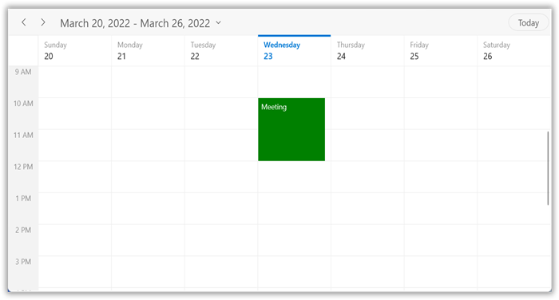
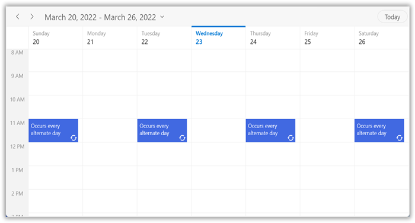
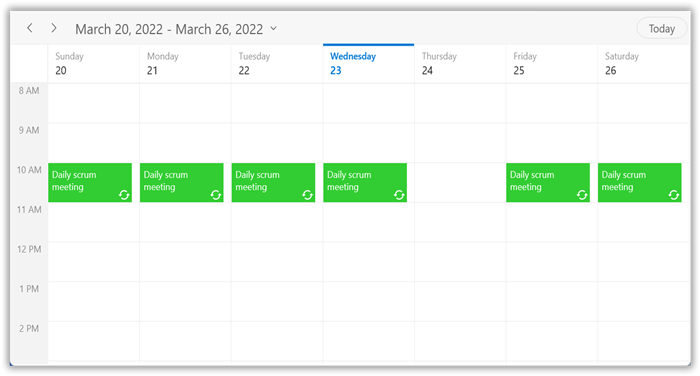
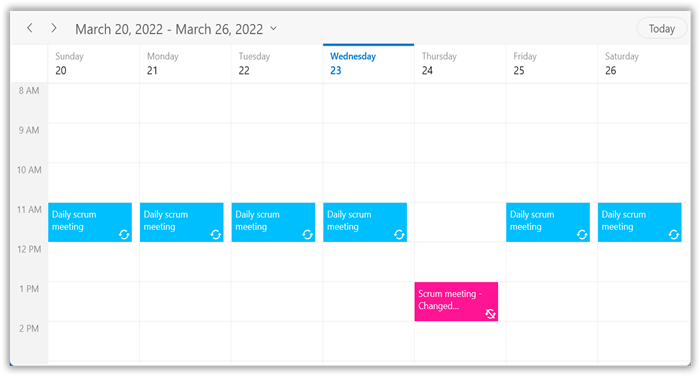
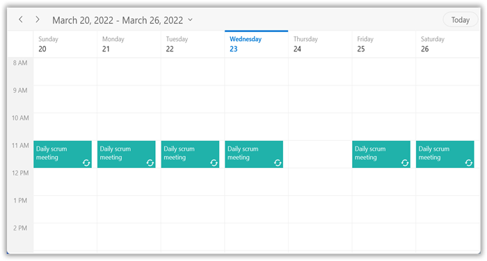

# Appointments in WinUI Scheduler (SfScheduler)

The WinUI Scheduler control has a built-in capability to handle the appointment arrangement internally based on the [ScheduleAppointmentCollection](https://help.syncfusion.com/cr/winui/Syncfusion.UI.Xaml.Scheduler.ScheduleAppointmentCollection.html). The scheduler supports rendering normal, all-day appointments, spanned appointments, recurring appointments, and recurrence exception dates appointments.
The [ScheduleAppointment](https://help.syncfusion.com/cr/winui/Syncfusion.UI.Xaml.Scheduler.ScheduleAppointment.html) is a class that includes the specific scheduled appointment. It has some basic properties such as [StartTime](https://help.syncfusion.com/cr/winui/Syncfusion.UI.Xaml.Scheduler.ScheduleAppointment.html#Syncfusion_UI_Xaml_Scheduler_ScheduleAppointment_StartTime), [EndTime](https://help.syncfusion.com/cr/winui/Syncfusion.UI.Xaml.Scheduler.ScheduleAppointment.html#Syncfusion_UI_Xaml_Scheduler_ScheduleAppointment_EndTime), [Subject](https://help.syncfusion.com/cr/winui/Syncfusion.UI.Xaml.Scheduler.ScheduleAppointment.html#Syncfusion_UI_Xaml_Scheduler_ScheduleAppointment_Subject), and some additional information about the appointment can be added with [Notes](https://help.syncfusion.com/cr/winui/Syncfusion.UI.Xaml.Scheduler.ScheduleAppointment.html#Syncfusion_UI_Xaml_Scheduler_ScheduleAppointment_Notes), [Location](https://help.syncfusion.com/cr/winui/Syncfusion.UI.Xaml.Scheduler.ScheduleAppointment.html#Syncfusion_UI_Xaml_Scheduler_ScheduleAppointment_Location), and [IsAllDay](https://help.syncfusion.com/cr/winui/Syncfusion.UI.Xaml.Scheduler.ScheduleAppointment.html#Syncfusion_UI_Xaml_Scheduler_ScheduleAppointment_IsAllDay) properties.



<scheduler:SfScheduler x:Name="Schedule" ViewType="Week" >
</scheduler:SfScheduler>


// Creating an instance for the schedule appointment collection.
var scheduleAppointmentCollection = new ScheduleAppointmentCollection();
//Adding the schedule appointment in the schedule appointment collection.
scheduleAppointmentCollection.Add(new ScheduleAppointment
{
    StartTime = DateTime.Now.Date.AddHours(10),
    EndTime = DateTime.Now.Date.AddHours(12),
    Subject = "Client Meeting"
});

//Adding the schedule appointment collection to the ItemSource of SfScheduler.
Schedule.ItemsSource = scheduleAppointmentCollection;



N> 
* The Scheduler supports functionality to arrange appointments according to their start time and duration for normal appointments in a day, week, and workweek views.
*  In Timeline views, all the appointments (span, all day, and normal) are ordered and rendered based on the start date-time of appointment, followed by the time duration of the appointment, `IsSpanned,` `IsAllDay,` and normal appointments.

N> [View sample in GitHub](https://github.com/SyncfusionExamples/WinUI-Scheduler-Examples/tree/main/ScheduleAppointment)

## Scheduler item source and Mapping

The WinUI Scheduler supports to bind any collection that implements the `IEnumerable` interface to populate appointments. Map the properties in the business object to [ScheduleAppointment](https://help.syncfusion.com/cr/winui/Syncfusion.UI.Xaml.Scheduler.ScheduleAppointment.html) by configuring the [AppointmentMapping](https://help.syncfusion.com/cr/winui/Syncfusion.UI.Xaml.Scheduler.AppointmentMapping.html) property. The following table shows that property mapping property details to `ScheduleAppointment.`

<table>
<tr><th>Property Name</th><th>Description</th></tr>
<tr><td>{{'[StartTime](https://help.syncfusion.com/cr/winui/Syncfusion.UI.Xaml.Scheduler.ScheduleAppointment.html#Syncfusion_UI_Xaml_Scheduler_ScheduleAppointment_StartTime)'| markdownify }}</td>
<td>Maps the property name of a business object class, which is equivalent to the StartTime of ScheduleAppointment.</td></tr>
<tr><td>{{'[EndTime](https://help.syncfusion.com/cr/winui/Syncfusion.UI.Xaml.Scheduler.ScheduleAppointment.html#Syncfusion_UI_Xaml_Scheduler_ScheduleAppointment_EndTime)'| markdownify }}</td>
<td>Maps the property name of a business object class, which is equivalent to the EndTime of ScheduleAppointment.</td></tr>
<tr><td>{{'[StartTimeZone](https://help.syncfusion.com/cr/winui/Syncfusion.UI.Xaml.Scheduler.ScheduleAppointment.html#Syncfusion_UI_Xaml_Scheduler_ScheduleAppointment_StartTimeZone)'| markdownify }}</td>
<td>Maps the property name of a business object class, which is equivalent to the StartTimeZone of ScheduleAppointment.</td></tr>
<tr><td>{{'[EndTimeZone](https://help.syncfusion.com/cr/winui/Syncfusion.UI.Xaml.Scheduler.ScheduleAppointment.html#Syncfusion_UI_Xaml_Scheduler_ScheduleAppointment_EndTimeZone)'| markdownify }}</td>
<td>Maps the property name of a business object class, which is equivalent to the EndTimeZone of ScheduleAppointment.</td></tr>
<tr><td>{{'[Subject](https://help.syncfusion.com/cr/winui/Syncfusion.UI.Xaml.Scheduler.ScheduleAppointment.html#Syncfusion_UI_Xaml_Scheduler_ScheduleAppointment_Subject)'| markdownify }}</td>
<td>Maps the property name of a business object class, which is equivalent to the Subject of ScheduleAppointment.</td></tr>
<tr><td>{{'[Id](https://help.syncfusion.com/cr/winui/Syncfusion.UI.Xaml.Scheduler.ScheduleAppointment.html#Syncfusion_UI_Xaml_Scheduler_ScheduleAppointment_Id)'| markdownify }}</td>
<td>Maps the property name of a business object class, which is equivalent to the Id of ScheduleAppointment.</td></tr>
<tr><td>{{'[AppointmentBackground](https://help.syncfusion.com/cr/winui/Syncfusion.UI.Xaml.Scheduler.ScheduleAppointment.html#Syncfusion_UI_Xaml_Scheduler_ScheduleAppointment_AppointmentBackground)'| markdownify }}</td>
<td>Maps the property name of a business object class, which is equivalent to the AppointmentBackground of ScheduleAppointment.</td></tr>
<tr><td>{{'[Foreground](https://help.syncfusion.com/cr/winui/Syncfusion.UI.Xaml.Scheduler.ScheduleAppointment.html#Syncfusion_UI_Xaml_Scheduler_ScheduleAppointment_Foreground)'| markdownify }}</td>
<td>Maps the property name of a business object class, which is equivalent to the  Foreground of ScheduleAppointment.</td></tr>
<tr><td>{{'[IsAllDay](https://help.syncfusion.com/cr/winui/Syncfusion.UI.Xaml.Scheduler.ScheduleAppointment.html#Syncfusion_UI_Xaml_Scheduler_ScheduleAppointment_IsAllDay)'| markdownify }}</td>
<td>Maps the property name of a business object class, which is equivalent to the IsAllDay of ScheduleAppointment.</td></tr>
<tr><td>{{'[RecurrenceRule](https://help.syncfusion.com/cr/winui/Syncfusion.UI.Xaml.Scheduler.ScheduleAppointment.html#Syncfusion_UI_Xaml_Scheduler_ScheduleAppointment_RecurrenceRule)'| markdownify }}</td>
<td>Maps the property name of a business object class, which is equivalent to the RecurrenceRule of ScheduleAppointment.</td></tr>
<tr><td>{{'[RecurrenceId](https://help.syncfusion.com/cr/winui/Syncfusion.UI.Xaml.Scheduler.ScheduleAppointment.html#Syncfusion_UI_Xaml_Scheduler_ScheduleAppointment_RecurrenceId)'| markdownify }}</td>
<td>Maps the property name of a business object class, which is equivalent to the RecurrenceId of ScheduleAppointment.</td></tr>
<tr><td>{{'[Notes](https://help.syncfusion.com/cr/winui/Syncfusion.UI.Xaml.Scheduler.ScheduleAppointment.html#Syncfusion_UI_Xaml_Scheduler_ScheduleAppointment_Notes)'| markdownify }}</td>
<td>Maps the property name of a business object class, which is equivalent to the Notes of ScheduleAppointment.</td></tr>
<tr><td>{{'[Location](https://help.syncfusion.com/cr/winui/Syncfusion.UI.Xaml.Scheduler.ScheduleAppointment.html#Syncfusion_UI_Xaml_Scheduler_ScheduleAppointment_Location)'| markdownify }}</td>
<td>Maps the property name of a business object class, which is equivalent to the Location of ScheduleAppointment.</td></tr>
<tr><td>{{'[RecurrenceExceptionDates](https://help.syncfusion.com/cr/winui/Syncfusion.UI.Xaml.Scheduler.ScheduleAppointment.html#Syncfusion_UI_Xaml_Scheduler_ScheduleAppointment_RecurrenceExceptionDates)'| markdownify }}</td>
<td>Maps the property name of a business object class, which is equivalent to the RecurrenceExceptionDates of ScheduleAppointment.</td></tr>
<tr><td>{{'[ResourceIdCollection](https://help.syncfusion.com/cr/winui/Syncfusion.UI.Xaml.Scheduler.ScheduleAppointment.html#Syncfusion_UI_Xaml_Scheduler_ScheduleAppointment_ResourceIdCollection)'| markdownify }}</td>
<td>Maps the property name of a business object class, which is equivalent to the ResourceIdCollection of ScheduleAppointment.</td></tr>
</table>

N> The business object class should contain event start and end DateTime fields as mandatory.

## Creating business objects
Create a business object class `Meeting` with mandatory fields `From,` `To,` and `EventName.`



/// 
   
/// Represents the business object data properties.   
/// 
 
public class Meeting
{
	public string EventName { get; set; }
	public DateTime From { get; set; }
	public DateTime To { get; set; }
    public Brush BackgroundColor { get; set; }
    public Brush ForegroundColor { get; set; }
}



Map those properties of the `Meeting` class to schedule appointment by using the `AppointmentMapping` properties.



<scheduler:SfScheduler x:Name="Schedule" ViewType="Week">
    <scheduler:SfScheduler.AppointmentMapping>
        <scheduler:AppointmentMapping
            Subject="EventName"
            StartTime="From"
            EndTime="To"
            AppointmentBackground="BackgroundColor"
            Foreground="ForegroundColor"/>
    </scheduler:SfScheduler.AppointmentMapping>
</scheduler:SfScheduler>


//Schedule data mapping for business objects.
AppointmentMapping dataMapping = new AppointmentMapping();
dataMapping.Subject = "EventName";
dataMapping.StartTime = "From";
dataMapping.EndTime = "To";
dataMapping.AppointmentBackground = "BackgroundColor";
dataMapping.Foreground = "ForegroundColor";
Schedule.AppointmentMapping = dataMapping;



Schedule meetings for a day by setting the `From` and `To` of `Meeting` class. Create meetings of type `ObservableCollection<Meeting>` and assign those appointments collection `Meetings` to the [ItemsSource](https://help.syncfusion.com/cr/winui/Syncfusion.UI.Xaml.Scheduler.SfScheduler.html#Syncfusion_UI_Xaml_Scheduler_SfScheduler_ItemsSource) property which is of `IEnumerable` type.



//Creating an instance for the business object class.
Meeting meeting = new Meeting();
//Setting the start time of an event.
meeting.From = new DateTime(2021, 03, 23, 10, 0, 0);
//Setting the end time of an event.
meeting.To = meeting.From.AddHours(2);
//Setting the subject for an event.
meeting.EventName = "Meeting";
//Setting the background color for an event.
meeting.BackgroundColor = new SolidColorBrush(Colors.Green);
//Setting the foreground color for an event.
meeting.ForegroundColor = new SolidColorBrush(Colors.White);
//Creating an instance for the collection of business objects.
var Meetings = new ObservableCollection<Meeting>();
//Adding a business object to the business object Collection.
Meetings.Add(meeting);
//Adding business object in the ItemsSource of SfScheduler.
Schedule.ItemsSource = Meetings;



N> [View sample in GitHub](https://github.com/SyncfusionExamples/WinUI-Scheduler-Examples/tree/main/BusinessObject)

## Spanned appointments

Spanned Appointment is an appointment that lasts more than 24 hours. It does not block out time slots in the WinUI Scheduler, it will render in [AllDayAppointmentPanel](https://help.syncfusion.com/cr/winui/Syncfusion.UI.Xaml.Scheduler.AllDayAppointmentPanel.html) exclusively.



<scheduler:SfScheduler x:Name="Schedule" ViewType="Week">
    <scheduler:SfScheduler.AppointmentMapping>
        <scheduler:AppointmentMapping
            Subject="EventName"
            StartTime="From"
            EndTime="To"
            AppointmentBackground="BackgroundColor"
            Foreground="ForegroundColor"/>
    </scheduler:SfScheduler.AppointmentMapping>
</scheduler:SfScheduler>


// Creating an instance for the collection of business objects.
var Meetings = new ObservableCollection<Meeting>();
// Creating an instance for the business object class.
Meeting meeting = new Meeting();
// Setting the start time of an event.
meeting.From = new DateTime(2021, 03, 23, 10, 0, 0);
// Setting the end time of an event.
meeting.To = meeting.From.AddDays(2).AddHours(1);
// Setting the subject for an event.
meeting.EventName = "Meeting";
// Setting the background color for an event.
meeting.BackgroundColor = new SolidColorBrush(Colors.MediumPurple);
// Setting the foreground color for an event.
meeting.ForegroundColor = new SolidColorBrush(Colors.White);
// Adding a business object in the business object collection.
Meetings.Add(meeting);
//Adding schedule appointment collection to the ItemsSource of SfSchedule.
Schedule.ItemsSource = Meetings;



## All day appointments

The all-Day appointment is an appointment that is scheduled for a whole day. It can be set by using the [IsAllDay](https://help.syncfusion.com/cr/winui/Syncfusion.UI.Xaml.Scheduler.ScheduleAppointment.html#Syncfusion_UI_Xaml_Scheduler_ScheduleAppointment_IsAllDay) property in the [ScheduleAppointment](https://help.syncfusion.com/cr/winui/Syncfusion.UI.Xaml.Scheduler.ScheduleAppointment.html).



<scheduler:SfScheduler x:Name="Schedule" 
                       ViewType="Week" >
</scheduler:SfScheduler>


// Creating an instance for the schedule appointment collection.
var scheduleAppointmentCollection = new ScheduleAppointmentCollection();
//Adding schedule appointment in the schedule appointment collection. 
scheduleAppointmentCollection.Add(new ScheduleAppointment()
{
    StartTime = new DateTime(2021, 03, 23, 10, 0, 0),
    EndTime = new DateTime(2021, 03, 23, 12, 0, 0),
    Subject = "Client Meeting",
    Location = "Hutchison road",
    AppointmentBackground = new SolidColorBrush(Colors.AliceBlue),
    Foreground = new SolidColorBrush(Colors.White),
    IsAllDay = true,
});
//Adding the schedule appointment collection to the ItemsSource of SfScheduler.
Schedule.ItemsSource = scheduleAppointmentCollection;



N> Appointment that lasts for an entire day (exact 24 hours) will be considered as an all-day appointment without setting the [IsAllDay](https://help.syncfusion.com/cr/winui/Syncfusion.UI.Xaml.Scheduler.ScheduleAppointment.html#Syncfusion_UI_Xaml_Scheduler_ScheduleAppointment_IsAllDay) property. For example: From 06/29/2020 12:00AM to 06/30/2020 12:00AM.

## Recurrence appointment

The recurring appointment on a daily, weekly, monthly, or yearly interval. Recurring appointments can be created by setting the [RecurrenceRule](https://help.syncfusion.com/cr/winui/Syncfusion.UI.Xaml.Scheduler.ScheduleAppointment.html#Syncfusion_UI_Xaml_Scheduler_ScheduleAppointment_RecurrenceRule) property in [ScheduleAppointment](https://help.syncfusion.com/cr/winui/Syncfusion.UI.Xaml.Scheduler.ScheduleAppointment.html).

### Recurrence rule

The `RecurrenceRule` is a string value (RRULE) that contains the details of the recurrence appointments such as repeat type, daily, weekly, monthly, or yearly. And also contains details about how many times it needs to be repeated, the interval duration, the time period to render the appointment and more. The [RecurrenceRule](https://help.syncfusion.com/cr/winui/Syncfusion.UI.Xaml.Scheduler.ScheduleAppointment.html#Syncfusion_UI_Xaml_Scheduler_ScheduleAppointment_RecurrenceRule) has the following properties and based on this property value, the recurrence appointments are rendered in the SfScheduler with its respective time period.

<table>
<tr><th>PropertyName</th>
<th>Purpose</th></tr>
<tr><td>FREQ</td>
<td>Maintains the Repeat type value of the appointment. (Example: Daily, Weekly, Monthly, Yearly, Every week day) Example:FREQ=DAILY;INTERVAL=1</td></tr>
<tr><td>INTERVAL</td>
<td>Maintains the interval value of the appointments. For example, while creating the daily appointment at an interval of 2, the appointments are rendered on the days Monday, Wednesday, and Friday. (creates the appointment on all days by leaving the interval of one day gap) Example:FREQ=DAILY;INTERVAL=1</td></tr>
<tr><td>COUNT</td>
<td>It holds the appointment’s count value. For example, when the recurrence appointment count value is 10, it means 10 appointments are created in the recurrence series. Example: FREQ=DAILY;INTERVAL=1;COUNT=10</td></tr>
<tr><td>UNTIL</td>
<td>This property is used to store the recurrence end date value. For example, while setting the end date of appointment as 6/30/2020, the UNTIL property holds the end date value when the recurrence actually ends. Example:FREQ=DAILY;INTERVAL=1;UNTIL=20200725</td></tr>
<tr><td>BYDAY</td>
<td>It holds the “DAY” values of an appointment to render. For example, create the weekly appointment, select the day(s) from the day options (Monday/Tuesday/Wednesday/Thursday/Friday/Saturday/Sunday). When Monday is selected, the first two letters of the selected day “MO” is stored in the “BYDAY” property. While selecting the multiple days, the values are separated by commas. Example:FREQ=WEEKLY;INTERVAL=1;BYDAY=MO,WE;COUNT=10</td></tr>
<tr><td>BYMONTHDAY</td>
<td>This property is used to store the date value of the Month while creating the Month recurrence appointment. For example, while creating a Monthly recurrence appointment in the date 3, it means the BYMONTHDAY holds the value 3 and creates the appointment on 3rd day of every month. Example:FREQ=MONTHLY;BYMONTHDAY=3;INTERVAL=1;COUNT=10</td></tr>
<tr><td>BYMONTH</td>
<td>This property is used to store the index value of the selected Month while creating the yearly appointments. For example, while creating the yearly appointment in the Month June, it means the index value for June month is 6 and it is stored in the BYMONTH field. The appointment is created on every 6th month of a year. Example:FREQ=YEARLY;BYMONTHDAY=16;BYMONTH=6;INTERVAL=1;COUNT=10</td></tr>
<tr><td>BYSETPOS</td>
<td>This property is used to store the index value of the week. For example, while creating the monthly appointment in second week of the month, the index value of the second week (2) is stored in BYSETPOS. Example:FREQ=MONTHLY;BYDAY=MO;BYSETPOS=2;UNTIL=20200725</td></tr>
</table>

### Adding recurrence appointment

The WinUI Scheduler appointment recurrenceRule is used to populate the required recurring appointment collection in a specific pattern. The RRULE can be directly set to the [RecurrenceRule](https://help.syncfusion.com/cr/winui/Syncfusion.UI.Xaml.Scheduler.ScheduleAppointment.html#Syncfusion_UI_Xaml_Scheduler_ScheduleAppointment_RecurrenceRule) property of [ScheduleAppointment](https://help.syncfusion.com/cr/winui/Syncfusion.UI.Xaml.Scheduler.ScheduleAppointment.html).



<scheduler:SfScheduler x:Name="Schedule" 
                        ViewType="Week">
</scheduler:SfScheduler>


// Creating an instance for schedule appointment collection.
var scheduleAppointmentCollection = new ScheduleAppointmentCollection();
//Adding schedule appointment in the schedule appointment collection. 
var scheduleAppointment = new ScheduleAppointment()
{
    Id = 1,
    StartTime = new DateTime(2021, 03, 28, 11, 0, 0),
    EndTime = new DateTime(2021, 03, 28, 12, 0, 0),
    Subject = "Occurs every alternate day",
    AppointmentBackground = new SolidColorBrush(Colors.RoyalBlue),
    Foreground = new SolidColorBrush(Colors.White),
};
//Creating a recurrence rule
scheduleAppointment.RecurrenceRule = "FREQ=DAILY;INTERVAL=2;COUNT=10";
//Adding the schedule appointment to the schedule appointment collection.
scheduleAppointmentCollection.Add(scheduleAppointment);
//Adding the schedule appointment collection to the ItemsSource of SfScheduler.
Schedule.ItemsSource = scheduleAppointmentCollection;



N> [View sample in GitHub](https://github.com/SyncfusionExamples/WinUI-Scheduler-Examples/tree/main/RecurringAppointment/ScheduleAppointment)

### Creating the business object recurrence appointment

For creating the business object recurrence appointment, create a business object class Meeting with mandatory fields `from,` `to,` and `recurrenceRule.`



/// 
   
/// Represents the business object data properties.   
/// 
 
public class Meeting
{
	public string EventName { get; set; }
	public DateTime From { get; set; }
	public DateTime To { get; set; }
    public Brush BackgroundColor { get; set; }
    public Brush ForegroundColor { get; set; }
    public string RecurrenceRule { get; set; }
    public object Id {get; set;}
}



 Map those properties of the `Meeting` class to schedule appointments by using the `AppointmentMapping` properties.



<scheduler:SfScheduler x:Name="Schedule" ViewType="Week">
    <scheduler:SfScheduler.AppointmentMapping>
        <scheduler:AppointmentMapping
            Subject="EventName"
            StartTime="From"
            EndTime="To"
            AppointmentBackground="BackgroundColor"
            Foreground="ForegroundColor"
            Id="Id"
            RecurrenceRule="RecurrenceRule"/>
    </scheduler:SfScheduler.AppointmentMapping>
</scheduler:SfScheduler>


//Schedule data mapping for business objects.
AppointmentMapping dataMapping = new AppointmentMapping();
dataMapping.Subject = "EventName";
dataMapping.StartTime = "From";
dataMapping.EndTime = "To";
dataMapping.AppointmentBackground = "BackgroundColor";
dataMapping.Foreground = "ForegroundColor";
dataMapping.Id = "Id";
dataMapping.RecurrenceRule = "RecurrenceRule";
Schedule.AppointmentMapping = dataMapping;



Schedule the recurring meetings for daily, weekly, monthly, or yearly intervals by setting the [RecurrenceRule](https://help.syncfusion.com/cr/winui/Syncfusion.UI.Xaml.Scheduler.ScheduleAppointment.html#Syncfusion_UI_Xaml_Scheduler_ScheduleAppointment_RecurrenceRule) of `Meeting` class. Create meetings of type `ObservableCollection <Meeting>` and assign those appointments collection `Meetings` to the [ItemsSource](https://help.syncfusion.com/cr/winui/Syncfusion.UI.Xaml.Scheduler.SfScheduler.html#Syncfusion_UI_Xaml_Scheduler_SfScheduler_ItemsSource) property which is of IEnumerable type.



//Creating an instance for the business object class.
Meeting meeting = new Meeting();
//Setting the start time of an event.
meeting.From = new DateTime(2021, 03, 28, 10, 0, 0);
//Setting the end time of an event.
meeting.To = meeting.From.AddHours(2);
//Setting the subject for an event.
meeting.EventName = "Meeting";
//Setting the background color for an event.
meeting.BackgroundColor = new SolidColorBrush(Colors.Green);
//Setting the foreground color for an event.
meeting.ForegroundColor = new SolidColorBrush(Colors.White);
//Creating a recurrence rule.
meeting.RecurrenceRule = "FREQ=DAILY;INTERVAL=2;COUNT=10";
// Setting the Id of an event.
meeting.Id = 1;
var Meetings = new ObservableCollection<Meeting>();
//Adding a business object in the business object collection.
Meetings.Add(meeting);
//Adding business objects in the ItemsSource of SfScheduler.
Schedule.ItemsSource = Meetings;



N> [View sample in GitHub](https://github.com/SyncfusionExamples/WinUI-Scheduler-Examples/tree/main/RecurringAppointment/BusinessObject)

### How to get the recurrence editor field values from RRULE?

Get the Recurrence properties from the [RRULE](https://help.syncfusion.com/cr/winui/Syncfusion.UI.Xaml.Scheduler.RecurrenceHelper.html#Syncfusion_UI_Xaml_Scheduler_RecurrenceHelper_CreateRRule_Syncfusion_UI_Xaml_Scheduler_RecurrenceProperties_System_DateTime_System_DateTime_) using the [RRuleParser](https://help.syncfusion.com/cr/winui/Syncfusion.UI.Xaml.Scheduler.RecurrenceHelper.html#Syncfusion_UI_Xaml_Scheduler_RecurrenceHelper_RRuleParser_System_String_System_DateTime_) method of SfScheduler.



DateTime dateTime = new DateTime(2021, 3, 28, 10, 0, 0);
RecurrenceProperties recurrenceProperties = RecurrenceHelper.RRuleParser("FREQ=DAILY;INTERVAL=1;COUNT=3", dateTime);



Recurrence properties retrieved from above method,
recurrenceProperties.RecurrenceType = RecurrenceType.Daily;
recurrenceProperties.Interval = 1;
recurrenceProperties.RecurrenceCount = 3;
recurrenceProperties.RecurrenceRange = RecurrenceRange.Count;

### How to get the recurrence dates from RRULE?

Get the occurrences date-time list of recurring appointment from the RRULE using the [GetRecurrenceDateTimeCollection](https://help.syncfusion.com/cr/winui/Syncfusion.UI.Xaml.Scheduler.RecurrenceHelper.html#Syncfusion_UI_Xaml_Scheduler_RecurrenceHelper_GetRecurrenceDateTimeCollection_System_String_System_DateTime_System_Nullable_System_DateTime__System_Nullable_System_DateTime__) method of SfScheduler.



DateTime dateTime = new DateTime(2021, 3, 28, 9, 0, 0);
IEnumerable<DateTime> dateCollection = RecurrenceHelper.GetRecurrenceDateTimeCollection("FREQ=DAILY;INTERVAL=1;COUNT=3", dateTime);



The following occurrence dates can be retrieved from the given RRULE:
var date0 = 28-03-2021 09:00:00;
var date1 = 29-03-2021 09:00:00;
var date2 = 30-03-2021 09:00:00;

### How to get pattern appointment for the specified occurrence?

Gets the [pattern appointment](https://help.syncfusion.com/cr/winui/Syncfusion.UI.Xaml.Scheduler.RecurrenceHelper.html#Syncfusion_UI_Xaml_Scheduler_RecurrenceHelper_GetPatternAppointment_Syncfusion_UI_Xaml_Scheduler_SfScheduler_System_Object_) for the specified occurrence.

To get the pattern appointment by using the following event and passing a parameter as Scheduler and Specified `Appointment.`



this.Schedule.AppointmentTapped += Schedule_AppointmentTapped; 

private void Schedule_AppointmentTapped(object sender, AppointmentTappedArgs e)
{
    if (e.Appointment != null)
    {
        var patternAppointment = RecurrenceHelper.GetPatternAppointment(this.Schedule, e.Appointment);
    }
}



N>
* For a business object, pass `e.Appointment.Data` as a param and get the business object details from the `Data` property of `ScheduleAppointment.`
* If a specified occurrence is changed, the [GetPatternAppointment()](https://help.syncfusion.com/cr/winui/Syncfusion.UI.Xaml.Scheduler.RecurrenceHelper.html#Syncfusion_UI_Xaml_Scheduler_RecurrenceHelper_GetPatternAppointment_Syncfusion_UI_Xaml_Scheduler_SfScheduler_System_Object_) returns the pattern appointment of exception appointment.

### How to get occurrence appointment at the specified date?

Get an [occurrence appointment](https://help.syncfusion.com/cr/winui/Syncfusion.UI.Xaml.Scheduler.RecurrenceHelper.html#Syncfusion_UI_Xaml_Scheduler_RecurrenceHelper_GetOccurrenceAppointment_Syncfusion_UI_Xaml_Scheduler_SfScheduler_System_Object_System_DateTime_) at the specified date within a series of recurring appointments.

To get a specific appointment by using the following event and passing a parameter as Scheduler, Specified `Appointment,` and specified `DateTime.`



this.Schedule.AppointmentTapped += Schedule_AppointmentTapped; 

private void Schedule_AppointmentTapped(object sender, AppointmentTappedArgs e)
{
    if (e.Appointment != null)
    {
        var occurrenceAppointment = RecurrenceHelper.GetOccurrenceAppointment(this.Schedule, e.Appointment, new DateTime(2021, 3, 30));
    }
}



N> If an occurrence at the specified date is deleted or not present, then the [GetOccurrenceAppointment()](https://help.syncfusion.com/cr/winui/Syncfusion.UI.Xaml.Scheduler.RecurrenceHelper.html#Syncfusion_UI_Xaml_Scheduler_RecurrenceHelper_GetOccurrenceAppointment_Syncfusion_UI_Xaml_Scheduler_SfScheduler_System_Object_System_DateTime_) returns null.

## Recurrence pattern exceptions

Delete or change any recurrence pattern appointment by handling exception dates and exception appointments to that recurring appointment.

### Recurrence exception dates

Delete any occurrence appointment, which is exception from the recurrence pattern appointment by adding exception dates to the recurring appointment.

### Recurrence exception appointment

Change any occurrence appointment which is exception from recurrence pattern appointment by adding the recurrence exception appointment in the WinUI Scheduler [ItemsSource](https://help.syncfusion.com/cr/winui/Syncfusion.UI.Xaml.Scheduler.SfScheduler.html#Syncfusion_UI_Xaml_Scheduler_SfScheduler_ItemsSource).

### Creating the recurrence exceptions for schedule appointment

Add the recurrence exception appointments and recurrence exception dates to `ScheduleAppointment` or remove them from the [ScheduleAppointment](https://help.syncfusion.com/cr/winui/Syncfusion.UI.Xaml.Scheduler.ScheduleAppointment.html) by using its [RecurrenceExceptionDates](https://help.syncfusion.com/cr/winui/Syncfusion.UI.Xaml.Scheduler.ScheduleAppointment.html#Syncfusion_UI_Xaml_Scheduler_ScheduleAppointment_RecurrenceExceptionDates) property.

### Delete occurrence from recurrence pattern appointment or adding exception dates to recurrence pattern appointment

Delete any of the occurrence which is an exception from recurrence pattern appointment by using the [RecurrenceExceptionDates](https://help.syncfusion.com/cr/winui/Syncfusion.UI.Xaml.Scheduler.ScheduleAppointment.html#Syncfusion_UI_Xaml_Scheduler_ScheduleAppointment_RecurrenceExceptionDates) property of [ScheduleAppointment](https://help.syncfusion.com/cr/winui/Syncfusion.UI.Xaml.Scheduler.ScheduleAppointment.html). The deleted occurrence date will be considered as recurrence exception date.



<scheduler:SfScheduler x:Name="Schedule" 
                        ViewType="Week">
</scheduler:SfScheduler>


// Creating an instance for the schedule appointment collection.
var scheduleAppointmentCollection = new ScheduleAppointmentCollection();

// Recurrence and exception appointment.
var scheduleAppointment = new ScheduleAppointment
{
    Id = 1,
    Subject = "Daily scrum meeting",
    StartTime = new DateTime(2021, 03, 28, 11, 0, 0),
    EndTime = new DateTime(2021, 03, 28, 12, 0, 0),
    AppointmentBackground = new SolidColorBrush(Colors.LimeGreen),
    Foreground = new SolidColorBrush(Colors.White),
    RecurrenceRule = "FREQ=DAILY;INTERVAL=1;COUNT=10"
};
//Adding the recurring or pattern appointment to the Schedule AppointmentCollection.
scheduleAppointmentCollection.Add(scheduleAppointment);

//Add the ExceptionDates to avoid occurrence on specific dates.
DateTime exceptionDate = scheduleAppointment.StartTime.AddDays(3).Date;
scheduleAppointment.RecurrenceExceptionDates = new ObservableCollection<DateTime>()
{
    exceptionDate,
};

//Setting AppointmentCollection as ItemSource of SfScheduler.
this.Schedule.ItemsSource = scheduleAppointmentCollection;



N> Exception dates should be Universal Time Coordinates (UTC) time zone.

N> [View sample in GitHub](https://github.com/SyncfusionExamples/WinUI-Scheduler-Examples/tree/main/RecursiveExceptionAppointment/ScheduleAppointment)

### Add exception appointment to the recurrence pattern

Also add an exception appointment which is changed or modified occurrence of the recurrence pattern appointment to the [ItemsSource](https://help.syncfusion.com/cr/winui/Syncfusion.UI.Xaml.Scheduler.SfScheduler.html#Syncfusion_UI_Xaml_Scheduler_SfScheduler_ItemsSource) of Scheduler. To add a changed occurrence, ensure to set the [RecurrenceId](https://help.syncfusion.com/cr/winui/Syncfusion.UI.Xaml.Scheduler.ScheduleAppointment.html#Syncfusion_UI_Xaml_Scheduler_ScheduleAppointment_RecurrenceId) of that occurrence and add the date of that occurrence to the [RecurrenceExceptionDates](https://help.syncfusion.com/cr/winui/Syncfusion.UI.Xaml.Scheduler.ScheduleAppointment.html#Syncfusion_UI_Xaml_Scheduler_ScheduleAppointment_RecurrenceExceptionDates) of recurrence pattern appointment. The [RecurrenceId](https://help.syncfusion.com/cr/winui/Syncfusion.UI.Xaml.Scheduler.ScheduleAppointment.html#Syncfusion_UI_Xaml_Scheduler_ScheduleAppointment_RecurrenceId) of changed occurrence should hold the exact recurrence pattern appointment [Id](https://help.syncfusion.com/cr/winui/Syncfusion.UI.Xaml.Scheduler.ScheduleAppointment.html#Syncfusion_UI_Xaml_Scheduler_ScheduleAppointment_Id).



<scheduler:SfScheduler x:Name="Schedule" 
                        ViewType="Week">
</scheduler:SfScheduler>


// Creating an instance for schedule appointment collection.
var appointmentCollection = new ScheduleAppointmentCollection();
// Recurrence and exception appointment.
var scheduleAppointment = new ScheduleAppointment
{
    Id = 1,
    Subject = "Daily scrum meeting",
    StartTime = new DateTime(2021, 3, 28, 11, 0, 0),
    EndTime = new DateTime(2021, 3, 28, 12, 0, 0),
    AppointmentBackground = new SolidColorBrush(Colors.DeepSkyBlue),
    Foreground = new SolidColorBrush(Colors.White),
    RecurrenceRule = "FREQ=DAILY;INTERVAL=1;COUNT=10"
};
//Adding the recurring or pattern appointment to the AppointmentCollection.
appointmentCollection.Add(scheduleAppointment);

//Add ExceptionDates to avoid occurrence on specific dates.
DateTime changedExceptionDate = scheduleAppointment.StartTime.AddDays(3).Date;
scheduleAppointment.RecurrenceExceptionDates = new ObservableCollection<DateTime>()
{
    changedExceptionDate,
};

//Creating an exception occurence appointment by changing the start time or end time. 
// RecurrenceId is set to 1, so it will be the changed occurence for the above-created pattern appointment. 
var exceptionAppointment = new ScheduleAppointment()
{
    Id = 2,
    Subject = "Scrum meeting - Changed Occurrence",
    StartTime = new DateTime(changedExceptionDate.Year, changedExceptionDate.Month, changedExceptionDate.Day, 13, 0, 0),
    EndTime = new DateTime(changedExceptionDate.Year, changedExceptionDate.Month, changedExceptionDate.Day, 14, 0, 0),
    AppointmentBackground = new SolidColorBrush(Colors.DeepPink),
    Foreground = new SolidColorBrush(Colors.White),
    RecurrenceId = 1
};
// Adding an exception occurence appointment to the AppointmentCollection.
appointmentCollection.Add(exceptionAppointment);
//Setting the AppointmentCollection as a ItemSource of SfScheduler.
this.Schedule.ItemsSource = appointmentCollection;



N> [View sample in GitHub](https://github.com/SyncfusionExamples/WinUI-Scheduler-Examples/tree/main/RecursiveExceptionAppointment/ScheduleAppointment)

N>
* The `RecurrenceId` of an exception appointment and the Id of its pattern appointment should have the same value.
* The Exception recurrence appointment does not have the `RecurrenceRule,` so for an exception appointment, it will be reset to `empty.`
* The exception appointment should have a different Id with original pattern appointment `Id.`
* The exception appointment should be a normal appointment and should not be created as a recurring appointment, since its occurrence is from a recurrence pattern.
* The `RecurrenceExceptionDates` should be in a Universal Time Coordinates (UTC) time zone.

### Create recurrence exceptions for business object

Add the recurrence exception appointments and recurrence exception dates to the business object or remove them from business object, a business object class `Meeting` can be created with mandatory fields [RecurrenceExceptionDates](https://help.syncfusion.com/cr/winui/Syncfusion.UI.Xaml.Scheduler.ScheduleAppointment.html#Syncfusion_UI_Xaml_Scheduler_ScheduleAppointment_RecurrenceExceptionDates) and [RecurrenceId](https://help.syncfusion.com/cr/winui/Syncfusion.UI.Xaml.Scheduler.ScheduleAppointment.html#Syncfusion_UI_Xaml_Scheduler_ScheduleAppointment_RecurrenceId).

### Delete occurrence from the recurrence pattern appointment or adding exception dates to recurrence pattern appointment

Delete any occurrence which is an exception from the recurrence pattern appointment by using the [RecurrenceExceptionDates](https://help.syncfusion.com/cr/winui/Syncfusion.UI.Xaml.Scheduler.AppointmentMapping.html#Syncfusion_UI_Xaml_Scheduler_AppointmentMapping_RecurrenceExceptionDates) property of the [AppointmentMapping](https://help.syncfusion.com/cr/winui/Syncfusion.UI.Xaml.Scheduler.AppointmentMapping.html) class which is used to map the exception dates to the schedule recurrence appointment. The deleted occurrence date will be considered as a recurrence exception date.
To add the exception dates in the recurrence series of business object, add the `RecurrenceExceptionDates,` `EventName,` `From,` `To,` `Color,` `RecurrenceRule` properties to the business object class `Meeting.`



public class Meeting
{
    public ObservableCollection<DateTime> RecurrenceExceptions { get; set; } = new ObservableCollection<DateTime>();
    public string EventName { get; set; }
    public DateTime From { get; set; }
    public DateTime To { get; set; }
    public object Id { get; set; }
    public Brush BackgroundColor { get; set; }
    public Brush ForegroundColor { get; set; }
    public string RecurrenceRule { get; set; }
    public object RecurrenceId { get; set; }
}



Map the property `RecurrenceExceptionDates` of business object class with the `RecurrenceExceptionDates` property of `AppointmentMapping` class to map the exception dates to the scheduled appointment.



<scheduler:SfScheduler x:Name="Schedule" 
                        ViewType="Week">
    <scheduler:SfScheduler.AppointmentMapping>
        <scheduler:AppointmentMapping
            Subject="EventName"
            StartTime="From"
            EndTime="To"
            Id="Id"
            AppointmentBackground="BackgroundColor"
            Foreground="ForegroundColor"
            IsAllDay="IsAllDay"
            StartTimeZone="StartTimeZone"
            RecurrenceRule="RecurrenceRule"
            RecurrenceExceptionDates="RecurrenceExceptions"
            EndTimeZone="EndTimeZone"
            RecurrenceId="RecurrenceId"/>
    </scheduler:SfScheduler.AppointmentMapping>
</scheduler:SfScheduler>


// Creating an instance for business object collection.
ObservableCollection<Meeting> customAppointmentCollection = new ObservableCollection<Meeting>();
var exceptionDate = new DateTime(2021, 04, 01);
//Adding business object in the business object collection. 
var recurrenceAppointment = new Meeting()
{
    From = new DateTime(2021, 03, 28, 10, 0, 0),
    To = new DateTime(2021, 03, 28, 11, 0, 0),
    EventName = "Occurs Daily",
    BackgroundColor = new SolidColorBrush(Colors.LightSeaGreen),
    ForegroundColor = new SolidColorBrush(Colors.White),
    Id = 1
};
// Creating a recurrence rule.
recurrenceAppointment.RecurrenceRule = "FREQ=DAILY;COUNT=20";
// Add RecurrenceExceptionDates to appointment.
recurrenceAppointment.RecurrenceExceptions = new ObservableCollection<DateTime>()
{
    exceptionDate
};
//Adding business object in the business object collection.
customAppointmentCollection.Add(recurrenceAppointment);
//Adding business object collection to the ItemsSource of SfScheduler.
this.Schedule.ItemsSource = customAppointmentCollection;



N> Exception dates should be Universal Time Coordinates (UTC) time zone.

N> [View sample in GitHub](https://github.com/SyncfusionExamples/WinUI-Scheduler-Examples/tree/main/RecursiveExceptionAppointment/BusinessObject)

## Add an exception appointment to the recurrence pattern

Also add an exception appointment which is changed or modified occurrence of the recurrence pattern appointment to the [ItemsSource](https://help.syncfusion.com/cr/winui/Syncfusion.UI.Xaml.Scheduler.SfScheduler.html#Syncfusion_UI_Xaml_Scheduler_SfScheduler_ItemsSource) of Scheduler. To add the changed occurrence, ensure to set the [RecurrenceId](https://help.syncfusion.com/cr/winui/Syncfusion.UI.Xaml.Scheduler.ScheduleAppointment.html#Syncfusion_UI_Xaml_Scheduler_ScheduleAppointment_RecurrenceId) of that occurrence and add the date of that occurrence to [RecurrenceExceptionDates](https://help.syncfusion.com/cr/winui/Syncfusion.UI.Xaml.Scheduler.ScheduleAppointment.html#Syncfusion_UI_Xaml_Scheduler_ScheduleAppointment_RecurrenceExceptionDates) of recurrence pattern appointment. The RecurrenceId of changed occurrence should hold the exact recurrence pattern appointment [Id](https://help.syncfusion.com/cr/winui/Syncfusion.UI.Xaml.Scheduler.ScheduleAppointment.html#Syncfusion_UI_Xaml_Scheduler_ScheduleAppointment_Id).Map the equivalent properties of `Id,` `RecurrenceId,` and `RecurrenceExceptionDates` properties from the business object to the [Id](https://help.syncfusion.com/cr/winui/Syncfusion.UI.Xaml.Scheduler.AppointmentMapping.html#Syncfusion_UI_Xaml_Scheduler_AppointmentMapping_Id) and [RecurrenceExceptionDates](https://help.syncfusion.com/cr/winui/Syncfusion.UI.Xaml.Scheduler.AppointmentMapping.html#Syncfusion_UI_Xaml_Scheduler_AppointmentMapping_RecurrenceExceptionDates) properties of [AppointmentMapping](https://help.syncfusion.com/cr/winui/Syncfusion.UI.Xaml.Scheduler.AppointmentMapping.html).

Add the created exception recurrence appointment to the SfScheduler `ItemsSource.`



//// Creating an instance for schedule appointment collection.
public ObservableCollection<Meeting> RecursiveAppointmentCollection
{
    get;
    set;
}





<scheduler:SfScheduler x:Name="Schedule" 
                        ViewType="Week">
    <scheduler:SfScheduler.AppointmentMapping>
        <scheduler:AppointmentMapping
            Subject="EventName"
            StartTime="From"
            EndTime="To"
            Id="Id"
            AppointmentBackground="BackgroundColor"
            Foreground="ForegroundColor"
            IsAllDay="IsAllDay"
            StartTimeZone="StartTimeZone"
            RecurrenceRule="RecurrenceRule"
            RecurrenceExceptionDates="RecurrenceExceptions"
            EndTimeZone="EndTimeZone"
            RecurrenceId="RecurrenceId"/>
    </scheduler:SfScheduler.AppointmentMapping>
</scheduler:SfScheduler>


this.RecursiveAppointmentCollection = new ObservableCollection<Meeting>();
//Adding business object in the business object collection. 
Meeting dailyEvent = new Meeting
{
    EventName = "Daily scrum meeting",
    From = new DateTime(2021, 03, 28, 11, 0, 0),
    To = new DateTime(2021, 03, 28, 12, 0, 0),
    BackgroundColor = new SolidColorBrush(Colors.DeepSkyBlue),
    ForegroundColor = new SolidColorBrush(Colors.White),
    RecurrenceRule = "FREQ=DAILY;INTERVAL=1;COUNT=10",
    Id = 1
};
//Adding business object in the business object collection.
RecursiveAppointmentCollection.Add(dailyEvent);

//Add ExceptionDates to avoid occurrence on specific dates.
DateTime changedExceptionDate = DateTime.Now.AddDays(-1).Date;
dailyEvent.RecurrenceExceptions = new ObservableCollection<DateTime>()
{
    changedExceptionDate
};
//Change start time or end time of an occurrence.
Meeting changedEvent = new Meeting
{
    EventName = "Scrum meeting - Changed Occurrence",
    From = new DateTime(changedExceptionDate.Year, changedExceptionDate.Month, changedExceptionDate.Day, 13, 0, 0),
    To = new DateTime(changedExceptionDate.Year, changedExceptionDate.Month, changedExceptionDate.Day, 14, 0, 0),
    BackgroundColor = new SolidColorBrush(Colors.DeepPink),
    ForegroundColor = new SolidColorBrush(Colors.White),
    RecurrenceRule = "FREQ=DAILY;INTERVAL=1;COUNT=10",
    Id = 2,
    RecurrenceId = 1
};
RecursiveAppointmentCollection.Add(changedEvent);
//Adding business object collection to the ItemsSource of SfScheduler.
this.Schedule.ItemsSource = RecursiveAppointmentCollection;



N>
* The `RecurrenceId` of exception appointment and the `Id` of its pattern appointment should have same value.
* The Exception recurrence appointment does not have the `RecurrenceRule`, so for an exception appointment, it will be reset to empty.
* The exception appointment should have different `Id` with original pattern appointment `Id.`
* The exception appointment should be a normal appointment and should not be created as recurring appointment, since its occurrence from the recurrence pattern.
* The recurrenceExceptions should be in a Universal Time Coordinates (UTC) time zone.

N> [View sample in GitHub](https://github.com/SyncfusionExamples/WinUI-Scheduler-Examples/tree/main/RecursiveExceptionAppointment/BusinessObject)

## Appearance customization

The default appearance of schedule appointment can be customized in all views by using the [AppointmentTemplate](https://help.syncfusion.com/cr/winui/Syncfusion.UI.Xaml.Scheduler.ViewSettingsBase.html#Syncfusion_UI_Xaml_Scheduler_ViewSettingsBase_AppointmentTemplate) and [AppointmentTemplateSelector](https://help.syncfusion.com/cr/winui/Syncfusion.UI.Xaml.Scheduler.ViewSettingsBase.html#Syncfusion_UI_Xaml_Scheduler_ViewSettingsBase_AppointmentTemplateSelector) properties of [ViewSettingsBase](https://help.syncfusion.com/cr/winui/Syncfusion.UI.Xaml.Scheduler.ViewSettingsBase.html). Use the [AllDayAppointmentTemplate](https://help.syncfusion.com/cr/winui/Syncfusion.UI.Xaml.Scheduler.DaysViewSettings.html#Syncfusion_UI_Xaml_Scheduler_DaysViewSettings_AllDayAppointmentTemplate) property of [DaysViewSettings](https://help.syncfusion.com/cr/winui/Syncfusion.UI.Xaml.Scheduler.DaysViewSettings.html) to customize the appearance of all-day appointments in day, week, and workweek views.



<scheduler:SfScheduler x:Name="Schedule" ItemsSource="{Binding Appointments}" ViewType="Week">
    <scheduler:SfScheduler.DaysViewSettings>
        <scheduler:DaysViewSettings>
            <scheduler:DaysViewSettings.AppointmentTemplate>
                <DataTemplate>
                    <StackPanel Background="{Binding Data.BackgroundColor}"  
                        VerticalAlignment="Stretch" 
                        HorizontalAlignment="Stretch"
                        Orientation="Horizontal">
                    <TextBlock Margin="5"
                         VerticalAlignment="Center"
                        Text="Meeting" 
                        TextTrimming="CharacterEllipsis"
                        Foreground="{Binding Data.ForegroundColor}"   
                        TextWrapping="Wrap"
                        FontStyle="Italic" 
                        TextAlignment="Left"
                        FontWeight="Normal"/>
                    </StackPanel>
                </DataTemplate>
            </scheduler:DaysViewSettings.AppointmentTemplate>
        </scheduler:DaysViewSettings>
    </scheduler:SfScheduler.DaysViewSettings>
</scheduler:SfScheduler>



N>  
* By default, the `ScheduleAppointment` is set as the `DataContext` for the `AppointmentTemplate` and `AppointmentTemplateSelector` for both `ScheduleAppointment` and business object in the `ItemsSource` of SfScheduler.
* The business object can be bound in the `AppointmentTemplate` and `AppointmentTemplateSelector` by using the property of `ScheduleAppointment.Data.`

N> [View sample in GitHub](https://github.com/SyncfusionExamples/WinUI-Scheduler-Examples/tree/main/AppointmentCustomization)

### Appointment selection border brush
You can customize the appointment selection border brush by using the `SelectionBorderBrush` property in the `AppointmentControl.` If the `AppointmentControl` has a default style, The appointment selection border color will be updated based on the selected appointment background color.



    



