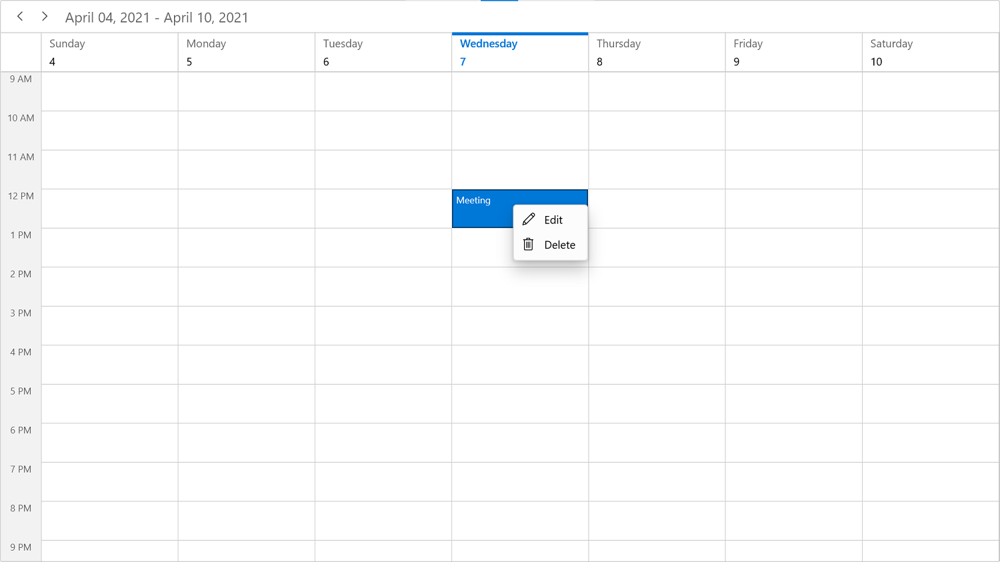

# Context Flyout and Commands in WinUI Scheduler

The WinUI scheduler has support to define a context flyout for appointments, time slots, and month cells are right-clicked. It will also have the built-in `DelegateCommand` support for handling the context flyout to add, edit, and delete appointments. There are two types of `Context Flyout.`

* [CellContextFlyout](https://help.syncfusion.com/cr/winui/Syncfusion.UI.Xaml.Scheduler.SfScheduler.html#Syncfusion_UI_Xaml_Scheduler_SfScheduler_CellContextFlyout)
* [AppointmentContextFlyout](https://help.syncfusion.com/cr/winui/Syncfusion.UI.Xaml.Scheduler.SfScheduler.html#Syncfusion_UI_Xaml_Scheduler_SfScheduler_AppointmentContextFlyout)

N> [View sample in GitHub](https://github.com/SyncfusionExamples/WinUI-Scheduler-Examples/tree/main/SchedulerContextFlyout)

## Cell context flyout

You can set the context flyout for time slot and month cells by using the `SfScheduler.CellContextFlyout` property. The [CellContextFlyout](https://help.syncfusion.com/cr/winui/Syncfusion.UI.Xaml.Scheduler.SfScheduler.html#Syncfusion_UI_Xaml_Scheduler_SfScheduler_CellContextFlyout) will appear only when the time slot or month cells are right-clicked.

N> 
* The menu flyout items which bind the [SchedulerCommands.Edit](https://help.syncfusion.com/cr/winui/Syncfusion.UI.Xaml.Scheduler.SchedulerCommands.html#Syncfusion_UI_Xaml_Scheduler_SchedulerCommands_Edit) and [SchedulerCommands.Delete](https://help.syncfusion.com/cr/winui/Syncfusion.UI.Xaml.Scheduler.SchedulerCommands.html#Syncfusion_UI_Xaml_Scheduler_SchedulerCommands_Delete) built-in commands will be disabled in the `CellContextFlyout.`
* While binding the menu flyout item using the CommandBinding, you can get the command parameter as `SchedulerContextFlyoutInfo` that contains the `Appointment` or `DateTime` of the corresponding cell.
* By default, the cell context flyout will be opened when holding on any timeslot or month cell. The appointment menu flyout will be opened by holding, only if the appointment’s drag and drop is disabled using the `AppointmentEditFlag` property.



<scheduler:SfScheduler x:Name="Schedule" 
                       ViewType="Week">
    <scheduler:SfScheduler.CellContextFlyout>
        <MenuFlyout>
            <MenuFlyoutItem Text="Add" 
                            Foreground="{ThemeResource SystemBaseHighColor}" 
                            Command="{x:Bind Path=scheduler:SchedulerCommands.Add}" 
                            CommandParameter="{Binding}">
                <MenuFlyoutItem.Icon>
                    <FontIcon x:Name="Add" 
                              Foreground="{ThemeResource SystemBaseHighColor}" 
                              FontFamily="Segoe MDL2 Assets" 
                              Glyph="&#xE710;"/>
                </MenuFlyoutItem.Icon>
            </MenuFlyoutItem>
        </MenuFlyout>
    </scheduler:SfScheduler.CellContextFlyout>
</scheduler:SfScheduler>



## Appointment context flyout

You can set the context flyout for schedule appointments by using the `SfScheduler.AppointmentContextFlyout` property. The [AppointmentContextFlyout](https://help.syncfusion.com/cr/winui/Syncfusion.UI.Xaml.Scheduler.SfScheduler.html#Syncfusion_UI_Xaml_Scheduler_SfScheduler_AppointmentContextFlyout) will be displayed only on appointments that are right-clicked.

N>
* The menu flyout items which binds the SchedulerCommands.Add command will be disabled in the `SfScheduler.AppointmentContextFlyout.`
* While binding the menu flyout items using the CommandBinding, you can get the command parameter as [SchedulerContextFlyoutInfo](https://help.syncfusion.com/cr/winui/Syncfusion.UI.Xaml.Scheduler.SchedulerContextFlyoutInfo.html) that contains the `Appointment` or `DateTime` of the corresponding cell.
* In the month view, the `AppointmentContextFlyout` opens when the `MonthViewSettings.AppointmentDisplayMode` is set to `AppointmentDisplayMode.Appointment.`
* To enable the touch context flyout for appointments in the scheduler by disabling the appointment drag and drop by setting the `AppointmentEditFlag` property except for `DragDrop.` In this case, you will not be able to perform the appointment drag & drop. The `AppointmentContextFlyout` will be displayed only on appointments and the appointment selection should be performed.



<scheduler:SfScheduler x:Name="Schedule" 
                               ViewType="Week">
            <scheduler:SfScheduler.AppointmentContextFlyout>
                <MenuFlyout>
                    <MenuFlyoutItem Text="Edit" Foreground="{ThemeResource SystemBaseHighColor}" Command="{x:Bind Path=scheduler:SchedulerCommands.Edit}" CommandParameter="{Binding}">
                        <MenuFlyoutItem.Icon>
                            <FontIcon x:Name="Edit" Foreground="{ThemeResource SystemBaseHighColor}" FontFamily="Segoe MDL2 Assets" Glyph="&#xE70F;"/>
                        </MenuFlyoutItem.Icon>
                    </MenuFlyoutItem>
                    <MenuFlyoutItem Text="Delete" Foreground="{ThemeResource SystemBaseHighColor}" Command="{x:Bind Path=scheduler:SchedulerCommands.Delete}" CommandParameter="{Binding}">
                        <MenuFlyoutItem.Icon>
                            <FontIcon x:Name="Delete" Foreground="{ThemeResource SystemBaseHighColor}"  FontFamily="Segoe MDL2 Assets" Glyph="&#xE74D;"/>
                        </MenuFlyoutItem.Icon>
                    </MenuFlyoutItem>
                </MenuFlyout>
            </scheduler:SfScheduler.AppointmentContextFlyout>
        </scheduler:SfScheduler>



## ContextFlyoutOpening event

The [SchedulerContextFlyoutInfo](https://help.syncfusion.com/cr/winui/Syncfusion.UI.Xaml.Scheduler.SchedulerContextFlyoutInfo.html) event occurs while opening the `AppointmentContextFlyout` or `CellContextFlyout` in the SfScheduler.

The [SchedulerContextFlyoutOpeningEventArgs](https://help.syncfusion.com/cr/winui/Syncfusion.UI.Xaml.Scheduler.SchedulerContextFlyoutOpeningEventArgs.html) has the following members which provides the information about the [ContextFlyoutOpening](https://help.syncfusion.com/cr/winui/Syncfusion.UI.Xaml.Scheduler.SfScheduler.html#Syncfusion_UI_Xaml_Scheduler_SfScheduler_ContextFlyoutOpening) event.

* [MenuInfo](https://help.syncfusion.com/cr/winui/Syncfusion.UI.Xaml.Scheduler.SchedulerContextFlyoutOpeningEventArgs.html#Syncfusion_UI_Xaml_Scheduler_SchedulerContextFlyoutOpeningEventArgs_MenuInfo): Returns the `SchedulerContextFlyoutInfo` which contains the information about date time, appointment, resources and scheduler of the element opens the context flyout. The `AppointmentContextFlyout` and `CellContextFlyout` received this information as a DataContext.
* [MenuType](https://help.syncfusion.com/cr/winui/Syncfusion.UI.Xaml.Scheduler.SchedulerContextFlyoutOpeningEventArgs.html#Syncfusion_UI_Xaml_Scheduler_SchedulerContextFlyoutOpeningEventArgs_MenuType): Gets the element type for which the context flyout opens.
* [ContextMenu](https://help.syncfusion.com/cr/winui/Syncfusion.UI.Xaml.Scheduler.SchedulerContextFlyoutOpeningEventArgs.html#Syncfusion_UI_Xaml_Scheduler_SchedulerContextFlyoutOpeningEventArgs_ContextMenu): It represents a shortcut context flyout that is being opened.