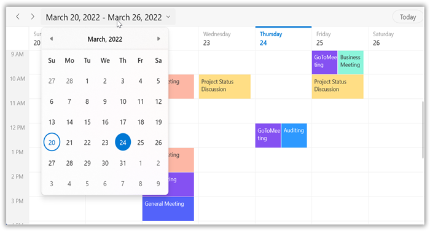

# Date Navigations in WinUI Scheduler (SfScheduler)

## Range for visible dates

Visible dates can be restricted between certain range of dates, using [MaximumDate](https://help.syncfusion.com/cr/winui/Syncfusion.UI.Xaml.Scheduler.SfScheduler.html#Syncfusion_UI_Xaml_Scheduler_SfScheduler_MaximumDate) and [MinimumDate](https://help.syncfusion.com/cr/winui/Syncfusion.UI.Xaml.Scheduler.SfScheduler.html#Syncfusion_UI_Xaml_Scheduler_SfScheduler_MinimumDate) properties in SfScheduler. It is applicable in all the scheduler views.

### Minimum display date

[MinimumDate](https://help.syncfusion.com/cr/winui/Syncfusion.UI.Xaml.Scheduler.SfScheduler.html#Syncfusion_UI_Xaml_Scheduler_SfScheduler_MinimumDate) will restrict date navigations features of backward and also it doesn't allow to swipe the control using touch gesture beyond the minimum date range. The dates before the minimum date will be disabled in the schedule.



this.Schedule.MinimumDate = new DateTime(2021, 03, 05, 10, 0, 0);



### Maximum display date

[MaximumDate](https://help.syncfusion.com/cr/winui/Syncfusion.UI.Xaml.Scheduler.SfScheduler.html#Syncfusion_UI_Xaml_Scheduler_SfScheduler_MaximumDate) will restrict date navigations features of forward, and also it doesn't allow to swipe the control using touch gesture beyond the maximum date range. The dates beyond the maximum date will be disabled in the schedule.



this.Schedule.MaximumDate = new DateTime(2021, 05, 05, 10, 0, 0);



## Programmatic date navigation

Programmatically navigate the dates in scheduler by using the [DisplayDate](https://help.syncfusion.com/cr/winui/Syncfusion.UI.Xaml.Scheduler.SfScheduler.html#Syncfusion_UI_Xaml_Scheduler_SfScheduler_DisplayDate) property of SfScheduler.



this.Schedule.DisplayDate = new DateTime(2021, 04, 07, 9, 0, 0);



N> Date navigation before the minimum date will be reset to the scheduler minimum date and date navigation beyond the maximum date will be reset to the scheduler maximum date.

## Programmatic date selection

Programmatically select the dates in scheduler by using the [SelectedDate](https://help.syncfusion.com/cr/winui/Syncfusion.UI.Xaml.Scheduler.SfScheduler.html#Syncfusion_UI_Xaml_Scheduler_SfScheduler_SelectedDate) property of SfScheduler.



this.Schedule.SelectedDate = new DateTime(2021, 04, 07, 10, 0, 0);



N> Selection before minimum dates and beyond maximum dates using the `SelectedDate` is not possible.

## Programmatically change to adjacent dates

By default, the date can be navigated to next and previous views using touch gesture, and by swiping the control from right to left and left to right direction. The view can be also changed programmatically using the `Forward` and `Backward` methods available in SfScheduler.

#### Forward

Use the [Forward](https://help.syncfusion.com/cr/winui/Syncfusion.UI.Xaml.Scheduler.SfScheduler.html#Syncfusion_UI_Xaml_Scheduler_SfScheduler_Forward) method of Scheduler for viewing the next immediate visible dates in the scheduler. It will move to the next month if the scheduler view is month, similarly it will move to the next week for week view and the next day for day view.



<scheduler:SfScheduler x:Name="Schedule"  
                       ViewType="Week">
</scheduler:SfScheduler>

<Button x:Name="Forward"
        Content="Forward"
        Click="Forward_Click">
</Button>


private void Forward_Click(object sender, RoutedEventArgs e)
{
    this.Schedule.Forward();
}



#### Backward

Use the [Backward](https://help.syncfusion.com/cr/winui/Syncfusion.UI.Xaml.Scheduler.SfScheduler.html#Syncfusion_UI_Xaml_Scheduler_SfScheduler_Backward) method of Scheduler for viewing the previous immediate visible dates in the scheduler. It will move to the previous month if the scheduler view is month, similarly it will move to the previous week for week view and the previous day for day view.



<scheduler:SfScheduler x:Name="Schedule"  
                       ViewType="Week">
</scheduler:SfScheduler>

<Button x:Name="Backward"
        Content="Backward"
        Click="Backward_Click">
</Button>


private void Backward_Click(object sender, RoutedEventArgs e)
{
    this.Schedule.Backward();
}



## Allow view navigation

You can quickly navigate to the respective day or timeline day view by single-clicking on the date in month cell or view header of the following scheduler views such as a week, work week, month, timeline week, timeline work week, and timeline month views by using the [AllowViewNavigation](https://help.syncfusion.com/cr/winui/Syncfusion.UI.Xaml.Scheduler.SfScheduler.html#Syncfusion_UI_Xaml_Scheduler_SfScheduler_AllowViewNavigation) property of the scheduler.



<scheduler:SfScheduler  x:Name="Schedule"
                        ViewType="Week"
                        AllowViewNavigation="True">
</scheduler:SfScheduler>


this.Schedule.ViewType = SchedulerViewType.Week;
this.Schedule.AllowViewNavigation = true;



N>
* The `AllowViewNavigation` is not applicable for the day and timeline day views.
* If the [ShowAgendaView](https://help.syncfusion.com/winui/scheduler/month-view#month-agenda-view) is true in a month view, the month view should navigate to the day view by single-clicking on the agenda date view header, otherwise, the month view should navigate to the day view by single-clicking on the date in a month cell.

## Show date picker
You can enable the date picker for the scheduler by using the [ShowDatePickerButton](https://help.syncfusion.com/cr/winui/Syncfusion.UI.Xaml.Scheduler.SfScheduler.html#Syncfusion_UI_Xaml_Scheduler_SfScheduler_ShowDatePickerButton) property in the [scheduler,](https://help.syncfusion.com/cr/winui/Syncfusion.UI.Xaml.Scheduler.SfScheduler.html) which displays the date picker and `Today` button in the header view. It allows you to quickly navigate to today and different scheduler views.



<syncfusion:SfScheduler x:Name="Schedule" 
                        ViewType="Week"
                        ShowDatePickerButton="True">
</syncfusion:SfScheduler>


this.Schedule.ViewType = SchedulerViewType.Week;
this.Schedule.ShowDatePickerButton = true;



N> The header `DatePicker` uses the calendar for your app's default language, or you can set the [CalendarIdentifier](https://help.syncfusion.com/cr/winui/Syncfusion.UI.Xaml.Scheduler.SfScheduler.html#Syncfusion_UI_Xaml_Scheduler_SfScheduler_CalendarIdentifier) property to a scheduler to use a specific calendar system. If the `CalendarIdentifier` is not set the scheduler uses the default calendar for the application’s preferred language.

## Allowed views
You can quickly navigate to the different scheduler views by using the [AllowedViewTypes](https://help.syncfusion.com/cr/winui/Syncfusion.UI.Xaml.Scheduler.SfScheduler.html#Syncfusion_UI_Xaml_Scheduler_SfScheduler_AllowedViewTypes) property in the [SfScheduler.](https://help.syncfusion.com/cr/winui/Syncfusion.UI.Xaml.Scheduler.SfScheduler.html) The views set to this property will display as a view button in the scheduler header view. This UI will be responsive as showing more icons and will be updated based on the window size change.



<syncfusion:SfScheduler x:Name="Schedule" 
                        AllowedViewTypes="Month,Week,WorkWeek,Day,TimelineDay,TimelineWeek,TimelineWorkWeek,TimelineMonth" >
</syncfusion:SfScheduler>                        


this.Schedule.AllowedViewTypes = AllowedSchedulerViewTypes.Week | AllowedSchedulerViewTypes.WorkWeek | AllowedSchedulerViewTypes.Day | AllowedSchedulerViewTypes.Month | AllowedSchedulerViewTypes.TimelineDay | AllowedSchedulerViewTypes.TimelineMonth | AllowedSchedulerViewTypes.TimelineWeek | AllowedSchedulerViewTypes.TimelineWorkWeek;



N> [View sample in GitHub](https://github.com/SyncfusionExamples/WinUI-Scheduler-Examples/tree/main/AllowedViews)