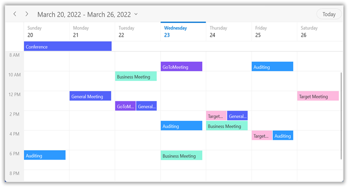
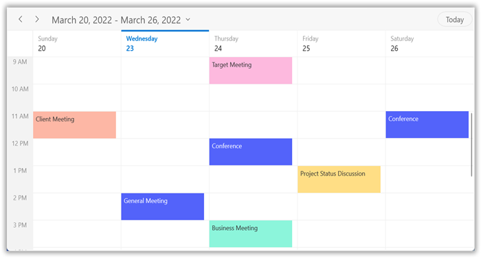
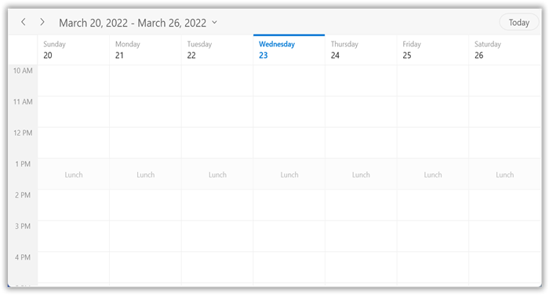
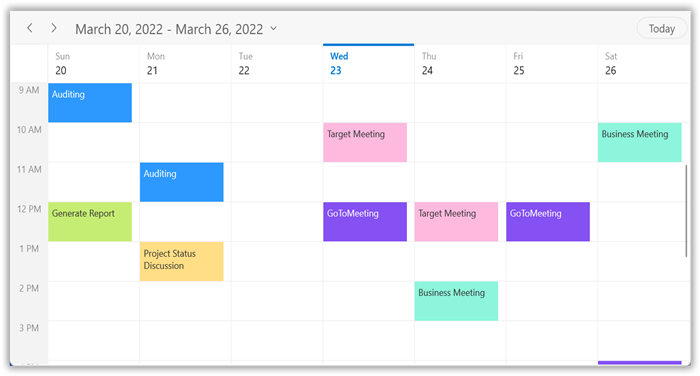

# Day and Week Views in WinUI Scheduler (SfScheduler)

The [WinUI Scheduler](https://help.syncfusion.com/cr/winui/Syncfusion.UI.Xaml.Scheduler.SfScheduler.html) supports to display the day, week, workweek views, and the current day will be visible by default. The appointments on a specific day will be arranged in the respective timeslots based on their duration.

## Change time duration
Customize the interval of timeslots in all the day, week, workweek views by using the [TimeInterval](https://help.syncfusion.com/cr/winui/Syncfusion.UI.Xaml.Scheduler.TimeSlotViewSettings.html#Syncfusion_UI_Xaml_Scheduler_TimeSlotViewSettings_TimeInterval) property of [DaysViewSettings](https://help.syncfusion.com/cr/winui/Syncfusion.UI.Xaml.Scheduler.DaysViewSettings.html).








this.Schedule.ViewType = SchedulerViewType.Week;
this.Schedule.DaysViewSettings.TimeInterval = new System.TimeSpan(0, 120, 0);



N> To modify the [TimeInterval](https://help.syncfusion.com/cr/winui/Syncfusion.UI.Xaml.Scheduler.TimeSlotViewSettings.html#Syncfusion_UI_Xaml_Scheduler_TimeSlotViewSettings_TimeInterval) value (in minutes), change the time labels format by setting the [TimeRulerFormat](https://help.syncfusion.com/cr/winui/Syncfusion.UI.Xaml.Scheduler.TimeSlotViewSettings.html#Syncfusion_UI_Xaml_Scheduler_TimeSlotViewSettings_TimeRulerFormat) value to hh:mm.

## Change time interval height

Customize the interval height of timeslots in a day, week, and workweek views by setting [TimeIntervalSize](https://help.syncfusion.com/cr/winui/Syncfusion.UI.Xaml.Scheduler.TimeSlotViewSettings.html#Syncfusion_UI_Xaml_Scheduler_TimeSlotViewSettings_TimeIntervalSize) property of [DaysViewSettings](https://help.syncfusion.com/cr/winui/Syncfusion.UI.Xaml.Scheduler.DaysViewSettings.html).



 <scheduler:SfScheduler x:Name="Schedule" ViewType="Week">
    <scheduler:SfScheduler.DaysViewSettings>
        <scheduler:DaysViewSettings 
            TimeIntervalSize="120"/>
        </scheduler:SfScheduler.DaysViewSettings>
</scheduler:SfScheduler>


this.Schedule.ViewType = SchedulerViewType.Week;
this.Schedule.DaysViewSettings.TimeIntervalSize = 120;



## Flexible working days 

By default, the `WinUI Scheduler` considers the week days from Monday to Friday as working days. The days which are defined in this non-working days collection are considered as [non-working days](https://help.syncfusion.com/cr/winui/Syncfusion.UI.Xaml.Scheduler.TimeSlotViewSettings.html#Syncfusion_UI_Xaml_Scheduler_TimeSlotViewSettings_NonWorkingDays). Therefore, when the weekend days are set to hide from Scheduler.

The `workweek` view displays exactly the defined working days on Scheduler control, whereas other views displays all the days.



<scheduler:SfScheduler x:Name="Schedule" ViewType="Week">
    <scheduler:SfScheduler.DaysViewSettings>
        <scheduler:DaysViewSettings 
                  NonWorkingDays="Monday,Tuesday">
        </scheduler:DaysViewSettings>
    </scheduler:SfScheduler.DaysViewSettings>
</scheduler:SfScheduler>


this.scheduler.ViewType = SchedulerViewType.WorkWeek;
this.scheduler.DaysViewSettings.NonWorkingDays = new ObservableCollection<DayOfWeek>() { DayOfWeek.Monday, DayOfWeek.Tuesday };



## Flexible working hours

The default values for `StartHour` and `EndHour` are 0 and 24 to show all the timeslots in a day, week, workweek views. Set the [StartHour](https://help.syncfusion.com/cr/winui/Syncfusion.UI.Xaml.Scheduler.TimeSlotViewSettings.html#Syncfusion_UI_Xaml_Scheduler_TimeSlotViewSettings_StartHour) and [EndHour](https://help.syncfusion.com/cr/winui/Syncfusion.UI.Xaml.Scheduler.TimeSlotViewSettings.html#Syncfusion_UI_Xaml_Scheduler_TimeSlotViewSettings_EndHour) properties of [DaysViewSettings](https://help.syncfusion.com/cr/winui/Syncfusion.UI.Xaml.Scheduler.DaysViewSettings.html) to show only the required time duration for users. Set the `StartHour` and `EndHour` in time duration to show the required time duration in minutes.



<scheduler:SfScheduler x:Name="Schedule" ViewType="Week">
    <scheduler:SfScheduler.DaysViewSettings>
        <scheduler:DaysViewSettings 
            StartHour="8"
            EndHour="13"/>
        </scheduler:SfScheduler.DaysViewSettings>
</scheduler:SfScheduler>


this.Schedule.ViewType = SchedulerViewType.Week;
this.Schedule.DaysViewSettings.StartHour = 8;
this.Schedule.DaysViewSettings.EndHour = 13;



N>
* The [NonWorkingDays](https://help.syncfusion.com/cr/winui/Syncfusion.UI.Xaml.Scheduler.TimeSlotViewSettings.html#Syncfusion_UI_Xaml_Scheduler_TimeSlotViewSettings_NonWorkingDays) property will be applicable only for `workWeek` and `TimelineWorkWeek` views only, and not be applicable for the remaining views.
* Scheduler Appointments UI, which does not fall within the `StartHour` and `EndHour` will not be visible and if it falls partially, it will be clipped.
* No need to specify the decimal point values for `StartHour` and `EndHour`, if you do not want to set the minutes.
* The number of time slots will be calculated based on total minutes of a day and time interval (total minutes of a day ((start hour - end hour) * 60) / time interval).
* If a custom timeInterval is given, then the number of time slots calculated based on the given `TimeInterval` should result in an integer value (total minutes % timeInterval = 0), otherwise the next immediate time interval that results in integer value when dividing total minutes of a day will be considered. For example, if TimeInterval=2 Hours 15 minutes and total minutes = 1440 (24 Hours per day), then the `TimeInterval` will be changed to ‘144’ (1440%144=0) by considering (total minutes % TimeInterval = 0), it will return integer value for time slots rendering.
* If the custom `StartHour` and `EndHour` are given, then the number of time slots calculated based on given `StartHour` and `EndHour` should result in integer value, otherwise the next immediate `TimeInterval` will be considered until the result is integer value. For example, if the `StartHour` is 9 (09:00AM), `EndHour` is 18.25 (06:15 PM), `TimeInterval` is 30 minutes, and total minutes = 555 ((18.25-9)*60), then the `TimeInterval` will be changed to ’37 minutes’ (555%37=0) by considering (total minutes % timeInterval = 0) it will return the integer value for time slots rendering.

## Special time regions

Restrict the user interaction such as selection and highlight specific regions of time in a day, week, and workweek views by adding the [SpecialTimeRegions](https://help.syncfusion.com/cr/winui/Syncfusion.UI.Xaml.Scheduler.TimeSlotViewSettings.html#Syncfusion_UI_Xaml_Scheduler_TimeSlotViewSettings_SpecialTimeRegions) property of SfScheduler. Set the [StartTime](https://help.syncfusion.com/cr/winui/Syncfusion.UI.Xaml.Scheduler.SpecialTimeRegion.html#Syncfusion_UI_Xaml_Scheduler_SpecialTimeRegion_StartTime) and [EndTime](https://help.syncfusion.com/cr/winui/Syncfusion.UI.Xaml.Scheduler.SpecialTimeRegion.html#Syncfusion_UI_Xaml_Scheduler_SpecialTimeRegion_EndTime) properties of [SpecialTimeRegion](https://help.syncfusion.com/cr/winui/Syncfusion.UI.Xaml.Scheduler.SpecialTimeRegion.html) to create a `SpecialTimeRegion,` use the timeZone property to set the specific timezone for Start and end time of `SpecialTimeRegion.` The `SpecialTimeRegion` will display the text or image on it, which is set to the text or icon property of `SpecialTimeRegion`.

Merge the adjacent region of `SpecialTimeRegion` and show them as a single region instead of showing them separately for each day using the [CanMergeAdjacentRegions](https://help.syncfusion.com/cr/winui/Syncfusion.UI.Xaml.Scheduler.SpecialTimeRegion.html#Syncfusion_UI_Xaml_Scheduler_SpecialTimeRegion_CanMergeAdjacentRegions) property of [SpecialTimeRegion](https://help.syncfusion.com/cr/winui/Syncfusion.UI.Xaml.Scheduler.SpecialTimeRegion.html) in the week and workweek views. By default, its value is set to `false`.

### Selection restriction in timeslots

Enable or disable the touch interaction of SpecialTimeRegion using the [CanEdit](https://help.syncfusion.com/cr/winui/Syncfusion.UI.Xaml.Scheduler.SpecialTimeRegion.html#Syncfusion_UI_Xaml_Scheduler_SpecialTimeRegion_CanEdit) property of [SpecialTimeRegion](https://help.syncfusion.com/cr/winui/Syncfusion.UI.Xaml.Scheduler.SpecialTimeRegion.html). By default, it's value is set to `true`.








this.Schedule.ViewType = SchedulerViewType.Week;
this.Schedule.DaysViewSettings.SpecialTimeRegions.Add(new SpecialTimeRegion
{
    StartTime = new System.DateTime(2021, 03, 23, 13, 0, 0),
    EndTime = new System.DateTime(2021, 03, 23, 14, 0, 0),
    Text = "Lunch",
    CanEdit = false,
    Background = new SolidColorBrush(Colors.LightGray),
    Foreground = new SolidColorBrush(Colors.White)
});



N> This property only restricts the interaction on region and it does not restrict the following:
* Programmatic selection (if the user updates the selected date value dynamically).
* Does not clear the selection when the user selects the region and dynamically change the [CanEdit](https://help.syncfusion.com/cr/winui/Syncfusion.UI.Xaml.Scheduler.SpecialTimeRegion.html#Syncfusion_UI_Xaml_Scheduler_SpecialTimeRegion_CanEdit) property to false.
* It does not restrict appointment interaction when the appointment placed in the region.
* It does not restrict the appointment rendering on a region, when the appointments are loaded from data services or added programmatically.

### Recurring time region

The recurring time region on a daily, weekly, monthly, or yearly interval. The recurring special time regions can be created by setting the [RecurrenceRule](https://help.syncfusion.com/cr/winui/Syncfusion.UI.Xaml.Scheduler.SpecialTimeRegion.html#Syncfusion_UI_Xaml_Scheduler_SpecialTimeRegion_RecurrenceRule) property in [SpecialTimeRegion](https://help.syncfusion.com/cr/winui/Syncfusion.UI.Xaml.Scheduler.SpecialTimeRegion.html).

Merge the adjacent region of `SpecialTimeRegion` and show them as a single region instead of showing them separately for each day using the [CanMergeAdjacentRegions](https://help.syncfusion.com/cr/winui/Syncfusion.UI.Xaml.Scheduler.SpecialTimeRegion.html#Syncfusion_UI_Xaml_Scheduler_SpecialTimeRegion_CanMergeAdjacentRegions) property of [SpecialTimeRegion](https://help.syncfusion.com/cr/winui/Syncfusion.UI.Xaml.Scheduler.SpecialTimeRegion.html) in the week and workweek views. By default, it's value is set to `false`.








this.Schedule.ViewType = SchedulerViewType.Week;
this.Schedule.DaysViewSettings.SpecialTimeRegions.Add(new SpecialTimeRegion
{
    StartTime = new System.DateTime(2021, 03, 21, 13, 0, 0),
    EndTime = new System.DateTime(2021, 03, 21, 14, 0, 0),
    Text = "Lunch",
    CanEdit = false,
    Background = new SolidColorBrush(Colors.LightGray),
    Foreground = new SolidColorBrush(Colors.White),
    CanMergeAdjacentRegions = true,
    RecurrenceRule = "FREQ=DAILY;INTERVAL=1"
});



If the [CanMergeAdjacentRegions](https://help.syncfusion.com/cr/winui/Syncfusion.UI.Xaml.Scheduler.SpecialTimeRegion.html#Syncfusion_UI_Xaml_Scheduler_SpecialTimeRegion_CanMergeAdjacentRegions) of [SpecialTimeRegion](https://help.syncfusion.com/cr/winui/Syncfusion.UI.Xaml.Scheduler.SpecialTimeRegion.html) is set to false. The SpecialTimeRegion will be rendering on date basis.

### Recurrence exception dates

Delete any of the occurrence that are an exception from the recurrence pattern time region by using the `[RecurrenceExceptionDates](https://help.syncfusion.com/cr/winui/Syncfusion.UI.Xaml.Scheduler.SpecialTimeRegion.html#Syncfusion_UI_Xaml_Scheduler_SpecialTimeRegion_RecurrenceExceptionDates) property of [SpecialTimeRegion](https://help.syncfusion.com/cr/winui/Syncfusion.UI.Xaml.Scheduler.SpecialTimeRegion.html). The deleted occurrence date will be considered as a recurrence exception date.








this.Schedule.ViewType = SchedulerViewType.Week;
           
DateTime recurrenceExceptionDates = DateTime.Now.Date.AddDays(-1);
DateTime recurrenceExceptionDates1 = DateTime.Now.Date.AddDays(2);
this.Schedule.DaysViewSettings.SpecialTimeRegions.Add(new SpecialTimeRegion
{
    StartTime = new System.DateTime(2021, 03, 21, 13, 0, 0),
    EndTime = new System.DateTime(2021, 03, 21, 14, 0, 0),
    Text = "Lunch",
    CanEdit = false,
    RecurrenceRule = "FREQ=DAILY;INTERVAL=1",
    CanMergeAdjacentRegions = true,
    Background = new SolidColorBrush(Colors.LightGray),
    Foreground = new SolidColorBrush(Colors.White),
    RecurrenceExceptionDates = new ObservableCollection<DateTime>()
    {
        recurrenceExceptionDates,
        recurrenceExceptionDates1,
    }
});



The [SpecialTimeRegion](https://help.syncfusion.com/cr/winui/Syncfusion.UI.Xaml.Scheduler.SpecialTimeRegion.html) can be got in date basis by setting the value of [CanMergeAdjacentRegions](https://help.syncfusion.com/cr/winui/Syncfusion.UI.Xaml.Scheduler.SpecialTimeRegion.html#Syncfusion_UI_Xaml_Scheduler_SpecialTimeRegion_CanMergeAdjacentRegions) to false.

### Special time region customization

The `SpecialTimeRegion` background color can be customized by using the [Background](https://help.syncfusion.com/cr/winui/Syncfusion.UI.Xaml.Scheduler.SpecialTimeRegion.html#Syncfusion_UI_Xaml_Scheduler_SpecialTimeRegion_Background) and [SpecialTimeRegionTemplate](https://help.syncfusion.com/cr/winui/Syncfusion.UI.Xaml.Scheduler.TimeSlotViewSettings.html#Syncfusion_UI_Xaml_Scheduler_TimeSlotViewSettings_SpecialTimeRegionTemplate) properties of [SpecialTimeRegion](https://help.syncfusion.com/cr/winui/Syncfusion.UI.Xaml.Scheduler.SpecialTimeRegion.html) that is used to customize the text style for the image of the SpecialTimeRegion.



<Grid>
    <Grid.Resources>
        <DataTemplate x:Key="specialRegionTemplate">
            <Grid Background="{Binding Background}"
            Opacity="0.5"
            HorizontalAlignment="Stretch"
            VerticalAlignment="Stretch">
            <Path x:Name="Fork" Data="M11,0 C11.553001,0 12,0.4469986 12,1 L12,15 C12,15.553001 11.553001,16 11,16 10.446999,16 10,15.553001 10,15 L10,7 9,7 C8.4469986,7 8,6.5530014 8,6 L8,3 C8,1.3429985 9.3429985,0 11,0 z M0,0 L1,0 1.2340002,4 1.7810001,4 2,0 3,0 3.2340002,4 3.7810001,4 4,0 5,0 5,4 C5,4.9660001 4.3140001,5.7727499 3.4029064,5.9593439 L3.4007993,5.9597201 3.9114671,14.517 C3.9594617,15.321 3.3195295,16 2.5136147,16 L2.5076156,16 C1.6937013,16 1.0517693,15.309 1.1107631,14.497 L1.7400641,5.9826035 1.6955509,5.9769421 C0.73587513,5.8301721 0,5.0005002 0,4 z" Fill="Black" HorizontalAlignment="Center" Height="16"  Stretch="Fill" VerticalAlignment="Center" Width="12"/>
            </Grid>
        </DataTemplate>
    </Grid.Resources>
<scheduler:SfScheduler x:Name="Schedule" ViewType="Week">
    <scheduler:SfScheduler.DaysViewSettings>
        <scheduler:DaysViewSettings  
                                SpecialTimeRegionTemplate="{StaticResource specialRegionTemplate}">
        </scheduler:DaysViewSettings>
    </scheduler:SfScheduler.DaysViewSettings>
</scheduler:SfScheduler>
</Grid>


this.Schedule.DaysViewSettings.SpecialTimeRegions.Add(new SpecialTimeRegion
{
    StartTime = new System.DateTime(2021, 03, 21, 13, 0, 0),
    EndTime = new System.DateTime(2021, 03, 21, 14, 0, 0),
    Text = "Lunch",
    CanEdit = false,
    RecurrenceRule = "FREQ=DAILY;INTERVAL=1",
    CanMergeAdjacentRegions = true,
    Background = new SolidColorBrush(Colors.LightGray),
    Foreground = new SolidColorBrush(Colors.White),
});



The [SpecialTimeRegion](https://help.syncfusion.com/cr/winui/Syncfusion.UI.Xaml.Scheduler.SpecialTimeRegion.html) can be customized on a date basis by setting the value of [CanMergeAdjacentRegions](https://help.syncfusion.com/cr/winui/Syncfusion.UI.Xaml.Scheduler.SpecialTimeRegion.html#Syncfusion_UI_Xaml_Scheduler_SpecialTimeRegion_CanMergeAdjacentRegions) to false.

N> [View sample in GitHub](https://github.com/SyncfusionExamples/WinUI-Scheduler-Examples/tree/main/SpecialTimeRegionCustomization)

## Full screen scheduler

The WinUI Scheduler time interval height can be adjusted based on screen height by changing the value of [TimeIntervalSize](https://help.syncfusion.com/cr/wpf/Syncfusion.UI.Xaml.Scheduler.TimeSlotViewSettings.html#Syncfusion_UI_Xaml_Scheduler_TimeSlotViewSettings_TimeIntervalSize) property to `-1.` It will auto-fit to the screen height and width.



<scheduler:SfScheduler x:Name="Schedule" ViewType="Week">
    <scheduler:SfScheduler.DaysViewSettings>
        <scheduler:DaysViewSettings 
            TimeIntervalSize="-1"/>
    </scheduler:SfScheduler.DaysViewSettings>
</scheduler:SfScheduler>


this.Schedule.ViewType = SchedulerViewType.Week;
this.Schedule.DaysViewSettings.TimeIntervalSize = -1;



## Change time ruler width

Customize the size of the time ruler view where the labels mentioning the time are placed by using the [TimeRulerSize](https://help.syncfusion.com/cr/winui/Syncfusion.UI.Xaml.Scheduler.TimeSlotViewSettings.html#Syncfusion_UI_Xaml_Scheduler_TimeSlotViewSettings_TimeRulerSize) property of [DayViewSettings](https://help.syncfusion.com/cr/winui/Syncfusion.UI.Xaml.Scheduler.DaysViewSettings.html).



<scheduler:SfScheduler x:Name="Schedule" ViewType="Week" >
    <scheduler:SfScheduler.DaysViewSettings>
        <scheduler:DaysViewSettings   
            TimeRulerSize="100">
        </scheduler:DaysViewSettings>
    </scheduler:SfScheduler.DaysViewSettings>
</scheduler:SfScheduler>


this.Schedule.ViewType = SchedulerViewType.Week;
this.Schedule.DaysViewSettings.TimeRulerSize = 100;



## Minimum appointment duration

The [MinimumAppointmentDuration](https://help.syncfusion.com/cr/winui/Syncfusion.UI.Xaml.Scheduler.TimeSlotViewSettings.html#Syncfusion_UI_Xaml_Scheduler_TimeSlotViewSettings_MinimumAppointmentDuration) property in [DayViewSettings](https://help.syncfusion.com/cr/winui/Syncfusion.UI.Xaml.Scheduler.DaysViewSettings.html) is to set an arbitrary height to appointments when it has a minimum duration in a day, week, workweek views so that the subject can be readable.








this.Schedule.ViewType = SchedulerViewType.Week;
this.Schedule.DaysViewSettings.MinimumAppointmentDuration = new System.TimeSpan(0, 120, 0);



N>
*  The `MinimumAppointmentDuration` value will be set when an appointment duration value is lesser than `MinimumAppointmentDuration`.
* The appointment duration value will be set when the appointment duration value is greater than the `MinimumAppointmentDuration`.
*  The `TimeInterval` value will be set when the `MinimumAppointmentDuration` is greater than the `TimeInterval` with lesser appointment duration.
* All-day Appointment does not support `MinimumAppointmentDuration`.

## Minimum display appointments count in all day panel

You can customize the number of appointments displayed in an all-day panel using the [MinimumAllDayAppointmentsCount](https://help.syncfusion.com/cr/winui/Syncfusion.UI.Xaml.Scheduler.DaysViewSettings.html#Syncfusion_UI_Xaml_Scheduler_DaysViewSettings_MinimumAllDayAppointmentsCount) property of `DaysViewSettings` in the Scheduler. By default, the appointment display count is 2, and all-day panels have more than 2 appointments, two appointments will be displayed and the remaining appointments will be displayed as appointment counts.



<scheduler:SfScheduler x:Name="Schedule" ViewType="Week">
    <scheduler:SfScheduler.DaysViewSettings>
        <scheduler:DaysViewSettings 
                        MinimumAllDayAppointmentsCount="3"/>
    </scheduler:SfScheduler.DaysViewSettings>
</scheduler:SfScheduler>


this.Schedule.ViewType = SchedulerViewType.Week;
this.Schedule.DaysViewSettings.MinimumAllDayAppointmentsCount = 3;



### Customize more appointments indicator in all day panel

You can customize the default appearance of more appointments indicator in an all-day panel by using the [AllDayMoreAppointmentsIndicatorTemplate](https://help.syncfusion.com/cr/winui/Syncfusion.UI.Xaml.Scheduler.DaysViewSettings.html#Syncfusion_UI_Xaml_Scheduler_DaysViewSettings_AllDayMoreAppointmentsIndicatorTemplate) property of `DaysViewSettings`.



<scheduler:SfScheduler x:Name="Schedule" ViewType="Week">
    <scheduler:SfScheduler.DaysViewSettings>
        <scheduler:DaysViewSettings>
            <scheduler:DaysViewSettings.AllDayMoreAppointmentsIndicatorTemplate>
                <DataTemplate >
                    <StackPanel Background="#EAEAEA" HorizontalAlignment="Stretch" VerticalAlignment="Stretch">
                        <TextBlock Text="{Binding}" Foreground="Black" TextAlignment="Center" VerticalAlignment="Center">
                        </TextBlock>
                    </StackPanel>
                </DataTemplate>
            </scheduler:DaysViewSettings.AllDayMoreAppointmentsIndicatorTemplate>
        </scheduler:DaysViewSettings>
    </scheduler:SfScheduler.DaysViewSettings>
</scheduler:SfScheduler>



## Time ruler text formatting

Customize the format for the labels mentioning the time by setting the [TimeRulerFormat](https://help.syncfusion.com/cr/winui/Syncfusion.UI.Xaml.Scheduler.TimeSlotViewSettings.html#Syncfusion_UI_Xaml_Scheduler_TimeSlotViewSettings_TimeRulerFormat) property of [DayViewSettings](https://help.syncfusion.com/cr/winui/Syncfusion.UI.Xaml.Scheduler.DaysViewSettings.html) in Scheduler.








this.Schedule.ViewType = SchedulerViewType.Week;
this.Schedule.DaysViewSettings.TimeRulerFormat = "hh mm";
this.Schedule.DaysViewSettings.TimeInterval = new System.TimeSpan(0, 30, 0);



N>
* ou can customize the appointment editor time format based on the scheduler time ruler format and culture.
* By default, the scheduler time ruler format is `h tt` and the appointment editor time picker format is `hh:mm tt`.

## View header

Customize the default appearance of view header in a day, week, and workweek views by setting the `ViewHeaderDateFormat`, `ViewHeaderHeight`, `ViewHeaderDayFormat` and `ViewHeaderTemplate` of [DaysViewSettings](https://help.syncfusion.com/cr/winui/Syncfusion.UI.Xaml.Scheduler.DaysViewSettings.html).

### View header text formatting

Customize the date and day format of ViewHeader by using the [ViewHeaderDateFormat](https://help.syncfusion.com/cr/winui/Syncfusion.UI.Xaml.Scheduler.TimeSlotViewSettings.html#Syncfusion_UI_Xaml_Scheduler_TimeSlotViewSettings_ViewHeaderDateFormat) and [ViewHeaderDayFormat](https://help.syncfusion.com/cr/winui/Syncfusion.UI.Xaml.Scheduler.ViewSettingsBase.html#Syncfusion_UI_Xaml_Scheduler_ViewSettingsBase_ViewHeaderDayFormat) properties of [DaysViewSettings](https://help.syncfusion.com/cr/winui/Syncfusion.UI.Xaml.Scheduler.DaysViewSettings.html).



<scheduler:SfScheduler x:Name="Schedule" ViewType="Week">
    <scheduler:SfScheduler.DaysViewSettings>
        <scheduler:DaysViewSettings 
            ViewHeaderDayFormat="ddd"
            ViewHeaderDateFormat="dd"/>
    </scheduler:SfScheduler.DaysViewSettings>
</scheduler:SfScheduler>


this.Schedule.ViewType = SchedulerViewType.Week;
this.Schedule.DaysViewSettings.ViewHeaderDateFormat = "dd";
this.Schedule.DaysViewSettings.ViewHeaderDayFormat = "ddd";



### View header height

Customize the height of the ViewHeader in a day, week, and workweek views by setting the [ViewHeaderHeight](https://help.syncfusion.com/cr/winui/Syncfusion.UI.Xaml.Scheduler.ViewSettingsBase.html#Syncfusion_UI_Xaml_Scheduler_ViewSettingsBase_ViewHeaderHeight) property of [DaysViewSettings](https://help.syncfusion.com/cr/winui/Syncfusion.UI.Xaml.Scheduler.DaysViewSettings.html) in SfScheduler.



<scheduler:SfScheduler x:Name="Schedule" ViewType="Week">
    <scheduler:SfScheduler.DaysViewSettings>
        <scheduler:DaysViewSettings
            ViewHeaderHeight="100"/>
    </scheduler:SfScheduler.DaysViewSettings>
</scheduler:SfScheduler>


this.Schedule.ViewType = SchedulerViewType.Week;
this.Schedule.DaysViewSettings.ViewHeaderHeight = 100;



### View header appearance customization

Customize the default appearance of view header by setting the [ViewHeaderTemplate](https://help.syncfusion.com/cr/winui/Syncfusion.UI.Xaml.Scheduler.ViewSettingsBase.html#Syncfusion_UI_Xaml_Scheduler_ViewSettingsBase_ViewHeaderTemplate) property of [DaysViewSettings](https://help.syncfusion.com/cr/winui/Syncfusion.UI.Xaml.Scheduler.DaysViewSettings.html) in SfScheduler.



<Grid>
    <Grid.Resources>
        <DataTemplate x:Key="viewHeaderTemplate">
            <StackPanel Background="Transparent"  
                Width="Auto"
                VerticalAlignment="Center" 
                HorizontalAlignment="Stretch"
                Orientation="Vertical">
            <TextBlock 
                HorizontalAlignment="Left" 
                VerticalAlignment="Center" 
                Foreground="#8551F2"
                FontFamily="Arial"
                Text="{Binding DateText}"
                FontSize="25"
                TextTrimming="CharacterEllipsis"
                TextWrapping="Wrap" />
            <TextBlock 
                HorizontalAlignment="Left" 
                VerticalAlignment="Center" 
                Foreground="#8551F2"
                FontFamily="Arial"
                Text="{Binding DayText}"
                FontSize="10"
                TextTrimming="CharacterEllipsis"
                TextWrapping="Wrap" />
        </StackPanel>
    </DataTemplate>
</Grid.Resources>
<scheduler:SfScheduler x:Name="Schedule" ViewType="Week">
    <scheduler:SfScheduler.DaysViewSettings>
        <scheduler:DaysViewSettings 
            ViewHeaderTemplate="{StaticResource viewHeaderTemplate}" />
    </scheduler:SfScheduler.DaysViewSettings>
</scheduler:SfScheduler>
</Grid>



## Cell right padding

You can customize the spacing between an appointment and the right border of its cell to enhance interaction with a scheduler that contains appointments.



<scheduler:SfScheduler x:Name="Schedule" 
                       ViewType="Week">
    <scheduler:SfScheduler.DaysViewSettings>
        <scheduler:DaysViewSettings CellRightPadding="30"/>
    </scheduler:SfScheduler.DaysViewSettings>
</scheduler:SfScheduler>


this.Schedule.ViewType = SchedulerViewType.Week;
this.Schedule.DaysViewSettings.CellRightPadding = 30;



N>
* This customization will apply only when the scheduler has an appointment.
