# Day View in WinUI Scheduler (SfSchedule)

The Scheduler supports to display the day, week, work week views and current day will be visible by default. Appointments on a specific day will be arranged in respective timeslots based on its duration.

## Change time interval

You can customize the interval of timeslots in all the day, week, work week views by using the `TimeInterval` property of `DaysViewSettings`.



this.Schedule.ViewType = SchedulerViewType.Week;
this.Schedule.DaysViewSettings.TimeInterval = new System.TimeSpan(0, 120, 0);



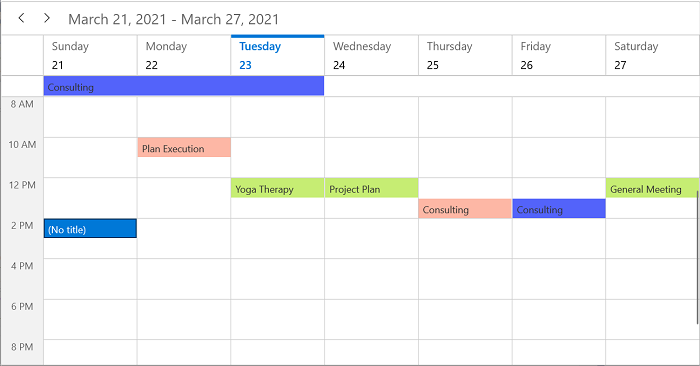

N> If you modify the timeInterval value (in minutes), you need to change the time labels format by setting the timeFormat value to hh:mm.

## Change time interval size

You can customize the interval size of timeslots in day, week, work week views by setting `TimeIntervalSize` property of `DaysViewSettings`.



 <syncfusion:SfScheduler x:Name="Schedule" ViewType="Week">
    <syncfusion:SfScheduler.DaysViewSettings>
        <syncfusion:DaysViewSettings 
            TimeIntervalSize="120"/>
        </syncfusion:SfScheduler.DaysViewSettings>
</syncfusion:SfScheduler>


this.Schedule.ViewType = SchedulerViewType.Week;
this.Schedule.DaysViewSettings.TimeIntervalSize = 120;



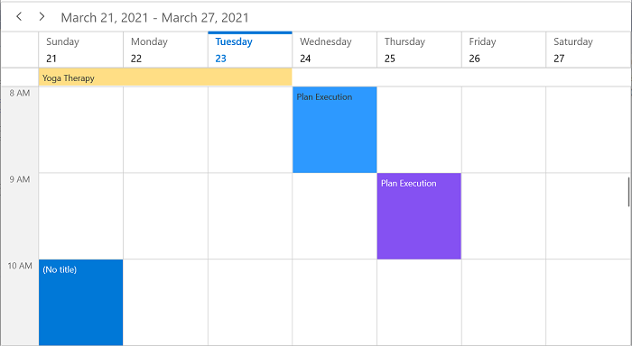

## Flexible working days and working hours

The default values for `StartHour` and `EndHour` are 0 and 24 to show all the timeslots in day, week, work week views. You can to set the `StartHour` and `EndHour` properties of `DaysViewSettings` to show only the required time duration for users. You can set `StartHour` and `EndHour` in time duration to show the required time duration in minutes.



<syncfusion:SfScheduler x:Name="Schedule" ViewType="Week">
    <syncfusion:SfScheduler.DaysViewSettings>
        <syncfusion:DaysViewSettings 
            StartHour="8"
            EndHour="13"/>
        </syncfusion:SfScheduler.DaysViewSettings>
</syncfusion:SfScheduler>


this.Schedule.ViewType = SchedulerViewType.Week;
this.Schedule.DaysViewSettings.StartHour = 8;
this.Schedule.DaysViewSettings.EndHour = 13;



N>
* The `NonWorkingDays` property will applicable only for `workWeek` and `TimelineWorkWeek` views only, and not applicable for the remaining views.
* Scheduler Appointments UI, which does not fall within the `StartHour` and `EndHour` will not be visible and if it falls partially, it will be clipped.
* No need to specify the decimal point values for `StartHour` and `EndHour`, if you don’t want to set the minutes.
* The number of time slots will be calculated based on total minutes of a day and time interval (total minutes of a day ((start hour - end hour) * 60) / time interval).
* If custom timeInterval is given, then the number of time slots calculated based on the given `TimeInterval` should result in integer value (total minutes % timeInterval = 0), otherwise next immediate time interval that result in integer value when divide total minutes of a day will be considered. For example, if TimeInterval=2 Hours 15 minutes and total minutes = 1440 (24 Hours per day), then `TimeInterval` will be changed to ‘144’ (1440%144=0) by considering (total minutes % TimeInterval = 0), it will return integer value for time slots rendering.
* If the custom `StartHour` and `EndHour` are given, then the number of time slots calculated based on given `StartHour` and `EndHour` should result in integer value, otherwise next immediate `TimeInterval` will be considered until the result is integer value. For example, if `StartHour` is 9 (09:00AM), `EndHour` is 18.25 (06:15 PM), `TimeInterval` is 30 minutes, and total minutes = 555 ((18.25-9)*60), then the `TimeInterval` will be changed to ’37 minutes’ (555%37=0) by considering (total minutes % timeInterval = 0). it will return integer value for time slots rendering.

## Special time regions

You can restrict the user interaction such as selection and highlights specific regions of time in day, week, work week views by adding the `SpecialTimeRegions` property of SfScheduler. You need to set the `StartTime` and `EndTime` properties of `SpecialTimeRegion` to create a `SpecialTimeRegion`, you can use the timeZone property to set the specific timezone for Start and end time of `SpecialTimeRegion`. The `SpecialTimeRegion` will display the text or image on it that set to the text or icon property of `SpecialTimeRegion`.

You can enable merges adjacent region of `SpecialTimeRegion` and show them as a single region instead of showing them separately for each day using the `CanMergeAdjacentRegions` property of `SpecialTimeRegion` in the week and workweek views. By default, its value is `false`.

### Selection restriction in timeslots

You can enable or disable the touch interaction of SpecialTimeRegion using the `CanEdit` property of `SpecialTimeRegion`. By default, its value is `true`.



this.Schedule.ViewType = SchedulerViewType.Week;
this.Schedule.DaysViewSettings.SpecialTimeRegions.Add(new SpecialTimeRegion
{
    StartTime = new System.DateTime(2021, 03, 23, 13, 0, 0),
    EndTime = new System.DateTime(2021, 03, 23, 14, 0, 0),
    Text = "Lunch",
    CanEdit = false,
    Background = new SolidColorBrush(Colors.LightGray),
    Foreground = new SolidColorBrush(Colors.White)
});



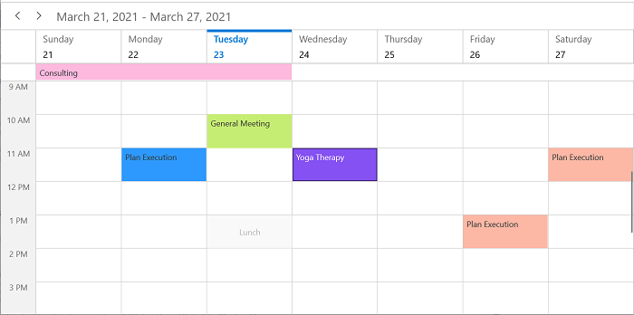

N> This property only restricts the interaction on region and it does not restrict the following:
* Programmatic selection (if the user updates the selected date value dynamically)
* Does not clear the selection when the user selects the region and dynamically change
the `CanEdit` property to false
* It does not restrict appointment interaction when the appointment placed
in the region
* It does not restrict the appointment rendering on a region, when appointments are loaded from data services or adding programmatically.

### Recurring time region

The recurring time region on a daily, weekly, monthly, or yearly interval. The recurring special time regions can be created by setting the `RecurrenceRule` property in `SpecialTimeRegion`.

You can enable merges adjacent region of `SpecialTimeRegion` and show them as a single region instead of showing them separately for each day using the `CanMergeAdjacentRegions` property of `SpecialTimeRegion` in the week and workweek views. By default, its value is `false`.



this.Schedule.ViewType = SchedulerViewType.Week;
this.Schedule.DaysViewSettings.SpecialTimeRegions.Add(new SpecialTimeRegion
{
    StartTime = new System.DateTime(2021, 03, 21, 13, 0, 0),
    EndTime = new System.DateTime(2021, 03, 21, 14, 0, 0),
    Text = "Lunch",
    CanEdit = false,
    Background = new SolidColorBrush(Colors.LightGray),
    Foreground = new SolidColorBrush(Colors.White),
    CanMergeAdjacentRegions = true,
    RecurrenceRule = "FREQ=DAILY;INTERVAL=1"
});



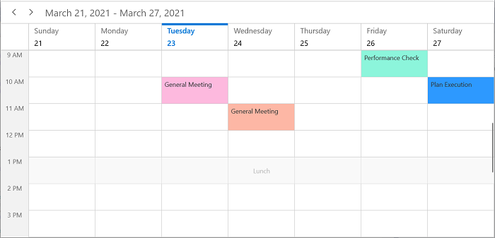

If the `CanMergeAdjacentRegions` of `SpecialTimeRegion` is set to false. The SpecialTimeRegion will be rendering on Date basis.

### Recurrence exception dates

You can delete any of occurrence that is an exception from the recurrence pattern time region by using the `RecurrenceExceptionDates` property of `SpecialTimeRegion`. The deleted occurrence date will be considered as a recurrence exception date.



this.Schedule.ViewType = SchedulerViewType.Week;
           
DateTime recurrenceExceptionDates = DateTime.Now.Date.AddDays(-1);
DateTime recurrenceExceptionDates1 = DateTime.Now.Date.AddDays(2);
this.Schedule.DaysViewSettings.SpecialTimeRegions.Add(new SpecialTimeRegion
{
    StartTime = new System.DateTime(2021, 03, 21, 13, 0, 0),
    EndTime = new System.DateTime(2021, 03, 21, 14, 0, 0),
    Text = "Lunch",
    CanEdit = false,
    RecurrenceRule = "FREQ=DAILY;INTERVAL=1",
    CanMergeAdjacentRegions = true,
    Background = new SolidColorBrush(Colors.LightGray),
    Foreground = new SolidColorBrush(Colors.White),
    RecurrenceExceptionDates = new ObservableCollection<DateTime>()
    {
        recurrenceExceptionDates,
        recurrenceExceptionDates1,
    }
});



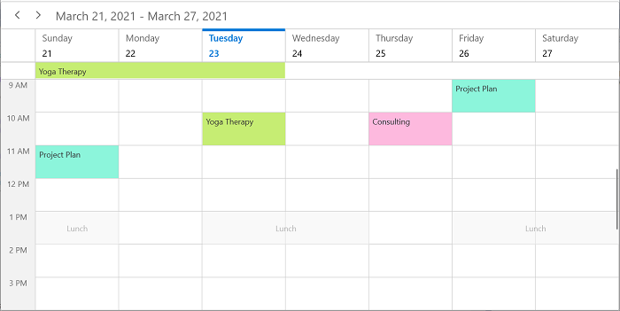

The `SpecialTimeRegion` in Date basis by setting the value of `CanMergeAdjacentRegions` is false.

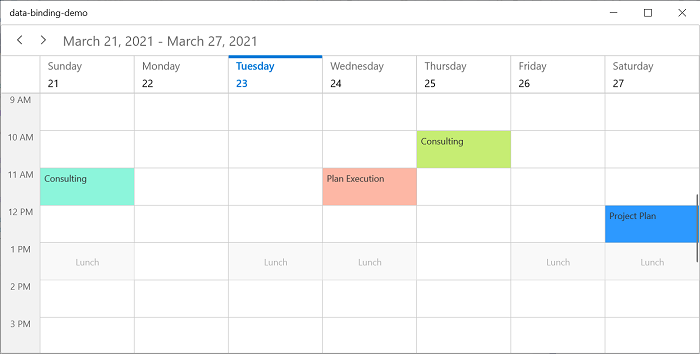

### Special time region customization

The `SpecialTimeRegion` background color can be customized by using the `Background` and `SpecialTimeRegionTemplate` properties of `SpecialTimeRegion` that is used to customize the text style for the image of the SpecialTimeRegion.



<Page.Resources>
    <DataTemplate x:Key="specialRegionTemplate">
        <Grid Background="{Binding Background}"
            Opacity="0.5"
            HorizontalAlignment="Stretch"
            VerticalAlignment="Stretch">
        <Path x:Name="Fork" Data="M11,0 C11.553001,0 12,0.4469986 12,1 L12,15 C12,15.553001 11.553001,16 11,16 10.446999,16 10,15.553001 10,15 L10,7 9,7 C8.4469986,7 8,6.5530014 8,6 L8,3 C8,1.3429985 9.3429985,0 11,0 z M0,0 L1,0 1.2340002,4 1.7810001,4 2,0 3,0 3.2340002,4 3.7810001,4 4,0 5,0 5,4 C5,4.9660001 4.3140001,5.7727499 3.4029064,5.9593439 L3.4007993,5.9597201 3.9114671,14.517 C3.9594617,15.321 3.3195295,16 2.5136147,16 L2.5076156,16 C1.6937013,16 1.0517693,15.309 1.1107631,14.497 L1.7400641,5.9826035 1.6955509,5.9769421 C0.73587513,5.8301721 0,5.0005002 0,4 z" Fill="Black" HorizontalAlignment="Center" Height="16"  Stretch="Fill" VerticalAlignment="Center" Width="12"/>
        </Grid>
    </DataTemplate>
</Page.Resources>





<syncfusion:SfScheduler x:Name="Schedule" ViewType="Week">
    <syncfusion:SfScheduler.DaysViewSettings>
        <syncfusion:DaysViewSettings  SpecialTimeRegionTemplate="{StaticResource specialRegionTemplate}">
        </syncfusion:DaysViewSettings>
    </syncfusion:SfScheduler.DaysViewSettings>
</syncfusion:SfScheduler>


this.Schedule.DaysViewSettings.SpecialTimeRegions.Add(new SpecialTimeRegion
{
    StartTime = new System.DateTime(2021, 03, 21, 13, 0, 0),
    EndTime = new System.DateTime(2021, 03, 21, 14, 0, 0),
    Text = "Lunch",
    CanEdit = false,
    RecurrenceRule = "FREQ=DAILY;INTERVAL=1",
    CanMergeAdjacentRegions = true,
    Background = new SolidColorBrush(Colors.LightGray),
    Foreground = new SolidColorBrush(Colors.White),
});



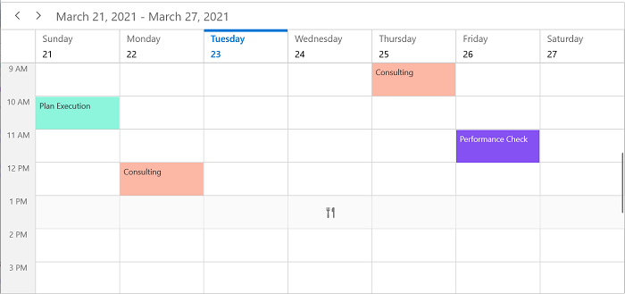

The `SpecialTimeRegion` can be customized in a Date basis by setting the value of `CanMergeAdjacentRegions` is false.

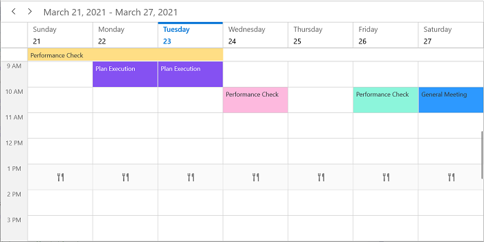

## Full screen scheduler

The Scheduler time interval size can be adjusted based on screen height by changing the value of `TimeIntervalSize` property of `DaysViewSettings` to -1. It will auto-fit to the screen height and width.



<syncfusion:SfScheduler x:Name="Schedule" ViewType="Week">
    <syncfusion:SfScheduler.DaysViewSettings>
        <syncfusion:DaysViewSettings 
            TimeIntervalSize="-1"/>
        </syncfusion:SfScheduler.DaysViewSettings>
</syncfusion:SfScheduler>


this.Schedule.ViewType = SchedulerViewType.Week;
this.Schedule.DaysViewSettings.TimeIntervalSize = -1;



## Change time ruler size

You can customize the size of the time ruler view where the labels mentioning the time are placed by using the `TimeRulerSize` property of `DayViewSettings`.



<syncfusion:SfScheduler x:Name="Schedule" ViewType="Week" >
    <syncfusion:SfScheduler.DaysViewSettings>
        <syncfusion:DaysViewSettings   
            TimeRulerSize="100">
        </syncfusion:DaysViewSettings>
    </syncfusion:SfScheduler.DaysViewSettings>
</syncfusion:SfScheduler>


this.Schedule.ViewType = SchedulerViewType.Week;
this.Schedule.DaysViewSettings.TimeRulerSize = 100;



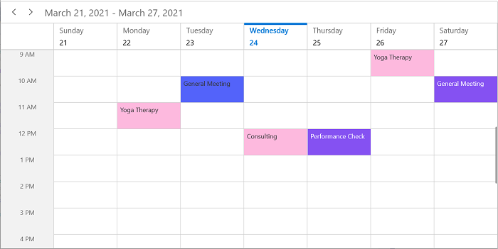

## Minimum appointment duration

The `MinimumAppointmentDuration` property in `DayViewSettings` is to set an arbitrary height to appointments when it has minimum duration,in day, week, work week views, so that the subject can be readable.



this.Schedule.ViewType = SchedulerViewType.Week;
this.Schedule.DaysViewSettings.MinimumAppointmentDuration = new System.TimeSpan(0, 120, 0);



N>
* The `MinimumAppointmentDuration` value will be set, when an appointment duration value lesser than `MinimumAppointmentDuration`.
* Appointment duration value will be set, when the appointment duration value greater than `MinimumAppointmentDuration`.
* `TimeInterval` value will be set, when `MinimumAppointmentDuration` greater than `TimeInterval` with lesser appointment duration.
* All day Appointment does not support `MinimumAppointmentDuration`.

## Time text formatting

You can customize the format for the labels mentioning the time, by setting the `TimeRulerFormat` property of `DayViewSettings` in Scheduler.



this.Schedule.ViewType = SchedulerViewType.Week;
this.Schedule.DaysViewSettings.TimeRulerFormat = "hh mm";
this.Schedule.DaysViewSettings.TimeInterval = new System.TimeSpan(0, 30, 0);



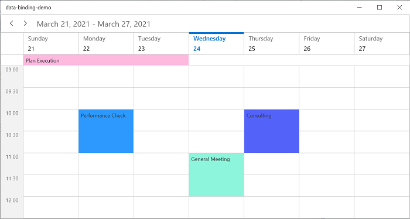

## View header

You can customize the default appearance of view header in day, week, work week views by setting `ViewHeaderDateFormat`, `ViewHeaderHeight`, `ViewHeaderDayFormat` and `ViewHeaderTemplate` of `DaysViewSettings`.

### View header text formatting

You can customize the date and day format of ViewHeader by using the `ViewHeaderDateFormat` and `ViewHeaderDayFormat` properties of `DaysViewSettings`.



<syncfusion:SfScheduler x:Name="Schedule" ViewType="Week">
    <syncfusion:SfScheduler.DaysViewSettings>
        <syncfusion:DaysViewSettings 
            ViewHeaderDayFormat="ddd"
            ViewHeaderDateFormat="dd"/>
    </syncfusion:SfScheduler.DaysViewSettings>
</syncfusion:SfScheduler>


this.Schedule.ViewType = SchedulerViewType.Week;
this.Schedule.DaysViewSettings.ViewHeaderDateFormat = "dd";
this.Schedule.DaysViewSettings.ViewHeaderDayFormat = "ddd";



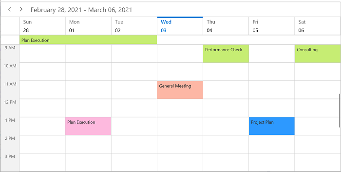

### View header height

You can customize the height of the ViewHeader in day , week , work week views by setting `ViewHeaderHeight` property of `DaysViewSettings` in SfScheduler.



<syncfusion:SfScheduler x:Name="Schedule" ViewType="Week">
    <syncfusion:SfScheduler.DaysViewSettings>
        <syncfusion:DaysViewSettings
            ViewHeaderHeight="100"/>
    </syncfusion:SfScheduler.DaysViewSettings>
</syncfusion:SfScheduler>


this.Schedule.ViewType = SchedulerViewType.Week;
this.Schedule.DaysViewSettings.ViewHeaderHeight = 100;



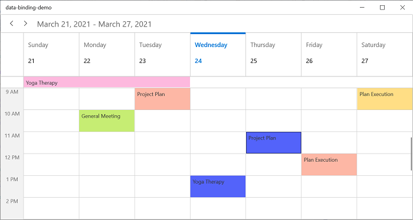

### View header appearance customization

You can customize the default appearance of view header by setting `ViewHeaderTemplate` property of `DaysViewSettings` in SfScheduler.



<Page.Resources>
    <DataTemplate x:Key="viewHeaderTemplate">
        <StackPanel Background="Transparent"  
            Width="Auto"
            VerticalAlignment="Center" 
            HorizontalAlignment="Stretch"
            Orientation="Vertical">
        <TextBlock 
            HorizontalAlignment="Left" 
            VerticalAlignment="Center" 
            Foreground="#8551F2"
            FontFamily="Arial"
            Text="{Binding DateText}"
            FontSize="25"
            TextTrimming="CharacterEllipsis"
            TextWrapping="Wrap" />
        <TextBlock 
            HorizontalAlignment="Left" 
            VerticalAlignment="Center" 
            Foreground="#8551F2"
            FontFamily="Arial"
            Text="{Binding DayText}"
            FontSize="10"
            TextTrimming="CharacterEllipsis"
            TextWrapping="Wrap" />
        </StackPanel>
    </DataTemplate>
</Page.Resources>





<syncfusion:SfScheduler x:Name="Schedule" ViewType="Week">
    <syncfusion:SfScheduler.DaysViewSettings>
        <syncfusion:DaysViewSettings 
            ViewHeaderTemplate="{StaticResource viewHeaderTemplate}" />
    </syncfusion:SfScheduler.DaysViewSettings>
</syncfusion:SfScheduler>



