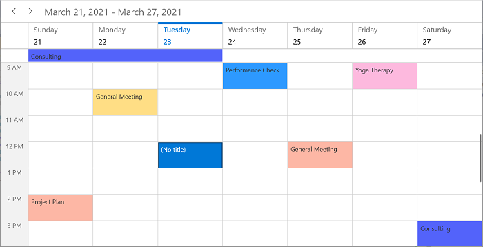
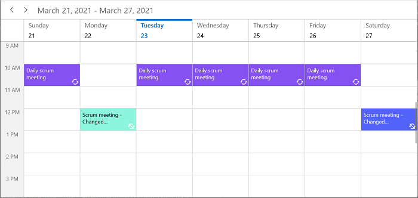
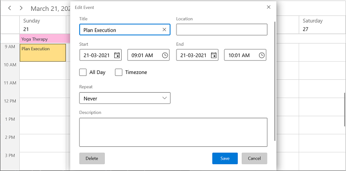

# WinUI Scheduler Overview

The Syncfusion WinUI Scheduler displays appointments in different views and allows user to create and manage appointments. Its rich feature set includes functionalities like viewing daily/all day/spanned appointments, complete customization using custom Templates, efficient performance, Data binding to different sources.

## Key features

* **Built-in Views** - The Scheduler provides eight different types of views such as Day, Week, WorkWeek, TimelineDay, TimelineWeek, TimelineWorkWeek, TimelineMonth, and Month.

* **Events** - Appointments contain information on events scheduled at specific times. In addition to default appointments, the users can use their own collections to connect a business entity to an appointment by mapping their fields, such as start time, end time, subject, notes, and recurrence.

* **Recurrence Events** - Easily configure recurring events on a daily, weekly, monthly, or yearly basis. You can also skip or change the occurrence of a recurring appointment.

* **Appointment Mapping** - SfScheduler control supports to map any collection that implements the IEnumerable interface to populate appointments.

* **Appointment Editor** - You can easily create, edit, or delete appointments using the built-in appointment editor.

* **Timezone** - Display appointments created in various time zones in the system time zone. Appointment start and end times are also automatically adjusted and displayed based on the daylight savings time.

* **First day of the week** - Customize the first day of the week as needed. The default first day is Sunday.

* **Flexible working days** - Customize the workdays in a workweek so that the remaining days will be hidden from view.

* **Appearance Customization** - Provide a unique look to your scheduler with the event appearance customization.

* **Localization** - Display the current date and time by following the globalized date and time formats, and localize all available static texts in the SfScheduler.

* **LoadOnDemand** - The SfScheduler supports loading appointments on-demand with loading indicator and it improves the loading performance when you have appointments range for multiple years.