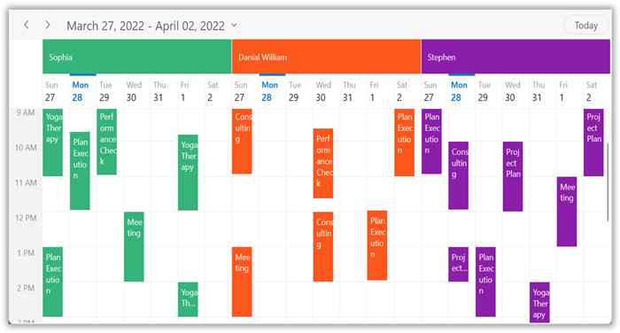
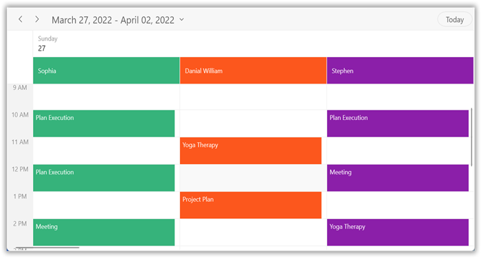
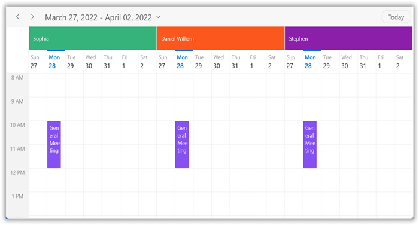
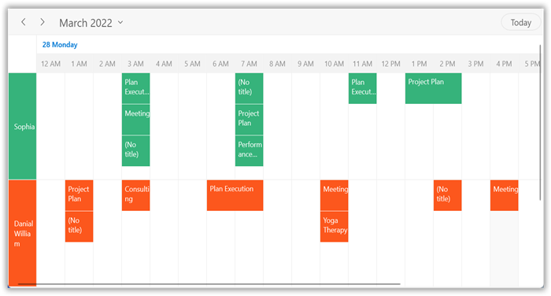
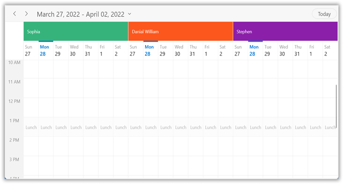
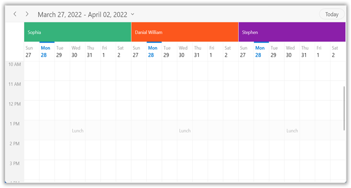
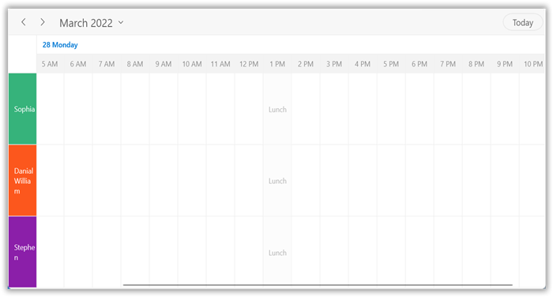
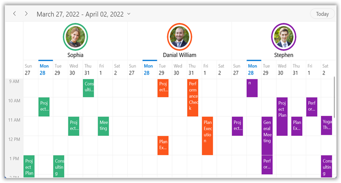
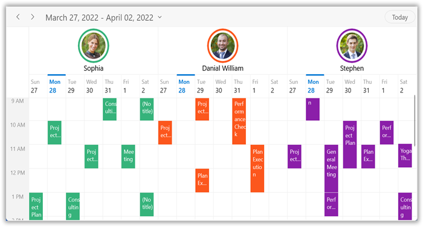

# Resource Grouping in WinUI Scheduler (SfScheduler)

The scheduler resource view will allow the group appointments based on the resources or dates, arranged by the column, or row in the day, week, workweek, timeline day, timeline week, timeline workweek, and timeline month views. It also allows to share the events or appointments to the multiple resources and resource appointment details that can be edited by using a built-in appointment editor dialog.

## Grouping by resources

Resources can be added to the scheduler by setting the [ResourceGroupType](https://help.syncfusion.com/cr/winui/Syncfusion.UI.Xaml.Scheduler.ResourceGroupType.html) property as [Resource](https://help.syncfusion.com/cr/winui/Syncfusion.UI.Xaml.Scheduler.ResourceGroupType.html#Syncfusion_UI_Xaml_Scheduler_ResourceGroupType_Resource) in SfScheduler. Set the [Id](https://help.syncfusion.com/cr/winui/Syncfusion.UI.Xaml.Scheduler.SchedulerResource.html#Syncfusion_UI_Xaml_Scheduler_SchedulerResource_Id), [Name](https://help.syncfusion.com/cr/winui/Syncfusion.UI.Xaml.Scheduler.SchedulerResource.html#Syncfusion_UI_Xaml_Scheduler_SchedulerResource_Name), [Foreground](https://help.syncfusion.com/cr/winui/Syncfusion.UI.Xaml.Scheduler.SchedulerResource.html#Syncfusion_UI_Xaml_Scheduler_SchedulerResource_Foreground), and [Background](https://help.syncfusion.com/cr/winui/Syncfusion.UI.Xaml.Scheduler.SchedulerResource.html#Syncfusion_UI_Xaml_Scheduler_SchedulerResource_Background) properties of [SchedulerResource](https://help.syncfusion.com/cr/winui/Syncfusion.UI.Xaml.Scheduler.SchedulerResource.html) to create a resource. Add the resource to the scheduler by using the [ResourceCollection](https://help.syncfusion.com/cr/winui/Syncfusion.UI.Xaml.Scheduler.SfScheduler.html#Syncfusion_UI_Xaml_Scheduler_SfScheduler_ResourceCollection) property of SfScheduler and also add or remove the scheduler resources dynamically.

N> No resource view will be displayed even the resource added using the [ResourceCollection](https://help.syncfusion.com/cr/winui/Syncfusion.UI.Xaml.Scheduler.SfScheduler.html#Syncfusion_UI_Xaml_Scheduler_SfScheduler_ResourceCollection) property when the [ResourceGroupType](https://help.syncfusion.com/cr/winui/Syncfusion.UI.Xaml.Scheduler.ResourceGroupType.html) property value is set to [None](https://help.syncfusion.com/cr/winui/Syncfusion.UI.Xaml.Scheduler.ResourceGroupType.html#Syncfusion_UI_Xaml_Scheduler_ResourceGroupType_None).



<scheduler:SfScheduler x:Name="Schedule"  
                       ViewType="Week"
                       ResourceGroupType="Resource"
                       ResourceCollection="{Binding ResourceCollection}">
</scheduler:SfScheduler>


// Adding schedule resource in the scheduler resource collection.
var ResourceCollection = new ObservableCollection<SchedulerResource>()
{
   new SchedulerResource() { Name = "Sophia", Foreground = new SolidColorBrush(Colors.White), Background = new SolidColorBrush(Color.FromArgb(255,54, 179, 123)), Id = "1000" },
   new SchedulerResource() { Name = "Zoey Addison", Foreground = new SolidColorBrush(Colors.White), Background = new SolidColorBrush(Color.FromArgb(255,252,87,29)), Id = "1001" },
   new SchedulerResource() { Name = "James William", Foreground = new SolidColorBrush(Colors.White), Background = new SolidColorBrush(Color.FromArgb(255, 139,31,169)), Id = "1002" },
};

// Adding the scheduler resource collection to the schedule resources of SfSchedule.
this.Schedule.ResourceCollection = ResourceCollection;



N> [View sample in GitHub](https://github.com/SyncfusionExamples/WinUI-Scheduler-Examples/tree/main/ResourceGrouping)

## Resource grouping types

Group the resource order by [Date](https://help.syncfusion.com/cr/winui/Syncfusion.UI.Xaml.Scheduler.ResourceGroupType.html#Syncfusion_UI_Xaml_Scheduler_ResourceGroupType_Date) or order by [Resource](https://help.syncfusion.com/cr/winui/Syncfusion.UI.Xaml.Scheduler.ResourceGroupType.html#Syncfusion_UI_Xaml_Scheduler_ResourceGroupType_Resource) using the [ResourceGroupType](https://help.syncfusion.com/cr/winui/Syncfusion.UI.Xaml.Scheduler.ResourceGroupType.html) property of SfScheduler.

N> Group the resource order in the day, week, workweek, timeline day, timeline week, timeline workweek, and timeline month views.

### Resource

The [ResourceGroupType](https://help.syncfusion.com/cr/winui/Syncfusion.UI.Xaml.Scheduler.ResourceGroupType.html) is set to [Resource](https://help.syncfusion.com/cr/winui/Syncfusion.UI.Xaml.Scheduler.ResourceGroupType.html#Syncfusion_UI_Xaml_Scheduler_ResourceGroupType_Resource) to group the number of dates under each resource.








this.Schedule.ViewType = SchedulerViewType.Week;
this.Schedule.ResourceGroupType = ResourceGroupType.Resource;

// Adding schedule resource in the scheduler resource collection.
var ResourceCollection = new ObservableCollection<SchedulerResource>()
{
   new SchedulerResource() { Name = "Sophia", Foreground = new SolidColorBrush(Colors.White), Background = new SolidColorBrush(Color.FromArgb(255,54, 179, 123)), Id = "1000" },
   new SchedulerResource() { Name = "Zoey Addison", Foreground = new SolidColorBrush(Colors.White), Background = new SolidColorBrush(Color.FromArgb(255,252,87,29)), Id = "1001" },
   new SchedulerResource() { Name = "James William", Foreground = new SolidColorBrush(Colors.White), Background = new SolidColorBrush(Color.FromArgb(255, 139,31,169)), Id = "1002" },
};

// Adding the scheduler resource collection to the schedule resources of SfSchedule.
this.Schedule.ResourceCollection = ResourceCollection;



### Date

The [ResourceGroupType](https://help.syncfusion.com/cr/winui/Syncfusion.UI.Xaml.Scheduler.ResourceGroupType.html) is set to Date to group the number of resources under each date.



<scheduler:SfScheduler x:Name="Schedule"  
                       ViewType="Week"
                       ResourceGroupType="Date">
</scheduler:SfScheduler>


this.Schedule.ViewType = SchedulerViewType.Week;
this.Schedule.ResourceGroupType = ResourceGroupType.Date;

// Adding schedule resource in the scheduler resource collection.
var ResourceCollection = new ObservableCollection<SchedulerResource>()
{
   new SchedulerResource() { Name = "Sophia", Foreground = new SolidColorBrush(Colors.White), Background = new SolidColorBrush(Color.FromArgb(255,54, 179, 123)), Id = "1000" },
   new SchedulerResource() { Name = "Zoey Addison", Foreground = new SolidColorBrush(Colors.White), Background = new SolidColorBrush(Color.FromArgb(255,252,87,29)), Id = "1001" },
   new SchedulerResource() { Name = "James William", Foreground = new SolidColorBrush(Colors.White), Background = new SolidColorBrush(Color.FromArgb(255, 139,31,169)), Id = "1002" },
};

// Adding the scheduler resource collection to the schedule resources of SfSchedule.
this.Schedule.ResourceCollection = ResourceCollection;



## Assigning resources to appointments

Appointments associated with the scheduler [ResourceCollection](https://help.syncfusion.com/cr/winui/Syncfusion.UI.Xaml.Scheduler.SfScheduler.html#Syncfusion_UI_Xaml_Scheduler_SfScheduler_ResourceCollection)  will be displayed by setting the schedule resource Id in the [ScheduleAppointment](https://help.syncfusion.com/cr/winui/Syncfusion.UI.Xaml.Scheduler.ScheduleAppointment.html) by using the [ResourceIdCollection](https://help.syncfusion.com/cr/winui/Syncfusion.UI.Xaml.Scheduler.ScheduleAppointment.html#Syncfusion_UI_Xaml_Scheduler_ScheduleAppointment_ResourceIdCollection). For [ResourceGroupType](https://help.syncfusion.com/cr/winui/Syncfusion.UI.Xaml.Scheduler.ResourceGroupType.html) set as [Resource](https://help.syncfusion.com/cr/winui/Syncfusion.UI.Xaml.Scheduler.ResourceGroupType.html#Syncfusion_UI_Xaml_Scheduler_ResourceGroupType_Resource) or [Date](https://help.syncfusion.com/cr/winui/Syncfusion.UI.Xaml.Scheduler.ResourceGroupType.html#Syncfusion_UI_Xaml_Scheduler_ResourceGroupType_Date). Also assign the resources to `recurrence appointments.`








// Creating an instance for the schedule appointment collection.
var scheduleAppointmentCollection = new ScheduleAppointmentCollection();
//Adding schedule appointment in the schedule appointment collection. 
var appointments = new ScheduleAppointment()
{
    StartTime = DateTime.Now,
    EndTime = DateTime.Now.AddHours(2),
    Subject = "General Meeting",
    ResourceIdCollection = new ObservableCollection<object>() { "1000", "1001" }
};
//Adding the schedule appointment to the schedule appointment collection.
scheduleAppointmentCollection.Add(appointments);
//Adding the schedule appointment collection to the ItemsSource of SfScheduler.
this.Schedule.ItemsSource = scheduleAppointmentCollection;



N>
* When the `ResourceIdCollection` is not added to `ScheduleAppointment` then the appointment will not be displayed when `ResourceGroupType` is set to `Resource` or `Date.`
* When `ResourceGroupType` is set to `None,` the resource view will be collapsed and all scheduler DataSource events will be displayed.
* Also add or remove the appointment resources dynamically.

#### Multiple resource sharing

Multiple resources can share the same events or appointments. If the appointment details are edited or updated, then the changes will be reflected on all other shared instances simultaneously.








// Creating an instance for schedule appointment collection.
var scheduleAppointmentCollection = new ScheduleAppointmentCollection();
//Adding schedule appointment in the schedule appointment collection. 
var appointments = new ScheduleAppointment()
{
   StartTime = DateTime.Now,
   EndTime = DateTime.Now.AddHours(2),
   Subject = "General Meeting",
   ResourceIdCollection = new ObservableCollection<object>() { "1000", "1001","1002" },
   AppointmentBackground = new SolidColorBrush(Color.FromArgb(255, 133, 81, 242)),
};
//Adding the schedule appointment to the schedule appointment collection.
scheduleAppointmentCollection.Add(appointments);
//Adding the schedule appointment collection to the ItemsSource of SfScheduler.
this.Schedule.ItemsSource = scheduleAppointmentCollection;



## Scheduler resource mapping

The Schedule supports full data binding to [ResourceCollection](https://help.syncfusion.com/cr/winui/Syncfusion.UI.Xaml.Scheduler.SfScheduler.html#Syncfusion_UI_Xaml_Scheduler_SfScheduler_ResourceCollection). Specify the [ResourceMapping](https://help.syncfusion.com/cr/winui/Syncfusion.UI.Xaml.Scheduler.ResourceMapping.html) attribute to map the properties in the underlying data source to the schedule resource.

| Property Name | Description |
|-------------------------------------------------------------------------------------------------------------------------------------------------------------------------------------------------------|--------------------------------------------------------------------------------------------------------------------------|
| Name | Maps the property name of custom class, which is equivalent to Name in ScheduleResource. |
| Id | Maps the property name of custom class, which is equivalent to Id in ScheduleResource. |
| Background | Maps the property name of custom class, which is equivalent to Background in ScheduleResource. |
| Foreground | Maps the property name of custom class, which is equivalent to Foreground in ScheduleResource. |

N> Custom resource class should contain a mandatory field for resource `Id`.

## Create business object for resource

Create a custom class employee with mandatory fields `Name,` `Id,` `ForegroundColor,` and `BackgroundColor.` Also assign the resources to `recurrence appointments.`



public class Employee
{
   public string Name {get; set;}

   public string Id {get; set;}

   public Brush BackgroundColor {get; set; }

   public Brush ForegroundColor {get; set; }
}




N> 
* Inherit this class from `NotificationObject` for dynamic changes in custom data.
* The [SchedulerResource.Data](https://help.syncfusion.com/cr/wpf/Syncfusion.UI.Xaml.Scheduler.SchedulerResource.html#Syncfusion_UI_Xaml_Scheduler_SchedulerResource_Data) property is used to get the details of custom data.

Map the properties of the `Employee` class with SfScheduler control using the Scheduler `ResourceMapping.`



<scheduler:SfScheduler Name="Schedule" ViewType="Week" ResourceGroupType="Resource">
    <scheduler:SfScheduler.ResourceMapping>
       <scheduler:ResourceMapping Id="Id" Name="Name" Background="BackgroundColor" Foreground="ForegroundColor"/>
    </scheduler:SfScheduler.ResourceMapping>
</scheduler:SfScheduler>


 // Schedule data mapping for custom resource.
ResourceMapping resourceMapping = new ResourceMapping();
resourceMapping.Name = "Name";
resourceMapping.Id = "Id";
resourceMapping.Background = "BackgroundColor";
resourceMapping.Foreground = "ForegroundColor";
this.Schedule.ResourceMapping = resourceMapping;



#### Assign resource object collection

Add the resources of `Employee` collection that can be assigned to the scheduler using the [ResourceCollection](https://help.syncfusion.com/cr/winui/Syncfusion.UI.Xaml.Scheduler.SfScheduler.html#Syncfusion_UI_Xaml_Scheduler_SfScheduler_ResourceCollection) property which is of `IEnumerable` type. Also add or remove scheduler resources dynamically.



<scheduler:SfScheduler Name="Schedule" ViewType="Week" ResourceGroupType="Resource">
    <scheduler:SfScheduler.ResourceMapping>
       <scheduler:ResourceMapping Id="Id" Name="Name" Background="BackgroundColor" Foreground="ForegroundColor"/>
    </scheduler:SfScheduler.ResourceMapping>
</scheduler:SfScheduler>


// Creating and Adding custom resource in scheduler resource collection.
var ResourceCollection = new ObservableCollection<Employee>()
{
   new Employee () {Name = "Sophia", BackgroundColor = new SolidColorBrush((Color.FromArgb(255, 157, 101, 201))), Id = "1000", ForegroundColor = new SolidColorBrush(Colors.White) },
   new Employee () {Name = "Zoey Addison", BackgroundColor = new SolidColorBrush(Color.FromArgb(255, 240, 138, 93)), Id = "1001" , ForegroundColor = new SolidColorBrush(Colors.White)},
   new Employee () {Name = "James William", BackgroundColor = new SolidColorBrush(Color.FromArgb(255,103, 155, 155)), Id = "1002" , ForegroundColor = new SolidColorBrush(Colors.White)},
};

// Adding the scheduler resource collection to the schedule resources of SfSchedule.
this.Schedule.ResourceCollection = ResourceCollection;



#### Assign the resource objects to appointment business object

Associate the scheduler [ResourceMapping](https://help.syncfusion.com/cr/wpf/Syncfusion.UI.Xaml.Scheduler.ResourceMapping.html) to the custom appointment by mapping resource [Id](https://help.syncfusion.com/cr/winui/Syncfusion.UI.Xaml.Scheduler.ScheduleAppointment.html#Syncfusion_UI_Xaml_Scheduler_ScheduleAppointment_Id) in the [ResourceIdCollection](https://help.syncfusion.com/cr/winui/Syncfusion.UI.Xaml.Scheduler.ScheduleAppointment.html#Syncfusion_UI_Xaml_Scheduler_ScheduleAppointment_ResourceIdCollection) property of [AppointmentMapping](https://help.syncfusion.com/cr/wpf/Syncfusion.UI.Xaml.Scheduler.AppointmentMapping.html). The custom appointments associated with the scheduler resources will be displayed when the `ResourceGroupType` is set to `Resource` or `Date.` Also assign the resources to recurrence appointments.



/// 
   
/// Represents the custom data properties.   
/// 
 
public class Meeting
{
	public string EventName {get; set;}
	public DateTime From {get; set;}
	public DateTime To {get; set;}
   public ObservableCollection<object> Resources {get; set;}
}



N> Inherit this class from the `NotificationObject` for dynamic changes in custom data.

Map those properties of the `Meeting` class to schedule appointments by using the `AppointmentMapping` properties.



<scheduler:SfScheduler x:Name="Schedule" ItemsSource="{Binding Appointments}" ViewType="Week">
         <scheduler:SfScheduler.AppointmentMapping>
            <scheduler:AppointmentMapping
            Subject="EventName"
            StartTime="From"
            EndTime="To"
            ResourceIdCollection ="Resources"/>
        </scheduler:SfScheduler.AppointmentMapping>
</scheduler:SfScheduler>


//Schedule data mapping for custom appointments
AppointmentMapping dataMapping = new AppointmentMapping();
dataMapping.Subject = "EventName";
dataMapping.StartTime = "From";
dataMapping.EndTime = "To";
dataMapping.AppointmentBackground = "Color";
dataMapping.ResourceIdCollection= "Resources";
this.Schedule.AppointmentMapping = dataMapping;



Schedule meetings for a resource by setting `From,` `To,` and `Resources` of the Meeting class.



Meeting meeting = new Meeting ();
meeting.From = new DateTime(2020, 07, 01, 10, 0, 0);
meeting.To = meeting.From.AddHours(1);
meeting.EventName = "Meeting";
meeting.Resources = new ObservableCollection<object> { (Resources[0] as Employee).Id, (Resources[1] as Employee).Id };
var Meetings = new ObservableCollection<Meeting> ();
Meetings.Add(meeting);
this.Schedule.ItemsSource = Meetings;



## Resource header size

Customize the resource header size in the day, week, workweek, timeline day, timeline week, timeline workweek, and timeline month views by using the [ResourceHeaderSize](https://help.syncfusion.com/cr/winui/Syncfusion.UI.Xaml.Scheduler.ViewSettingsBase.html#Syncfusion_UI_Xaml_Scheduler_ViewSettingsBase_ResourceHeaderSize) property of [DaysViewSettings](https://help.syncfusion.com/cr/winui/Syncfusion.UI.Xaml.Scheduler.DaysViewSettings.html) or [TimelineViewSettings](https://help.syncfusion.com/cr/winui/Syncfusion.UI.Xaml.Scheduler.TimelineViewSettings.html) in SfScheduler.

#### Resource header height in days view

The [DaysViewSettings](https://help.syncfusion.com/cr/winui/Syncfusion.UI.Xaml.Scheduler.DaysViewSettings.html) is applicable for `Day,` `Week,` and `WorkWeek` views. By default, the value of this property is set to `50.`



<scheduler:SfScheduler x:Name="Schedule"  
                       ViewType="Week"
                       ResourceGroupType="Resource">
   <scheduler:SfScheduler.DaysViewSettings>
      <scheduler:DaysViewSettings 
                        ResourceHeaderSize="100"/>
   </scheduler:SfScheduler.DaysViewSettings>
</scheduler:SfScheduler>


this.Schedule.ViewType = SchedulerViewType.Week;
this.Schedule.DaysViewSettings.ResourceHeaderSize = 100;



#### Resource header width in timeline view

The [TimelineViewSettings](https://help.syncfusion.com/cr/winui/Syncfusion.UI.Xaml.Scheduler.TimelineViewSettings.html) is applicable for timeline day, timeline week, timeline workweek, and timeline month views. By default, the value of this property is set to 50.



<scheduler:SfScheduler x:Name="Schedule"  
                       ViewType="TimelineWeek"
                       ResourceGroupType="Resource">
   <scheduler:SfScheduler.TimelineViewSettings>
         <scheduler:TimelineViewSettings 
                        ResourceHeaderSize="100"/>
   </scheduler:SfScheduler.TimelineViewSettings>
</scheduler:SfScheduler>


this.Schedule.ViewType = SchedulerViewType.TimelineWeek;
this.Schedule.TimelineViewSettings.ResourceHeaderSize = 100;



## Resource auto height
The resource row height gets auto-adjusted based on the number of overlapping appointments occupied on the same time range by setting [RowAutoHeight](https://help.syncfusion.com/cr/winui/Syncfusion.UI.Xaml.Scheduler.TimelineViewSettings.html#Syncfusion_UI_Xaml_Scheduler_TimelineViewSettings_RowAutoHeight) property as `true` in [TimelineViewSettings.](https://help.syncfusion.com/cr/winui/Syncfusion.UI.Xaml.Scheduler.TimelineViewSettings.html) By default, value of this property is set to `false.` 



<Schedule:SfScheduler Name="schedule" 
                      ViewType="TimelineWeek"
                      ResourceGroupType="Resource">
   <Schedule:SfScheduler.TimelineViewSettings>
      <Schedule:TimelineViewSettings 
                      RowAutoHeight="True" />
   </Schedule:SfScheduler.TimelineViewSettings>
</Schedule:SfScheduler>


 schedule.TimelineViewSettings.RowAutoHeight = true;



N> * [View sample in GitHub](https://github.com/SyncfusionExamples/WinUI-Scheduler-Examples/tree/main/ResourceAutoRowHeight)

N> 
 * This auto row height adjustment is applicable only on all the Timeline views such as timeline day, timeline week, timeline workweek and timeline month views.
 * If auto resource row height is enabled then [VisibleResourceCount](https://help.syncfusion.com/cr/winui/Syncfusion.UI.Xaml.Scheduler.ViewSettingsBase.html#Syncfusion_UI_Xaml_Scheduler_ViewSettingsBase_VisibleResourceCount) will not be applicable and if resources have no appointments, then [RowMinHeight](https://help.syncfusion.com/cr/winui/Syncfusion.UI.Xaml.Scheduler.TimelineViewSettings.html#Syncfusion_UI_Xaml_Scheduler_TimelineViewSettings_RowMinHeight) will be considered as default resource row height.

## Resource minimum height
You can customize minimum row height of visible resources in timeline day, timeline week, timeline workweek and timeline month views by using the [RowMinHeight](https://help.syncfusion.com/cr/winui/Syncfusion.UI.Xaml.Scheduler.TimelineViewSettings.html#Syncfusion_UI_Xaml_Scheduler_TimelineViewSettings_RowMinHeight) property of [TimelineViewSettings](https://help.syncfusion.com/cr/winui/Syncfusion.UI.Xaml.Scheduler.TimelineViewSettings.html) in [SfScheduler.](https://help.syncfusion.com/cr/winui/Syncfusion.UI.Xaml.Scheduler.SfScheduler.html) By default, value of this property is set to 50.



<Schedule:SfScheduler Name="schedule" 
                      ViewType="TimelineWeek" 
                      ResourceGroupType="Resource">
   <Schedule:SfScheduler.TimelineViewSettings>
      <Schedule:TimelineViewSettings 
                     RowMinHeight="100" />
   </Schedule:SfScheduler.TimelineViewSettings>
</Schedule:SfScheduler>


 schedule.TimelineViewSettings.RowMinHeight = 100;

 

N> The minimum resource row height adjusted based on view port size and the [VisibleResourceCount](https://help.syncfusion.com/cr/winui/Syncfusion.UI.Xaml.Scheduler.ViewSettingsBase.html#Syncfusion_UI_Xaml_Scheduler_ViewSettingsBase_VisibleResourceCount) will not be applicable. 

## Visible resource count

Customize the number of visible resources in the day, week, workweek, timeline day, timeline week, timeline workweek, and timeline month views by using the [VisibleResourceCount](https://help.syncfusion.com/cr/winui/Syncfusion.UI.Xaml.Scheduler.ViewSettingsBase.html#Syncfusion_UI_Xaml_Scheduler_ViewSettingsBase_VisibleResourceCount) property of `DaysViewSettings` or `TimelineViewSettings` in SfScheduler.

N> If the visible resource count exceeds the count of schedule `ResourceCollection` count then the schedule `ResourceCollection` count will be displayed.

#### Visible resource count in days view

The `DaysViewSettings` applicable for Day, Week, and WorkWeek views. By default, the value of this property is set to `3.`



<scheduler:SfScheduler x:Name="Schedule"  
                       ViewType="Week"
                       ResourceGroupType="Resource">
   <scheduler:SfScheduler.DaysViewSettings>
      <scheduler:DaysViewSettings 
                     VisibleResourceCount="2"/>
   </scheduler:SfScheduler.DaysViewSettings>
</scheduler:SfScheduler>


this.Schedule.ViewType = SchedulerViewType.Week;
this.Schedule.DaysViewSettings.VisibleResourceCount = 2;



#### Visible resource count in timeline views

The [TimelineViewSettings](https://help.syncfusion.com/cr/winui/Syncfusion.UI.Xaml.Scheduler.TimelineViewSettings.html) is applicable for timeline day, timeline week, timeline workweek, and timeline month views. By default, the value of this property is set to `3.`



<scheduler:SfScheduler x:Name="Schedule"  
                       ViewType="TimelineWeek"
                       ResourceGroupType="Resource">
   <scheduler:SfScheduler.TimelineViewSettings>
      <scheduler:TimelineViewSettings 
                        VisibleResourceCount="2"/>
   </scheduler:SfScheduler.TimelineViewSettings>
</scheduler:SfScheduler>


this.Schedule.ViewType = SchedulerViewType.TimelineWeek;
this.Schedule.TimelineViewSettings.VisibleResourceCount = 2;



## Assign resources to special time regions

Special time region can be created based on the resources in the day, week, workweek, timeline day, timeline week, timeline workweek, and timeline month views.








this.Schedule.DaysViewSettings.SpecialTimeRegions.Add(new SpecialTimeRegion
{
   StartTime = new System.DateTime(2021, 04, 04, 13, 0, 0),
   EndTime = new System.DateTime(2021, 04, 04, 14, 0, 0),
   Text = "Lunch",
   CanEdit = false,
   RecurrenceRule = "FREQ=DAILY;INTERVAL=1",
   CanMergeAdjacentRegions = false,
   ResourceIdCollection = new ObservableCollection<object>() { "1000", "1001", "1002" }
});



N> The [SpecialTimeRegion](https://help.syncfusion.com/cr/winui/Syncfusion.UI.Xaml.Scheduler.SpecialTimeRegion.html) in a `Time basis` can be displayed by setting the value of [CanMergeAdjacentRegions](https://help.syncfusion.com/cr/winui/Syncfusion.UI.Xaml.Scheduler.SpecialTimeRegion.html#Syncfusion_UI_Xaml_Scheduler_SpecialTimeRegion_CanMergeAdjacentRegions) to `True.`

#### Assign resources to special time regions in timeline view







this.Schedule.TimelineViewSettings.SpecialTimeRegions.Add(new SpecialTimeRegion
{
   StartTime = new System.DateTime(2021, 04, 04, 13, 0, 0),
   EndTime = new System.DateTime(2021, 04, 04, 14, 0, 0),
   Text = "Lunch",
   CanEdit = false,
   RecurrenceRule = "FREQ=DAILY;INTERVAL=1",
   CanMergeAdjacentRegions = false,
   ResourceIdCollection = new ObservableCollection<object>() { "1000", "1001", "1002" }
});



## Appearance customization

The resource appearance customization can be achieved by using the [ResourceHeaderTemplate](https://help.syncfusion.com/cr/winui/Syncfusion.UI.Xaml.Scheduler.SfScheduler.html#Syncfusion_UI_Xaml_Scheduler_SfScheduler_ResourceHeaderTemplate) and [ResourceHeaderTemplateSelector](https://help.syncfusion.com/cr/winui/Syncfusion.UI.Xaml.Scheduler.SfScheduler.html#Syncfusion_UI_Xaml_Scheduler_SfScheduler_ResourceHeaderTemplateSelector) properties of the [SfScheduler](https://help.syncfusion.com/cr/winui/Syncfusion.UI.Xaml.Scheduler.SfScheduler.html).

#### Customize resource appearance using ResourceHeaderTemplate



<!--used to find Image Source and Name properties.-->
<Grid>
   <Grid.DataContext>
      <local:Employee />
   </Grid.DataContext>
   <Grid.Resources>
      <DataTemplate  x:Key="DayViewResourceTemplate">
         <Grid Background="Transparent">
            <Border Background="Transparent" >
               <StackPanel VerticalAlignment="Center" Orientation="Vertical">
                  <Border CornerRadius="36" Height="72" Width="72" BorderThickness="4" BorderBrush="{Binding Data.BackgroundBrush}">
                        <Border CornerRadius="36" Height="64" Width="64" BorderThickness="4" BorderBrush="White">
                        <Image HorizontalAlignment="Center" VerticalAlignment="Center" Width="55"
                          Height="55" Source="{Binding Data.ImageSource}" />
                        </Border>
                  </Border>
                  <TextBlock HorizontalAlignment="Center" VerticalAlignment="Center" FontSize="15"
                  Foreground="Black" Text="{Binding Data.Name}" />
               </StackPanel>
            </Border>
         </Grid>
      </DataTemplate>
   </Grid.Resources>
   <scheduler:SfScheduler x:Name="Schedule"  
                          ViewType="Week"
                          ResourceGroupType="Resource" 
                          ResourceCollection="{Binding ResourceCollection}"
                          ResourceHeaderTemplate="{StaticResource DayViewResourceTemplate}">
      <scheduler:SfScheduler.ResourceMapping>
         <scheduler:ResourceMapping Id="Id" Name="Name" Background="BackgroundBrush" Foreground="ForegroundBrush"/>
      </scheduler:SfScheduler.ResourceMapping>
   </scheduler:SfScheduler>
</Grid>



N> 
* By default, the `SchedulerResource` is set as the `DataContext` for the `ResourceHeaderTemplate` for both `SchedulerResource` and custom data object in the `ResourceCollection.`
* The custom data object can be bound in the `ResourceHeaderTemplate` by using the property of `SchedulerResource.Data.`

N> [View sample in GitHub](https://github.com/SyncfusionExamples/WinUI-Scheduler-Examples/tree/main/ResourceHeaderTemplate)

#### Customize resource appearance using ResourceHeaderTemplateSelector



<Grid>
   <Grid.Resources>
        <DataTemplate  x:Key="DayViewResourceTemplate">
            <Grid Background="Transparent">
                <Border Background="Transparent" >
                    <StackPanel VerticalAlignment="Center" Orientation="Vertical">
                        <Border CornerRadius="36" Height="72" Width="72" BorderThickness="4" BorderBrush="{Binding Data.BackgroundBrush}">
                            <Border CornerRadius="36" Height="64" Width="64" BorderThickness="4" BorderBrush="White">
                                <Image HorizontalAlignment="Center" VerticalAlignment="Center" Width="55"
                          Height="55" Source="{Binding Data.ImageSource}" />
                            </Border>
                        </Border>
                        <TextBlock HorizontalAlignment="Center" VerticalAlignment="Center" FontSize="15"
                   Foreground="Black" Text="{Binding Data.Name}" />
                    </StackPanel>
                </Border>
            </Grid>
        </DataTemplate>
        <DataTemplate x:Key="TimelineViewResourceTemplate">
            <Grid Background="Transparent">
                <StackPanel VerticalAlignment="Center" Orientation="Vertical">
                    <Border CornerRadius="36" Height="72" Width="72" BorderThickness="4" BorderBrush="{Binding Data.BackgroundBrush}">
                        <Border CornerRadius="36" Height="64" Width="64" BorderThickness="4" BorderBrush="Transparent">
                            <Image HorizontalAlignment="Center" VerticalAlignment="Center"
                                   Width="55"
                                   Height="55"
                                   Source="{Binding Data.ImageSource}" />
                        </Border>
                    </Border>
                    <TextBlock HorizontalAlignment="Center"
                               VerticalAlignment="Center"
                               FontSize="15"
                               Text="{Binding Data.Name}"/>
                </StackPanel>
            </Grid>
        </DataTemplate>
        <local:ResourceTemplateSelector x:Key="resourceTemplateSelector" DayViewResourceTemplate="{StaticResource DaysViewResourceTemplate}" TimelineViewResourceTemplate="{StaticResource TimelineResourceTemplate}"/>
    <Grid.Resources>
      <Grid.DataContext>
         <local:BindingViewModel/>
      </Grid.DataContext>
        <scheduler:SfScheduler x:Name="Schedule"
                                ViewType="Week"
                                ResourceGroupType="Resource}"
                                ResourceCollection="{Binding Resources}"
                                ItemsSource="{Binding ResourceAppointments}" HeaderHeight="32"
                                DisplayDate="{Binding DisplayDate}" 
                                ResourceHeaderTemplateSelector="{StaticResource resourceTemplateSelector}"/>
    
</Grid>


public class ResourceTemplateSelector : DataTemplateSelector
{
   /// 

   /// Initializes a new instance of the <see cref="ResourceTemplateSelector" /> class.
   /// 

   public ResourceTemplateSelector()
   {
   }

   public DataTemplate DayViewResourceTemplate {get; set;}

   public DataTemplate TimelineViewResourceTemplate {get; set;}

   /// 

   /// Template selection method
   /// 

   /// <param name="item">return the object</param>
   /// <param name="container">return the bindable object</param>
   /// <returns>return the template</returns>
   public override DataTemplate SelectTemplateCore(object item, DependencyObject container)
   {
      var schedule = container as SfScheduler;
	   if (schedule == null)
            return null;
		if (schedule.ViewType == SchedulerViewType.Day || schedule.ViewType == SchedulerViewType.Week || schedule.ViewType == SchedulerViewType.WorkWeek)
            return DayViewResourceTemplate;
      else
            return TimelineViewResourceTemplate;
   }
}



N>
* By default, the [SchedulerResource](https://help.syncfusion.com/cr/winui/Syncfusion.UI.Xaml.Scheduler.SchedulerResource.html) is set as the DataContext for the `ResourceHeaderTemplateSelector` for both [SchedulerResource](https://help.syncfusion.com/cr/winui/Syncfusion.UI.Xaml.Scheduler.SchedulerResource.html) and custom data object in the `ResourceCollection.`
* The custom data object can be bound in the `ResourceHeaderTemplateSelector` by using the property of [SchedulerResource.Data](https://help.syncfusion.com/cr/winui/Syncfusion.UI.Xaml.Scheduler.SchedulerResource.html#Syncfusion_UI_Xaml_Scheduler_SchedulerResource_Data).

