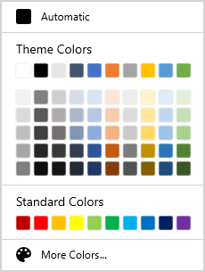
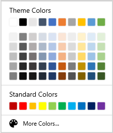
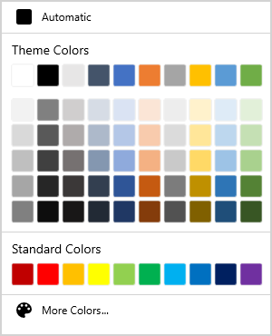

# Control Customization in WPF SfColorPalette

This section explains the different types of colors available in the `SfColorPalette` and  how to choose the colors and its panel customizations.

## Accessing a Color programmatically

You can set or change the selected color of the `SfColorPalette` programmatically by setting the value to `SelectedBrush` property. You can also get the selected color by using the `SelectedBrush` property. The default value of `SelectedBrush` property is `Transparent(#00FFFFFF)`.




<syncfusion:SfColorPalette SelectedBrush="Yellow"
                           Name="sfColorPalette" />




sfColorPalette.SelectedBrush = new SolidColorBrush(Colors.Yellow);




Here, `Yellow` color is selected color in the `SfColorPalette`.

## Setting null value programmatically

You can set a null color value for the selected color by setting the color code `#00000000` or `Colors.Transparent` for `SelectedBrush` property to indicate the null value.




<syncfusion:SfColorPalette SelectedBrush="Transparent"
                           Name="sfColorPalette"/>




sfColorPalette.SelectedBrush = new SolidColorBrush(Colors.Transparent);




## Reset the selected color

If you want to reset the selected color as `No color` or `Transparent`, click the `No Color` button. You can display the
 `No color` button only by setting the `ShowNoColorButton` property value as `true`. The default value of `ShowNoColorButton` property is `false`. 




<syncfusion:SfColorPalette ShowNoColorButton="True"
                           Name="sfColorPalette"/>




sfColorPalette.ShowNoColorButton = true;




## Setting default color

If you want to change the default selected color on application launching, set the value for `AutomaticBrush` property. If you changed the selected color, then you can easily make the default color as selected color by clicking the default color button. The default value of `AutomaticColor` property is `Black`.




<syncfusion:SfColorPalette AutomaticBrush="Red"
                           Name="sfColorPalette" />




sfColorPalette.AutomaticBrush = new SolidColorBrush(Colors.Red);




### Hide default color button

You can hide the default color button visibility by setting the `ShowDefaultColorButton` property value as `Collapsed`. The default value of `ShowDefaultColorButton` property is `true`.




<syncfusion:SfColorPalette AutomaticBrush="Green"
                           ShowDefaultColorButton="False"
                           Name="sfColorPalette" />




sfColorPalette.AutomaticBrush = new SolidColorBrush(Colors.Red);
sfColorPalette.ShowDefaultColorButton = false;




## Selected color changed notification

The selected color changed in `SfColorPalette` can be examined using `SelectedBrushChanged` event. The `SelectedBrushChanged` event contains the old and newly selected color values in the `OldBrush`, `NewBrush` properties.




<syncfusion:SfColorPalette SelectedBrushChanged="SfColorPalette_SelectedBrushChanged"
                           Name="sfColorPalette" />




sfColorPalette.SelectedBrushChanged += SfColorPalette_SelectedBrushChanged;







//Invoked when the selected color is changed
private void SfColorPalette_SelectedBrushChanged(object sender, SelectedBrushChangedEventArgs e) {
    var oldBrush= e.OldBrush;
    var newBrush= e.NewBrush;

}




## Tooltip support

Tooltip is used to show the information about the segment, when you mouse over on the segment. You can show information about name of the color item using tooltip when hovering the mouse on the specific color item.

## Recently used color items

The recently selected color items are displayed in the `Recent Colors` panel. If you want to choose a color which are previously selected, use the `Recent Colors` panel. You can get the recently selected color list by using the `RecentColors` collection property.




<syncfusion:SfColorPalette Name="sfColorPalette"/>




SfColorPalette sfColorPalette = new SfColorPalette();

//Recently selected color list 
var recentColors = sfColorPalette.RecentColors;




## Setting the foreground

You can change the foreground color of the `SfColorPalette` by using the `Foreground` property. The default value of `Foreground` property is `Black`.




<syncfusion:SfColorPalette Foreground="Red"
                           Name="sfColorPalette" />




sfColorPalette.Foreground = new SolidColorBrush(Colors.Red);




## Setting the background

You can change the background color of the `SfColorPalette` by using the `Background` property. The default value of `Background` property is `null`.




<syncfusion:SfColorPalette Background="LightYellow"
                           Name="sfColorPalette" />




sfColorPalette.Background = new SolidColorBrush(Colors.LightYellow);




## Change flow direction

You can change the flow direction of the `SfColorPalette` layout from right to left by setting the `FlowDirection` property value as `RightToLeft`. The default value of `FlowDirection` property is `LeftToRight`.




<syncfusion:SfColorPalette FlowDirection="RightToLeft"
                           Name="sfColorPalette" />




sfColorPalette.FlowDirection = FlowDirection.RightToLeft;




## Change color palette size

You can change the color palette size by using the `Width` and `Height` properties. Based on the color palette size, the color items are resized. The default value of `Width` and `Height` properties is `Auto`.




<syncfusion:SfColorPalette Width="200" 
                           Height="300"
                           Name="sfColorPalette"/>




sfColorPalette.Width = 200;
sfColorPalette.Height = 300;




## Hide the SfColorPalette

You can hide the `SfColorPalette` by setting the `Visibility` property value as `Collapsed`. The default value of `SfColorPalette.Visibility` property is `Visible`.




<syncfusion:SfColorPalette Visibility="Collapsed"
                           Name="sfColorPalette"/>




sfColorPalette.Visibility = Visibility.Collapsed;



