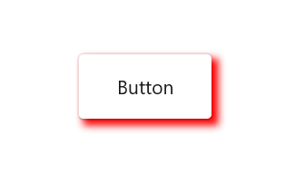
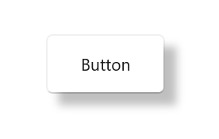

# Customization in WinUI Shadow

This section explains the customization features available in the WinUI [Shadow] control.

## Apply Color for shadow

If you want to change the color of the shadow other than the default Color value, use the `Color` property. The default value of `Color` property is `Black` color with 25% alpha value.




<syncfusion:SfShadow>
    <Button Height="50" width="100" Content="Button"         
         CornerRadius="5"/>
</syncfusion:SfShadow>




   // Creating an instance of the Shadow control.
   SfShadow shadow = new SfShadow();
   shadow.Color = Color.FromArgb(125, 255, 0, 0);
   
   Button button = new Button();
   shadow.Content = button;
   shadow.Height = 50;
   shadow.width = 100;
   shadow.Content = "Button";
   this.Content = shadow;




## Apply BlurRadius for shadow

If you want to change the blur radius of the shadow other than the default value, use the `BlurRadius` property. The default value of `BlurRadius` property is 8.




<syncfusion:SfShadow>
    <Button Height="50" width="100" Content="Button"         
         CornerRadius="5"/>
</syncfusion:SfShadow>




   SfShadow shadow = new SfShadow();
   shadow.BlurRadius = 10;
   
   Button button = new Button();
   shadow.Content = button;
   shadow.Height = 50;
   shadow.width = 100;
   shadow.Content = "Button";
   this.Content = shadow;




## Apply OffsetX for shadow

 If you want to change the offsetX position of the shadow other than the default value, use the `OffsetX` property. The default value of `OffsetX` property is 4.




<syncfusion:SfShadow>
    <Button Height="50" width="100" Content="Button"         
         CornerRadius="5"/>
</syncfusion:SfShadow>




   SfShadow shadow = new SfShadow();
   shadow.OffsetX = 12;
   
   Button button = new Button();
   shadow.Content = button;
   shadow.Height = 50;
   shadow.width = 100;
   shadow.Content = "Button";
   this.Content = shadow;




## Apply OffsetY for shadow

If you want to change the offsetY position of the shadow other than the default value, use the `OffsetY` property. The default value of `OffsetY` property is 4.




<syncfusion:SfShadow>
    <Button Height="50" width="100" Content="Button"         
         CornerRadius="5"/>
</syncfusion:SfShadow>




   SfShadow shadow = new SfShadow();
   shadow.OffsetY = 12;
   
   Button button = new Button();
   shadow.Content = button;
   shadow.Height = 50;
   shadow.width = 100;
   shadow.Content = "Button";
   this.Content = shadow;




## Apply CornerRadius for shadow

If you want to change the corner radius of the shadow other than the default value, use the `CornerRadius` property. The default value of `CornerRadius` property is 0.




<syncfusion:SfShadow>
    <Button Height="50" width="100" Content="Button"         
         CornerRadius="5"/>
</syncfusion:SfShadow>




   SfShadow shadow = new SfShadow();
   shadow.ShadowCornerRadius = 5;
   
   Button button = new Button();
   shadow.Content = button;
   shadow.Height = 50;
   shadow.width = 100;
   shadow.Content = "Button";
   this.Content = shadow;




