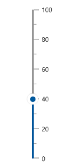

# Basic Features in WinUI Slider

This section explains about how to add the WinUI slider with basic features.

## Setting Minimum and Maximum value

The [`Minimum`](https://help.syncfusion.com/cr/winui/Syncfusion.UI.Xaml.Sliders.SliderBase.html#Syncfusion_UI_Xaml_Sliders_SliderBase_Minimum) and [`Maximum`](https://help.syncfusion.com/cr/winui/Syncfusion.UI.Xaml.Sliders.SliderBase.html#Syncfusion_UI_Xaml_Sliders_SliderBase_Maximum) properties of a Slider is used to customize the start and end range of the Slider. The default value of [`Minimum`](https://help.syncfusion.com/cr/winui/Syncfusion.UI.Xaml.Sliders.SliderBase.html#Syncfusion_UI_Xaml_Sliders_SliderBase_Minimum) is 0 and [`Maximum`](https://help.syncfusion.com/cr/winui/Syncfusion.UI.Xaml.Sliders.SliderBase.html#Syncfusion_UI_Xaml_Sliders_SliderBase_Maximum) is 100.





<slider:SfSlider Minimum="-20"
                 Maximum="20"
                 ShowLabels="True" />





SfSlider sfSlider = new SfSlider();
sfSlider.Minimum = -20;
sfSlider.Maximum = 20;
sfSlider.ShowLabels = true;
this.Content = sfSlider;





## Interval

Slider elements like labels, ticks, and divisors are rendered based on the [`Interval`](https://help.syncfusion.com/cr/winui/Syncfusion.UI.Xaml.Sliders.SliderBase.html#Syncfusion_UI_Xaml_Sliders_SliderBase_Interval), [`Minimum`](https://help.syncfusion.com/cr/winui/Syncfusion.UI.Xaml.Sliders.SliderBase.html#Syncfusion_UI_Xaml_Sliders_SliderBase_Minimum), and [`Maximum`](https://help.syncfusion.com/cr/winui/Syncfusion.UI.Xaml.Sliders.SliderBase.html#Syncfusion_UI_Xaml_Sliders_SliderBase_Maximum) properties. The default value of [`Interval`](https://help.syncfusion.com/cr/winui/Syncfusion.UI.Xaml.Sliders.SliderBase.html#Syncfusion_UI_Xaml_Sliders_SliderBase_Interval) is double.NaN.

For example, if [`Minimum`](https://help.syncfusion.com/cr/winui/Syncfusion.UI.Xaml.Sliders.SliderBase.html#Syncfusion_UI_Xaml_Sliders_SliderBase_Minimum) is 0, [`Maximum`](https://help.syncfusion.com/cr/winui/Syncfusion.UI.Xaml.Sliders.SliderBase.html#Syncfusion_UI_Xaml_Sliders_SliderBase_Maximum) is 10, and [`Interval`](https://help.syncfusion.com/cr/winui/Syncfusion.UI.Xaml.Sliders.SliderBase.html#Syncfusion_UI_Xaml_Sliders_SliderBase_Interval) is 2, the slider will render the labels, major ticks, and divisors at 0, 2, 4 and so on.





<slider:SfRangeSlider Minimum="0"
                      Maximum="10"
                      Interval="2"
                      RangeStart="2"
                      RangeEnd="8"
                      ShowTicks="True"
                      ShowLabels="True" />





SfRangeSlider sfRangeSlider = new SfRangeSlider();
sfRangeSlider.Minimum = 0;
sfRangeSlider.Maximum = 10;
sfRangeSlider.Interval = 2;
sfRangeSlider.RangeStart = 2;
sfRangeSlider.RangeEnd = 8;
sfRangeSlider.ShowTicks = true;
sfRangeSlider.ShowLabels = true;
this.Content = sfRangeSlider;





N> Slider having auto-interval support. So, the auto-interval is calculated by default.

N>
* Refer the [`ShowDivisors`](https://help.syncfusion.com/cr/winui/Syncfusion.UI.Xaml.Sliders.SliderBase.html#Syncfusion_UI_Xaml_Sliders_SliderBase_ShowDivisors), to know more about the rendering of divisors at given interval.
* Refer the [`ShowTicks`](https://help.syncfusion.com/cr/winui/Syncfusion.UI.Xaml.Sliders.SliderBase.html#Syncfusion_UI_Xaml_Sliders_SliderBase_ShowTicks), to know more about the rendering of major ticks at given interval.
* Refer the [`ShowLabels`](https://help.syncfusion.com/cr/winui/Syncfusion.UI.Xaml.Sliders.SliderBase.html#Syncfusion_UI_Xaml_Sliders_SliderBase_ShowLabels), to know more about the rendering of labels at given interval.

## Discrete Selection for Values

You can move the thumb in discrete manner for numeric values using the [`StepFrequency`](https://help.syncfusion.com/cr/winui/Syncfusion.UI.Xaml.Sliders.SliderBase.html#Syncfusion_UI_Xaml_Sliders_SliderBase_StepFrequency) property in the range slider.





<slider:SfRangeSlider Minimum="0"
                      Maximum="10"
                      Interval="2"
                      RangeStart="2"
                      RangeEnd="8"
                      StepFrequency="2"
                      ShowTicks="True"
                      ShowLabels="True" />





SfSlider sfRangeSlider = new SfRangeSlider();
sfRangeSlider.Minimum = 0;
sfRangeSlider.Maximum = 10;
sfRangeSlider.Interval = 2;
sfRangeSlider.RangeStart = 2;
sfRangeSlider.RangeEnd = 8;
sfRangeSlider.StepFrequency = 2;
sfRangeSlider.ShowTicks = true;
sfRangeSlider.ShowLabels = true;
this.Content = sfRangeSlider;





## Value

You can show value in the slider by setting double value to the [`Value`](https://help.syncfusion.com/cr/winui/Syncfusion.UI.Xaml.Sliders.SfSlider.html#Syncfusion_UI_Xaml_Sliders_SfSlider_Value) properties.





<slider:SfSlider Value="50"
                 ShowLabels="True" />





SfSlider sfSlider = new SfSlider();
sfSlider.Value = 50;
sfSlider.ShowLabels = true;
this.Content = sfSlider;





## Flow Direction Customization

The direction of slider can be customized by its [`IsInversed`](https://help.syncfusion.com/cr/winui/Syncfusion.UI.Xaml.Sliders.SliderBase.html#Syncfusion_UI_Xaml_Sliders_SliderBase_IsInversed) property.

When the [`IsInversed`](https://help.syncfusion.com/cr/winui/Syncfusion.UI.Xaml.Sliders.SliderBase.html#Syncfusion_UI_Xaml_Sliders_SliderBase_IsInversed) property is true, the slider can be placed in right-to-left direction. When the [`IsInversed`](https://help.syncfusion.com/cr/winui/Syncfusion.UI.Xaml.Sliders.SliderBase.html#Syncfusion_UI_Xaml_Sliders_SliderBase_IsInversed) property is set to false, the slider will be positioned in left-to-right direction.





<slider:SfSlider ShowTicks="True"
                 ShowLabels="True"
                 Interval="20"
                 Value="40"
                 IsInversed="True"/>





SfSlider sfSlider = new SfSlider();
sfSlider.ShowTicks = true;
sfSlider.ShowLabels = true;
sfSlider.Interval = 20;
sfSlider.Value = 40;
sfSlider.IsInversed = true;
this.Content = sfSlider;





## Vertical Slider 

The orientation of [`slider`](https://help.syncfusion.com/cr/winui/Syncfusion.UI.Xaml.Sliders.SfSlider.html?tabs=tabid-1) can be changed by using the `Orientation` property.

When the `Orientation` property is `Vertical`, the [`slider`](https://help.syncfusion.com/cr/winui/Syncfusion.UI.Xaml.Sliders.SfSlider.html?tabs=tabid-1) will be rendered in bottom-to-top vertical direction.





<slider:SfSlider Orientation="Vertical"
                 ShowTicks="True"
                 ShowLabels="True"
                 Interval="20"
                 Value="40" />





SfSlider sfSlider = new SfSlider();
sfSlider.Orientation = Orientation.Vertical;
sfSlider.ShowTicks = true;
sfSlider.ShowLabels = true;
sfSlider.Interval = 20;
sfSlider.Value = 40;
this.Content = sfSlider;





## Events

**ValueChanged**

The [`ValueChanged`](https://help.syncfusion.com/cr/winui/Syncfusion.UI.Xaml.Sliders.SfSlider.html#Syncfusion_UI_Xaml_Sliders_SfSlider_ValueChanged) event occurs each time when a [`Value`](https://help.syncfusion.com/cr/winui/Syncfusion.UI.Xaml.Sliders.SfSlider.html#Syncfusion_UI_Xaml_Sliders_SfSlider_Value) gets changed. You can get the following values in this event args:

* [`OldValue`](https://help.syncfusion.com/cr/winui/Syncfusion.UI.Xaml.Sliders.SliderValueChangedEventArgs.html#Syncfusion_UI_Xaml_Sliders_SliderValueChangedEventArgs_OldValue) – Gets the previous value of a range value property.
* [`NewValue`](https://help.syncfusion.com/cr/winui/Syncfusion.UI.Xaml.Sliders.SliderValueChangedEventArgs.html#Syncfusion_UI_Xaml_Sliders_SliderValueChangedEventArgs_NewValue) – Gets the new value of a range value property.





<slider:SfSlider Value="50"
                 ValueChanged="SfSlider_ValueChanged" />





private void SfSlider_ValueChanged(object sender, SliderValueChangedEventArgs e)
{
    var oldValue = e.OldValue;
    var newValue = e.NewValue;
}




