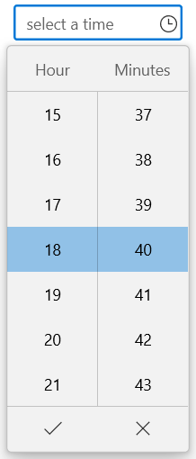
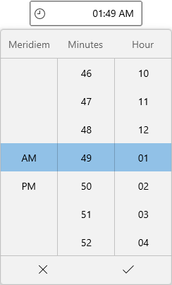

# Localization and Formatting in WinUI Time Picker

This section describes how to localize and format the WinUI [Time Picker](https://help.syncfusion.com/cr/winui/Syncfusion.UI.Xaml.Editors.SfTimePicker.html) control using [`CalendarIdentifier`](https://help.syncfusion.com/cr/winui/Syncfusion.UI.Xaml.Calendar.SfCalendar.html#Syncfusion_UI_Xaml_Calendar_SfCalendar_CalendarIdentifier) and `Language` properties and to change the display formats.

## Change the type of clock

The `Time Picker` control supports 12 hours and 24 hours formats. You can change the time format by using `ClockIdentifier` property. The default value of `ClockIdentifier` property is `12HourClock`.

You can select the required `ClockIdentifier` value from below formats.

* 12HourClock
* 24HourClock 




<editors:SfTimePicker ClockIdentifier="24HourClock"
                      x:Name="sfTimePicker"/>




SfTimePicker sfTimePicker = new SfTimePicker();
sfTimePicker.CalendarIdentifier = "24HourClock";




## Change flow direction

You can change the flow direction of the `Time Picker` layout from right to left by setting the `FlowDirection` property value as `RightToLeft`. The default value of `FlowDirection` property is `LeftToRight`.




<editors:SfTimePicker FlowDirection="RightToLeft" 
                      x:Name="sfTimePicker"/>




SfTimePicker sfTimePicker = new SfTimePicker();
sfTimePicker.FlowDirection = FlowDirection.RightToLeft;




N> Download demo application from [GitHub](https://github.com/SyncfusionExamples/syncfusion-winui-tools-timepicker-examples/blob/main/Samples/ViewAndItemCustomization)

## Change the language

You can localize the `Time Picker` using the `Language` property. The default value of `Language` property is **en-US**.




<editors:SfTimePicker Language="ar-SA"
                      x:Name="sfTimePicker"/>




SfTimePicker sfTimePicker = new SfTimePicker();
sfTimePicker.Language = "ar";




N> `Time Picker` control updates the flow direction visually based on the `Language` property value.

N> When `Language` and `FlowDirection` properties are set, `FlowDirection` property have higher precedence.

## Change time display format

 You can edit and display the selected time with various formatting like hour, minutes, seconds and meridiem formats by using the [`FormatString`](https://help.syncfusion.com/cr/winui/Syncfusion.UI.Xaml.Editors.SfTimePicker.html#Syncfusion_UI_Xaml_Editors_SfTimePicker_FormatString) property. The default value of `FormatString` property is `hh:mm tt`.




<editors:SfTimePicker x:Name="sfTimePicker" 
                      FormatString="HH:mm"/>




SfTimePicker sfTimePicker = new SfTimePicker();
sfTimePicker.FormatString= "HH:mm";




N> Download demo application from [GitHub](https://github.com/SyncfusionExamples/syncfusion-winui-tools-timepicker-examples/blob/main/Samples/TimeRestriction)

## Edit time using free form editing

By default, the user entering each input numbers are automatically validated with the `FormatString`'s formats and assigned the proper value for current field, then it will move to next input field of the time format.

If you want to perform the validation after the user completely entering their time inputs, use the [EditMode](https://help.syncfusion.com/cr/winui/Syncfusion.UI.Xaml.Editors.SfTimePicker.html#Syncfusion_UI_Xaml_Editors_SfTimePicker_EditMode) property value as `Normal`. Then the entered time value is validated with the `FormatString` property value by pressing the `Enter` key or lost focus. If entered value is not suit with `FormatString` property, the previously selected time value sets to `SelectedTime` property.




<editors:SfTimePicker EditMode="Normal"
                      x:Name="sfTimePicker" />




SfTimePicker sfTimePicker = new SfTimePicker();
sfTimePicker.EditMode = DateTimeEditingMode.Normal;




N> Download demo application from [GitHub](https://github.com/SyncfusionExamples/syncfusion-winui-tools-timepicker-examples/blob/main/Samples/TimeRestriction)
