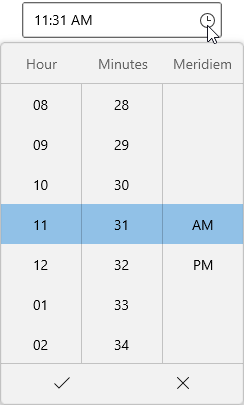
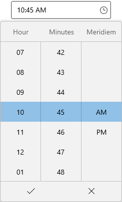
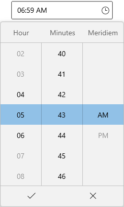

# Getting Started with WinUI TimePicker (SfTimePicker)

This section explains the steps required to add the [TimePicker](https://help.syncfusion.com/cr/winui/Syncfusion.UI.Xaml.Editors.SfTimePicker.html) control and its time selection options. This section covers only basic features needed to get started with Syncfusion `TimePicker` control.

## Structure of TimePicker control

## Creating an application with WinUI TimePicker

1. Create a simple project using the instructions given in the [Getting Started with your first WinUI app](https://docs.microsoft.com/en-us/windows/apps/winui/winui3/get-started-winui3-for-uwp) documentation.
2. Add reference to [Syncfusion.Editors.WinUI](https://www.nuget.org/packages/Syncfusion.Editors.WinUI) NuGet. 
3. Import the control namespace `Syncfusion.UI.Xaml.Editors` in XAML or C# code.
4. Initialize the `SfTimePicker` control.




<Page
    x:Class="GettingStarted.MainPage"
    xmlns="http://schemas.microsoft.com/winfx/2006/xaml/presentation"
    xmlns:x="http://schemas.microsoft.com/winfx/2006/xaml"
    xmlns:local="using:GettingStarted"
    xmlns:d="http://schemas.microsoft.com/expression/blend/2008"
    xmlns:mc="http://schemas.openxmlformats.org/markup-compatibility/2006"
    xmlns:editors="using:Syncfusion.UI.Xaml.Editors"
    mc:Ignorable="d"
    Background="{ThemeResource ApplicationPageBackgroundThemeBrush}">
    <Grid Name="grid">
        <!--Adding TimePicker control -->
        <editors:SfTimePicker Name="timePicker"/>
    </Grid>
</Page>




using Syncfusion.UI.Xaml.Editors;

namespace GettingStarted
{
    /// 

    /// An empty page that can be used on its own or navigated to within a Frame.
    /// 

    public sealed partial class MainPage : Page
    {
        public MainPage()
        {
            this.InitializeComponent();
            // Creating an instance of the TimePicker control
            SfTimePicker sfTimePicker = new SfTimePicker();

            grid.Children.Add(sfTimePicker);
        }
    }
}




## Select the time programmatically

You can set or change the selected time programmatically by using [SelectedTime](https://help.syncfusion.com/cr/winui/Syncfusion.UI.Xaml.Editors.SfTimePicker.html#Syncfusion_UI_Xaml_Editors_SfTimePicker_SelectedTime) property. If you not assign any value for the `SelectedTime` property, `TimePicker` will automatically assign the current system time as `SelectedTime`.




<editors:SfTimePicker Name="sfTimePicker" />




SfTimePicker sfTimePicker= new SfTimePicker();
sfTimePicker.SelectedTime = new DateTimeOffset(new DateTime(2021, 10, 29, 10, 45, 10));




## Select time interactively

You can change the selected time interactively by enter the time value using keyboard or from the drop down time spinner. You can get the selected time from the `SelectedTime` property.




<editors:SfTimePicker Name="sfTimePicker" />




SfTimePicker sfTimePicker= new SfTimePicker();




## Setting null value

If you want to set null value for the `TimePicker`, set the [AllowNullValue](https://help.syncfusion.com/cr/winui/Syncfusion.UI.Xaml.Editors.SfTimePicker.html#Syncfusion_UI_Xaml_Editors_SfTimePicker_AllowNullValue) property as `true` and `SelectedTime` property as `null`. If `AllowNullValue` property is `false`, then the current system time is updated in `SelectedTime` property and displayed instead of `null`.




<editors:SfTimePicker SelectedTime="{x:Null}"
                      AllowNullValue="True"
                      Name="sfTimePicker" />




SfTimePicker sfTimePicker= new SfTimePicker();
sfTimePicker.SelectedTime = null;
sfTimePicker.AllowNullValue = true;




## Setting watermark text

You can prompt the user with some information by using the [PlaceHolderText](https://help.syncfusion.com/cr/winui/Syncfusion.UI.Xaml.Editors.SfTimePicker.html#Syncfusion_UI_Xaml_Editors_SfTimePicker_PlaceHolderText) property. This will display only on when the `TimePicker` contains the `SelectedTime` property as `null` and `AllowNullValue` property as `true`. If `AllowNullValue` property is `false`, then the current system time is updated in `SelectedTime` property and displayed instead of `PlaceHolderText`.




<editors:SfTimePicker PlaceHolderText="Select the Time"
                      SelectedTime="{x:Null}"
                      AllowNullValue="True"
                      Name="sfTimePicker" />




SfTimePicker sfTimePicker= new SfTimePicker();
sfTimePicker.PlaceHolderText = "Select the Time";
sfTimePicker.SelectedTime = null;
sfTimePicker.AllowNullValue = true;




## Time changed notification

You will be notified when selected time changed in `TimePicker` by using [TimeChanged](https://help.syncfusion.com/cr/winui/Syncfusion.UI.Xaml.Editors.SfTimePicker.html#Syncfusion_UI_Xaml_Editors_SfTimePicker_TimeChanged) event. The `TimeChanged` event contains the old and newly selected time in the [OldDateTime](https://help.syncfusion.com/cr/winui/Syncfusion.UI.Xaml.Editors.SelectedDateTimeChangedEventArgs.html#Syncfusion_UI_Xaml_Editors_SelectedDateTimeChangedEventArgs_OldDateTime) and [NewDateTime](https://help.syncfusion.com/cr/winui/Syncfusion.UI.Xaml.Editors.SelectedDateTimeChangedEventArgs.html#Syncfusion_UI_Xaml_Editors_SelectedDateTimeChangedEventArgs_NewDateTime) properties.

* `OldDateTime` - Gets a time which is previously selected.
* `NewDateTime` - Gets a time which is currently selected.




<editors:SfTimePicker TimeChanged="SfTimePicker_TimeChanged" 
                      Name="sfTimePicker"/>




SfTimePicker sfTimePicker = new SfTimePicker();
sfTimePicker.TimeChanged += SfTimePicker_TimeChanged;




You can handle the event as follows:




private void SfTimePicker_TimeChanged(DependencyObject d, DependencyPropertyChangedEventArgs e) {          
    Console.WriteLine("The previously selected Time: " + e.OldDateTime.ToString());
    Console.WriteLine("The newly selected Time: " + e.NewDateTime.ToString());            
}




## Change time display format

 You can edit and display the selected time with various formatting like hour, minutes, seconds and meridiem formats by using the [FormatString](https://help.syncfusion.com/cr/winui/Syncfusion.UI.Xaml.Editors.SfTimePicker.html#Syncfusion_UI_Xaml_Editors_SfTimePicker_FormatString) property. The default value of `FormatString` property is `hh:mm tt`.




<editors:SfTimePicker x:Name="sfTimePicker" 
                      FormatString="HH:mm"/>




SfTimePicker sfTimePicker = new SfTimePicker();
sfTimePicker.FormatString= "HH:mm";




## Restrict time selection

You can restrict the users from selecting a time within the particular range by specifying [MinTime](https://help.syncfusion.com/cr/winui/Syncfusion.UI.Xaml.Editors.SfTimePicker.html#Syncfusion_UI_Xaml_Editors_SfTimePicker_MinTime) and [MaxTime](https://help.syncfusion.com/cr/winui/Syncfusion.UI.Xaml.Editors.SfTimePicker.html#Syncfusion_UI_Xaml_Editors_SfTimePicker_MaxTime) properties in `TimePicker` control. The default value of `MinTime` property is `1/1/0001 12:00:00 AM` and `MaxTime` property is `12/31/9999 11:59:59 PM`.




<editors:SfTimePicker x:Name="sfTimePicker"/>




SfTimePicker sfTimePicker = new SfTimePicker();
sfTimePicker.MinTime = new DateTimeOffset(new DateTime(2020, 12, 10, 4, 00, 00));
sfTimePicker.MaxTime = new DateTimeOffset(new DateTime(2020, 12, 10, 6, 59, 59));




## Hide submit button(Select time directly from time spinner)

If you want to hide the submit button and select the time directly from the drop down time spinner without clicking the `Ok` button, use the [ShowSubmitButtons](https://help.syncfusion.com/cr/winui/Syncfusion.UI.Xaml.Editors.SfDropDownBase.html#Syncfusion_UI_Xaml_Editors_SfDropDownBase_ShowSubmitButtons) property value as `false`. The default value of `ShowSubmitButtons` property is `true`.




<editors:SfTimePicker ShowSubmitButtons="False" 
	                  x:Name="sfTimePicker"/>




SfTimePicker sfTimePicker = new SfTimePicker();
sfTimePicker.ShowSubmitButtons = false;




## Edit time using free form editing

If you want to perform the validation after the user completely entering their time inputs, use the [EditMode](https://help.syncfusion.com/cr/winui/Syncfusion.UI.Xaml.Editors.SfTimePicker.html#Syncfusion_UI_Xaml_Editors_SfTimePicker_EditMode) property value as `Normal`. Then the entered time value is validated with the `FormatString` property value by pressing the `Enter` key or lost focus. If entered value is not suit with `FormatString` property, the selected time will be set as default format value.

By default, the user entering each input numbers are automatically validated with the `FormatString` formats and assigned the proper value for it, then it will move to next input part of the time format.




<editors:SfTimePicker EditMode="Normal"
                      x:Name="sfTimePicker" />




SfTimePicker sfTimePicker = new SfTimePicker();
sfTimePicker.EditMode = DateTimeEditingMode.Normal;




