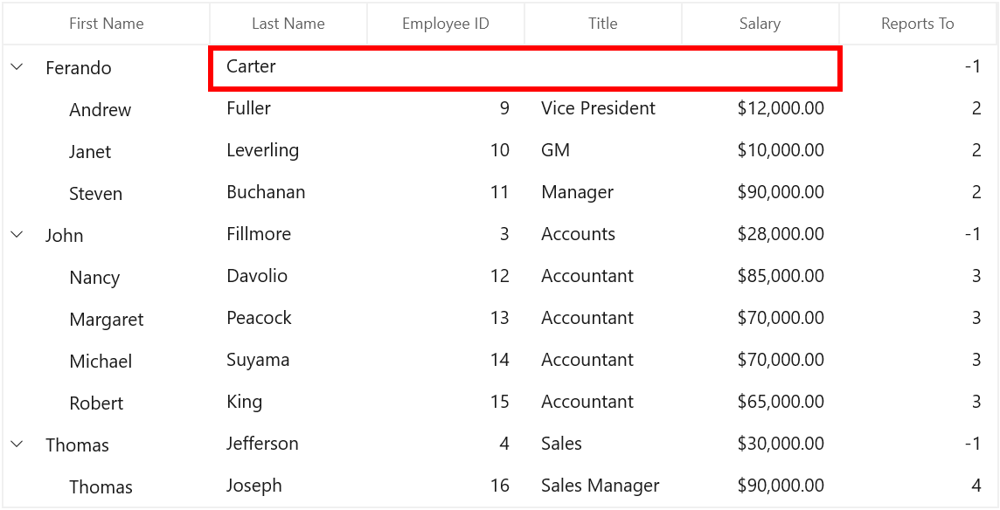
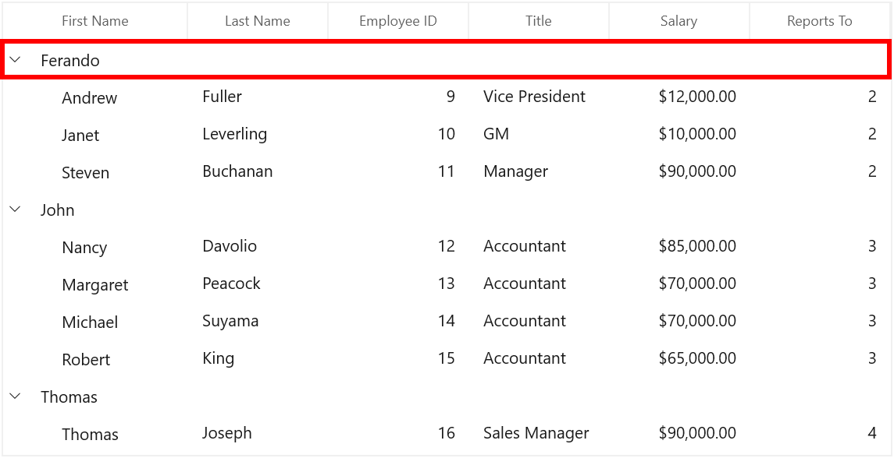

# Merge Cells in WinUI TreeGrid (SfTreeGrid)

SfTreeGrid allows you to merge a range of adjacent cells in a row across columns using the [QueryCoveredRange](https://help.syncfusion.com/cr/winui/Syncfusion.UI.Xaml.TreeGrid.SfTreeGrid.html#Syncfusion_UI_Xaml_TreeGrid_SfTreeGrid_QueryCoveredRange) event.

The `QueryCoveredRange` event occurs when each cell is arranged. When scrolling, the merged range will be added for newly added columns through this event and will also be removed for the columns that are out of view.

[TreeGridQueryCoveredRangeEventArgs](https://help.syncfusion.com/cr/winui/Syncfusion.UI.Xaml.TreeGrid.TreeGridQueryCoveredRangeEventArgs.html) of the `QueryCoveredRange` event provides information about the cell triggered in this event. [GridQueryCoveredRangeEventArgs.OriginalSender](https://help.syncfusion.com/cr/winui/Syncfusion.UI.Xaml.Grids.GridEventArgs.html#Syncfusion_UI_Xaml_Grids_GridEventArgs_OriginalSender) returns the TreeGrid fired in this event using the [TreeGridQueryCoveredRangeEventArgs.Range](https://help.syncfusion.com/cr/winui/Syncfusion.UI.Xaml.TreeGrid.TreeGridQueryCoveredRangeEventArgs.html#Syncfusion_UI_Xaml_TreeGrid_TreeGridQueryCoveredRangeEventArgs_Range) property. The adjacent cells can be merged.



xmlns:treeGrid="using:Syncfusion.UI.Xaml.TreeGrid"

<treeGrid:SfTreeGrid Name="sfTreeGrid"
                                ItemsSource="{Binding EmployeeDetails}"
                                QueryCoveredRange="SfTreeGrid_QueryCoveredRange"
                                SelectionMode="Single"
                                NavigationMode="Cell" />
							



this.sfTreeGrid.NavigationMode = Syncfusion.UI.Xaml.Grids.NavigationMode.Cell;
this.sfTreeGrid.SelectionMode = Syncfusion.UI.Xaml.Grids.GridSelectionMode.Multiple;
this.sfTreeGrid.QueryCoveredRange += SfTreeGrid_QueryCoveredRange;

private void SfTreeGrid_QueryCoveredRange(object sender, TreeGridQueryCoveredRangeEventArgs e)
{

}	



## Column wise merging cells by fixed range

You can merge the columns by setting the range using the Left and Right properties of [TreeGridCoveredCellInfo](https://help.syncfusion.com/cr/winui/Syncfusion.UI.Xaml.TreeGrid.TreeGridCoveredCellInfo.html#Syncfusion_UI_Xaml_TreeGrid_TreeGridCoveredCellInfo__ctor_System_Int32_System_Int32_System_Int32_).



this.sfTreeGrid.QueryCoveredRange += SfTreeGrid_QueryCoveredRange;

private void SfTreeGrid_QueryCoveredRange(object sender, TreeGridQueryCoveredRangeEventArgs e)
{
    if (e.RowColumnIndex.RowIndex == 1)
    {
        if (e.RowColumnIndex.ColumnIndex >= 1 && e.RowColumnIndex.ColumnIndex <= 3)
        {
            e.Range = new TreeGridCoveredCellInfo(1, 4, 1);
            e.Handled = true;
        }
    }             
}	



## Merge all cells in an entire parent node

You can merge the entire column parent node using `TreeGridCoveredCellInfo`.



<treeGrid:SfTreeGrid Name="sfTreeGrid"
                                ItemsSource="{Binding EmployeeDetails}"
                                ChildPropertyName="Children"
                                QueryCoveredRange="SfTreeGrid_QueryCoveredRange"
                                SelectionMode="Single"
                                NavigationMode="Cell" />							


this.sfTreeGrid.QueryCoveredRange += SfTreeGrid_QueryCoveredRange;

private void SfTreeGrid_QueryCoveredRange(object sender, TreeGridQueryCoveredRangeEventArgs e)
{    
    var treeNode = this.sfTreeGrid.GetNodeAtRowIndex(e.RowColumnIndex.RowIndex);
    if (treeNode != null && treeNode.HasChildNodes)
    {
        if (e.RowColumnIndex.ColumnIndex >= 1 && e.RowColumnIndex.ColumnIndex <= this.sfTreeGrid.Columns.Count)
        {
            e.Range = new TreeGridCoveredCellInfo(0, this.sfTreeGrid.Columns.Count, e.RowColumnIndex.RowIndex);
            e.Handled = true;
        }
    }
}	



