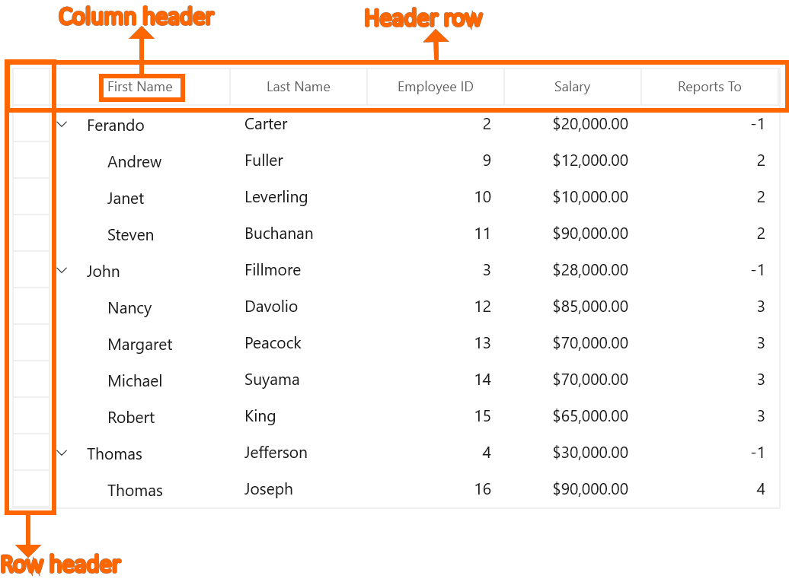
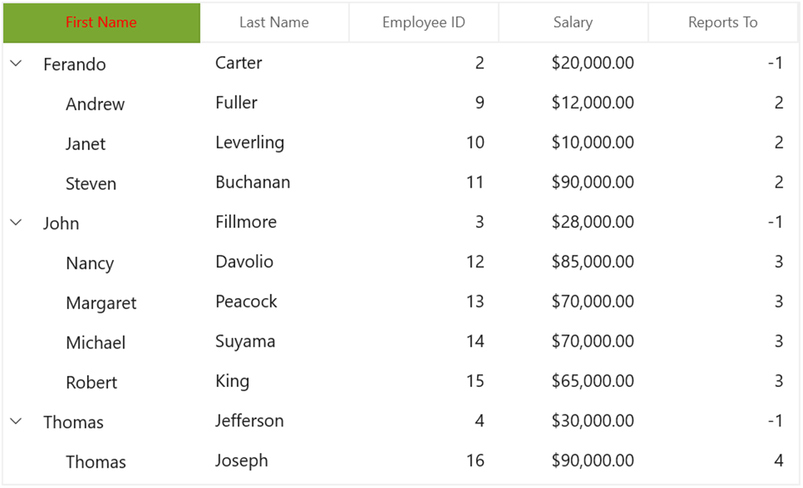

# Rows in WinUI TreeGrid (SfTreeGrid)

This section explains about various row types in treegrid and its customization.

## Row header

RowHeader is a special column used to indicate the status of row (current row, editing status, errors in row, etc.) which is placed as first cell of each row. You can show or hide the row header by setting [SfTreeGrid.ShowRowHeader](https://help.syncfusion.com/cr/winui/Syncfusion.UI.Xaml.Grids.SfGridBase.html#Syncfusion_UI_Xaml_Grids_SfGridBase_ShowRowHeader) property.



<syncfusion:SfTreeGrid Name="treeGrid"
                       ColumnWidthMode="Star"
                       AutoExpandMode="AllNodesExpanded"
                       ShowRowHeader="True" 
                       AutoGenerateColumns="False"
                       ChildPropertyName="Children"
                       ItemsSource="{Binding EmployeeDetails}" >



### Row indicators and its description

<table>
<tr>
<th>
Row Indicator
</th>
<th>
Description
</th>
</tr>
<tr>
<td>

</td>
<td>
Denotes the row which has current cell or selected item.
</td>
</tr>
<tr>
<td>

</td>
<td>
Denotes row is being edited. 
</td>
</tr>
<tr>
<td>

</td>
<td>
Denotes the row has errors. 
</td>
</tr>
<tr>
<td>

</td>
<td>
Denotes that the current row which has errors.
</td>
</tr>
</table>

### Show row index in row header

You can display the row index value in row header by customizing the `TreeGridRowHeaderCell` style with the binding of `RowIndex` to `TextBlock.Text` property.







## Header row

Header row is present in top of the treegrid which has column headers in it. Column header describes the caption to identify the column content.

### Hiding header row

You can hide the header row by setting [SfTreeGrid.HeaderRowHeight](https://help.syncfusion.com/cr/winui/Syncfusion.UI.Xaml.Grids.SfGridBase.html#Syncfusion_UI_Xaml_Grids_SfGridBase_HeaderRowHeight) as 0 (zero).



<syncfusion:SfTreeGrid Name="treeGrid"
                       ColumnWidthMode="Star"
                       AutoExpandMode="AllNodesExpanded"
                       ShowRowHeader="True" 
                       HeaderRowHeight="0"
                       AutoGenerateColumns="False"
                       ChildPropertyName="Children"
                       ItemsSource="{Binding EmployeeDetails}" >




### Customize style of header row

You can change the header cell background and foreground for specific column or an entire grid by using [HeaderStyle](https://help.syncfusion.com/cr/winui/Syncfusion.UI.Xaml.Grids.GridColumnBase.html#Syncfusion_UI_Xaml_Grids_GridColumnBase_HeaderStyle) property.



<syncfusion:Window.Resources>
        
</syncfusion:Window.Resources>

<syncfusion:SfTreeGrid Name="treeGrid"
                       ColumnWidthMode="Star"
                       AutoExpandMode="AllNodesExpanded"
                       HeaderStyle="{StaticResource headerStyle}"
                       AutoGenerateColumns="False"
                       ChildPropertyName="Children"
                       ItemsSource="{Binding EmployeeDetails}" > 



You can change the style of the particular column header by using the [HeaderStyle](https://help.syncfusion.com/cr/winui/Syncfusion.UI.Xaml.Grids.GridColumnBase.html#Syncfusion_UI_Xaml_Grids_GridColumnBase_HeaderStyle) property in column,



<syncfusion:TreeGridTextColumn HeaderText="First Name" HeaderStyle="{StaticResource headerStyle}" MappingName="FirstName" />



