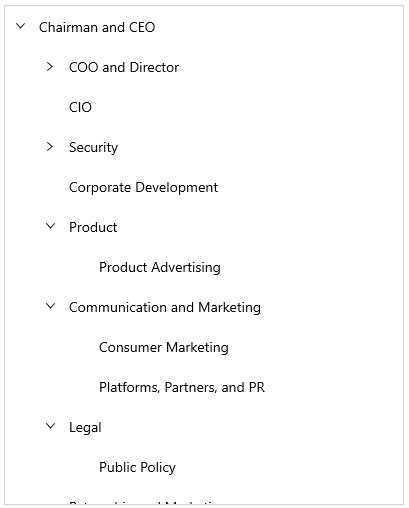

# Data Population in WinUI TreeView

[TreeView](https://help.syncfusion.com/cr/winui/Syncfusion.UI.Xaml.TreeView.SfTreeView.html) can be populated either with the data source by using a [ItemsSource](https://help.syncfusion.com/cr/winui/Syncfusion.UI.Xaml.TreeView.SfTreeView.html#Syncfusion_UI_Xaml_TreeView_SfTreeView_ItemsSource) property or by creating and adding the [TreeViewNode](https://help.syncfusion.com/cr/winui/Syncfusion.UI.Xaml.TreeView.Engine.TreeViewNode.html) in hierarchical structure to [Nodes](https://help.syncfusion.com/cr/winui/Syncfusion.UI.Xaml.TreeView.SfTreeView.html#Syncfusion_UI_Xaml_TreeView_SfTreeView_Nodes) property.

## Populating Nodes by data binding - Bound Mode

[Nodes](https://help.syncfusion.com/cr/winui/Syncfusion.UI.Xaml.TreeView.SfTreeView.html#Syncfusion_UI_Xaml_TreeView_SfTreeView_Nodes) can be populated in bound mode includes following steps.

   * Create hierarchical data model
   * Bind data model to treeview

To update the collection changes in UI, it is necessary to define [NotificationSubscriptionMode](https://help.syncfusion.com/cr/winui/Syncfusion.UI.Xaml.TreeView.SfTreeView.html#Syncfusion_UI_Xaml_TreeView_SfTreeView_NotificationSubscriptionMode) to Treeview as CollectionChanged /PropertyChanged.

`NotificationSubscriptionMode` enum has following members:

   * CollectionChange - Updates its tree structure when child items collection gets changed.
   * PropertyChange - Updates its ChildItems when associated collection property gets changed.
   * None - It is a default mode and it doesn’t reflect collection/property changes in UI.
To decide how to populate the nodes, it is necessary to set this `NodePopulationMode` API to Treeview.

The [NodePopulationMode](https://help.syncfusion.com/cr/winui/Syncfusion.UI.Xaml.TreeView.SfTreeView.html#Syncfusion_UI_Xaml_TreeView_SfTreeView_NodePopulationMode) API has following enum values:

   * OnDemand - Populates the child nodes only when parent nodes is expanded. It is the default value.
   * Instant - Populates all the child nodes when Treeview control is initially loaded.

### Create Data Model for treeview

Create a simple data source as shown in the following code example in a new class file, and save it as Folder.cs file:




//Folder.cs
public class Folder : NotificationObject
{ 
    private string fileName;

    private DataTemplate imageTemplate;
        
    private ObservableCollection<Folder> files;

    public Folder()
    {

    }

    public ObservableCollection< Folder> Files
    {
        get { return files; }
        internal set
        {
            files = value;
            RaisePropertyChanged(nameof(Files));
        }
    }

    public string FileName
    {
        get { return fileName; }
        set
        {
            fileName = value;
            RaisePropertyChanged(nameof(FileName));
        }
    }

    public DataTemplate ImageTemplate
    {
        get { return imageTemplate; }
        set { imageTemplate = value; }
    }
}




Create a model repository class with ImageNodeInfo collection property initialized with required number of data objects in a new class file as shown in the following code example, and save it as NodeWithImageViewModel.cs file:




public class NodeWithImageViewModel
{
    public ObservableCollection<Folder> Folders { get; internal set; }

    private ResourceDictionary CommonResourceDictionary { get; set; }

    public NodeWithImageViewModel()
    {
        CommonResourceDictionary = new ResourceDictionary() { Source = new Uri("ms-appx:///Icons/PathIcon.xaml", UriKind.RelativeOrAbsolute) };
        this.Folders = GetFiles();
    }

    private ObservableCollection<Folder> GetFiles()
    {
        var nodeImageInfo = new ObservableCollection<Folder>();

        var doc = new Folder() { FileName = "Documents", ImageTemplate = CommonResourceDictionary["Folder"] as DataTemplate };
        var download = new Folder() { FileName = "Downloads", ImageTemplate = CommonResourceDictionary["Folder"] as DataTemplate };
        var mp3 = new Folder() { FileName = "Music", ImageTemplate = CommonResourceDictionary["Folder"] as DataTemplate };
        var pictures = new Folder() { FileName = "Pictures", ImageTemplate = CommonResourceDictionary["Folder"] as DataTemplate };
        var video = new Folder() { FileName = "Videos", ImageTemplate = CommonResourceDictionary["Folder"] as DataTemplate };

        var pollution = new Folder() { FileName = "Environmental Pollution.docx", ImageTemplate = CommonResourceDictionary["Word"] as DataTemplate };
        var globalWarming = new Folder() { FileName = "Global Warming.ppt", ImageTemplate = CommonResourceDictionary["PowerPoint"] as DataTemplate };
        var sanitation = new Folder() { FileName = "Sanitation.docx", ImageTemplate = CommonResourceDictionary["Word"] as DataTemplate };
        var socialNetwork = new Folder() { FileName = "Social Network.pdf", ImageTemplate = CommonResourceDictionary["Pdf"] as DataTemplate };
        var youthEmpower = new Folder() { FileName = "Youth Empowerment.pdf", ImageTemplate = CommonResourceDictionary["Pdf"] as DataTemplate };

        var games = new Folder() { FileName = "Game.exe", ImageTemplate = CommonResourceDictionary["EXE"] as DataTemplate };
        var tutorials = new Folder()  { FileName = "Tutorials.zip", ImageTemplate = CommonResourceDictionary["Zip"] as DataTemplate };
        var typeScript = new Folder() { FileName = "TypeScript.7z", ImageTemplate = CommonResourceDictionary["Zip"] as DataTemplate };
        var uiGuide = new Folder() { FileName = "UI-Guide.pdf", ImageTemplate = CommonResourceDictionary["Pdf"] as DataTemplate };

        var song = new Folder() { FileName = "Gouttes", ImageTemplate = CommonResourceDictionary["Audio"] as DataTemplate };

        var camera = new Folder() { FileName = "Camera Roll", ImageTemplate = CommonResourceDictionary["Folder"] as DataTemplate };
        var stone = new Folder() { FileName = "Stone.jpg", ImageTemplate = CommonResourceDictionary["Png"] as DataTemplate };
        var wind = new Folder() { FileName = "Wind.jpg", ImageTemplate = CommonResourceDictionary["Png"] as DataTemplate };

        var img0 = new Folder() { FileName = "WIN_20160726_094117.JPG", ImageTemplate = CommonResourceDictionary["Png"] as DataTemplate };
        var img1 = new Folder() { FileName = "WIN_20160726_094118.JPG", ImageTemplate = CommonResourceDictionary["Png"] as DataTemplate };

        var video1 = new Folder() { FileName = "Natural World.mp4", ImageTemplate = CommonResourceDictionary["Video"] as DataTemplate };
        var video2 = new Folder() { FileName = "Wildlife.mpeg", ImageTemplate = CommonResourceDictionary["Video"] as DataTemplate };

        doc.Files = new ObservableCollection<Folder>
        {
            pollution,
            globalWarming,
            sanitation,
            socialNetwork,
            youthEmpower
        };

        download.Files = new ObservableCollection<Folder>
        {
            games,
            tutorials,
            typeScript,
            uiGuide
        };

        mp3.Files = new ObservableCollection<Folder>
        {
            song
        };

        pictures.Files = new ObservableCollection<Folder>
        {
            camera,
            stone,
            wind
        };

        camera.Files = new ObservableCollection<Folder>
        {
            img0,
            img1
        };

        video.Files = new ObservableCollection<Folder>
        {
            video1,
            video2
        };

        nodeImageInfo.Add(doc);
        nodeImageInfo.Add(download);
        nodeImageInfo.Add(mp3);
        nodeImageInfo.Add(pictures);
        nodeImageInfo.Add(video);

        return nodeImageInfo;
    }
}




### Bind to Hierarchical DataSource

To create a TreeView using data binding, set a hierarchical data collection to the [ItemsSource](https://help.syncfusion.com/cr/winui/Syncfusion.UI.Xaml.TreeView.SfTreeView.html#Syncfusion_UI_Xaml_TreeView_SfTreeView_ItemsSource) property. And set the child object name to the [ChildPropertyName](https://help.syncfusion.com/cr/winui/Syncfusion.UI.Xaml.TreeView.SfTreeView.html#Syncfusion_UI_Xaml_TreeView_SfTreeView_ChildPropertyName) property.




<Page x:Class="syncfusion.treeviewdemos.winui.NodeWithImagePage"
      xmlns="http://schemas.microsoft.com/winfx/2006/xaml/presentation"
      xmlns:x="http://schemas.microsoft.com/winfx/2006/xaml"
      xmlns:local="using:syncfusion.treeviewdemos.winui"
      xmlns:syncfusion="using:Syncfusion.UI.Xaml.TreeView"
      xmlns:d="http://schemas.microsoft.com/expression/blend/2008"
      xmlns:mc="http://schemas.openxmlformats.org/markup-compatibility/2006"
      mc:Ignorable="d"
      Background="{ThemeResource ApplicationPageBackgroundThemeBrush}"
      NavigationCacheMode="Disabled">

    <Page.DataContext>
        <local:NodeWithImageViewModel />
    </Page.DataContext>

    <Grid>
       <syncfusion:SfTreeView x:Name="treeView"
                              ChildPropertyName=”Files”  
                              ItemsSource="{Binding Folders}">
                    <syncfusion:SfTreeView.ItemTemplate>
                        <DataTemplate>
                            <StackPanel Orientation="Horizontal">
                                <ContentPresenter Width="20"
                                                  Height="20"
                                                  HorizontalAlignment="Stretch"
                                                  VerticalAlignment="Center"
                                                  ContentTemplate="{Binding ImageTemplate}" />
                                <TextBlock Margin="5"
                                           VerticalAlignment="Center"
                                           Text="{Binding FileName}" />
                            </StackPanel>
                        </DataTemplate>
                    </syncfusion:SfTreeView.ItemTemplate>
        </syncfusion:SfTreeView>
    </Grid>
</Page>




## Populating Nodes without DataSource - Unbound Mode

You can create and manage the [TreeViewNode](https://help.syncfusion.com/cr/winui/Syncfusion.UI.Xaml.TreeView.Engine.TreeViewNode.html) objects by yourself to display the data in a hierarchical view. To create a tree view, you use a `TreeView` control and a hierarchy of `TreeViewNode` objects. You create the node hierarchy by adding one or more root nodes to the [SfTreeView.Nodes](https://help.syncfusion.com/cr/winui/Syncfusion.UI.Xaml.TreeView.SfTreeView.html#Syncfusion_UI_Xaml_TreeView_SfTreeView_Nodes) collection. Each `TreeViewNode` can have more nodes added to its children collection. You can nest tree view nodes to whatever depth you require.




<Page x:Class="syncfusion.treeviewdemos.winui.GettingStartedPage"
      xmlns="http://schemas.microsoft.com/winfx/2006/xaml/presentation"
      xmlns:x="http://schemas.microsoft.com/winfx/2006/xaml"
      xmlns:d="http://schemas.microsoft.com/expression/blend/2008"
      xmlns:mc="http://schemas.openxmlformats.org/markup-compatibility/2006"
      xmlns:local="using:syncfusion.treeviewdemos.winui"
      xmlns:syncfusion="using:Syncfusion.UI.Xaml.TreeView"
      xmlns:node="using:Syncfusion.UI.Xaml.TreeView.Engine"
      mc:Ignorable="d"
      Background="{ThemeResource ApplicationPageBackgroundThemeBrush}"
      NavigationCacheMode="Disabled">
    <Grid> 
        <syncfusion:SfTreeView x:Name="unboundTreeView" Width="400" Height="500"> 
                        <syncfusion:SfTreeView.Nodes>
                            <node:TreeViewNode Content="Chairman and CEO"
                                               IsExpanded="True">
                                <node:TreeViewNode.ChildNodes>
                                    <node:TreeViewNode Content="COO and Director">
                                        <node:TreeViewNode.ChildNodes>
                                            <node:TreeViewNode Content="Human Resources" />
                                            <node:TreeViewNode Content="Platform, EMEA" />
                                            <node:TreeViewNode Content="Mobile" />
                                            <node:TreeViewNode Content="Mid-Market Sales EMED" />
                                            <node:TreeViewNode Content="EMEA Regional Director" />
                                            <node:TreeViewNode Content="Advertising and Global Operations" />
                                            <node:TreeViewNode Content="Growth, Engagement, and Moblie" />
                                            <node:TreeViewNode Content="Global Marketing and Solutions" />
                                        </node:TreeViewNode.ChildNodes>
                                    </node:TreeViewNode>
                                    <node:TreeViewNode Content="CIO" />
                                    <node:TreeViewNode Content="Security">
                                        <node:TreeViewNode.ChildNodes>
                                            <node:TreeViewNode Content="Security Services" />
                                        </node:TreeViewNode.ChildNodes>
                                    </node:TreeViewNode>
                                    <node:TreeViewNode Content="Corporate Development" />
                                    <node:TreeViewNode Content="Product"
                                                       IsExpanded="True">
                                        <node:TreeViewNode.ChildNodes>
                                            <node:TreeViewNode Content="Product Advertising" />
                                        </node:TreeViewNode.ChildNodes>
                                    </node:TreeViewNode>
                                    <node:TreeViewNode Content="Communication and Marketing"
                                                       IsExpanded="True">
                                        <node:TreeViewNode.ChildNodes>
                                            <node:TreeViewNode Content="Consumer Marketing" />
                                            <node:TreeViewNode Content="Platforms, Partners, and PR" />
                                        </node:TreeViewNode.ChildNodes>
                                    </node:TreeViewNode>
                                    <node:TreeViewNode Content="Legal"
                                                       IsExpanded="True">
                                        <node:TreeViewNode.ChildNodes>
                                            <node:TreeViewNode Content="Public Policy" />
                                        </node:TreeViewNode.ChildNodes>
                                    </node:TreeViewNode>
                                    <node:TreeViewNode Content="Patnership and Marketing" />
                                    <node:TreeViewNode Content="Engineering"
                                                       IsExpanded="True">
                                        <node:TreeViewNode.ChildNodes>
                                            <node:TreeViewNode Content="Engineering" />
                                            <node:TreeViewNode Content="Software Development" />
                                            <node:TreeViewNode Content="Engineering and Products" />
                                            <node:TreeViewNode Content="Infrastructure Engineering" />
                                        </node:TreeViewNode.ChildNodes>
                                    </node:TreeViewNode>
                                    <node:TreeViewNode Content="CFO"
                                                       IsExpanded="True">
                                        <node:TreeViewNode.ChildNodes>
                                            <node:TreeViewNode Content="Treasurer" />
                                        </node:TreeViewNode.ChildNodes>
                                    </node:TreeViewNode>
                                    <node:TreeViewNode Content="Brand Design" />
                                </node:TreeViewNode.ChildNodes>
                            </node:TreeViewNode>
                        </syncfusion:SfTreeView.Nodes>
        </syncfusion:SfTreeView>    
    </Grid>
</Page>




