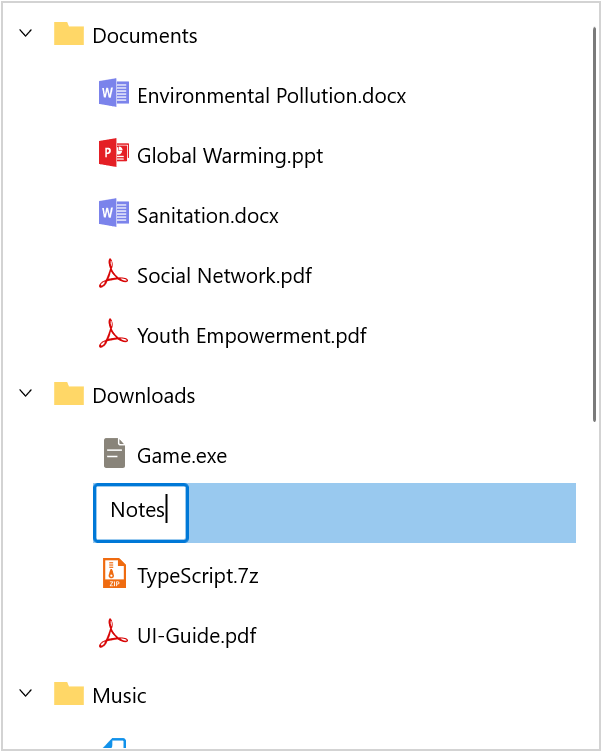

# Editing in WinUI TreeView (SfTreeView)

The TreeView provides support for editing and it can be enabled or disabled by using [SfTreeView.AllowEditing](https://help.syncfusion.com/cr/winui/Syncfusion.UI.Xaml.TreeView.SfTreeView.html#Syncfusion_UI_Xaml_TreeView_SfTreeView_AllowEditing) property. You can enter edit mode in a node by pressing <kbd>F2</kbd> key only. The editing changes in a node will be committed only when user move to next node or pressing <kbd>Enter</kbd> key.

It is necessary to define [EditTemplate](https://help.syncfusion.com/cr/winui/Syncfusion.UI.Xaml.TreeView.SfTreeView.html#Syncfusion_UI_Xaml_TreeView_SfTreeView_EditTemplate) / [EditTemplateSelector](https://help.syncfusion.com/cr/winui/Syncfusion.UI.Xaml.TreeView.SfTreeView.html#Syncfusion_UI_Xaml_TreeView_SfTreeView_EditTemplateSelector) for bound mode, to enable editing. For UnboundMode, textbox will be loaded in edit mode by default.



<treeView:SfTreeView x:Name="treeView"
                        Width="400"
                        Height="500"
                        AutoExpandMode="AllNodes"
                        BorderBrush="LightGray"
                        BorderThickness="1"
                        AllowEditing="True"
                        IsAnimationEnabled="True"
                        ChildPropertyName="Files"
                        ItemsSource="{Binding Folders}">
    <treeView:SfTreeView.ItemTemplate>
        <DataTemplate>
            <StackPanel Orientation="Horizontal">
                <ContentPresenter Width="20"
                                    Height="20"
                                    HorizontalAlignment="Stretch"
                                    VerticalAlignment="Center"
                                    ContentTemplate="{Binding ImageTemplate}" />
                <TextBlock Margin="5"
                            VerticalAlignment="Center"
                            Text="{Binding FileName}" />
            </StackPanel>
        </DataTemplate>
    </treeView:SfTreeView.ItemTemplate>
    <treeView:SfTreeView.EditTemplate>
        <DataTemplate>
            <TextBox Text="{Binding Name}" 
				VerticalContentAlignment="Center" 
                Margin="-4,0,-4,0"
                Height="{Binding ItemHeight,ElementName=treeView}" />
        </DataTemplate>
    </treeView:SfTreeView.EditTemplate>
</treeView:SfTreeView>


treeView.AllowEditing = true;



## Programmatic Editing

### Begin the editing

The TreeView allows you to edit the node programmatically by calling the [BeginEdit](https://help.syncfusion.com/cr/winui/Syncfusion.UI.Xaml.TreeView.SfTreeView.html#Syncfusion_UI_Xaml_TreeView_SfTreeView_BeginEdit_Syncfusion_UI_Xaml_TreeView_TreeViewNode_) method.



this.treeView.Loaded += TreeView_Loaded;

private void TreeView_Loaded(object sender, RoutedEventArgs e)
{
    this.treeView.BeginEdit(this.treeView.Nodes[0]);
}



N> [CurrentItem](https://help.syncfusion.com/cr/winui/Syncfusion.UI.Xaml.TreeView.SfTreeView.html#Syncfusion_UI_Xaml_TreeView_SfTreeView_CurrentItem) is set to the node when the BeginEdit is called.

### End the editing

You can call [EndEdit](https://help.syncfusion.com/cr/winui/Syncfusion.UI.Xaml.TreeView.SfTreeView.html#Syncfusion_UI_Xaml_TreeView_SfTreeView_EndEdit_Syncfusion_UI_Xaml_TreeView_TreeViewNode_) method to programmatically end the editing for specific node.



this.treeView.Loaded += TreeView_Loaded;

private void TreeView_Loaded(object sender, RoutedEventArgs e)
{
    this.treeView.EndEdit(this.treeView.Nodes[0]);
}



## Revert the edited changes while pressing Escape key

By default, TreeView does not have support for rollback the changes when pressing the <kbd>ESC</kbd> key while editing the TreeView node. But it supports to rollback the changes when an underlying data object implements the [IEditableObject](https://msdn.microsoft.com/en-us/library/system.componentmodel.ieditableobject.aspx) interface.

The user can take a backup of existing data of a node in the [BeginEdit](https://msdn.microsoft.com/en-us/library/system.componentmodel.ieditableobject.beginedit.aspx) method and can change the existing data to the current data in the [CancelEdit](https://msdn.microsoft.com/en-us/library/system.componentmodel.ieditableobject.canceledit.aspx) method to rollback the changes.

The below code snippet explains the simple implementation of IEditableObject interface to rollback the changes.



public class Country : INotifyPropertyChanged, IEditableObject
{
    private bool isSelected;
    internal string name;
    private ObservableCollection<State> states;
    internal Country backUpData;
    private Country currentData;

    public Country()
    {
	
    }

    public Country(string name):base()
    {
        this.currentData = new Country();
        this.currentData.name = name;
        this.currentData.isSelected = false;
    }

    public ObservableCollection<State> States
    {
        get 
        { 
            return states; 
        }
        set
        {
            states = value;
            RaisedOnPropertyChanged("States");
        }
    }

    public string Name
    {
        get
        { 
            return this.currentData.name; 
        }
        set
        {
            this.currentData.name = value;
            RaisedOnPropertyChanged("Name");
        }
    }

    public bool IsSelected
    {
        get 
        { 
            return this.currentData.isSelected; 
        }
        set
        {
            this.currentData.isSelected = value;
            RaisedOnPropertyChanged("IsSelected");
        }
    }

    public event PropertyChangedEventHandler PropertyChanged;

    public void RaisedOnPropertyChanged(string _PropertyName)
    {
        if (PropertyChanged != null)
        {
            PropertyChanged(this, new PropertyChangedEventArgs(_PropertyName));
        }
    }

    public void BeginEdit()
    {
        Debug.WriteLine("BeginEdit is Called.");
        backUpData = new Country();
        backUpData.name = this.currentData.name;
        backUpData.isSelected = this.currentData.isSelected;
    }

    public void CancelEdit()
    {
        Debug.WriteLine("CancelEdit is Called.");
        this.currentData = backUpData;
    }

    public void EndEdit()
    {
        Debug.WriteLine("EndEdit is Called.");
    }
}



## Events

### ItemBeginEdit Event

The [ItemBeginEdit](https://help.syncfusion.com/cr/winui/Syncfusion.UI.Xaml.TreeView.SfTreeView.html#Syncfusion_UI_Xaml_TreeView_SfTreeView_ItemBeginEdit) event occurs when the node enters edit mode. The [TreeViewItemBeginEditEventArgs](https://help.syncfusion.com/cr/winui/Syncfusion.UI.Xaml.TreeView.TreeViewItemBeginEditEventArgs.html) has the following members which provides information about the `ItemBeginEdit` event.

* [Node](https://help.syncfusion.com/cr/winui/Syncfusion.UI.Xaml.TreeView.TreeViewItemEditEventArgs.html#Syncfusion_UI_Xaml_TreeView_TreeViewItemEditEventArgs_Node) : Gets the [TreeViewNode](https://help.syncfusion.com/cr/winui/Syncfusion.UI.Xaml.TreeView.TreeViewNode.html) which is being edited.

You can cancel the editing of certain nodes using custom logic within this event by setting `TreeViewItemBeginEditEventArgs.Cancel` as true.



treeView.ItemBeginEdit += TreeView_ItemBeginEdit;

private void TreeView_ItemBeginEdit(object sender, Syncfusion.UI.Xaml.TreeView.TreeViewItemBeginEditEventArgs e)
{
    if ((e.Node.Content as Folder).FileName == "Documents")
        e.Cancel = true;
}



### ItemEndEdit Event

The [ItemEndEdit](https://help.syncfusion.com/cr/winui/Syncfusion.UI.Xaml.TreeView.SfTreeView.html#Syncfusion_UI_Xaml_TreeView_SfTreeView_ItemEndEdit) event occurs when the node leaves the edit mode. The [TreeViewItemEndEditEventArgs](https://help.syncfusion.com/cr/winui/Syncfusion.UI.Xaml.TreeView.TreeViewItemEndEditEventArgs.html) has the following members which provides information about the `ItemEndEdit` event.

* [Node](https://help.syncfusion.com/cr/winui/Syncfusion.UI.Xaml.TreeView.TreeViewItemEditEventArgs.html#Syncfusion_UI_Xaml_TreeView_TreeViewItemEditEventArgs_Node) : Gets the [TreeViewNode](https://help.syncfusion.com/cr/winui/Syncfusion.UI.Xaml.TreeView.TreeViewNode.html) which is being edited.

You can cancel the editing from being ended for certain nodes using custom logic within this event by setting `TreeViewItemEndEditEventArgs.Cancel` as true.



treeView.ItemEndEdit += TreeView_ItemEndEdit;

private void TreeView_ItemEndEdit(object sender, TreeViewItemEndEditEventArgs e)
{
    if ((e.Node.Content as Folder).FileName == "Downloads")
        e.Cancel = true;
}



