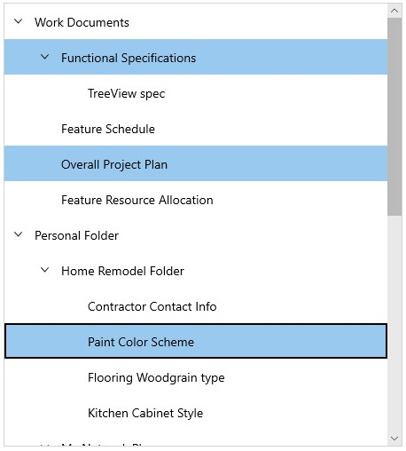

# Selection in WinUI TreeView 

This section explains how to perform selection and its related operations in the [TreeView](https://help.syncfusion.com/cr/winui/Syncfusion.UI.Xaml.TreeView.SfTreeView.html).

## UI Selection
The TreeView allows selecting the items either programmatically or touch interactions by setting the [SelectionMode](https://help.syncfusion.com/cr/winui/Syncfusion.UI.Xaml.TreeView.SfTreeView.html#Syncfusion_UI_Xaml_TreeView_SfTreeView_SelectionMode) property value to other than `None`. The control has different selection modes to perform selection operations as listed as follows.

* `None`: Allows disabling the selection.
* `Single`: Allows selecting the single item only. When clicking on the selected item, selection will not be cleared. This is the default value for `SelectionMode`.
* `SingleDeselect`: Allows selecting the single item only. When clicking on the selected item, selection gets cleared.
* `Multiple`: Allows selecting more than one item. Selection is not cleared when selecting more than one items. When clicking on the selected item, selection gets cleared.
* `Extended`: Allows to select the multiple items using the common key modifiers.



<syncfusion:SfTreeView x:Name="treeView" SelectionMode="Multiple"/>


treeView.SelectionMode = SelectionMode.Multiple;



## Programmatic Selection

When the [SelectionMode](https://help.syncfusion.com/cr/winui/Syncfusion.UI.Xaml.TreeView.SfTreeView.html#Syncfusion_UI_Xaml_TreeView_SfTreeView_SelectionMode) is other than `None`, the item or items in the TreeView can be selected from the code by setting the [SelectedItem](https://help.syncfusion.com/cr/winui/Syncfusion.UI.Xaml.TreeView.SfTreeView.html#Syncfusion_UI_Xaml_TreeView_SfTreeView_SelectedItem), or adding items to the [SelectedItems](https://help.syncfusion.com/cr/winui/Syncfusion.UI.Xaml.TreeView.SfTreeView.html#Syncfusion_UI_Xaml_TreeView_SfTreeView_SelectedItems) property based on the `SelectionMode`.

When the selection mode is `Single` or `SingleDeselect`, programmatically select an item by setting the underlying object to the [SelectedItem](https://help.syncfusion.com/cr/winui/Syncfusion.UI.Xaml.TreeView.SfTreeView.html#Syncfusion_UI_Xaml_TreeView_SfTreeView_SelectedItem) property.




treeView.SelectedItem = viewModel.Items[0];




When the selection mode is `Multiple`, programmatically select more than one item by adding the underlying object to the [SelectedItems](https://help.syncfusion.com/cr/winui/Syncfusion.UI.Xaml.TreeView.SfTreeView.html#Syncfusion_UI_Xaml_TreeView_SfTreeView_SelectedItems) property.




treeView.SelectedItems.Add(viewModel.Items[2]);
treeView.SelectedItems.Add(viewModel.Items[3]);




W> If an item is selected programmatically when `SelectionMode` is `None` and if multiple items are programmatically selected when `SelectionMode` is `Single` or `SingleDeselect`, then exception will be thrown internally.

## Selected items 

### Gets selected Items
The `TreeView` gets all the selected items through the `SelectedItems` property and gets the single item by using the `SelectedItem` property.

### Clear selected items
The selected items can be cleared by calling the `SelectedItems.Clear()` method.




treeView.SelectedItems.Clear();




### CurrentItem vs SelectedItem

The `TreeView` gets the selected item by using the [SelectedItem](https://help.syncfusion.com/cr/winui/Syncfusion.UI.Xaml.TreeView.SfTreeView.html#Syncfusion_UI_Xaml_TreeView_SfTreeView_SelectedItem) and [CurrentItem](https://help.syncfusion.com/cr/winui/Syncfusion.UI.Xaml.TreeView.SfTreeView.html#Syncfusion_UI_Xaml_TreeView_SfTreeView_CurrentItem) properties. Both `SelectedItem` and `CurrentItem` returns the same data object when selecting single item. When selecting more than one item, the `SelectedItem` property returns the first selected item, and the `CurrentItem` property returns the last selected item.

## Selected item style

### Selection background

The `TreeView` allows changing the selection background color for the selected items by using the [SelectionBackgroundColor](https://help.syncfusion.com/cr/winui/Syncfusion.UI.Xaml.TreeView.SfTreeView.html#Syncfusion_UI_Xaml_TreeView_SfTreeView_SelectionBackgroundColor) property. You can also change the selection background color at runtime.

### Selection foreground

The `TreeView` allows changing the selection foreground color for the selected items by using the [SelectionForegroundColor](https://help.syncfusion.com/cr/winui/Syncfusion.UI.Xaml.TreeView.SfTreeView.html#Syncfusion_UI_Xaml_TreeView_SfTreeView_SelectionForegroundColor) property. You can also change the selection foreground color at runtime.

N> `SelectionForegroundColor` is applicable only for unbound mode.

## Events

### SelectionChanging Event

The [SelectionChanging](https://help.syncfusion.com/cr/winui/Syncfusion.UI.Xaml.TreeView.SfTreeView.html#Syncfusion_UI_Xaml_TreeView_SfTreeView_SelectionChanging) event is raised while selecting an item at the execution time. The [ItemSelectionChangingEventArgs](https://help.syncfusion.com/cr/winui/Syncfusion.UI.Xaml.TreeView.ItemSelectionChangingEventArgs.html) has the following members which provides the information for `SelectionChanging` event:

* [AddedItems](https://help.syncfusion.com/cr/winui/Syncfusion.UI.Xaml.TreeView.ItemSelectionChangingEventArgs.html#Syncfusion_UI_Xaml_TreeView_ItemSelectionChangingEventArgs_AddedItems): Gets collection of the underlying data objects where the selection is going to process.
* [RemovedItems](https://help.syncfusion.com/cr/winui/Syncfusion.UI.Xaml.TreeView.ItemSelectionChangingEventArgs.html#Syncfusion_UI_Xaml_TreeView_ItemSelectionChangingEventArgs_RemovedItems): Gets collection of the underlying data objects where the selection is going to remove.

You can cancel the selection process within this event by setting the `ItemSelectionChangingEventArgs.Cancel` property to true.



treeView.SelectionChanging += treeView_SelectionChanging;

private void treeView_SelectionChanging(object sender, Syncfusion.UI.Xaml.TreeView.ItemSelectionChangingEventArgs e)
{
    if (e.AddedItems.Count > 0 && e.AddedItems[0] == viewModel.Items[0])
    {
        e.Cancel = true;
    }
}




### SelectionChanged event

The [SelectionChanged](https://help.syncfusion.com/cr/winui/Syncfusion.UI.Xaml.TreeView.SfTreeView.html#Syncfusion_UI_Xaml_TreeView_SfTreeView_SelectionChanged) event will occur once selection process has been completed for the selected item in the TreeView. The [ItemSelectionChangedEventArgs](https://help.syncfusion.com/cr/winui/Syncfusion.UI.Xaml.TreeView.ItemSelectionChangedEventArgs.html) has the following members which provides information for `SelectionChanged` event:

* [AddedItems](https://help.syncfusion.com/cr/winui/Syncfusion.UI.Xaml.TreeView.ItemSelectionChangedEventArgs.html#Syncfusion_UI_Xaml_TreeView_ItemSelectionChangedEventArgs_AddedItems): Gets collection of the underlying data objects where the selection has been processed.
* [RemovedItems](https://help.syncfusion.com/cr/winui/Syncfusion.UI.Xaml.TreeView.ItemSelectionChangedEventArgs.html#Syncfusion_UI_Xaml_TreeView_ItemSelectionChangedEventArgs_RemovedItems): Gets collection of the underlying data objects where the selection has been removed.



treeView.SelectionChanged += treeView_SelectionChanged;

private void treeView_SelectionChanged(object sender, Syncfusion.UI.Xaml.TreeView.ItemSelectionChangedEventArgs e)
{
    treeView.SelectedItems.Clear();
}




N> [SelectionChanging](https://help.syncfusion.com/cr/winui/Syncfusion.UI.Xaml.TreeView.SfTreeView.html#Syncfusion_UI_Xaml_TreeView_SfTreeView_SelectionChanging) and [SelectionChanged](https://help.syncfusion.com/cr/winui/Syncfusion.UI.Xaml.TreeView.SfTreeView.html#Syncfusion_UI_Xaml_TreeView_SfTreeView_SelectionChanged) events will be triggered only on UI interactions.

## Key Navigation

The `TreeView` allows to select or navigate the items through keyboard interactions. When the [SelectionMode](https://help.syncfusion.com/cr/winui/Syncfusion.UI.Xaml.TreeView.SfTreeView.html#Syncfusion_UI_Xaml_TreeView_SfTreeView_SelectionMode) is `Multiple` or `Extended`, the [FocusBorderColor](https://help.syncfusion.com/cr/winui/Syncfusion.UI.Xaml.TreeView.SfTreeView.html#Syncfusion_UI_Xaml_TreeView_SfTreeView_FocusBorderColor) will set to the CurrentItem.

## FocusBorderColor

The [FocusBorderColor](https://help.syncfusion.com/cr/winui/Syncfusion.UI.Xaml.TreeView.SfTreeView.html#Syncfusion_UI_Xaml_TreeView_SfTreeView_FocusBorderColor) property is used to set the border color for the current focused item. The default color is `SystemChromeBlackHighColor`.

## FocusBorderThickness
The [FocusBorderThickness](https://help.syncfusion.com/cr/winui/Syncfusion.UI.Xaml.TreeView.SfTreeView.html#Syncfusion_UI_Xaml_TreeView_SfTreeView_FocusBorderThickness) property is used to set the border thickness for the current focused item. The default thickness is `2`.

## Limitation
* When a grid is loaded inside the [ItemTemplate](https://help.syncfusion.com/cr/winui/Syncfusion.UI.Xaml.TreeView.SfTreeView.html#Syncfusion_UI_Xaml_TreeView_SfTreeView_ItemTemplate) with background color, the [SelectionBackgroundColor](https://help.syncfusion.com/cr/winui/Syncfusion.UI.Xaml.TreeView.SfTreeView.html#Syncfusion_UI_Xaml_TreeView_SfTreeView_SelectionBackgroundColor) will not display. Because, it overlaps the `SelectionBackgroundColor`. In this case, set the background color for the TreeView instead of grid in the  `ItemTemplate`.
* When the `TreeView` contains duplicated items in the collection, only the first item whose instance was created initially will be selected or deselected.
