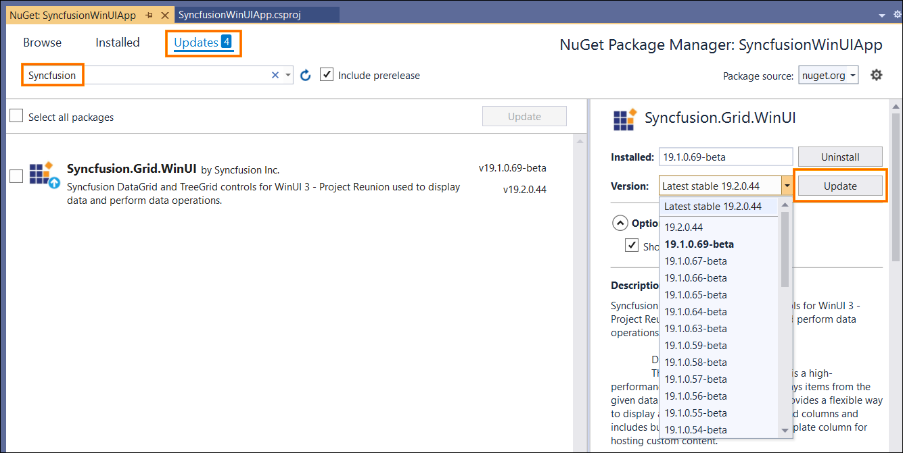

# Upgrading Syncfusion WinUI

Every three months, Syncfusion releases new volumes with interesting new features. For this volume, there will be a weekly NuGet release and one service pack. Syncfusion WinUI NuGet packages are released on a weekly basis to address critical issue fixes in volume releases.

From any Syncfusion WinUI NuGet version you have installed; you can update to our most recent version.

## Upgrade NuGet packages through Package Manager UI

The NuGet **Package Manager UI** in Visual Studio allows you to easily install, uninstall, and update NuGet packages in projects and solutions. You can find and upgrade the Syncfusion WinUI NuGet packages to the most recent version or to specific version in the WinUI solution or project and this process is easy with the steps below:

1. Right-click on the WinUI project or solution in the Solution Explorer tab, and choose **Manage NuGet Packages...**

    

    As an alternative, after opening the WinUI application in Visual Studio, go to the **Tools** menu and select **NuGet Package Manager | Manage NuGet Packages for Solution...**

2. The Manage NuGet Packages window will open. Navigate to the **Updates** tab, then search for the Syncfusion WinUI NuGet packages using a term like **"Syncfusion"** and select the appropriate Syncfusion WinUI NuGet package for your application.

    N> The [nuget.org](https://api.nuget.org/v3/index.json) package source is selected by default in the Package source drop-down. If your Visual Studio does not have nuget.org configured, follow the instructions in the [Microsoft documents](https://docs.microsoft.com/en-us/nuget/tools/package-manager-ui#package-sources) to set up the nuget.org feed URL.

3. By default, the package selected with latest version. You can select the required version and click the **Update** button and accept the license terms. The package will be upgraded to selected version in your WinUI application.

    

## Upgrade NuGet packages through Package Manager Console

The **Package Manager Console** saves NuGet packages upgrade time since you don't have to search for the package you want to update, and you can just type the command to update the appropriate Syncfusion WinUI NuGet package. Follow the steps below to upgrade the installed Syncfusion NuGet packages using the Package Manager Console in your WinUI application.

1. To show the Package Manager Console, open your WinUI application in Visual Studio and navigate to **Tools** in the Visual Studio menu and after hovering **NuGet Package Manager**, select **Package Manager Console**.

    

2. The Package Manager Console will be shown at the bottom of the screen. You can install the Syncfusion WinUI NuGet packages by enter the following NuGet update commands.

    ***Update specified Syncfusion WinUI NuGet package***

    The below command will update the Syncfusion WinUI NuGet package in the default WinUI project of the application

    ```
    Update-Package <Package Name> -prerelease
    ```

    **For example:** Update-Package Syncfusion.Grid.WinUI -prerelease

    ***Update specified Syncfusion WinUI NuGet package in specified WinUI project***

    The below command will update the Syncfusion WinUI NuGet package in the given WinUI project alone

    ```
    Update-Package <Package Name> -prerelease -ProjectName <Project Name>
    ```

    **For example:** Update-Package Syncfusion.Grid.WinUI -prerelease -ProjectName WinUIApplication

    N> We need to use the -prerelease term with the NuGet Update command, because all the Syncfusion WinUI NuGet packages are in beta

3. By default, the package will be installed with latest version. You can give the required version with the -Version term like below to install the Syncfusion WinUI NuGet packages in the appropriate version.

    ```
    Update-Package Syncfusion.Grid.WinUI -Version 19.1.0.65-beta -prerelease
    ```

    

4. The NuGet package manager will update the Syncfusion WinUI NuGet package as well as the dependencies it has.


## Upgrade NuGet packages through Dotnet (.NET) CLI

There is no distinct command for the update procedure in the Dotnet CLI. Unless you specify the package version, Dotnet CLI installs the latest version of the Syncfusion WinUI NuGet packages when you use the dotnet add package command.

To specify a version, add the -v parameter:

```
dotnet add package Syncfusion.Grid.WinUI –prerelease -v 19.1.0.65-beta.
```