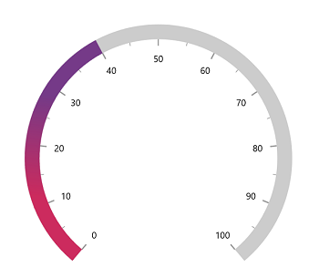

# Range pointer for radial gauge

A range pointer is an accenting line or shaded background range that can be placed on a gauge to mark the current value.





<gauge:SfRadialGauge>
    <gauge:SfRadialGauge.Axes>
        <gauge:RadialAxis>
            <gauge:RadialAxis.Pointers>
                <gauge:RangePointer Value="30" />
            </gauge:RadialAxis.Pointers>
        </gauge:RadialAxis>
    </gauge:SfRadialGauge.Axes>
</gauge:SfRadialGauge>





SfRadialGauge sfRadialGauge = new SfRadialGauge();

RadialAxis radialAxis = new RadialAxis();
sfRadialGauge.Axes.Add(radialAxis);

RangePointer rangePointer = new RangePointer();
rangePointer.Value = 30;
radialAxis.Pointers.Add(rangePointer);

this.Content = sfRadialGauge;





The following properties are used to customize the range pointer:

* `Background` – Customizes the color of range pointer.

* `PointerWidth` - Specifies the width of pointer either in logical pixels or factor.

* `WidthUnit` – Specifies whether the `PointerWidth` is defined in logical pixels or factor.

The `PointerWidth` of the pointer can be specified either in logical pixel or factor. If the `WidthUnit` is specified as logicalPixel, then the range will be rendered based on the provided pixel value. If the `WidthUnit` is set as factor, the provided factor value will be multiplied with axis radius. For example, if the pointer width is set as 0.1, then 10% of axis radius is considered as range pointer width.





<gauge:SfRadialGauge>
    <gauge:SfRadialGauge.Axes>
        <gauge:RadialAxis>
            <gauge:RadialAxis.Pointers>
                <gauge:RangePointer Value="30"
                                    PointerWidth="0.1"
                                    WidthUnit="Factor"
                                    Background="Indigo" />
            </gauge:RadialAxis.Pointers>
        </gauge:RadialAxis>
    </gauge:SfRadialGauge.Axes>
</gauge:SfRadialGauge>





SfRadialGauge sfRadialGauge = new SfRadialGauge();

RadialAxis radialAxis = new RadialAxis();
sfRadialGauge.Axes.Add(radialAxis);

RangePointer rangePointer = new RangePointer();
rangePointer.Value = 30;
rangePointer.PointerWidth = 0.1;
rangePointer.WidthUnit = SizeUnit.Factor;
rangePointer.Background = new SolidColorBrush(Colors.Indigo);
radialAxis.Pointers.Add(rangePointer);

this.Content = sfRadialGauge;





 The default value of `WidthUnit` and `OffsetUnit` is `SizeUnit.Pixel`.
 
 **Gradient support**

 The `GradientStops` property of `range pointer` allows to specify the smooth color transition to pointer by specifying the different colors based on provided axis value.





<gauge:SfRadialGauge>
    <gauge:SfRadialGauge.Axes>
        <gauge:RadialAxis AxisLineWidth="0.1"
                          AxisLineWidthUnit="Factor">
            <gauge:RadialAxis.Pointers>
                <gauge:RangePointer Value="40"
                                    PointerWidth="0.1"
                                    WidthUnit="Factor">
                    <gauge:RangePointer.GradientStops>
                        <gauge:GaugeGradientStop Value="10"
                                                 Color="#FFCC2B5E" />
                        <gauge:GaugeGradientStop Value="30"
                                                 Color="#FF753A88" />
                    </gauge:RangePointer.GradientStops>
                </gauge:RangePointer>
            </gauge:RadialAxis.Pointers>
        </gauge:RadialAxis>
    </gauge:SfRadialGauge.Axes>
</gauge:SfRadialGauge>





SfRadialGauge sfRadialGauge = new SfRadialGauge();

RadialAxis radialAxis = new RadialAxis();
radialAxis.AxisLineWidth = 0.1;
radialAxis.AxisLineWidthUnit = SizeUnit.Factor;
sfRadialGauge.Axes.Add(radialAxis);

RangePointer rangePointer = new RangePointer();
rangePointer.Value = 40;
rangePointer.PointerWidth = 0.1;
rangePointer.WidthUnit = SizeUnit.Factor;
rangePointer.GradientStops.Add(new GaugeGradientStop { Value = 10, Color = Color.FromArgb(255, 204, 43, 94) });
rangePointer.GradientStops.Add(new GaugeGradientStop { Value = 30, Color = Color.FromArgb(255, 117, 58, 136) });

radialAxis.Pointers.Add(rangePointer);

this.Content = sfRadialGauge;





**Corner customization**

 The `CornerStyle` property of `range pointer` specifies the corner type for pointer. The corners can be customized using the bothFlat, bothCurve, startCurve, and endCurve options. The default value of this property is bothFlat.





<gauge:SfRadialGauge>
    <gauge:SfRadialGauge.Axes>
        <gauge:RadialAxis>
            <gauge:RadialAxis.Pointers>
                <gauge:RangePointer Value="30"
                                    CornerStyle="BothCurve" />
            </gauge:RadialAxis.Pointers>
        </gauge:RadialAxis>
    </gauge:SfRadialGauge.Axes>
</gauge:SfRadialGauge>





SfRadialGauge sfRadialGauge = new SfRadialGauge();

RadialAxis radialAxis = new RadialAxis();
sfRadialGauge.Axes.Add(radialAxis);

RangePointer rangePointer = new RangePointer();
rangePointer.Value = 30;
rangePointer.CornerStyle = CornerStyle.BothCurve;
radialAxis.Pointers.Add(rangePointer);

this.Content = sfRadialGauge;





## Position customization

The following properties are used to customize the position of range pointer:

* `PointerOffset` - Specifies the position value for pointer either in logical pixels or factor.

* `OffsetUnit` – Specifies whether the `PointerOffset` is defined in logical pixels or factor.

The range pointer can be moved far or near to the axis line using the `PointerOffset` property. The `PointerOffset` can be set either in logical pixel or factor value using its `OffsetUnit`.





<gauge:SfRadialGauge>
    <gauge:SfRadialGauge.Axes>
        <gauge:RadialAxis>
            <gauge:RadialAxis.Pointers>
                <gauge:RangePointer Value="30"
                                    PointerOffset="70" />
            </gauge:RadialAxis.Pointers>
        </gauge:RadialAxis>
    </gauge:SfRadialGauge.Axes>
</gauge:SfRadialGauge>





SfRadialGauge sfRadialGauge = new SfRadialGauge();

RadialAxis radialAxis = new RadialAxis();
sfRadialGauge.Axes.Add(radialAxis);

RangePointer rangePointer = new RangePointer();
rangePointer.Value = 30;
rangePointer.PointerOffset = 70;
radialAxis.Pointers.Add(rangePointer);

this.Content = sfRadialGauge;





When you set the `OffsetUnit` as logical pixel, the pointer will be moved to the provided logical pixel value.

If the `OffsetUnit` is specified as factor, the factor value will be multiplied with the axis radius. For example, if you set `PointerOffset` as 0.1, then the pointer offset is considered as 10% of axis radius.