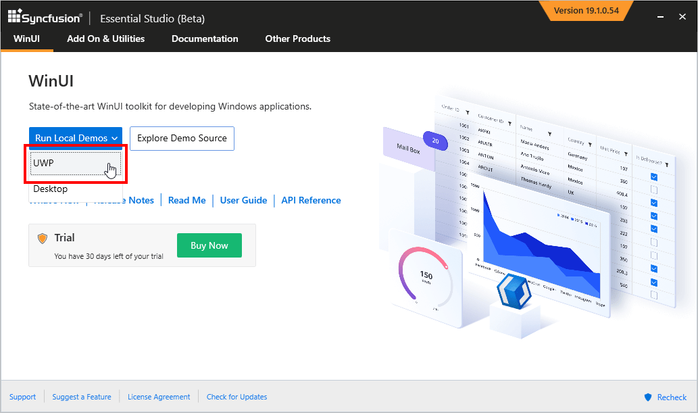
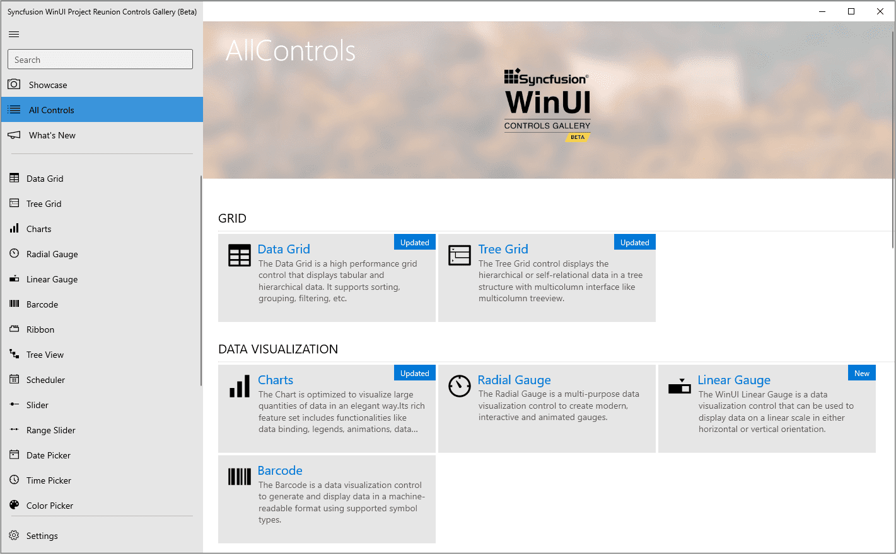
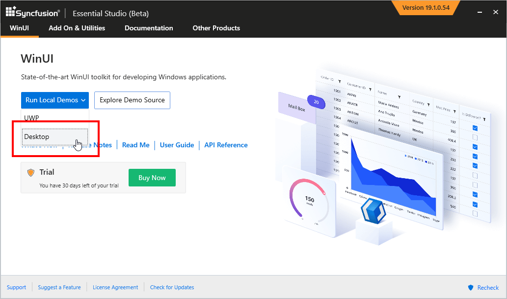
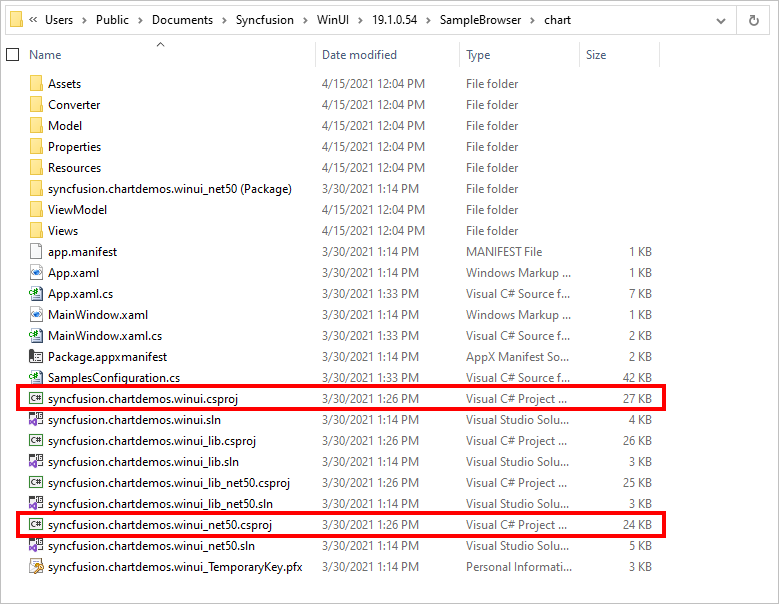

# Featured Samples for Syncfusion WinUI Controls

## Syncfusion WinUI control panel

To explore Syncfusion WinUI controls and components, Open `Syncfusion WinUI Controls Panel` by searching it from start and open. 

In another way, open the control panel from the following installed location,

C:\Program Files (x86)\Syncfusion\Essential Studio\WinUI\{{ site.releaseversion }}\Infrastructure\Launcher\Syncfusion WinUI Control Panel.exe 

N> In above section, latest Essential Studio version details has been provided. You can refer installed Essential Studio version instead of mentioned version.

## WinUI sample browser

The Syncfusion `WinUI Sample Browser` is available for both the WinUI `UWP` and `Desktop` environments.

### WinUI UWP

The WinUI UWP project can be explored in Visual Studio by clicking `Run Local Demos` and selecting `UWP` to open the `WinUI Sample Browser`.

### WinUI Desktop

The WinUI desktop project can be explored in Visual Studio by clicking `Run Local Demos` and selecting `Desktop` to open the `WinUI Sample Browser`.
 
 

## Offline samples

* The individual control samples can also be run by exploring the individual control project.

For example, below, we demonstrated how to run an individual `Chart` control project in Visual Studio.

* You can also open a standalone executable project either UWP or desktop (not a lib project) in the Visual Studio which is available under the category name.

 

* Build and deploy the individual control executable project and run the application.

  

## Online samples

* Download and install `WinUI` demos from [App Center](https://install.appcenter.ms/orgs/syncfusion-demos/apps/winui-demos/distribution_groups/release).

## Download demos from online (clone from github repository)

You can explore Syncfusion WinUI controls using [GitHub WinUI demos](https://github.com/syncfusion/winui-demos) where all WinUI demos are configured using `NuGet` to run without installing Syncfusion WinUI Studio.