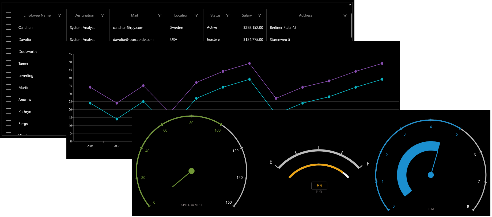

# Themes for Syncfusion WinUI Controls

Themes provides a sense of visual continuity for the Windows apps. It allows us to customize the appearance of the application. The theme affects the colors of the control's background, foreground, border brush, font etc. 

## Supported themes

Syncfusion WinUI controls supports Light and Dark themes. 

**Light theme**

**Dark Theme**
    

## Applying themes at application level

We can change theme for the whole application using the `RequestedTheme` property available in App.xaml. Syncfusion control adopts to theme setting, when it is applied through `RequestedTheme` property. 




    <Application
        x:Class="DemoApp.App"
        xmlns="http://schemas.microsoft.com/winfx/2006/xaml/presentation"
        xmlns:x="http://schemas.microsoft.com/winfx/2006/xaml"
        xmlns:local="using:WinUIDemoApp" RequestedTheme="Dark">
    </Application>





    sealed partial class App : Application

    {
        public App()
        {
            this.RequestedTheme = ApplicationTheme.Dark;
            this.InitializeComponent();
        }
    }




N> When the `RequestedTheme` property is not set, application will use the user's system settings.

## Applying themes for controls

Themes can also be applied for each framework element individually irrespective of the Application level themes. It can be set using the `RequestedTheme` property available in UIElements. When the `RequestedTheme` property is set to `Default` it uses the `Application.RequestedTheme` value for the elements.




    <syncfusion:SfDataGrid x:Name="datagrid" RequestedTheme="Dark"/>





        public MainPage()
        {
            this.datagrid.RequestedTheme = ElementTheme.Dark;
            this.InitializeComponent();
        }




N> When the RequestedTheme value is set on a FrameworkElement, it will inherit to any elements that are nested within the element.

