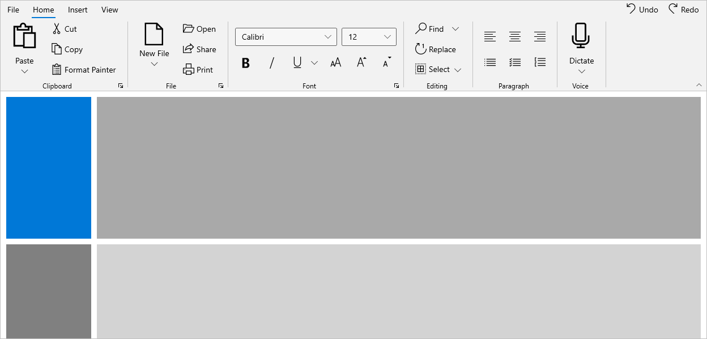

# Themes for Syncfusion WinUI Controls

Themes provide a sense of visual continuity for the Windows apps. 
It allows you to customize the appearance of the application. 
The theme affects the colors of the Control's background, foreground, border brush, font, etc. 

## Supported themes

Syncfusion WinUI controls support Light and Dark themes. 

**Light theme**

**Dark theme**
    

## Applying themes at the application level

The theme for the whole application can be changed using the `RequestedTheme` property available in App.xaml. 
Syncfusion control adopts to Theme settings, when it is applied using the `RequestedTheme` property. 




    <Application
        x:Class="DemoApp.App"
        xmlns="http://schemas.microsoft.com/winfx/2006/xaml/presentation"
        xmlns:x="http://schemas.microsoft.com/winfx/2006/xaml"
        xmlns:local="using:WinUIDemoApp" RequestedTheme="Dark">
    </Application>





    sealed partial class App : Application

    {
        public App()
        {
            this.RequestedTheme = ApplicationTheme.Dark;
            this.InitializeComponent();
        }
    }




N> When the `RequestedTheme` property is not set, the application will use the users' system settings.

## Applying themes for controls

Themes can also be applied for each framework element individually irrespective of the application level themes. 
It can be set using the `RequestedTheme` property available in UI Elements. 
When the `RequestedTheme` property is set to `Default`, it uses the `Application.RequestedTheme` value for the elements.




    <syncfusion:SfDataGrid x:Name="datagrid" RequestedTheme="Dark"/>





        public MainPage()
        {
            this.datagrid.RequestedTheme = ElementTheme.Dark;
            this.InitializeComponent();
        }




N> When the `RequestedTheme` value is set on a FrameworkElement, it is inherited by any elements nested within the element.

## Theme resource

Syncfusion provides a theme resource file for all Syncfusion WinUI Project Reunion controls. By referring to this file, the appearance of the controls can be customized at the application level.

Theme resource files for Syncfusion WinUI controls can be referred from this [link](https://github.com/syncfusion/winui-controls-theme-resource-files).

### Modify theme resource at application level

Refer to the above-mentioned theme resources to obtain the required keys for customizing the control as desired, and then define the same keys with custom colors at the application level.

The following example shows how to customize the ribbon control at the application level by using a ribbon theme resource file.

**Default theme resource values**

<table>
    <tr>
        <td><b>Key</b></td>
        <td><b>Value</b></td>
    </tr>
    <tr>
        <td>SyncfusionRibbonTabMenuButtonBackground</td>
        <td>SystemChromeLowColor</td>
    </tr>
    <tr>
        <td>SyncfusionRibbonTabMenuButtonForeground</td>
        <td>SystemBaseHighColor</td>
    </tr>
    <tr>
        <td>SyncfusionRibbonTabBorderBrushSelected</td>
        <td>SystemAccentColor</td>
    </tr>
</table>

**Customized value**

<table>
    <tr>
        <td><b>Key</b></td>
        <td><b>Value</b></td>
    </tr>
    <tr>
        <td>SyncfusionRibbonTabMenuButtonBackground</td>
        <td>Green</td>
    </tr>
    <tr>
        <td>SyncfusionRibbonTabMenuButtonForeground</td>
        <td>White</td>
    </tr>
    <tr>
        <td>SyncfusionRibbonTabBorderBrushSelected</td>
        <td>Green</td>
    </tr>
</table>

Now, add the customized value in application root elements' resources.



    
    <Page>
        <Page.Resources>
            <SolidColorBrush x:Key="SyncfusionRibbonTabMenuButtonBackground"
                                    Color="Green" />
            <SolidColorBrush x:Key="SyncfusionRibbonTabMenuButtonForeground"
                                    Color="White" />
            <SolidColorBrush x:Key="SyncfusionRibbonTabBorderBrushSelected"
                                    Color="Green" />        
        </Page.Resources>

        <ribbon:SfRibbon>
        ...
        </ribbon:SfRibbon>
    </Page>




**Control with default theme resource**

**Control with customized theme resource**

