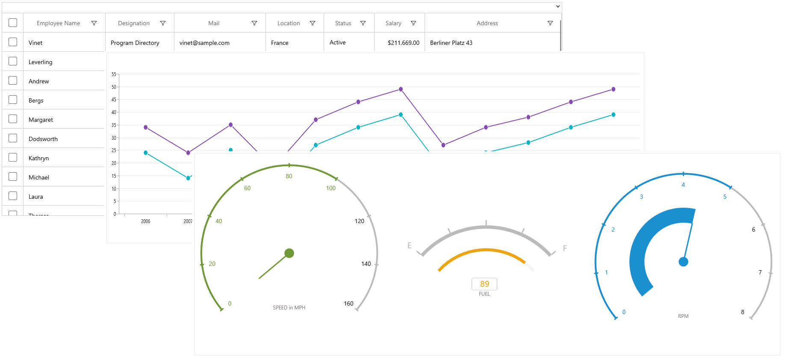

# Themes for Syncfusion WinUI Controls

The theme affects the colors of the control's background, foreground, BorderBrush and Padding, Margin, Font etc.

## Supported themes

Syncfusion WinUI controls supports Light, Dark application themes and also High contrast themes.. 

**Light theme**

**Dark Theme**

## Applying the theme at application level

We can change the theme for the whole application using the `RequestedTheme` property available in App.xaml 




    <Application
        x:Class="DemoApp.App"
        xmlns="http://schemas.microsoft.com/winfx/2006/xaml/presentation"
        xmlns:x="http://schemas.microsoft.com/winfx/2006/xaml"
        xmlns:local="using:WinUIDemoApp" RequestedTheme="Dark">
    </Application>





    sealed partial class App : Application

    {
        public App()
        {
            this.RequestedTheme = ApplicationTheme.Dark;
            this.InitializeComponent();
        }
    }




N> When the `RequestedTheme` property is not set, application will use the user's system settings. When the user set High contrast theme, the system will override the RequestedTheme.

## Applying themes for controls

Themes can also be applied for framework element individually irrespective of the Application level themes. It can be set using the `RequestedTheme` property available in UIElements. When the `RequestedTheme` property is set to `Default` it uses the `Application.RequestedTheme` value for the element.




    <syncfusion:SfDataGrid x:Name="datagrid" RequestedTheme="Dark"/>





        public MainPage()
        {
            this.RequestedTheme = ElementTheme.Dark;
            this.InitializeComponent();
        }




N> When the RequestedTheme value is set on a FrameworkElement, it will inherit to any elements that are nested within the element.

## Overriding control themes

We can override the control themes by following the below guidelines, 

